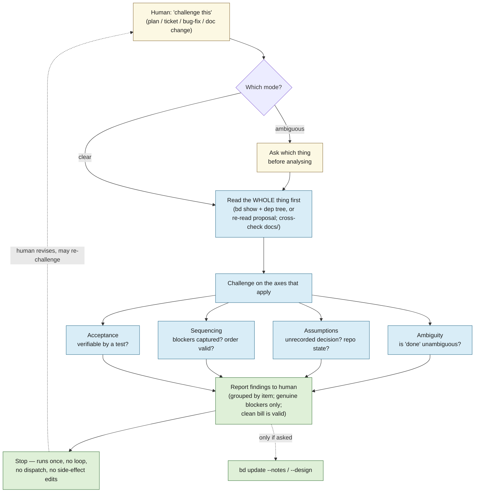

# lode — Agent dev workflow

How lode is *built*. The other docs describe the system; this one describes the **agent
loops that produce it** — a **design loop** that stress-tests a plan before it's built, a
**coding loop** in which a *builder* (Sonnet) produces a green branch and a separate *code-reviewer*
(Opus) runs the technical review on it (solo, or fanned out across several tasks at once with
`/code <id> <id> …`), and a **landing loop** in which a single `/land` lander is the **only** thing
that writes `trunk`. The three are the last three sections of this doc. See [design.md](design.md)
for the thesis and the build sequencing the work flows through.

The operational source of truth for each loop is its skill/agent definition under
[`.claude/`](../.claude); this doc is the map, not the mechanics. The hard project invariants live
in [`CLAUDE.md`](../CLAUDE.md) and [`AGENTS.md`](../AGENTS.md) — **where they and this doc disagree,
`CLAUDE.md` wins.**

---

## The loops

Work moves through three passes, with the human as the hinge:

1. **Design loop — `challenge`.** Before anything is built, a plan, a beads ticket tree, a bug-fix
   approach, or a proposed `docs/` change is handed to the `challenge` skill, which *pushes back*:
   it surfaces ambiguity, hidden assumptions, sequencing gaps, and risky approaches, and reports
   them to the human. It never edits `docs/` or beads as a side effect. The human revises until
   the plan is sound.
2. **Coding loop — `/code` → `coding` builder, then `code-reviewer`.** Once the plan is sound and
   captured as beads issues, `/code` runs each task in **two dispatched phases**. First a `coding`
   **builder** (Sonnet) carries it through an orderly cycle in an isolated worktree: claim → build →
   green gates → push a `land/<id>` branch → mark **`ready-for-code-review`** → **keep the worktree**
   → stop. Then a `code-reviewer` (Opus) fetches that pushed branch and checks it out into its **own**
   launch worktree, runs the technical review (`/code-review` + `/simplify`), re-gates, re-pushes, and
   swaps the ticket to **`ready-for-land`**.
   The builder never reviews its own work; neither agent merges, closes, or writes `trunk`.
   **`/code` claims each resolved ticket itself, before dispatch (lode-xr8v)** — for every path where
   the id is known at dispatch (a named id, or one auto-selected from `bd ready`). The builder's own
   `bd update --claim` (its cycle's step 2) is left in place as an *idempotent backstop*, and is the
   *primary* claim only on the free-text path, where no id exists until the builder files the issue.
   The claim was previously the builder's alone, and being an unverified soft step nothing downstream
   checked (Phase 2 verifies labels + the remote branch, never `status`), a builder that skipped it
   carried a ticket all the way to `ready-for-land` while it stayed `open`/unassigned (lode-gpzn.2) —
   so it sat in `bd ready` through its whole build and step 1's `--status in_progress` stranded-review
   sweep would miss it on an escalation. Claiming from the orchestrator, one deterministic flow, makes
   the `in_progress` invariant that the sweeps and Phase 2 assume actually hold.
3. **Landing loop — `/land`.** A single lander drains the `ready-for-land` queue: it semantically
   reviews each branch, merges the accepted set into `trunk`, re-gates, closes the tickets, and
   pushes. It is the **only** thing that writes `trunk` (see
   [the landing loop](#the-landing-loop--build-review-land)).

The boundaries are deliberate: **challenge decides *what* and *whether*; the coding loop decides *how*
and *builds and reviews* it; the landing loop decides *whether it lands* and *does the merge*.**
Keeping the merge decision out of the hands of the agent that wrote the code is the point. Design
decisions settle into `docs/` and beads; only then does code get written (see
[how the loops connect](#how-the-loops-connect)).

---

## The design loop — `challenge`

`challenge` is a single, non-looping pass whose only job is to **argue with the plan**. You give it
something about to be built; it reads the *whole* thing before forming an opinion, challenges it on
the axes that apply, and hands the criticisms back. It does **not** implement, close tickets,
dispatch other agents, or silently rewrite issues — it runs once and stops. (Skill:
[`.claude/skills/challenge/SKILL.md`](../.claude/skills/challenge/SKILL.md).)

What it reads depends on the mode:

- **A conversation plan / approach** — the proposal as written (re-read, not remembered).
- **A beads issue or epic** — `bd show <id>`, then `bd dep tree <id>` and `bd show` on every
  subtask: titles, descriptions, acceptance criteria, notes, design.
- **A proposed `docs/` change** — cross-checked against the source of truth in `docs/`; a plan that
  contradicts a settled decision is itself a finding.

It then challenges on four axes — **ambiguity** (is "done" unambiguous?), **assumptions** (an
unrecorded architectural/tech decision? a repo state that may not hold? an uncited external?),
**sequencing & dependencies** (are all blockers captured? does the stated order actually work?),
and **acceptance/verifiability** (could someone write the test without more clarification?). For a
bug-fix approach it also weighs **root cause vs. symptom**, **side effects**, and whether a simpler
standard pattern exists.

Findings come back grouped by item, each a *genuine blocker* — no padding, and a clean bill is a
valid outcome. By default, closing a challenge persists: findings are appended to each challenged
issue's notes (`bd update <id> --append-notes=…`), and — since lode-bw5k — if the challenged target
*resolves to an epic* (`bd show <id>` shows `issue_type: epic`), that epic is stamped `bd update
<epic-id> --add-label epic-debated`, applied even on a clean bill (the marker records that the
stress-test pass *happened*, not that it found anything). This is the durable, machine-readable marker
[`/code`'s auto-select gate](#the-coding-loop--code--coding--code-reviewer) checks before building any
of that epic's children. Either the note-persisting or the stamp can be skipped by telling `/challenge`
"just tell me, don't persist" — never a ticket's `design` field, which `/challenge` never touches.



---

## The coding loop — `/code` → `coding` + `code-reviewer`

`/code` is the **only** sanctioned way to start coding work from the main session (which is
otherwise told not to spawn agents). The skill resolves the task from its argument and runs each task
in **two dispatched phases** — a `coding` **builder** (Sonnet), then a `code-reviewer` (Opus). **Bare
`/code`** fans out across the filtered ready frontier; `/code --single` does the top one task of that
same frontier (`/code` resolves the pick **itself** — the subagent never re-reads `bd ready` to choose
its own ticket); `/code <id>` / `/code <id> <id> …` name the work explicitly — in every case it's **N
builders in parallel** (one per task, each in its own isolated worktree), each followed by its own
reviewer. There is **no `/code-parallel`**. (Skill:
[`.claude/skills/code/SKILL.md`](../.claude/skills/code/SKILL.md); agents:
[`.claude/agents/coding.md`](../.claude/agents/coding.md),
[`.claude/agents/code-reviewer.md`](../.claude/agents/code-reviewer.md).)

**Topology — run only one `/code` invocation at a time (concurrent invocations unsupported,
lode-pzr).** Fan-out (N builders in parallel) is safe and is the supported way to get parallelism —
each producer works a distinct ticket in its own worktree and pushes its own `land/<id>` branch, so
producers never collide with each other. But `/code` also sweeps for stranded work at the *start* of
every invocation — `needs-rebase` kick-backs and stranded `ready-for-code-review` re-entries — and
those sweeps select on a ticket's **label**, which is only cleared at the very *end* of the agent
dispatched at it. Two concurrent `/code` invocations can therefore both sweep in a ticket whose
agent from the *other* invocation is still live, and dispatch a second agent onto the same worktree
via `git -C`. The observed consequence today is benign (the loser's push non-fast-forward-rejects;
clean-tree assertions guard the worktree), but it is a race, not an invariant — so, mirroring how
`/land` states its one-lander, one-machine topology invariant ([below](#mechanics-decided)), `/code`
states its own: **don't start a second `/code` while one is still running against this repo; pass
more IDs (or use bare `/code`) to the same invocation instead.** This is narrower than `/land`'s
rule — it only forbids a *second concurrent invocation*, not a second machine outright, since a lone
`/code` invocation's own builders already may legitimately fan out across machines (see the coding
loop's [producers may fan out across machines](#running-the-loop-family-unattended--epic-audit-sweep)
note) as long as no other invocation's sweep is running concurrently with them. See
[decisions.md](decisions.md) for the rationale.

Argument resolution:

- **No argument** (the default) / **`--all-ready`** → fan out across the **independent, unblocked**
  frontier of the filtered `bd ready --json` read (see the callout below), honoring the dependency
  graph and the phase-a skeleton order.
- **`--single`** → one task: `/code` resolves the pick **itself** — the same filtered frontier as
  above, top entry, dispatched as an explicitly-named id. The subagent never re-reads `bd ready` to
  pick its own ticket; `--single` collapses to "bare `/code`, limited to one ticket" — same
  selection, same filter, same skip-reporting, only the fan-out width differs.
- **A bd issue ID** (`lode-1a8`) / **several IDs** → claim and implement those (one builder each) —
  an **unfiltered operator override** (see below): the operator named it on purpose, `human` label or
  `epic` type notwithstanding.
- **Free text** ("add a `--json` flag to search") → the agent files the bd issue itself, then codes.

**Auto-select paths only — exclude `human`-labeled tickets and epics (lode-8pqv).** `bd ready` is a
dependency-satisfaction query, not a build queue, and two categories reach it that must never be
**auto**-selected on the **no-argument**, **`--all-ready`**, and **`--single`** paths: any ticket
carrying the **`human`** label (it exists precisely because an agent cannot resolve it — that's what
`/sweep` surfaces it for), and any ticket with **`issue_type == epic`** (a container with no
implementable acceptance criteria of its own). Plain `bd ready` renders no labels, so the filter reads
the frontier as JSON — on **every** auto-select path, including `--single`:

```bash
rtk bd ready --json | jq -r '.[] | select((.labels // []) | index("human") | not) | select(.issue_type != "epic") | .id'
```

`bd ready` is already priority-ordered, so this list's first entry is the highest-priority buildable
item — no extra sort needed. `/code` reports **every ticket dropped** (id + reason) rather than
dropping the skip silently, and if **nothing survives the filter, it dispatches nothing** — never
falling back to a filtered-out ticket. A frontier of nothing but `human` tickets and epics is a real,
reachable state (a decision ticket is its own blocker, and bd won't let a task block an epic); it
means there is no buildable work right now, a signal for `/sweep`, not a build target. This filter
never applies to explicitly-named IDs — those are an operator override, unfiltered.

**Auto-select paths only — exclude children of an un-debated epic (lode-bw5k).** `/challenge` is the
intended stress-test gate a plan/epic should pass **before** its children get built, but nothing
enforced that before this ticket — `lode-olmi`'s children were built and landed by `/code` without the
epic ever having been debated, caught only by a human noticing after the fact. `/code` now runs a
second, mechanical check on every candidate that survives the `human`/epic filter above, scoped
identically (the same **no-argument**, **`--all-ready`**, **`--single`** paths; never applied to an
explicitly-named ID):

```bash
scripts/epic-debate-gate.sh <candidate-id>
```

The **marker side of the contract** lives in `/challenge` (`.claude/skills/challenge/SKILL.md` §4):
closing a challenge whose target *resolves to an epic* (`bd show <id>` shows `issue_type: epic`) stamps
`bd update <epic-id> --add-label epic-debated` — applied even on a clean bill, since the marker records
that the stress-test pass *happened*, not that it found anything; skipped entirely for a non-epic
target (a conversation plan, a single ticket, a `docs/` change) or under the "just tell me, don't
persist" opt-out. The **check side** is `scripts/epic-debate-gate.sh`: given a candidate ticket id, it
derives the parent epic from the candidate's `dependencies[]` — a `parent-child` entry whose target has
`issue_type: epic` — and prints `BUILD <id>` when there is no parent epic or the parent carries `epic-debated`,
else `SKIP <id> epic not debated (<epic-id>)`. It only ever calls `bd show` (twice at most per
candidate); it never writes bd state.

**Two derivations of "who is my parent epic" are both valid** (measured against bd 1.1.0, lode-v4rk).
`bd show <child> --json` exposes a top-level **`.parent`** (`"lode-l38d"`) *and* embeds the epic inside
`.dependencies[]` as a `parent-child` entry — the two agree on every ticket sampled. What is null is
`parent_id`/`epic_id`, which are *different fields* from `.parent`; an earlier reading of that fact as
"no top-level parent field works" is what made the deps walk look like the only option. Prefer `.parent`
(one scalar, no schema/flag pitfall) — `scripts/epic-completion-check.sh` uses it. `epic-debate-gate.sh`
still walks `.dependencies[]` because it needs the *epic's* `issue_type` too, which the deps entry
embeds; that is a real reason, not an oversight. Neither form touches `.dependents`, which is the one
that genuinely needs an opt-in flag (see below). `/code` keeps every `BUILD` in the buildable set and reports every
`SKIP` in its skip list alongside the `human`/epic skips (id + `epic not debated (<epic-id>)`).

**No new escape-hatch flag.** The only unblock is to actually run `/challenge <epic-id>` (cheap) or
hand-apply the `epic-debated` label to acknowledge the epic was debated informally — both leave the
same durable marker, so there is nothing else to build. Both this gate and the `human`/epic filter
above are scoped to step 2's auto-select only: step 0's `needs-rebase` pickups and step 1's stranded
`ready-for-code-review` re-entries pick up tickets already mid-flight, past this gate, and re-checking
them here would strand in-flight work behind a retroactively-applied rule. Tests:
`tests/test_epic_debate_gate.py` (a fake `bd` shim on PATH drives the script through all three shapes:
no-epic ticket builds, debated-epic child builds, un-debated-epic child is skipped with the epic id
named in the reason).

Each builder then runs its orderly cycle. The worktree is **handed to it by the harness**
(`isolation: "worktree"`) — a subagent pinned at the repo root cannot create its own, so it begins
*already inside* `.claude/worktrees/agent-<hash>` on a branch off local `trunk` HEAD. It works
in-cwd with plain git, and if its `pwd` is ever the repo root it **stops and reports** rather than
writing on `trunk`. Before touching a file it **locks that worktree** (`git worktree lock`) — a
freshly created worktree has zero commits beyond `trunk`, so until the first commit its branch reads
as trivially "merged" into `trunk` by content identity, which is exactly what `/land`'s end-of-pass
backstop sweep otherwise treats as safe to reclaim; nothing raised that lock before (lode-oqr), so
every producer build was silently exposed for that window. It unlocks again right after its first
commit, once the branch has genuinely diverged and the backstop's own `merged`-into-`trunk` check
takes over as protection for the rest of the build. It claims the issue, builds the simplest thing
that works, takes it green through the gates, then **pushes a `land/<id>` branch to origin, marks the
ticket `ready-for-code-review` (recording its worktree path), keeps the worktree, and stops** — it
does **not** review its own work.

Then `/code` dispatches a **`code-reviewer`** (Opus) for that ticket. It fetches the pushed `land/<id>`
branch and checks it out **into its own launch worktree** — never `git -C` into the builder's
worktree, never `EnterWorktree`, and never the builder's worktree at all — runs the **technical
review** (`/code-review --fix` + `/simplify`, re-gate, keep the last green commit), re-pushes
`land/<id>`, and swaps the ticket to **`ready-for-land`**. Neither agent merges, closes, or writes
`trunk` — landing is [`/land`](#the-landing-loop--build-review-land)'s job. Final agent messages aren't
shown to the user, so `/code` relays what came back across **both** phases — which issue, that the
build gates and the technical review passed, the pushed branch and head SHA, or exactly where it
stopped (a build- or review-time escalation) and why.

> **Adding a brand-new `src/lode/*.py` module?** Build a worktree-local venv before `nox` — run
> `./scripts/python-init.sh` from *inside* the worktree. The shared `./venv` editable install
> resolves `lode` to the **main checkout's** `src`, so a new module that exists only in the worktree
> is invisible to it and `nox -s tests` fails with `ModuleNotFoundError`. **Editing an existing
> module needs no fresh venv** — that file already resolves under the main-checkout package.

```mermaid
flowchart TD
    INV["Human: /code &lt;arg&gt;<br>(bare /code fans out — one builder per ready task)"] --> RES{"Resolve arg"}
    RES -->|"bd id(s)"| T1["Resolve to named id(s)"]
    RES -->|"free text"| T2["Agent files the issue + claims it, then codes"]
    RES -->|"--single / none / --all-ready"| T3["/code picks from filtered bd ready<br>(human/epic excluded · phase-a order)<br>--single: top entry only"]

    T1 --> OCLAIM["/code claims each resolved id<br>(bd update --claim) BEFORE dispatch<br>(lode-xr8v · not the free-text path)"]
    T3 --> OCLAIM
    OCLAIM --> DISP["Phase 1 — dispatch coding builder<br>(Sonnet · isolation: worktree)"]
    T2 --> DISP

    DISP --> WT["Starts ALREADY inside<br>.claude/worktrees/agent-&lt;hash&gt;<br>(branch off local trunk HEAD)"]
    WT --> GUARD{"pwd is repo root?"}
    GUARD -->|"yes"| BAIL["STOP & report —<br>never write on trunk"]
    GUARD -->|"no, in worktree"| CLAIM["claim (bd update --claim) —<br>idempotent backstop;<br>primary only on free-text path"]

    CLAIM --> IMPL["Read issue + acceptance + design,<br>then implement (Typer · ./venv ·<br>simplest thing that works)"]
    IMPL --> COMMIT["Commit in worktree<br>(Co-Authored-By trailer)"]
    COMMIT --> CLEAN1{"git status --short<br>empty?"}
    CLEAN1 -->|"no"| COMMIT
    CLEAN1 -->|"yes"| GATES{"Quality gates"}
    GATES -->|"nox -t fix · nox -s tests ·<br>validate-mermaid (if diagram)"| GFAIL{"Pass?"}
    GFAIL -->|"no"| FIX["Fix & re-run —<br>never hand off on a failing gate"]
    FIX --> GATES
    GFAIL -->|"yes"| FIXCOMMIT["Commit gate output<br>(fixes + nox -t fix reformatting)"]

    FIXCOMMIT --> PUSH["git push -u origin HEAD:land/&lt;id&gt;"]
    PUSH --> CLEAN2{"git status --short<br>empty?"}
    CLEAN2 -->|"no — edits after push,<br>never gated"| COMMIT
    CLEAN2 -->|"yes"| HANDOFF["Builder: mark ready-for-code-review<br>(worktree path · head SHA) ·<br>KEEP worktree · bd dolt push · STOP"]
    HANDOFF --> REV["Phase 2 — code-reviewer (Opus):<br>fetch + checkout land/&lt;id&gt; into OWN worktree ·<br>/code-review --fix + simplify · re-gate"]
    REV --> MARKL["Swap to ready-for-land<br>(head SHA · summary) ·<br>re-push land/&lt;id&gt; · bd dolt push · STOP"]
    MARKL --> DONE["/land lands it (separate loop) ·<br>/code relays both phases"]

    classDef start fill:#fcf8e3,stroke:#8a6d3b,color:#1b1b1b;
    classDef work fill:#d9edf7,stroke:#31708f,color:#1b1b1b;
    classDef gate fill:#fcf8e3,stroke:#8a6d3b,color:#1b1b1b;
    classDef bad fill:#f2dede,stroke:#a94442,color:#1b1b1b;
    classDef good fill:#dff0d8,stroke:#3c763d,color:#1b1b1b;
    class INV,RES start;
    class T1,T2,T3,OCLAIM,DISP,WT,CLAIM,IMPL,COMMIT,FIXCOMMIT,PUSH,HANDOFF,REV work;
    class GATES,GFAIL,GUARD,CLEAN1,CLEAN2 gate;
    class BAIL,FIX bad;
    class MARKL,DONE good;
```



### Concurrency cap (lode-2cf)

`/code`'s fan-out (builders and reviewers, plus the step-0/step-1 sweep dispatches) shares **one
concurrency cap** for the whole invocation — it was previously unbounded, dispatching the entire ready
frontier at once.

**Why.** On 2026-07-10 the Claude Code host process crashed twice, each time with **7** concurrent
`/code` agents in flight (builders + reviewers), orphaning the whole fleet mid-run. Each agent's gate
is `nox -s tests` with pytest-xdist `-n auto` — **one worker per CPU core** (noxfile.py) — = **8
workers** on that box, each holding a cached ONNX cross-encoder (the
[reranker](configuration.md#retrieval-and-ranking)) in memory — 7 agents × 8 workers on a 15GiB/8-core
WSL2 VM is the prime suspect for the crash (no `dmesg` OOM lines survived, since WSL2 restarts the
whole VM on a crash, so the memory hypothesis is strong but not conclusively proven — the cap is cheap
insurance regardless). After manually staggering to **~4** concurrent agents, the identical workload
completed with zero further crashes.

**What.** `.claude/skills/code/SKILL.md` computes `CODE_MAX_CONCURRENT_AGENTS` once, at the start of
every invocation, before its step-0 sweep. **Never** more than that many agents — builders and
reviewers combined, across every dispatch source (step 0's rebase pickups, step 1's stranded-review
pickups, Phase 1 builders, Phase 2 reviewers) — run concurrently; the rest of the resolved task set
queues and dispatches as running agents complete and free a slot.

**Default derivation — the per-agent budget scales with core count, and it is measured, not guessed
(lode-lwx6).** The original derivation budgeted a **flat ~3GiB per agent**. That constant was only ever
calibrated for the 8 workers `-n auto` spawns on the 8-core reference box — but `-n auto` spawns one
worker **per CPU core**, so on a 24-core box each agent's gate spawns 24 workers, not 8, while the
constant stayed at 3GiB. The old formula therefore resolved to **9** concurrent agents on a
31GiB/24-core machine: optimistic in exactly the direction that crashed the host on the reference box.
That is the bug.

The fix budgets per agent as a **fixed cost plus a per-worker cost**:

```
workers        = LODE_TEST_WORKERS if it is a positive integer, else 8 when unset (lode-bv6y
                 default), else nproc — "auto", xdist's "logical", or any non-numeric value means
                 the width is unknowable here, so assume the widest the gate can get (one per core)
per_agent_gib  = 2 + workers / 8        # 3GiB @ 8 workers, 5GiB @ 24 workers
by_mem         = MemAvailable_GiB / per_agent_gib
by_cpu         = nproc / 2
cap            = max(1, min(by_mem, by_cpu))
```

Read `MemAvailable` from `/proc/meminfo` (falling back to `MemTotal` if absent), divide by
`per_agent_gib`, take the lower of that and `nproc/2`, floor at 1.

**This pseudo-code block is explanation, not the implementation (lode-54mo).** The actual derivation
lives in [`scripts/code-concurrency-cap.sh`](../scripts/code-concurrency-cap.sh), called by
`.claude/skills/code/SKILL.md` — extracted so it is testable
([`tests/test_code_concurrency_cap.py`](../tests/test_code_concurrency_cap.py)) rather than living as
ungated inline shell embedded in a SKILL.md prompt, exactly where this repo already shipped a silent,
undetected-for-months bug once before (lode-mh9g's `merge-tree` snippet). This block may lag a script
change; the script wins on any disagreement between the two.

**This term tracks `workers` (the `pytest -n` count the gate actually spawns), not `nproc`
(lode-bv6y).** When this section was first written (lode-lwx6), the gate always ran `-n auto`, so
`workers == nproc` and writing `nproc` directly into the formula was equivalent — the two were the same
number by construction. lode-bv6y (below) broke that equivalence: the gate's default width is now a
fixed **8** regardless of core count, overridable via `LODE_TEST_WORKERS` (including back to the old
`auto` behavior). The memory term has to track whichever width is actually in effect — `nproc` would
silently be the *wrong* number, and wrong in the same optimistic direction as the original bug, the
moment a wide-core box's gate no longer spawns one worker per core by default. `by_cpu` is unrelated and
stays on `nproc`: it bounds host-CPU contention across concurrent agent *processes*, independent of how
many pytest workers each spawns internally.

**A width the cap can't parse must fail *tight*, not optimistic.** `LODE_TEST_WORKERS` is passed
straight through to `pytest -n`, which accepts more than integers — `auto`, and also `logical` (one
worker per *logical* core). The cap snippet is shell, and shell arithmetic silently evaluates a
non-numeric string to **0**, which would collapse `per_agent_gib` to its 2GiB floor and *raise* the cap
(to 12 on the 24-core box) exactly when the gate is at its widest and heaviest. That is the same
optimistic-in-the-wrong-direction failure as the original stale constant, and over-dispatch is what
crashed this host twice. So the snippet treats **anything that is not a positive integer** — `auto`,
`logical`, a typo, an exported-but-empty var — as one worker per core (`nproc`): the widest the gate can
plausibly get, hence the tightest cap. An unparseable width may cost throughput; it must never cost
memory headroom.

**Where those numbers come from (measured 2026-07-12, not extrapolated).** The `2 + nproc/8` shape is
not a guess — an earlier draft of this fix *was* one (it linearly extrapolated ~0.375GiB/worker from
the single 3GiB/8-worker calibration point), and the measurement below refutes that draft in **both**
directions. Peak **PSS** of the whole gate process group (PSS, not summed RSS — summing RSS across
workers double-counts shared, memory-mapped model pages and would "confirm" any linear model), full
suite, 31GiB/24-core box:

| xdist workers | peak PSS | peak summed RSS |
|---|---|---|
| 4 | 4.1 GiB | 4.5 GiB |
| 8 | **6.5 GiB** | 7.4 GiB |
| 24 (`-n auto` here) | **11.4 GiB** | 13.0 GiB |

Two things fall out, both of which contradict a plausible-sounding story:

- **Footprint is real, and it is mostly *not* shared.** PSS ≈ summed RSS (11.4 vs 13.0 GiB), and ~99%
  of it is anonymous memory. The workers do **not** meaningfully share one memory-mapped copy of the
  reranker — so "the ONNX weights are shared through the page cache, therefore a big fan-out is nearly
  free" is **false**, and sizing the cap on that belief would badly over-subscribe the host.
- **But growth is concave, not linear.** Doubling 4→8 workers costs +2.4GiB (~600MiB/worker); going
  8→24 costs only +4.9GiB (~310MiB/worker). A straight line through the origin (the rejected draft)
  under-predicts the real 24-worker footprint by 27% (9GiB predicted vs 11.4GiB measured) while
  simultaneously over-penalizing the cap. A fixed term plus a per-core term fits all three points; that
  is exactly `2 + nproc/8` after the duty-cycle factor below.

**The cap is a throughput heuristic, not a worst-case memory bound — do not "fix" it into one.** If all
N agents were inside their gate at the same instant, even the empirically-safe caps would exceed RAM
(5 × 11.4GiB = 57GiB on a 31GiB box). They don't: the gate is ~1 minute of a multi-minute agent
lifetime, so gates mostly do not align. Dividing `MemAvailable` by the raw measured peak yields **2** on
*both* boxes — contradicting both known-safe operating points — which is how we know the alignment
factor is real. The `/8` (rather than `/4`) in the formula *is* that factor: it assumes roughly half of
the in-flight agents are inside their gate at any instant. That halving is the one modelling assumption
left, and it is pinned by two independent empirical anchors rather than by taste:

| Box | workers spawned | measured gate peak | `per_agent_gib` | derived cap | known-good in practice |
|---|---|---|---|---|---|
| 15GiB / 8-core (the crash box) | 8 | 6.5 GiB | **3** | **4** | 4 stable, **7 crashed it** |
| 31GiB / 24-core | 24 (`-n auto`, before lode-bv6y) | 11.4 GiB | **5** | **5** | 5 stable across a full `/code` session |

The formula reproduces every data point we have: it lands on **4** on the crash box (identical to the
old flat constant there — `2 + 8/8` = 3GiB — so nothing regresses, and the original calibration is
re-derived rather than discarded), it would have **refused** the 7 agents that actually crashed that box
(7 × 3 = 21GiB > the ~14.5GiB available), and it lands on **5** on the 24-core box **when that box's
gate spawns 24 workers**, matching what a full session ran without incident instead of cutting
throughput ~40% to 3.

**That last row is now a historical data point, not the default outcome — lode-bv6y narrowed the
gate's own default width, and the cap follows it down (up, really) to 9.** SPIKE lode-mtuy measured
(2026-07-13, idle 24-core/31GiB box, 3 reps/width, round-robin, warmup discarded) whether `-n auto` is
even *faster* than a narrower width for this suite — nobody had checked:

| xdist workers | median wall-clock | min–max | spread | reds |
|---|---|---|---|---|
| 4 | 34s | 32–35s | 3s | 0 |
| 8 | 23s | 22–24s | 2s | 0 |
| 12 | 22s | 21–23s | 2s | 1 (known lode-64jn/t1y flake, not a timing artifact) |
| 16 | 23s | 22–24s | 2s | 0 |
| 24 (`-n auto`) | 25s | 24–27s | 3s | 0 |

`-n auto` is **not** faster — it is the *slowest* non-trivial width measured, and consistently so
(every 24-worker run was at or above the worst 8-worker run). The curve knees at 8, is flat through 16,
and rises past ~12: beyond that, each extra worker costs more in process-startup + model-load time than
it recovers in parallelism. Paired with the memory table above, `-n auto` loses on **both** axes at once
— 75% more memory (11.4 vs 6.5 GiB) for an *8% slower* median gate — so lode-bv6y changed the gate's
default width itself (`noxfile.py`, `LODE_TEST_WORKERS`, default `8`) rather than adding a knob nobody
would think to set. The concurrency cap, deriving `per_agent_gib` from that same effective width, now
resolves to `2 + 8/8` = 3GiB/agent on the 24-core box too (its gate no longer spawns 24 workers unless
someone explicitly sets `LODE_TEST_WORKERS=auto`), so `by_mem = 29/3` ≈ 9, clamped by `by_cpu = 24/2` =
12 → **cap 9**, not 5. That is not a loosened heuristic — it is the same formula, correctly tracking a
gate that got cheaper. Setting `LODE_TEST_WORKERS=auto` on a box opts its gate back into one worker per
core and the cap term reverts to `nproc`-scaled (back toward 5 on this box) — the two knobs are designed
to move together, never independently.

**Re-measure when the suite grows.** The stale-constant bug this section documents happened because a
memory number was written down once and never checked again. The measurement above is reproducible in
about two minutes — run the gate under its own process group and sample peak PSS:

```bash
setsid nox -s tests & PG=$!
while kill -0 $PG 2>/dev/null; do
  ps -eo pid=,pgid= | awk -v g=$PG '$2==g{print $1}' |
    xargs -I{} awk '/^Pss:/{s+=$2} END{print s}' /proc/{}/smaps_rollup 2>/dev/null |
    awk '{t+=$1} END{print t/1024 " MiB"}'
  sleep 2
done
```

If the peak at this machine's effective worker count (`LODE_TEST_WORKERS`, default 8) has drifted well
away from `2 + workers/8` GiB (doubled, say), re-fit the two coefficients — don't just nudge the cap.
Re-run the wall-clock side too (lode-mtuy's method, above) if the suite has grown substantially — the
knee moves with test count, and the specific width `8` was measured on one machine at one suite size.

Two directions were on the table (lode-lwx6's own design note): scale the memory term with the workers
actually spawned (chosen, above), or pin pytest's `-n` to a fixed number in the nox test session so a
flat constant would mean something stable across machines. The fixed-`-n` route was rejected *at the
time* because it changes the gate for every developer and every CI run, not just this fan-out heuristic
— trading suite wall-clock time on big machines for a fix that only needed to correct a stale
calibration constant looked like scope creep when nobody had checked whether that trade was even real.

**lode-bv6y revisited that rejection once lode-mtuy's spike measured the wall-clock side, and it
inverted.** The rejected trade assumed `-n auto` was at least *faster* in exchange for the extra memory
— the SPIKE showed the opposite: `-n auto` is both slower and heavier than `-n 8` on this suite (see the
wall-clock table above). With no upside left on either axis, pinning the gate's own default off `auto`
stopped being scope creep and became the actual fix — `noxfile.py` now defaults `-n` to `8`
(`LODE_TEST_WORKERS`, overridable, including back to `auto`), and the cap formula above was updated to
track that same effective width rather than `nproc`, so the two knobs can't silently drift apart the way
a memory-only fix would have allowed (set `-n 4` and the cap would still budget for a 24-worker gate).

**Override — machine-local, no `SKILL.md` edit.** The env var `LODE_CODE_MAX_CONCURRENT_AGENTS`, when
set, wins outright over the derivation (no clamping — an explicit user choice is trusted as-is). Set
it durably per machine via `.claude/settings.local.json`'s `"env"` block (gitignored, applied to every
Claude Code session on that machine):

```json
{ "env": { "LODE_CODE_MAX_CONCURRENT_AGENTS": "6" } }
```

or export it in the shell that launches `claude` for a one-off override. The derivation/default logic
itself stays in the committed skill so it travels to every clone; only the override is machine-local.
The skill re-reads the env var fresh at the start of every invocation, so a changed value takes effect
on the next `/code` run without any other action.

**Onboarding note (lode-y24n).** Leaving the env var **unset** is the maintenance-free choice: the
derivation above re-runs on every invocation, so the cap tracks the machine by itself. A **pinned**
value does not — it is a cached, per-machine constant that will **not** follow a later hardware or
VM-size change (more RAM, a different box, a raised WSL2 memory limit). There's no command to
memorize: just ask Claude to recompute it after any such change. The pin is one of the small family of
deliberately machine-local, non-travelling settings listed in
[`CLAUDE.md` — New machine setup](../CLAUDE.md#new-machine-setup).

### Filing follow-up work: `blocks` vs `discovered-from` (lode-c0t3)

When a builder or reviewer discovers follow-up work mid-task, the dependency type it files that
follow-up with decides whether `bd ready` treats it as dispatchable *right now* — get this wrong and
a later `/code` fan-out can dispatch a builder onto work that is still unbuildable, or onto a root
cause a subsequent ticket has already superseded (OBSERVED 2026-07-12: five tickets sat in `bd ready`
this way, unbuildable until `lode-t1y` landed, two of them already based on a diagnosis `lode-t1y`
had disproven; caught by hand, nothing in the loop would have).

**`discovered-from` does not block `bd ready`.** It is a pure provenance edge — "this ticket was
found while working that one" — and `bd ready` returns the child immediately regardless of the
parent's state.

**Nor does `parent-child`** — and this trap is worth naming, because "sub-work of that ticket" is a
natural thing to reach for when you actually mean "sequenced after that ticket." An epic's child is
dispatchable while the epic is still open, *by design* (an epic only closes once its children do, so
gating children on it would deadlock every epic). Verified: `lode-kke.1` — status `open`, carrying
`parent-child -> lode-kke [open]` — is returned by `bd ready` today, despite being titled "DO NOT
START YET." Filing a blocked follow-up as `parent-child` reproduces the exact bug this rule exists to
kill: you believe you sequenced the work; you only grouped it.

**`blocks` is the edge that actually gates dispatch:** the child stays out of `bd ready` until the
parent *closes* — and in this loop a ticket closes only when `/land` merges it to `trunk`, so a
`blocks` edge means precisely "not dispatchable until the parent lands," which is the property we
want.

**bd allows exactly one dependency type per ordered `(from, to)` pair — the two are not additive**
(verified empirically: `bd dep add <child> <parent> --type blocks` on a pair that already carries
`discovered-from` fails with `already exists with type "discovered-from" (requested "blocks")`, and
the same holds trying to add `relates-to` over an existing edge). So filing a follow-up is a choice,
not a default, and the choice trades one property for the other:

- **The follow-up genuinely cannot be built or reviewed until the parent lands** (its root-cause
  diagnosis, its target code, or a decision the parent makes is a hard prerequisite) → file it with
  **`blocks`**. **Direction warning, verified empirically 2026-07-13 (lode-ij24):** `bd create --deps
  blocks:<parent>` does **not** make the new follow-up blocked by `<parent>` — it inverts. Creating a
  throwaway issue `B` with `bd create --deps blocks:A` left `A.dependencies = [B]` (i.e. `A` now
  depends on / is blocked by `B`), never the reverse. In this loop `<parent>` is often the very branch
  a builder or reviewer is about to certify `ready-for-code-review` / `ready-for-land` — filing a
  follow-up this way silently drops that parent out of `bd ready` behind its own follow-up. (Two other
  forms were checked in the same pass and are **not** affected: `bd create --deps discovered-from:X`
  and bare `bd create --deps X` with no type prefix both give the expected direction — new issue
  depends on `X`. Only the explicit `blocks:` prefix on `bd create --deps` inverts.)

  The bare form is in fact a correct one-liner — `bd create --deps <parent>` records exactly the edge we
  want, child blocked by parent, because `blocks` is bd's default dependency type. We still **don't**
  prescribe it: it is right only by way of an *implicit* default, which is the same class of
  under-specified `--deps` semantics that produced this bug in the first place, and it would silently
  become the wrong edge if bd ever changed that default. Spell the edge out at the call site instead.

  **Never write `bd create --deps blocks:<parent>`.** Create the ticket with **no `--deps` at all**,
  then wire the gate as its own step. Do *not* reach for `--deps discovered-from:<parent>` on the
  create as a way to keep the provenance: by the one-type-per-pair rule above, that edge occupies the
  same ordered `(child, parent)` pair, so the `bd dep add … --type blocks` that follows **fails**
  (`already exists with type "discovered-from" (requested "blocks")`) and leaves the follow-up sitting
  in `bd ready` *unblocked* — the exact bug this section exists to kill, now with an error message an
  unattended agent may never read. Provenance goes in the description, not the edge:

  ```bash
  NEW_ID=$(rtk bd create --title="…" --description="Discovered while building <parent>. …" \
    --type=task --silent)
  rtk bd dep add "$NEW_ID" <parent> --type blocks
  ```

  `bd dep add <child> <parent> --type blocks` (positional args, or the equivalent `--blocked-by
  <parent>` flag) is verified correct — the child's `.dependencies` gains the parent, i.e. the child is
  blocked by the parent, never the reverse. This is the only choice that keeps `bd ready` honest for
  that pair. Because the edge no longer carries "discovered while working X," say so in the new
  ticket's own description (e.g. "discovered while building lode-t1y") — that provenance is recoverable
  from prose, same as any other ticket fact, whereas a missing block edge is not recoverable at all:
  nothing catches it before a builder is dispatched onto broken work.

  **This rule is now mechanically enforced, not just advisory (lode-0kbq).** A committed
  `PreToolUse` (matcher `Bash`) hook in [`.claude/settings.json`](../.claude/settings.json) denies any
  Bash call that invokes `bd create … --deps …blocks:…` and returns the two-step remedy above as the
  deny reason. It travels with the clone, so every agent on every machine gets it. It covers the
  `bd new` alias, an `rtk` prefix, and bd's global `-C`/`--directory`/`--db` flags; the deny/allow
  table is pinned by `tests/test_bd_deps_guard.py`, which executes the hook as shipped.

  Two deliberate boundaries. It matches only at a **command position** (start of line, or after
  `;`/`&&`/`||`/`|`/`$(`), so prose that merely *quotes* the bad form — a commit message, a `bd` note,
  this very paragraph — is **not** denied; that matters because this repo's own commits and tickets
  discuss the bad form constantly, and a guard that denied them would block the loop that ships it.
  And it is a textual guard, so it cannot see through a shell variable (`--deps "$D"` where
  `D=blocks:x`). It is a net for the natural typo, not a security boundary.
- **The follow-up is independent** — related to the parent but safely buildable on its own, with no
  code or diagnosis dependency → file it with **`discovered-from`**, as before. This is still the
  right default for the common case (cleanup noticed in passing, an unrelated bug seen along the way);
  the fix here is narrowing when it applies, not retiring it.

The test is mechanical: *would implementing this follow-up today, before the parent lands, produce
correct work?* If no, it blocks. If yes, it's provenance-only.

This rule binds both dispatch-side filers — [`.claude/agents/coding.md`](../.claude/agents/coding.md)
(step 5, "Implement") and [`.claude/agents/code-reviewer.md`](../.claude/agents/code-reviewer.md)
(step 4, "Technical review") — since a builder or a reviewer can equally discover blocked follow-up
work mid-task.

**Mechanical guard + upstream report (lode-0kbq, lode-s1uz).** Docs alone are advisory, and this
section is the proof: it had already landed on `trunk` when, six hours later, a `/code` fan-out wired
2 of 7 follow-ups backwards (`lode-3jte`, `lode-yb9t` — `lode-ij24`). The agent was *following* this
section — it reached for `blocks:` precisely because the rule above told it to — and inverted the edge
anyway. A rule that is read, obeyed, and *still* silently miswired a third of the time is the exact
profile where a mechanical guard pays. So `lode-0kbq` added a repo-local mitigation: a committed
`PreToolUse(Bash)` hook in `.claude/settings.json` that denies any `bd create ... --deps
...blocks:...` (and its `bd new` alias) and points the caller at the two-step `bd dep add … --type
blocks` form above. It's a fence, not a fix — a regex over the Bash command string can't see through
shell variable indirection, and can't reach `bd create --graph <plan.json>`, which can express the same
inverted edge through a JSON file no string-level guard ever inspects. The real fix is upstream, in
`bd`'s own `--help` text and/or CLI surface: reported as
[beads#4766](https://github.com/gastownhall/beads/issues/4766) (lode-s1uz) — `bd create --deps`'s help
never states each prefix's direction (unlike `bd dep add --help`, which does), asking upstream to
document it explicitly and/or accept a `blocked-by:` prefix, and noting `new` is a live alias for
`create` that any doc fix needs to cover too. Revisit the local guard's scope once upstream responds.

**A related limit bd cannot express at all, and this fix does not attempt to:** a dependency edge can
say "after `<id>`," but it cannot say "when nothing else is running." `lode-mtuy` (an xdist timing
measurement) is only valid on an otherwise-idle machine — no dependency graph shape encodes that, and
a `/code` fan-out would dispatch it into a live batch and return a confident, worthless result. That
class of constraint is documented, not solved: it needs a human to run the ticket by hand in a quiet
window.

### Never write to an external tracker under the user's identity (lode-o29m)

**USER RULE (hard):** an agent must never WRITE to an external tracker — GitHub, an upstream repo, any
third-party — under the user's identity. The `gh` CLI (and any other external-tracker CLI available to
an agent) is authed **as the user**, so anything an agent files, comments, closes, reopens, merges, or
reviews there goes out **publicly under the user's own name**. The user does not want their public
identity spent by an agent, ever — even when the ticket driving the work explicitly calls for it.

**TRIGGER.** `lode-s1uz`'s ask was literally "report this ambiguity upstream to beads." Its builder
followed that instruction faithfully and filed
[beads#4766](https://github.com/gastownhall/beads/issues/4766) under the user's GitHub account. This
was **not** a misbehaviour bug — the agent did exactly what its ticket said — it was a **missing
guardrail**: nothing in `coding.md` / `code-reviewer.md` / `CLAUDE.md` forbade it, so a well-behaved
agent following its ticket faithfully will do it again the next time a ticket says "ask upstream." A
ticket's author can scope the *work*; they cannot grant the *user's identity* to spend on a public
platform — that authorisation belongs to the user alone, and a bd ticket is never it.

**Scope — confirmed explicitly with the user, deliberately narrow:**

- **Forbidden:** any WRITE to an external tracker under the user's identity — `gh issue create`, `gh pr
  create`, `gh issue comment`, `gh pr comment`, `gh pr review`, `gh issue/pr close|reopen|edit|delete|
  lock|unlock|merge|transfer|pin|unpin`, `gh api` with a non-GET method (`-X`/`--method`
  `POST`/`PUT`/`PATCH`/`DELETE`, **or the *implicit* POST that `-f`/`-F`/`--field`/`--raw-field`/
  `--input` triggers with no method flag at all** — see the guard section below), and the equivalent
  write operation on any non-GitHub tracker. Also forbidden, on the same "do not spend the user's
  public identity" logic: `gh release create`, `gh gist create`, `gh repo create|fork`.
- **Allowed and unchanged: read-only external calls.** `gh issue view`, `gh pr view`, `gh api` GET,
  `WebFetch` all stay legal and unrestricted — `lode-s1uz`'s **reviewer** used exactly this class of
  call to verify the cited URL, which was correct behaviour and must remain so. This rule is about
  *writing* under the user's name, not about looking things up.
- **Allowed and unchanged: internal bd tickets.** Agents keep filing bd follow-ups freely, exactly as
  [the `blocks` vs `discovered-from` rule above](#filing-follow-up-work-blocks-vs-discovered-from-lode-c0t3)
  already governs. bd's `created_by: bildzeitung` is just the local git identity, not a public act —
  this rule is about the user's **public** identity, not about bd's internal bookkeeping. Four bd
  follow-ups filed in the same `/code` pass that produced beads#4766 (`lode-qyd3`, `lode-2vsc`,
  `lode-h1vn`, `lode-37gg`) were all fine, and remain the model to follow.

**Required behaviour: draft, mark PENDING A HUMAN, and stop.** When a ticket's scope genuinely needs
something filed upstream, the agent **drafts** the issue/PR/comment text (title + body) into its
hand-off report, records that the upstream filing is **PENDING A HUMAN**, and stops. It does not file.
The human files it manually and, if useful, pastes the resulting URL back into the ticket. "The ticket
told me to" is never authorisation — the ticket's author could not grant the user's identity in the
first place, so there is nothing for the agent's compliance with its own ticket to have unlocked.

**Mechanical guard, same "fence not fix" framing as `lode-0kbq`'s `blocks:` guard — DEFAULT-DENY with
a read-only ALLOWLIST (`lode-9mbt`), not a write-verb denylist.** Docs alone are advisory — that is the
entire lesson of `lode-s1uz` (an agent read a ticket, followed it, and filed publicly under the user's
name because nothing said not to). A committed `PreToolUse(Bash)` hook in
[`.claude/settings.json`](../.claude/settings.json) denies **any `gh` invocation that does not match a
small, explicit read-only allowlist**, and returns the draft-and-surface protocol above as the deny
reason.

**Why default-deny, not a denylist (`lode-9mbt`).** The guard originally enumerated write verbs and
denied only those — a **list of verbs, not a category**. `lode-9l3d`'s technical review demonstrated
empirically that this shape rots: every `gh` release can add a write verb, and the guard silently gets
weaker with nothing in this repo changing. Probed live against the shipped hook, `gh codespace
create|delete`, `gh repo rename`, `gh repo archive`, and `gh repo deploy-key add` all fell through even
after `lode-9l3d` widened the alternation — the same inconsistency `lode-9l3d` itself flagged (`gh repo
edit` was denied; `gh repo rename`, equally destructive, was not) predates it and traces to `lode-o29m`'s
original alternation. `lode-9rim` was filed to widen the list again — the exact treadmill this ticket
gets off. The asymmetry settles the direction: a **false allow** is a public write under the user's
identity, unrecoverable in the sense that matters (the notification already went out); a **false deny**
blocks a read, which an agent reports and a human unblocks in seconds. Default-deny puts the cheap
failure on the common path. It's also cheaper to build than it looks: the guard already maintained an
`ALLOWED` read-only table as a regression pin — inverting it largely means *promoting that table to be
the decision*, not inventing a new one.

The read-only allowlist:

- **tracker reads** — `gh issue|pr view|list`, `gh issue status`, `gh pr checks|diff`, `gh release
  list|view`, `gh repo view`, `gh label list`;
- **gh's repo-*admin* surface, read-only forms** (`lode-9l3d`) — `gh run list|view`, `gh workflow
  list|view`, `gh secret|variable|ssh-key|gpg-key|cache list`;
- **`gh api`, allowed only on a positive read test** — see below.

Everything else that reaches `gh` at a command position is denied **because it is absent from this
list**, not because a write verb was enumerated. That is what closes `gh codespace create|delete`, `gh
repo rename|archive|deploy-key add`, and any future `gh` write verb — structurally, without anyone
having to notice the release note and widen an alternation. `lode-9rim` (widen the alternation to cover
exactly those verbs) is **superseded, closed, not built** — reopen it only if this ticket's inversion is
ever abandoned, since the gaps it names are real and this is the only thing currently closing them.

It matches `gh` at a *command position*: after `;`/`&&`/`||`/`|`/`(`/`` ` ``/`{` or at line start,
through the `rtk` prefix, a leading `VAR=x` assignment, a command wrapper (`env`, `sudo`, `xargs`,
`if`/`then`, …), an absolute or relative path to the binary (`/usr/bin/gh`), and `gh`'s global
`-R`/`--repo`/`--hostname` flags inserted before the subcommand (the same shape of gap the `blocks:`
guard already closes for bd's `-C`/`--directory`/`--db`). The allow/deny table is pinned by
`tests/test_gh_write_guard.py`, which executes the hook as shipped, mirroring
`tests/test_bd_deps_guard.py` — including mutation tests that assert reverting the inversion turns the
new denies (`gh codespace create`, `gh repo deploy-key add`, …) red, not merely that the suite is green.

**Both this guard and the `blocks:` guard shell out to `jq`, and `jq` FAILS CLOSED (lode-oii9).**
`jq` was an undocumented hard prerequisite until `lode-oii9`: with it absent, both guards used to
silently fall through — verified live during this guard's own land review, `gh issue create` was
**not** denied under `PATH=/nonexistent`. Both hooks now deny outright when `jq` is unreachable,
before attempting to parse `tool_input.command` at all; `docs/onboarding.md` documents `jq` as a
required prerequisite, and the full fail-closed-vs-fail-open reasoning is recorded in
[`docs/decisions.md`](decisions.md).

**`gh api` is the hard case: it is read-or-write depending on flags, so it cannot be allowed merely by
matching a verb — it needs a positive read test.** Allowed only when an explicit `-X GET`/`--method GET`
is present (regardless of whether fields are also present — fields on an explicit GET are gh's
documented way to send a query string), **or** no field flag (`-f`/`-F`/`--field`/`--raw-field`/
`--input`) and no explicit method at all are present (the plain, bodyless form defaults to
GET). Any other shape is denied. Note the second arm keys on the *presence* of a method that is not an
explicit GET, so **the guard enumerates no HTTP verbs either** — there is no `POST|PUT|PATCH|DELETE`
list to keep current, and a method nobody listed is denied for the same structural reason `gh codespace
create` is. **The implicit POST is denied too — this one is not optional.** `gh
api` switches to `POST` automatically as soon as a body field is supplied; from `gh api --help`:
*"adding request parameters will automatically switch the request method to POST."* So `gh api
repos/o/r/issues -f title=… -f body=…` files an issue with **no `-X`/`--method` anywhere on the line**.
That is the *ordinary*, documented way to POST with `gh` — not an exotic evasion — and it is the route
an agent denied at `gh issue create` would naturally reach for next, since the deny reason itself names
`gh api`. A guard that caught only the *explicit* method would therefore not enforce the rule it claims
to; the exemption would have swallowed the rule. `gh api graphql -f query=…` is denied as a side effect:
GraphQL is always an HTTP POST and the same command shape carries a mutation, so the guard **fails
closed** there and the read must go through a REST `GET` or a human.

The field-flag test matches **every spelling gh actually parses**, not just the space-separated one.
`gh` is a cobra/pflag CLI, so a shorthand flag's value may be attached with no separator at all —
`-ftitle=x` *is* `--raw-field title=x` (confirm against the binary: `gh issue list -L0` fails with
`invalid limit: 0`, i.e. the value parsed, whereas `-Z0` fails with `unknown shorthand flag`). A
pattern that required a space or `=` *after* `-f` therefore let a perfectly ordinary issue-filing POST
straight through; both the old denylist and the first cut of this allowlist did exactly that, and it was
caught in `lode-9mbt`'s technical review. `tests/test_gh_write_guard.py` pins all three spellings
(`-f x=y`, `-fx=y`, `--field=x=y`).

Residual gaps that remain — honest about what the inversion does **not** close, same character as the
`blocks:` guard's own (a guard that reads only the command *string* cannot see through indirection):

- **Quoted indirection** — `sh -c "gh issue create …"`, or the command held in a shell variable.
  Closing this would mean treating a quote as a command boundary, which would false-deny this repo's
  own prose about the rule (`rtk grep "gh issue create" docs/`, a commit message quoting the verb) — a
  worse trade than the residual.
- **`gh` reached from a command position the matcher does not recognize.** The *inversion* is
  default-deny on the **subcommand** — but the decision to look at a line at all still rests on
  matching `gh` at a command position, and that matcher is an enumeration: a leading `VAR=x`, a path
  (`/usr/bin/gh`), gh's global `-R`/`--repo`/`--hostname`, and a fixed wrapper list (`env`, `sudo`,
  `command`, `xargs`, `time`, `nohup`, `if`/`then`/`else`/`do`, `rtk`). A wrapper *outside* that list
  (`timeout 5 gh issue create`, `nice gh …`, `exec gh …`) or a shell-escaped/quoted binary name
  (`\gh …`, `'gh' …`) is not seen, and falls through. This is the same shape of residual as the bullet
  above and it predates the inversion (`lode-o29m`'s original matcher, unchanged here): generalizing it
  to "any leading tokens" would false-deny the prose cases in the bullet above, which is why it is a
  fence rather than a fix. **Accepted as a PERMANENT residual (`lode-bxow`)** — the same standing as
  quoted indirection above and the non-`gh` route below, not a gap awaiting a future fix. Do **not**
  widen it by adding verbs to the wrapper list; that is the exact treadmill the `lode-9mbt` inversion
  exists to get off, and it would reopen on the next release regardless. Full risk analysis and the
  rejected alternatives (dropping the wrapper list entirely; matching on an absent preceding quote
  character): `docs/decisions.md`.
- **Any non-`gh` route to an external tracker** — a raw `curl` against a tracker's REST API, a
  different CLI, or a non-GitHub tracker's own tool — is outside what a `gh`-shaped regex can ever see.

Each of these is structural: neither a wider denylist nor a narrower allowlist can see through them, and the
`lode-9mbt` inversion does not claim to. **What the inversion *does* close, and the old denylist did
not:** any `gh` write verb absent from the read-only allowlist, including ones nobody has thought to
name yet — `gh codespace create|delete`, `gh repo rename|archive|deploy-key add`, and whatever the next
`gh` release adds. That gap is now closed by construction, not by enumeration, which is the entire
point of doing this as an inversion rather than another widening pass.

None of the residuals above is a reason to skip the guard — and, crucially, none is a route an
*obedient* agent takes. That is the distinction that matters when judging where the fence is high
enough: the guard must close every path a well-behaved agent following its ticket would actually walk
down (which is why the implicit POST had to be closed, and why the residuals above may stay open),
the same way the `blocks:` guard closes the common case of the inverted edge without claiming to catch
`bd create --graph <file>`.

**Do not touch `beads#4766` itself** — it is already filed and open on the real upstream tracker.
Whether to leave, edit, or close it is the user's call, not any agent's; this rule governs future
writes, not a retroactive cleanup of the one write that already happened.

This rule binds every dispatch-side writer of external calls — the main session (`CLAUDE.md` — General
Directives), the builder ([`.claude/agents/coding.md`](../.claude/agents/coding.md) — Non-negotiables +
Anti-patterns), and the reviewer
([`.claude/agents/code-reviewer.md`](../.claude/agents/code-reviewer.md) — Non-negotiables +
Anti-patterns) — since any of the three can reach a `gh` call mid-task.

### Invariants the coding loop never breaks

A quick card; the full list is in [`.claude/agents/coding.md`](../.claude/agents/coding.md) and
[`CLAUDE.md`](../CLAUDE.md).

| Thing | Rule |
|---|---|
| Default branch | `trunk` — **never** edit directly *and never landed by a producer*; `/land` owns every write to it |
| Worktrees | harness-made (`isolation: "worktree"`) under `.claude/worktrees/`, branched from local `trunk` HEAD, pushed to `origin/land/<id>`; the **builder keeps its worktree** (the reviewer no longer drives it — it checks `land/<id>` out into its own worktree instead — and `/land`'s backstop sweep reclaims it after the land, lode-h1vn) |
| Worktree lock | builder `git worktree lock`s it before step 4, `git worktree unlock`s it right after its first commit — closes the gap where a zero-divergence worktree reads as "merged into `trunk`" to `/land`'s backstop reclaim sweep (lode-oqr) |
| Models | builder on **Sonnet** (cheap), code-reviewer on **Opus** (review quality); neither reviews work it authored |
| Concurrency cap | `/code` never runs more than `CODE_MAX_CONCURRENT_AGENTS` agents (builders + reviewers + sweep dispatches) at once; memory-derived default (4 on the 15GiB/8-core WSL2 crash machine), overridable via `LODE_CODE_MAX_CONCURRENT_AGENTS` (env var / `.claude/settings.local.json`'s `"env"` block) — [full rationale above](#concurrency-cap-lode-2cf) (lode-2cf) |
| Task tracker | **bd only** — no TodoWrite, no markdown checklists; file an issue *before* non-trivial work |
| Design decisions | doc edits under `docs/`, never a bd note or memory (that forks the record) |
| Gates | `nox -t fix`, `nox -s tests`; `scripts/validate-mermaid.sh` for diagram changes — never hand off / mark ready on a failing gate |
| Clean tree | `git status --short` empty before gating and before hand-off — `nox` gates the working tree, not `HEAD`, so the tree that gated green must be the tree committed and pushed; a dirty tree at either point silently drops uncommitted work (lode-tpt) |
| CLI framework | **Typer** (never argparse); venv at `./venv` |
| External trackers | never WRITE (`gh issue/pr create`, comment, review, close, merge, `gh api` non-GET, …) under the user's identity — draft the text and record it PENDING A HUMAN instead; read-only `gh`/`WebFetch` and internal bd filing stay legal ([full rationale above](#never-write-to-an-external-tracker-under-the-users-identity-lode-o29m); lode-o29m) |
| Done (coding loop) | builder hands off at `ready-for-code-review` (worktree kept); code-reviewer reviews, re-gates, swaps to `ready-for-land` (`bd dolt push`); `/land` does the merge/close |

---

## How the loops connect

The two loops share one substrate: **`docs/` and beads are the source of truth between them.**
Challenge reads that substrate and argues against the plan; the human folds the criticisms back into
the docs and the ticket tree; the coding loop then reads the settled docs and the claimed issue and
writes code to them. Nothing skips the middle — a design decision that exists only in a chat
transcript, a bd note, or memory has *forked the record*, and the next loop will trust the docs and
miss it. Keep the decisions in the docs, and the two loops stay in agreement.

---

## Running the loop family unattended — `/epic-audit`, `/sweep`

The build/review/land story above is what happens to *one* task. Running the whole family — `/code`
+ `/land` + `/epic-audit` + `/sweep` — is intended to run **unattended**, each leg self-paced via
`/loop` (`/loop 5m /land`, `/loop 30m /epic-audit`, `/loop 30m /sweep`), draining its own queue
without a human present for the steady-state case. Most outputs already have a downstream consumer:
a `needs-rebase` ticket is picked up by the next `/code` sweep, a `land-review` bounce re-enters `bd
ready` as a fresh ticket, and `/epic-audit` runs itself as its own `/loop`.

Two kinds of output had **no** consumer at all, and a third loop leg was needed to close that gap
rather than any new prevention mechanism:

- A **`land-escalated`** branch — a genuine decision only a human can make — sat wherever `/land` (or
  a producer) left it; nothing pinged anyone, and (until the resolution transitions defined
  [below](#the-lander--land-drained-by-a-self-paced-loop) existed) nothing even removed the label
  once resolved.
- An **`epic-audited`** epic with every child closed sits open forever: `/epic-audit` deliberately
  never closes an epic itself (closure stays a human capability judgment — see
  [decisions.md](decisions.md)), so nothing re-arms or notices that it's ready for a human to close.

**`/sweep`** (skill: [`.claude/skills/sweep/SKILL.md`](../.claude/skills/sweep/SKILL.md)) is the
fourth loop leg that closes this gap — **surface-only, lowest-privilege**: it makes **no** decision
and dispatches **no** builder, lander, or auditor. Each pass it collects every open `land-escalated`
branch, every open `human`-labeled decision ticket, and every epic that is `epic-audited` + open +
fully child-closed; dedups the set against a durable digest issue it owns (located by the reserved
label **`sweep-digest`**, itself excluded from the `land-escalated` query so the digest can never
select itself); rewrites that digest only when the queue actually changed; and pushes one
notification per pass, only when something genuinely new appeared. The digest issue is the entire
write footprint — one self-owned bd row, Dolt-durable so the dedup state survives across machines and
sessions the way the `ready-for-land` queue does.

**Topology — landing-side loops are a one-machine invariant.** `/land`, `/epic-audit`, and `/sweep`
are all expected to run on **one** machine. This is not a new rule invented for `/sweep`: it is
`/land`'s existing single-lander-lock convention ([below](#mechanics-decided)), stated explicitly now
that a second and third landing-side loop exist alongside it — the lock only ever guarded overlapping
`/land` ticks on that one machine, and says nothing about where `/epic-audit` or `/sweep` run, so the
convention has to be named, not assumed. `/code` producers are the one leg that **may** fan out across
machines, because they write disjoint issue rows and push branches rather than touching any
landing-side shared state — but only *within* one `/code` invocation: two *concurrent* `/code`
invocations are unsupported, because their start-of-run sweeps race (lode-pzr; see [the coding
loop's topology note](#the-coding-loop--code--coding--code-reviewer)).

Two further safeguards a `/challenge` pass considered for this unattended story — a `/land`
bounce-lineage cap and a `/code` rebase-attempt cap — were deliberately **deferred**, and an
epic-auto-close mechanism was deliberately **rejected**; see [decisions.md](decisions.md) for the
rationale and each one's revisit trigger. `/sweep` itself is the detector for the deferred caps: it
would surface a stuck bounce or rebase lineage the moment one actually occurs, well before a cap
would trigger.

---

## The landing loop — build, review, land

> **One landing path for everything.** Producers (the coding loop above) build a branch and a separate
> Opus code-reviewer technically reviews it; once it carries `ready-for-land`, a single `/land` lander
> is the **only** thing that ever writes `trunk` — solo or batch, one machine or several. This
> decouples *landing* from *building* through a durable hand-off, so the merge decision lands with the
> agent that *didn't* write the code.

### Why one landing path

In-session landing breaks down the moment work goes parallel or spans more than one sitting:

- **It isn't durable.** The build→land hand-off lives in the building session's context. If that
  session compacts, crashes, or is closed between "branch is green" and "branch is merged," the work
  is stranded on a branch nobody lands.
- **It doesn't cross machines.** In-session landing ties the merge to the machine that did the build.
  Development here happens across **multiple machines**, and a local worktree branch on machine A is
  invisible to a lander on machine B.
- **It puts the merge decision in the wrong hands.** The agent that *wrote* the code is the worst
  judge of whether it should land — it's attached to its own work.

So **all landing goes through `/land`, no exceptions** — solo or batch, one machine or several. The
durable hand-off is two facts: the branch lives on **origin**, and "ready-for-land" lives in
**beads**. Either survives a dead session and is visible from any machine.

### Two reviews, two stages

Review splits along a clean seam, and — crucially — **neither half is done by the author of the
code:**

- **Technical review — *the second phase of the coding loop*.** Bugs, cleanup, over-design,
  complexity. A separate **`code-reviewer` (Opus) owns this** — it fetches the pushed branch, checks
  it out into its *own* worktree, and fixes problems there, but it did **not** write the code.
  Splitting it out (the builder runs cheaper, on Sonnet) is what buys the independence *and* puts the
  review spend where it matters. It runs **autonomously** and you only hear about it on a real fork
  (see below).
- **Semantic review — *the first task of `/land`*.** Does it meet the ticket's acceptance? Is scope
  clean (no silent creep)? Are the design and the lode invariants honored? Is the approach right?
  This is the **build-side twin of `challenge`**, and it's done by the lander, *not* the builder — the
  independence is the point. `challenge` critiques the *plan* before building; the semantic review
  critiques the *result* before landing.

Both run autonomously and surface to you on the **same rule**: only a **genuine decision** pulls you
in (and, for the technical review, "I think I'm making it worse"). Everything else they handle.

### The producers — `/code`, solo or fan-out

There is **no separate `/code-parallel`** — once landing leaves the producer, building one task and
building five are the same act, just a different count:

- **bare `/code`** / `/code --all-ready` — **N builders in parallel** across the filtered ready
  frontier (`human`-labeled tickets and epics excluded, lode-8pqv).
- `/code --single` — one builder; `/code` itself resolves the top entry of that same filtered
  frontier and dispatches it as a named id — not the subagent (lode-c55t).
- `/code <id>` / `/code <id> <id> …` — one builder per named id (an unfiltered operator override).

Each builder (the `coding` agent, on **Sonnet**), in its worktree:

1. **Claims and builds** the simplest thing that works; `nox -t fix` / `nox -s tests` green.
2. **Pushes the branch to origin** (`git push -u origin HEAD:land/<id>`) — the durable, cross-machine
   artifact (a *new* branch ref doesn't race `trunk`, so parallel producers stay safe).
3. **Marks the ticket `ready-for-code-review`** with the review context (worktree path, branch, head
   SHA), **keeps its worktree**, and **stops**. It does **not** review its own work, merge, close,
   push `trunk`, or touch the main checkout. A build-time **clarifying decision** is the only thing
   that escalates it (revert to green, `land-escalated`, surface async — never blocking a sibling).

#### Concurrent `bd dolt push` under fan-out — the load-bearing assumption (validated, lode-nps.3)

Bare `/code` already fans out N producers writing to the **same** beads database, so concurrent `bd
dolt push` to `refs/dolt/data` is a **pre-existing** load-bearing assumption behind running the loop
family unattended — not a new risk introduced by any later addition. Validated against Dolt's own
documented push/merge semantics (a stress test is corroboration only — a green run cannot prove the
absence of a rare lost-write race; it is not the basis for this determination):

- **No silent lost write.** `dolt push` — the primitive `bd dolt push` wraps, including in the
  **embedded** (in-process Dolt engine) mode lode runs in — is **fast-forward-only, exactly like
  `git push`**: "Pushes to existing branches require that your changes are fast-forward changes
  relative to what you are pushing to"
  ([DoltHub docs](https://www.dolthub.com/docs/concepts/dolt/git/remotes)), enforced by an atomic
  compare-and-swap on the branch ref. Two racing pushes can never both silently win — one is
  atomically accepted, the other is **rejected outright** and must retry (pull → merge → push again).
  Because lode's Dolt remote is itself a plain git remote (`sync.remote:
  git+ssh://…/lode.git`, storing chunks under `refs/dolt/data`), a git server's own atomic ref-update
  is a second, independent enforcement layer underneath Dolt's client-side check — the guarantee is a
  property of the remote ref update, not of any one client code path. Producers writing disjoint issue
  rows (one ticket per producer) merge cleanly on retry via Dolt's cell-level merge. The only
  multi-machine failure on record corroborates this by exclusion rather than confirming it directly:
  [beads#2466](https://github.com/gastownhall/beads/issues/2466) was a recurring `bd dolt pull` merge
  conflict on *shared bookkeeping rows* in the `metadata` table — "not a conflict on actual issue
  data," in the issue's own words — fixed in beads v0.60.0 by moving that auto-push state out of the
  replicated table and into a local file. (lode runs bd 1.0.4, well past that fix.)
- **Invariant:** a `bd dolt push` from any producer can be *rejected* under concurrent writers, but
  never *silently loses* another writer's already-committed data. Treat a non-zero exit from
  `bd dolt push` as "needs pull + retry," never as proof of corruption.

This investigation also surfaced two **gaps** the above safety net does not cover — filed as a
follow-up (lode-83d):

1. **No retry-on-reject existed.** All four `bd dolt push` call sites in the skills
   (`.claude/agents/coding.md`, `.claude/agents/code-reviewer.md`, `.claude/skills/land/SKILL.md`,
   `.claude/skills/epic-audit/SKILL.md`) were bare calls with no exit-status check — a rejected push
   failed without the caller noticing, undermining the "durable, cross-machine" hand-off the comments
   assumed.
2. **Embedded mode is documented as the wrong mode for this concurrency.** lode runs bd in
   **embedded (in-process Dolt engine)** mode (`bd dolt show` → `Mode: embedded`), and every git
   worktree of this repo shares **one** physical store on a given machine (`.beads/embeddeddolt` at the
   main checkout — confirmed via `bd where` from inside a linked worktree; no `.beads/redirect` is
   needed for this). Beads' own docs are explicit this mode is **single-writer, enforced via file
   lock**, and recommend Dolt **server mode** for "high-concurrency scenarios (multiple agents)" —
   precisely what `/code`'s bare fan-out is. The documented failure is a hard `database is locked`
   error with no built-in retry.

**Fixed (lode-83d): a shared retry-on-reject wrapper, not a Dolt server-mode migration.** The four
files above now go through `scripts/bd-dolt-push.sh`, which retries a non-zero-exit `bd dolt
push` with exponential backoff + jitter, pulling (folding in the winner's commit) between attempts.
One mechanism covers both gaps: a rejected push gets a fast-forwardable retry, and a transient
embedded-mode lock (held for at most one bd operation) clears well inside the backoff window.
Switching to Dolt server mode was evaluated and deliberately **not** done — it trades a few seconds
of occasional retry for a standing per-machine daemon (`dolt sql-server` + lifecycle/config), which
is the wrong weight for this workload. Full rationale and the revisit trigger are in
[decisions.md](decisions.md).

**lode-83d's own enumeration was prefix-blind (lode-bpl).** It found its four files with
`grep -rl "rtk bd dolt push" .claude/`, which cannot see a call written without the `rtk` prefix —
CLAUDE.md's golden rule says to always prefix with `rtk`, but that's a human convention, not
something a literal grep enforces. A prefix-agnostic re-audit
(`grep -rnE '(rtk +)?bd +dolt +push'` over `.claude/`, `docs/`, and `scripts/`, worktrees excluded)
turned up two more unwrapped call sites inside unattended loops, now also routed through the
wrapper: `.claude/skills/land/SKILL.md`'s exit-(a) re-entry step (a bare call added by lode-08g,
after lode-83d's audit ran) and `.claude/skills/sweep/SKILL.md`'s publish step (a skill that didn't
exist yet when lode-83d ran its audit). Three more bare mentions survive as **deliberate
exemptions**, not oversights: `.claude/skills/challenge/SKILL.md` (`/challenge` is human-invoked and
interactive — a failed push is observed directly, unlike the unattended loops above — see the
in-line note at its persist step), and `.beads/README.md` / `AGENTS.md` (generic, beads-generated
quick-reference boilerplate demonstrating the base `bd` CLI to a human reader, not an automated call
site in any skill). Any future "where do we call X" audit across `.claude/` should grep
prefix-agnostically from the start — the failure mode was the enumeration method, not any one
missed file.

### The code-review pass — `code-reviewer` (Opus)

`/code` then dispatches a **`code-reviewer`** (Opus) for each `ready-for-code-review` ticket. Because
the technical review now lives in its own agent — not the builder — **neither review of a branch is
done by its author** (the lander's semantic review is the other). The reviewer:

1. **Fetches `origin/land/<id>` and checks it out into its own launch worktree** — not `git -C`
   into the builder's worktree, and not `EnterWorktree`: the worktree-isolation guard refuses to run
   commands resolved into a path-entered worktree ("commands from a worktree-isolated agent must run
   inside its worktree"), and a launch worktree still at `trunk` HEAD has an empty diff against the
   builder's real branch, so driving the builder's worktree in place both fought a guard *and*
   produced an empty-diff review (lode-k5e). Checking the pushed branch out locally sidesteps both.
2. **Runs the technical review** — `/code-review --fix` (bugs) and `/simplify` (over-design /
   complexity) — then **re-gates**, keeping the last **green** commit; if a refinement breaks the gates
   unrecoverably or trades simplicity for complexity, it **reverts to green**.
3. **Re-pushes `land/<id>`** and **swaps the ticket to `ready-for-land`** (refreshed head SHA +
   summary), then stops. Its escalation rule mirrors the builder's: a genuine **decision**, or "I'm
   making it worse," reverts to green, swaps the label to `land-escalated`, and surfaces async —
   landing nothing.
4. **Leaves its own launch worktree for `/code` to reclaim** — on either outcome (lode-vs7g). It
   cannot remove the worktree it is standing in, and `/land`'s backstop 1 (merged-into-`trunk`) can
   never reach it on an escalation, since that branch never merges. So `/code`'s orchestrating session
   removes it immediately after the agent returns, *deriving* which worktree was the agent's from the
   ticket id alone — the branch is `land/<id>--<worktree-dir>` — so the reclaim needs nothing handed
   back and still fires if the agent crashed or escalated.


### The lander — `/land`, drained by a self-paced loop

A **single** `/land` lander owns every write to `trunk`, **run self-paced as `/loop 5m /land` on one
machine** — start it and it drains the `ready-for-land` queue in the background while you build; stop
it by ending the loop, and there's no daemon to manage. Run exactly **one** such loop at a time:
being the *single* lander is what serializes landing (the single-lander lock in
[Mechanics](#mechanics-decided) below keeps overlapping ticks from colliding). Guaranteeing only one
is active across machines is an open mechanism (see [decisions.md](decisions.md)). A drain pass:

1. **Semantic review — the first task.** For each ready-for-land branch, the `challenge`-twin reviews it
   against the ticket (acceptance, scope, design, invariants, approach) and returns a verdict:
   **accept** → into the merge set; **bounce** (a clear failure it's confident about) → open a **new
   ticket carrying the findings, linked to the original** (the original is superseded), and drop the
   rejected branch; **ambiguous** (a genuine decision) → **escalate** to you, land nothing.
2. **Batch-merge the accepted set** `--no-ff` into `trunk`, then **re-gate once** on the combined
   result (two branches green in isolation can break *combined* — a clean git merge with broken
   behaviour). If green, proceed. If red, **isolate**: redo the merges one at a time to find the
   culprit, bounce it (→ new ticket, as above), and keep the survivors.
3. **Land the survivors:** push `trunk`, `bd close` the landed tickets, `bd dolt push`, delete the
   merged remote branches.

The re-validation that beads and git haven't drifted (branch still on origin, SHA matches) happens
before the merge; a drifted or missing branch is bounced like any other failure.


**Resolving `land-escalated`.** The label is not terminal — a human resolves it, outside a `/land`
pass, and every resolution **removes `land-escalated`** so a surfacer's queue can actually drain
instead of growing monotonically. Exactly three exits (full mechanics in
[`land/SKILL.md`](../.claude/skills/land/SKILL.md#resolving-a-land-escalated-branch)):

- **Land as-is** — the **branch is unchanged** (this exit is exactly the "it's fine as-is" case); the
  human **writes the decision into the ticket** (edits the acceptance criteria / description to remove
  the ambiguity `land-review` flagged), *then* swaps the label back to `ready-for-land`. A bare label
  swap with nothing else changed is **not** a valid transition: `/land`'s next pass just re-dispatches
  `land-review`, which hits the same ambiguity and escalates again. There is deliberately **no
  "human-blessed" bypass label** — `land-review` stays authoritative on re-review; forcing a land past
  its objection is an out-of-band manual act, not a designed fast-path.
- **Rebuild** — handled exactly like a `land-review` bounce: `bd supersede` the original onto a new
  ticket carrying the human's decision, and drop the branch.
- **Drop** — `bd close` the ticket with a reason, and GC the branch.

These resolve the label as `/land` sets it. `/code`'s producers set the same label for build-time,
technical-review, and rebase-conflict escalations: **rebuild** and **drop** apply to those unchanged,
while **land as-is** re-enters at the gate that escalated it rather than at `ready-for-land` —
`ready-for-code-review` for both a `code-reviewer` technical-review escalation and a `coding`
build-time clarification (the arguable case, decided: re-entry asserts the *ambiguity* is resolved,
not that the branch is finished — the `code-reviewer` can still escalate a half-built branch), and
`needs-rebase` for a `coding` rebase-pickup conflict; full mechanics and per-source table in
[`land/SKILL.md`](../.claude/skills/land/SKILL.md#exit-a-per-source--re-enter-at-the-gate-that-escalated)
(`lode-08g`).

**Making the `ready-for-code-review` re-entry executable (lode-08g's decision had two gaps; both
closed by lode-t83):** re-entering at `ready-for-code-review` is only a real re-entry if something
carries the hand-off and something else consumes the label —

1. A `coding` build-time escalation used to skip recording `review_head` entirely (it only wrote that
   metadata in the green hand-off path). A re-entered ticket therefore had nothing for `code-reviewer`
   to check out. **Fixed:** the build-time escalation now records `review_head` against the
   reverted-to-green commit at escalation time, even though it doesn't set the label itself — so the
   field is already there the moment a human applies `ready-for-code-review`. (At the time this fix
   landed the escalation also recorded `review_worktree`/`review_branch`; both are retired outright as
   of lode-2m89 — nothing ever read them, `review_head` was always the field that mattered here.)
2. Neither `bd ready` (the ticket stays `in_progress`) nor `/code`'s Phase 2 (which only reviews a
   ticket its *own* Phase 1 just built) ever picked the re-entered ticket back up — it was worse off
   than a `land-escalated` ticket, which at least `/sweep` surfaces. **Fixed:** `/code`'s step-0
   sweep gained a sibling step that looks for `ready-for-code-review` + `in_progress` tickets the same
   way it looks for `needs-rebase`, and dispatches a `code-reviewer` at each — mirroring the
   `needs-rebase` sweep exactly, just one gate earlier in the pipeline.

### Isolating `land-review` dispatches (lode-g387)

`/land` runs on **trunk, in the main checkout** — the same working tree its Section 3 batch-merges
the accepted set into a few steps later. `land-review` (the semantic gate, above) used to be
dispatched into that same tree with **no isolation**: the Agent tool call carried `subagent_type:
"claude"` but no `isolation` option, so the reviewer ran wherever the lander happened to be running
— the main checkout.

**Observed twice** (2026-07-19 pass reproduced an earlier, undocumented occurrence symptom-by-
symptom): three non-isolated `land-review` dispatches all ran in the main checkout; one left a full
branch diff (`lode-2zj0`'s) staged there. The next branch's `git merge --no-ff` then aborted with
"Your local changes to the following files would be overwritten by merge" — with `git ls-files -u`
**empty**, so the failure matched neither `merge_one`'s jsonl-restore retry path (that only restores
`.beads/issues.jsonl`, not arbitrary reviewer-left files) nor its real-conflict path (which requires
a genuinely unmerged index). It silently read as an unretried conflict rather than what it actually
was: a lander tree dirtied by something other than the branch being merged. Recovery required a
human to confirm the staged content was safe on `origin/land/lode-2zj0` and hand-reset the tree.

**Fix: enforce isolation at dispatch, not a defensive patch to the merge classifier.** The ticket's
own analysis is why: the symptom repeating across two independent occurrences is evidence the cause
is *systematic* — a dispatch-time isolation gap — not incidental to one branch's contents. Patching
`merge_one` to recognize "dirtied by something other than the passive export" as its own failure
mode would only make the *symptom* legible; it would not stop a reviewer from dirtying the tree in
the first place. So `land-review` is now dispatched exactly like the producer-side agents already
are (`code/SKILL.md`'s `coding` and `code-reviewer` dispatches): via the Agent tool with
`subagent_type: "claude"` **and `isolation: "worktree"`**, mandatory. The reviewer is launched
already cwd'd inside its own `.claude/worktrees/agent-<hash>`, branched from local `trunk` HEAD, and
does all of its `git fetch`/`git diff` work there — never in the lander's checkout.

**Superseded by lode-c6ir (2026-07-20):** the paragraph above describes the original fix — isolation
enforced only as a call-site dispatch option, on the generic `subagent_type: "claude"`. lode-kt6g then
asked whether that class of dispatch-time invariant should be mechanically enforced the way `gh`
writes are (lode-o29m); the human's answer was neither of that ticket's two original options, but a
third: give `land-review` its own dedicated agent definition (`.claude/agents/land-review.md`, moved
out of `.claude/skills/land-review/`) carrying `isolation: worktree` (and `model: opus`) in its own
frontmatter, so the requirement travels with the *role* rather than staying prose at the call site.
`/land`'s dispatch now names `subagent_type: "land-review"` instead of the generic `"claude"`, and
still passes the explicit `isolation: "worktree"` option too — belt-and-braces, until one confirmed
pass proves frontmatter isolation alone is sufficient and a follow-up ticket drops the call-site
param. Full reasoning: [docs/decisions.md](decisions.md) (search "lode-c6ir").

This costs nothing in capability: `land-review` only ever needs to `git fetch` the branch(es) under
review and diff them by ref (it never checks anything out — see
[`land-review.md`](../.claude/agents/land-review.md)), so isolation changes *where* that
happens, not *what* it does. And it needs no dedicated cleanup: `land-review` never commits (no
merge, no push, no `bd` write — its own "What I don't do"), so its scratch worktree's HEAD never
diverges from the `trunk` HEAD it was branched from. The existing worktree-GC backstop (lode-h1vn /
lode-amif, [above](#the-lander--land-drained-by-a-self-paced-loop)) already reclaims any unlocked,
clean worktree under `.claude/worktrees/` whose HEAD is an ancestor of `trunk` — this scratch
worktree qualifies by construction, with no new mechanism.

**One precision on "the same pass," because the fix's no-new-GC claim rests on it.** Section 4 is
reached even when the accepted set is empty — no early exit sits between the 2c dispatch and the
sweep on that account, and the merge loop just iterates zero times — so a pass that lands nothing
still reclaims its scratch worktrees. What does *not* hold is the unconditional reading: a pass that
**aborts** after 2c has already spun up scratch worktrees (the 2b precheck machine-fault stop, the
`validate-mermaid.sh` exit-2 stop, or the bounce path's `blocks-dependents.sh` `exit 1`) never
reaches Section 4, and leaks them past the pass. That leak is bounded and self-healing rather than a
hazard — the leaked worktrees are clean, unlocked, and ancestors of `trunk`, so the next pass that
does reach Section 4 reclaims them under the same predicate — but the justification is "the backstop
reclaims it, next pass at the latest," not "always this pass."

### The step-0 pickup merges, it never rebases (lode-cln)

The `/code` step-0 pickup **merges** `origin/trunk` into the kicked-back branch instead of rebasing
onto it. A merge commit *appends* to history: it never rewrites a commit already pushed to
`land/<id>`, so the branch's existing tip stays an ancestor of the new one and the push back is an
ordinary fast-forward `git push` — no `--force`/`--force-with-lease` anywhere in the cycle. That is
the whole reason the pickup is a single self-contained producer job.

Concretely, the whole cycle stays inside the one dispatched `coding` producer, start to finish:

- fetch `origin/land/<id>` and `origin/trunk`, check the branch out into its own launch worktree under
  a local name suffixed with that worktree's own directory (`land/<id>--agent-<hash>`), unique by
  construction — so the name can never already be checked out elsewhere, and the `git checkout --detach`
  fallback this used to require is retired outright (lode-em6v; see `docs/decisions.md` for why the
  detach path was itself the root cause of a steady-state leaked-worktree bug),
- `git merge origin/trunk` (not `git rebase`) — a **mechanical** conflict (independent,
  non-overlapping additions) is resolved directly with `Edit`, `git add`, `git commit`; a **genuine
  disagreement** between the two sides still escalates to a human, unchanged from before,
- re-gate (`nox -t fix` / `nox -s tests`), commit anything the gate loop produced,
- `git push origin HEAD:land/<id>` — an ordinary, non-force push by explicit refspec (regardless of
  what the local branch is named) to a ref that already exists on origin, because the merge commit
  descends from what's already there,
- refresh `land_head`/`land_summary` and swap `needs-rebase` straight to `ready-for-land` itself.

**Expect the merge to conflict — that is the normal case, not the exception.** `/land` only applies
`needs-rebase` when its precheck (`scripts/merge-precheck.sh origin/trunk origin/land/<id>`, lode-mh9g)
reports a conflict (exit 1) — a machine fault (exit 2) is handled separately, surfaced to a human
rather than kicked back — so by construction a branch arriving at step 0 *does* conflict with
current `trunk`; the clean-merge
path is the rare one (it means `trunk` moved again in a way that dissolved the conflict). Resolving
the conflict does not change any of the above: resolution rewrites the merge commit's *tree*, never
its ancestry, so the branch's already-pushed tip remains an ancestor and the push stays a
fast-forward. A conflicting pickup is therefore just as self-healing as a clean one — the only thing
that pulls a human in is a *genuine disagreement* between the two sides.

This doesn't affect a **clean fan-out of fresh builds** (Phase 1) or **technical reviews** (Phase 2)
— only step 0's pickup, and only in that it needs no destructive push at all.

**`needs-rebase` keeps its name even though the remedy is a merge.** The label names the *situation*
(this branch no longer merges cleanly onto current `trunk`), not the remedy, so the mismatch is
cosmetic. Renaming it would mean touching every producer and consumer of the label (`/code`'s step-0
sweep, `/land`'s kick-back, this doc) for no behavioral gain, and a ticket may be sitting in that
state at the time of a rename — stranding it or forcing a special case. Simplest left alone.

Two `autoMode.allow` entries in `.claude/settings.json` remain relevant elsewhere in the landing
loop — permitting ticket-scoped edits to this repo's own agent/skill instruction docs, and permitting
`/land`'s deletion of already-merged `land/<id>` branches — and neither was re-verified by this
ticket; treat their effectiveness as still unconfirmed rather than assumed.

**The pickup's own launch worktree is reclaimed by `/code` itself, right after the pickup returns
(lode-vs7g).** Eliminating the local-name collision above closes the *invisible*-worktree half of the
leak (every worktree is now branch-attached, hence reachable by `/land`'s backstop 1), but a clean
pickup's worktree still wasn't actually **removed** — only left standing until the branch eventually
merged into `trunk`. Worse, an *escalated* pickup's branch never merges at all, so backstop 1
structurally could never reach it, and the worktree leaked indefinitely. The pickup cannot
`git worktree remove` the worktree it's standing in, so `/code`'s orchestrating session — which runs
from the repo root, never itself worktree-isolated — removes it immediately after the pickup returns,
on either outcome. It **derives** the worktree rather than being told it: the local-name suffix above
guarantees the branch is `land/<id>--<worktree-dir>`, so the ticket id alone recovers both the path and
the branch (`git worktree list --porcelain`, filtered on that prefix). That derivation is what makes
the fix hold in the cases that actually leak — it needs no cooperation from the agent, so it still
fires when the agent crashed, escalated, or returned a garbled report, and it reclaims **every**
worktree the ticket accumulated across N cycles, not just the last one. It cannot touch the builder's
worktree, which is branch-named `worktree-agent-*` and so never matches. Safe on both outcomes: by the
time the pickup returns, its worktree holds nothing `origin/land/<id>` doesn't already have. `/land`'s
backstops 1-4 stay untouched as a partial net (they still only reach a branch that eventually merges).
Same mechanism, same reasoning, applies to `code-reviewer`'s launch worktree (Phase 2 and the step-1
stranded-review sweep) — see `.claude/skills/code/SKILL.md` and `docs/decisions.md`'s lode-vs7g entry.

### Stacked land branches (lode-02v)

A producer sometimes must build one `land/<id>` branch **on top of** another still-unlanded
`land/<base>` branch — merging it in — because its ticket only makes sense once the base's code
exists. **OBSERVED, 2026-07-12 (the lode-6qh / lode-96t knot — full history in lode-og3's FOLD-IN
note):** lode-96t was the error-handling fix *for* the `lode models pull` command lode-6qh
introduced, which was not yet on `trunk`; lode-96t's branch merged `land/lode-6qh` to have something
to fix. Nothing in the landing loop modeled this before lode-02v, and the gap broke in three separate
places at once:

1. **A bounce could silently strand a dependent.** `/land` bounced lode-6qh (a real defect) and
   deleted `origin/land/lode-6qh`, with no idea `land/lode-96t` had already merged it — lode-96t then
   sat on a foundation that had just been rejected, carrying its defect verbatim, and could never
   have landed. Discovering that cost a full `land-review` and a human decision, a pass later, with
   the context cold.
2. **`land-review` misjudged a stacked branch's scope, even in the happy path.** It diffed against
   `git merge-base origin/trunk origin/land/<id>` — for a stacked branch that merge-base *predates*
   its base branch, so the diff carries the base's own work too. lode-96t's diff read as 529 lines /
   8 files when only 290 lines / 3 files were its own. This was **not** a consequence of the bounce —
   had lode-6qh been accepted and both landed in the same pass, `land-review` would still have flagged
   lode-96t for importing ~500 lines of "foreign" work on the scope axis.
3. **The merge set was unordered.** A stacked branch merged before its base drags the base's
   unreviewed content onto `trunk` under the wrong ticket's name; and a stacked branch whose base
   isn't in the same pass's accepted set (bounced, escalated, kicked back `needs-rebase`) must not
   land at all that pass.

**This is deliberately one ticket, not a general branch-dependency subsystem — documented-YAGNI.** It
has happened exactly once. The fix closes the three holes above with the smallest mechanism that
covers the observed shape; it does not attempt to solve arbitrary multi-way branch dependencies.

**Detection is from git, always — never from producer cooperation or bd metadata.** Two land branches
cut independently from `trunk` share nothing *but* `trunk`, so the test is: **does ANY of their
merge-bases lie off `trunk`?** A pair can have more than one merge-base (see below), so this
enumerates all of them (`git merge-base --all`) and discards the ones that are ancestors of `trunk` —
if any survive, the pair **shares non-trunk history**, and the surviving off-trunk commit is a base's
tip at the moment a dependent merged it.

Shared history is **necessary but not sufficient** for a stack: two dependents that each merged the
*same* base share that base's commits, so they have an off-trunk merge-base with **each other** while
neither is stacked on the other. **Direction** is what separates the two cases, and it comes from the
first-parent spine — a dependent reached the shared commit through a *merge*, so it is not on the
dependent's own spine. For a real stack that matches in exactly one ordering (edge emitted); for a
sibling pair it matches in neither (no edge — the correct answer, since neither is the other's base;
each is still correctly detected against the base itself). Computed fresh,
once per `/land` pass, never persisted or trusted from an earlier pass (full mechanics:
[`land/SKILL.md` §1a](../.claude/skills/land/SKILL.md#1a-compute-the-stacked-branch-graph--once-per-pass-from-git-never-from-bd)).

**Why the merge-base and not `git merge-base --is-ancestor <base> <dep>`** — i.e. "is the base's tip
contained in the dependent?" Because **a base's tip moves after a dependent merges it**, by ordinary
fast-forward and entirely legitimately: the base's code-reviewer pushes review fixes onto it, and a
`needs-rebase` pickup merges `trunk` into it (lode-cln). Either one leaves the dependent holding the
base's *older* commits, so the base's current tip is no longer an ancestor of the dependent and a
tip-based test loses the whole stack — silently. That is the *normal* flow, not a corner case: a
producer stacks on a base precisely while it is unlanded, and therefore still moving.

**Why `--all`, not a single `git merge-base` call.** The naive fix — "just use the merge-base instead
of the tip" — is *not* immune to the trunk-merge pickup on its own. When a base takes a needs-rebase
pickup *after* a dependent has already merged it, the pair acquires **two** merge-bases: the base's
old tip (off `trunk` — the one that proves the stack) and the dependent's own `trunk` cut point (on
`trunk`). A single, no-`--all` `git merge-base` call returns **one of the two, arbitrarily** — and
when it happens to return the on-trunk one, the pair reads as unrelated and the whole stack goes
undetected, in both ordered pairs, silently. This was reproduced deterministically: over 40
randomized histories of exactly this flow, the single-result form missed the stack in 8/40; `--all`,
keeping any off-trunk survivor, missed it in 0/40. **The merge-base test is immune to appends and to a
base's trunk-merge pickup only when all merge-bases are considered** — not with a single arbitrary
one, which is exactly the shape that reintroduces the miss.

**Known, documented gaps — not claimed airtight.** Two, in the same honest register:

- **Rewrite, not append.** The merge-base test (with `--all`) survives any *append* to either branch,
  but not a **rewrite**: if a base's history were force-pushed after a dependent merged it, the shared
  commit is gone from the base entirely, every merge-base falls back to `trunk`, and the pair reads as
  unrelated while the dependent still carries the base's orphaned commits. Nothing in the current
  architecture force-pushes a `land/<id>` branch — every push on these branches is an ordinary
  fast-forward — so this is a defense against a future change or a manual force-push, not a live
  trigger today. There is no fully general fix short of every dependent re-checking after every base
  push, which this deliberately does not build. **If a `land/<id>` branch is ever force-pushed, that
  pass's stacked-branch graph is not trustworthy** — recorded as a known limitation, deliberately,
  rather than papered over.
- **Branched-from-base, not merged-base.** The direction test assumes the dependent *merged* the base,
  putting the shared commit on the base's first-parent spine but not the dependent's. A producer that
  instead branches directly off `land/<base>` (rather than branching from `trunk` and merging the base
  in, as `coding.md` instructs) puts that commit on *both* spines, so the direction test matches
  neither half of its condition and emits no edge — detection still correctly flags the pair as
  related, but direction is silently lost. The sanctioned build flow never produces this shape, so it
  is not a live trigger, but it is an undocumented silent miss if anyone deviates from it — recorded
  here rather than assumed away. Note it is **indistinguishable by signature from a normal sibling
  pair** (both read as "related, no edge"), which is why it stays a documented gap rather than a
  warning: a warning keyed on that signature would fire on every legitimate pair of branches stacked
  on a common base.

**The fixes.** Three close the three holes above, one per hole; the fourth (branch disposition) is not
keyed to a hole — it writes down a rule the lode-96t resolution had already improvised undocumented,
so the next bounce doesn't silently destroy work worth lifting:

- **Bounce (and the exit-(b)/(c) human-resolution paths, which also delete a branch) check for live
  descendants before deleting.** If a live `land/<dep>` branch already contains the branch about to
  be deleted, the deletion does **not** proceed silently — it escalates, surfacing "bouncing `<base>`
  strands `<dep>`: fold, sequence, or drop?" while both branches are still live, for a human to
  decide. The lander never makes this call itself — it's exactly the shape of question the existing
  `land-escalated` exit already exists for.
- **A second, now-documented branch disposition on the bounce path.** Before lode-02v the *only*
  documented outcome of a bounce was "drop the branch" — the lode-96t resolution invented "keep the
  branch so the rebuild can lift the reviewed implementation from it" as an undocumented one-off. The
  rule, written down now: **DROP (default)** when the bounce finding is about the branch's own
  content (unmet acceptance, wrong approach, violated invariant — nothing there survives review).
  **KEEP-FOR-LIFT**, reserved for a fold resolution of a strand escalation: the *dependent's* branch
  (not the bounced base's) is kept when its content was independently judged sound, and the combined
  rebuild ticket says explicitly "lift verbatim from `land/<dep>` @ `<sha>`" rather than re-deriving
  the same design — mirroring lode-og3's own FOLD-IN note pattern (`git show`/`git diff` pointers, not
  prose re-derivation). The bounced base's own branch is still dropped either way; folding doesn't
  rescue the branch that was actually rejected. A kept branch is **not** garbage-collected for free —
  `/land`'s GC only deletes the branches of tickets that *landed*, and a kept branch's ticket was
  superseded — so the rebuild ticket carries its disposal instruction explicitly ("delete `land/<dep>`
  once this lands"), as lode-og3's note does.
- **`land-review` diffs a stacked branch against its base, not `trunk`.** When `/land` tells it the
  branch is stacked on a live `land/<base>`, it diffs from its **off-trunk merge-base with that base**
  (`--all`, same enumeration as detection above — never a single-result `git merge-base`, which can
  hand back the on-trunk one and silently re-import the base's own work into the diff) instead of the
  usual trunk merge-base — isolating exactly the branch's own commits, and it must not flag scope creep
  merely for containing the base's own, separately-reviewed content. (Merge-base, not the base's *tip*,
  for the same reason detection uses it: a tip that has moved on makes the dependent look like it is
  reverting the base's work.)
- **`/land`'s merge set is topologically ordered, and a base that leaves it takes its dependents with
  it.** Base before dependent, derived from the same git graph, restricted to the pass's accepted set.
  A dependent whose base isn't accepted this pass (bounced, escalated, kicked back, or simply not yet
  `ready-for-land`) is **held** — pulled out of the merge set entirely rather than merged out of
  order — and automatically re-evaluated next pass once its base's own outcome resolves. Ordering
  up-front is not enough on its own: a base can still drop out *mid-pass*, by conflicting with another
  branch (kicked back `needs-rebase`) or by turning the re-gate red during isolation (bounced). Its
  dependents must leave with it, transitively — otherwise the merge loop carries on to a dependent
  whose base is no longer landing and puts that base's un-landed, just-rejected content on `trunk`
  under the dependent's ticket name, which is the same hole by another route.

**The producer records `builds_on: [<id>, ...]` in bd metadata — redundancy and intent, never the
mechanism.** When a `coding` producer discovers it must build on an unlanded `land/<other-id>`
branch, it merges that branch into its own worktree branch and writes `builds_on` as a cheap,
human-readable breadcrumb (`.claude/agents/coding.md`). `/land` never depends on this field being
present or correct — it always derives the actual stacked-branch graph from git containment. A prose
note in the ticket, or a bd field the lander trusts, was considered and rejected for the mechanism
itself: "the producer remembers to write it and the lander reads it correctly" are precisely the two
failure modes that caused the original incident, and building the fix on top of the same class of
assumption would not have closed it.

### Mechanics (decided)

- **Queue state is a label, not a status.** A built-but-unlanded ticket stays `in_progress` and moves
  through **two labels**: the builder sets **`ready-for-code-review`** (the code-reviewer's queue), and
  the reviewer swaps it to **`ready-for-land`** (the lander's queue). Escalations and bounces are their
  own labels (`land-escalated`, …), composing on top of the lifecycle status rather than replacing it.
  (A claimed ticket already drops out of `bd ready`, so a producer won't re-grab work waiting to review
  or land.)
- **Hand-off context is minimal — head SHA + a one-line summary** (small JSON in bd fields, read via
  `bd show --json`). The code-reviewer no longer drives the builder's worktree at all: it fetches
  `origin/land/<id>` and checks the branch out into its **own** launch worktree instead, so the head
  SHA (`review_head`) is the only field it depends on. The builder's worktree path used to be recorded
  too (`review_worktree`/`review_branch`), on the theory that `/land`'s worktree GC might need it; it
  never did (the backstop sweep discovers worktrees live off `git worktree list`, lode-h1vn), so both
  fields are retired outright (lode-2m89) — nothing writes or reads them. The lander re-reviews and
  re-gates, so stored gate-results would be decorative; the SHA exists only to detect drift (a push
  onto the branch *after* it was marked ready). The branch name isn't stored — it's derived (below).
- **Branches are `land/<ticket-id>` on origin** (`git push -u origin HEAD:land/<id>`) — derivable from
  the ticket, no opaque `worktree-agent-<hash>` refs on the remote. **GC:** delete `origin/land/<id>`
  on a successful land *or* a bounce (a rebuild gets a fresh `land/<new-id>`); keep it for an
  *escalated* ticket until the human resolves it, which always removes `land-escalated` — see
  "Resolving `land-escalated`" above (a sweep to surface long-abandoned escalations, rather than
  resolve them, is a later hygiene task).
  On a clean land the lander **also removes the builder's local worktree** (and its branch) — since
  **lode-h1vn** via its end-of-pass backstop sweep, which discovers worktrees directly from
  `git worktree list` rather than from the ticket's `review_worktree` metadata (the per-ticket loop that
  read it is deleted; a landed builder worktree's HEAD is an ancestor of `trunk`, so the sweep catches
  it). Still best-effort and machine-local: a worktree on another machine isn't in this machine's
  `git worktree list` at all, so the build machine reclaims its own. The sweep declines to reclaim a
  **dirty** or **locked** worktree — leaking a directory beats destroying uncommitted work.
- **Single-lander lock (v1): a local "skip if already running" guard + the convention that the
  `/land` loop runs on one machine.** The guard stops a `/loop 5m /land` tick from overlapping a
  still-running land on the same machine; the one-machine convention covers cross-machine. A
  **distributed remote-lock ref** (atomic `refs/locks/land` on origin, owner + timestamp for
  stale-break) is the documented upgrade for true concurrent multi-machine landing — and the natural
  seam toward real CI.

### Where this is heading — a green-branch merge queue

This is, deliberately, a **merge queue**: producers open reviewed "ready" branches, a single lander
semantically reviews and drains the green ones into `trunk`. It is the first step toward a proper
**CI/CD** setup — the natural end state is the re-gate and merge moving to **real CI** (a service
that merges green, approved PRs), with `/land` the local-dev stand-in until then. v1 keeps the lander
a local agent so it stays simple and needs no external infrastructure. The open sub-choices this
design defers — the single-lander lock, the `ready-for-land` representation, the landing-context
schema, remote-branch naming and cleanup — are recorded in [decisions.md](decisions.md).
