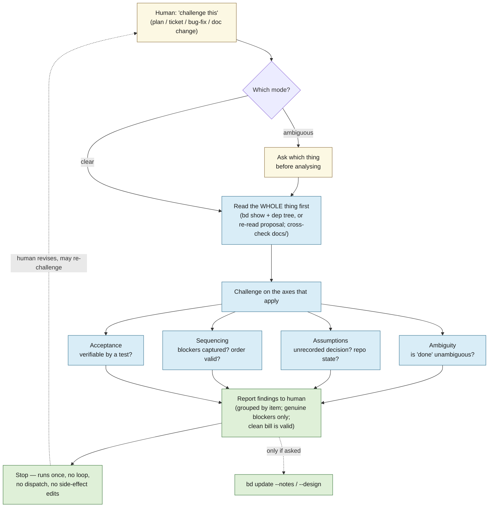
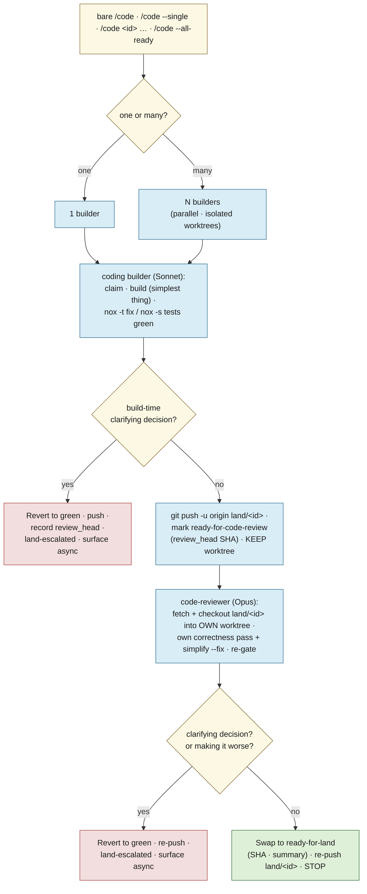

# lode — Agent dev workflow

How lode is *built*. The other docs describe the system; this one describes the **agent
loops that produce it** — a **design loop** that stress-tests a plan before it's built, a
**coding loop** in which a *builder* (Sonnet) produces a green branch and a separate *code-reviewer*
(Opus) runs the technical review on it (solo, or fanned out across several tasks at once with
`/code <id> <id> …`), and a **landing loop** in which a single `/land` lander is the **only** thing
that writes `trunk`. The three are the last three sections of this doc. See [design.md](design.md)
for the thesis and the build sequencing the work flows through.

The operational source of truth for each loop is its skill/agent definition under
[`.claude/`](../.claude); this doc is the map, not the mechanics. The hard project invariants live
in [`CLAUDE.md`](../CLAUDE.md) and [`AGENTS.md`](../AGENTS.md) — **where they and this doc disagree,
`CLAUDE.md` wins.**

---

## The loops

Work moves through three passes, with the human as the hinge:

1. **Design loop — `challenge`.** Before anything is built, a plan, a beads ticket tree, a bug-fix
   approach, or a proposed `docs/` change is handed to the `challenge` skill, which *pushes back*:
   it surfaces ambiguity, hidden assumptions, sequencing gaps, and risky approaches, and reports
   them to the human. It never edits `docs/` or beads as a side effect. The human revises until
   the plan is sound.
2. **Coding loop — `/code` → `coding` builder, then `code-reviewer`.** Once the plan is sound and
   captured as beads issues, `/code` runs each task in **two dispatched phases**. First a `coding`
   **builder** (Sonnet) carries it through an orderly cycle in an isolated worktree: claim → build →
   green gates → push a `land/<id>` branch → mark **`ready-for-code-review`** → **keep the worktree**
   → stop. Then a `code-reviewer` (Opus) fetches that pushed branch and checks it out into its **own**
   launch worktree, runs the technical review — a correctness pass it reasons through by hand plus
   `/simplify` (`/code-review` itself is a bundled skill that is user-gated and unreachable from any
   model context, lode-axyq; see `.claude/agents/code-reviewer.md` step 4) — re-gates, re-pushes, and
   swaps the ticket to **`ready-for-land`**.
   The builder never reviews its own work; neither agent merges, closes, or writes `trunk`.
   **`/code` claims each resolved ticket itself, before dispatch (lode-xr8v)** — for every path where
   the id is known at dispatch (a named id, or one auto-selected from `bd ready`). The builder's own
   `bd update --claim` (its cycle's step 2) is left in place as an *idempotent backstop*, and is the
   *primary* claim only on the free-text path, where no id exists until the builder files the issue.
   The claim was previously the builder's alone, and being an unverified soft step nothing downstream
   checked (Phase 2 verifies labels + the remote branch, never `status`), a builder that skipped it
   carried a ticket all the way to `ready-for-land` while it stayed `open`/unassigned (lode-gpzn.2) —
   so it sat in `bd ready` through its whole build and step 1's `--status in_progress` stranded-review
   sweep would miss it on an escalation. Claiming from the orchestrator, one deterministic flow, makes
   the `in_progress` invariant that the sweeps and Phase 2 assume actually hold.
3. **Landing loop — `/land`.** A single lander drains the `ready-for-land` queue: it semantically
   reviews each branch, merges the accepted set into `trunk`, re-gates, closes the tickets, and
   pushes. It is the **only** thing that writes `trunk` (see
   [the landing loop](#the-landing-loop--build-review-land)).

The boundaries are deliberate: **challenge decides *what* and *whether*; the coding loop decides *how*
and *builds and reviews* it; the landing loop decides *whether it lands* and *does the merge*.**
Keeping the merge decision out of the hands of the agent that wrote the code is the point. Design
decisions settle into `docs/` and beads; only then does code get written (see
[how the loops connect](#how-the-loops-connect)).

---

## The design loop — `challenge`

`challenge` is a single, non-looping pass whose only job is to **argue with the plan**. You give it
something about to be built; it reads the *whole* thing before forming an opinion, challenges it on
the axes that apply, and hands the criticisms back. It does **not** implement, close tickets,
dispatch other agents, or silently rewrite issues — it runs once and stops. (Skill:
[`.claude/skills/challenge/SKILL.md`](../.claude/skills/challenge/SKILL.md).)

What it reads depends on the mode:

- **A conversation plan / approach** — the proposal as written (re-read, not remembered).
- **A beads issue or epic** — `bd show <id>`, then `bd dep tree <id>` and `bd show` on every
  subtask: titles, descriptions, acceptance criteria, notes, design.
- **A proposed `docs/` change** — cross-checked against the source of truth in `docs/`; a plan that
  contradicts a settled decision is itself a finding.

It then challenges on four axes — **ambiguity** (is "done" unambiguous?), **assumptions** (an
unrecorded architectural/tech decision? a repo state that may not hold? an uncited external?),
**sequencing & dependencies** (are all blockers captured? does the stated order actually work?),
and **acceptance/verifiability** (could someone write the test without more clarification?). For a
bug-fix approach it also weighs **root cause vs. symptom**, **side effects**, and whether a simpler
standard pattern exists.

Findings come back grouped by item, each a *genuine blocker* — no padding, and a clean bill is a
valid outcome. By default, closing a challenge persists: findings are appended to each challenged
issue's notes (`bd update <id> --append-notes=…`), and — since lode-bw5k — if the challenged target
*resolves to an epic* (`bd show <id>` shows `issue_type: epic`), that epic is stamped `bd update
<epic-id> --add-label epic-debated`, applied even on a clean bill (the marker records that the
stress-test pass *happened*, not that it found anything). This is the durable, machine-readable marker
[`/code`'s auto-select gate](#the-coding-loop--code--coding--code-reviewer) checks before building any
of that epic's children. Either the note-persisting or the stamp can be skipped by telling `/challenge`
"just tell me, don't persist" — never a ticket's `design` field, which `/challenge` never touches.



---

## The coding loop — `/code` → `coding` + `code-reviewer`

`/code` is the **only** sanctioned way to start coding work from the main session (which is
otherwise told not to spawn agents). The skill resolves the task from its argument and runs each task
in **two dispatched phases** — a `coding` **builder** (Sonnet), then a `code-reviewer` (Opus). **Bare
`/code`** fans out across the filtered ready frontier; `/code --single` does the top one task of that
same frontier (`/code` resolves the pick **itself** — the subagent never re-reads `bd ready` to choose
its own ticket); `/code <id>` / `/code <id> <id> …` name the work explicitly — in every case it's **N
builders in parallel** (one per task, each in its own isolated worktree), each followed by its own
reviewer. There is **no `/code-parallel`**. (Skill:
[`.claude/skills/code/SKILL.md`](../.claude/skills/code/SKILL.md); agents:
[`.claude/agents/coding.md`](../.claude/agents/coding.md),
[`.claude/agents/code-reviewer.md`](../.claude/agents/code-reviewer.md).)

**Topology — run only one `/code` invocation at a time (concurrent invocations unsupported,
lode-pzr).** Fan-out (N builders in parallel) is safe and is the supported way to get parallelism —
each producer works a distinct ticket in its own worktree and pushes its own `land/<id>` branch, so
producers never collide with each other. But `/code` also sweeps for stranded work at the *start* of
every invocation — `needs-rebase` kick-backs and stranded `ready-for-code-review` re-entries — and
those sweeps select on a ticket's **label**, which is only cleared at the very *end* of the agent
dispatched at it. Two concurrent `/code` invocations can therefore both sweep in a ticket whose
agent from the *other* invocation is still live, and dispatch a second agent onto the same worktree
via `git -C`. The observed consequence today is benign (the loser's push non-fast-forward-rejects;
clean-tree assertions guard the worktree), but it is a race, not an invariant — so, mirroring how
`/land` states its one-lander, one-machine topology invariant ([below](#mechanics-decided)), `/code`
states its own: **don't start a second `/code` while one is still running against this repo; pass
more IDs (or use bare `/code`) to the same invocation instead.** This is narrower than `/land`'s
rule — it only forbids a *second concurrent invocation*, not a second machine outright, since a lone
`/code` invocation's own builders already may legitimately fan out across machines (see the coding
loop's [producers may fan out across machines](#running-the-loop-family-unattended--epic-audit-sweep)
note) as long as no other invocation's sweep is running concurrently with them. See
[decisions.md](decisions.md) for the rationale.

Argument resolution:

- **No argument** (the default) / **`--all-ready`** → fan out across the **independent, unblocked**
  frontier of the filtered `bd ready --json` read (see the callout below), honoring the dependency
  graph and the phase-a skeleton order.
- **`--single`** → one task: `/code` resolves the pick **itself** — the same filtered frontier as
  above, top entry, dispatched as an explicitly-named id. The subagent never re-reads `bd ready` to
  pick its own ticket; `--single` collapses to "bare `/code`, limited to one ticket" — same
  selection, same filter, same skip-reporting, only the fan-out width differs.
- **A bd issue ID** (`lode-1a8`) / **several IDs** → claim and implement those (one builder each) —
  an **unfiltered operator override** (see below): the operator named it on purpose, `human` label or
  `epic` type notwithstanding.
- **Free text** ("add a `--json` flag to search") → the agent files the bd issue itself, then codes.

**Auto-select paths only — exclude `human`-labeled tickets and epics (lode-8pqv).** `bd ready` is a
dependency-satisfaction query, not a build queue, and two categories reach it that must never be
**auto**-selected on the **no-argument**, **`--all-ready`**, and **`--single`** paths: any ticket
carrying the **`human`** label (it exists precisely because an agent cannot resolve it — that's what
`/sweep` surfaces it for), and any ticket with **`issue_type == epic`** (a container with no
implementable acceptance criteria of its own). Plain `bd ready` renders no labels, so the filter reads
the frontier as JSON — on **every** auto-select path, including `--single`:

```bash
bd ready --json | jq -r '.[] | select((.labels // []) | index("human") | not) | select(.issue_type != "epic") | .id'
```

`bd ready` is already priority-ordered, so this list's first entry is the highest-priority buildable
item — no extra sort needed. `/code` reports **every ticket dropped** (id + reason) rather than
dropping the skip silently, and if **nothing survives the filter, it dispatches nothing** — never
falling back to a filtered-out ticket. A frontier of nothing but `human` tickets and epics is a real,
reachable state (a decision ticket is its own blocker, and bd won't let a task block an epic); it
means there is no buildable work right now, a signal for `/sweep`, not a build target. This filter
never applies to explicitly-named IDs — those are an operator override, unfiltered.

**Auto-select paths only — exclude children of an un-debated epic (lode-bw5k).** `/challenge` is the
intended stress-test gate a plan/epic should pass **before** its children get built, but nothing
enforced that before this ticket — `lode-olmi`'s children were built and landed by `/code` without the
epic ever having been debated, caught only by a human noticing after the fact. `/code` now runs a
second, mechanical check on every candidate that survives the `human`/epic filter above, scoped
identically (the same **no-argument**, **`--all-ready`**, **`--single`** paths; never applied to an
explicitly-named ID):

```bash
scripts/epic-debate-gate.sh <candidate-id>
```

The **marker side of the contract** lives in `/challenge` (`.claude/skills/challenge/SKILL.md` §4):
closing a challenge whose target *resolves to an epic* (`bd show <id>` shows `issue_type: epic`) stamps
`bd update <epic-id> --add-label epic-debated` — applied even on a clean bill, since the marker records
that the stress-test pass *happened*, not that it found anything; skipped entirely for a non-epic
target (a conversation plan, a single ticket, a `docs/` change) or under the "just tell me, don't
persist" opt-out. The **check side** is `scripts/epic-debate-gate.sh`: given a candidate ticket id, it
derives the parent epic from the candidate's `dependencies[]` — a `parent-child` entry whose target has
`issue_type: epic` — and prints `BUILD <id>` when there is no parent epic or the parent carries `epic-debated`,
else `SKIP <id> epic not debated (<epic-id>)`. It only ever calls `bd show` (twice at most per
candidate); it never writes bd state.

**Two derivations of "who is my parent epic" are both valid** (measured against bd 1.1.0, lode-v4rk).
`bd show <child> --json` exposes a top-level **`.parent`** (`"lode-l38d"`) *and* embeds the epic inside
`.dependencies[]` as a `parent-child` entry — the two agree on every ticket sampled. What is null is
`parent_id`/`epic_id`, which are *different fields* from `.parent`; an earlier reading of that fact as
"no top-level parent field works" is what made the deps walk look like the only option. Prefer `.parent`
(one scalar, no schema/flag pitfall) — `scripts/epic-completion-check.sh` uses it. `epic-debate-gate.sh`
still walks `.dependencies[]` because it needs the *epic's* `issue_type` too, which the deps entry
embeds; that is a real reason, not an oversight. Neither form touches `.dependents`, which is the one
that genuinely needs an opt-in flag (see below). `/code` keeps every `BUILD` in the buildable set and reports every
`SKIP` in its skip list alongside the `human`/epic skips (id + `epic not debated (<epic-id>)`).

**No new escape-hatch flag.** The only unblock is to actually run `/challenge <epic-id>` (cheap) or
hand-apply the `epic-debated` label to acknowledge the epic was debated informally — both leave the
same durable marker, so there is nothing else to build. Both this gate and the `human`/epic filter
above are scoped to step 2's auto-select only: step 0's `needs-rebase` pickups and step 1's stranded
`ready-for-code-review` re-entries pick up tickets already mid-flight, past this gate, and re-checking
them here would strand in-flight work behind a retroactively-applied rule. Tests:
`tests/test_epic_debate_gate.py` (a fake `bd` shim on PATH drives the script through all three shapes:
no-epic ticket builds, debated-epic child builds, un-debated-epic child is skipped with the epic id
named in the reason).

Each builder then runs its orderly cycle. The worktree is **handed to it by the harness**
(`isolation: "worktree"`) — a subagent pinned at the repo root cannot create its own, so it begins
*already inside* `.claude/worktrees/agent-<hash>` on a branch off **`origin/trunk`** HEAD
(`.claude/settings.json`'s `worktree.baseRef: "fresh"`, `lode-jzbz`; `origin/trunk` can lag local
`trunk` by however long since `/land`'s last push — usually small, since `/land` pushes `trunk`
immediately after every merge, but never measured). It works
in-cwd with plain git, and its very first executable action is `scripts/isolation-guard.sh`
(lode-ska2) — a tested assertion that it is inside `.claude/worktrees/` at all, since the harness has
been observed handing a dispatched agent no worktree whatsoever; on failure it **hard-stops and
reports** rather than writing on `trunk`, and never self-provisions one ([full account
below](#isolation-guard-lode-ska2--lode-jk44)). Before touching a file it **locks that worktree** (`git worktree lock`) — a
freshly created worktree has zero commits beyond `trunk`, so until the first commit its branch reads
as trivially "merged" into `trunk` by content identity, which is exactly what `/land`'s end-of-pass
backstop sweep otherwise treats as safe to reclaim; nothing raised that lock before (lode-oqr), so
every producer build was silently exposed for that window. It unlocks again right after its first
commit, once the branch has genuinely diverged and the backstop's own `merged`-into-`trunk` check
takes over as protection for the rest of the build. It claims the issue, builds the simplest thing
that works, takes it green through the gates, then **pushes a `land/<id>` branch to origin, marks the
ticket `ready-for-code-review` (recording its worktree path), keeps the worktree, and stops** — it
does **not** review its own work.

Then `/code` dispatches a **`code-reviewer`** (Opus) for that ticket. It fetches the pushed `land/<id>`
branch and checks it out **into its own launch worktree** — never `git -C` into the builder's
worktree, never `EnterWorktree`, and never the builder's worktree at all — runs the **technical
review** (its own reasoned correctness pass — `/code-review` is unreachable from any model context,
lode-axyq — plus the genuinely tool-backed `/simplify`; re-gate, keep the last green commit), re-pushes
`land/<id>`, and swaps the ticket to **`ready-for-land`**. Neither agent merges, closes, or writes
`trunk` — landing is [`/land`](#the-landing-loop--build-review-land)'s job. Final agent messages aren't
shown to the user, so `/code` relays what came back across **both** phases — which issue, that the
build gates and the technical review passed, the pushed branch and head SHA, or exactly where it
stopped (a build- or review-time escalation) and why.

> **Adding a brand-new `src/lode/*.py` module?** Build a worktree-local venv before `nox` — run
> `./scripts/python-init.sh` from *inside* the worktree. The shared `./venv` editable install
> resolves `lode` to the **main checkout's** `src`, so a new module that exists only in the worktree
> is invisible to it and `nox -s tests` fails with `ModuleNotFoundError`. **Editing an existing
> module needs no fresh venv** — that file already resolves under the main-checkout package.
>
> **The same wrong-venv mistake has a quieter failure mode too (lode-jh80).** Editing an *existing*
> module while the main checkout's venv is active doesn't raise `ModuleNotFoundError` — the import
> resolves fine, just to the **wrong checkout's** `src`. `nox -s tests`/`nox -s unit` then collect
> this worktree's `tests/` but exercise the main checkout's source: a false FAIL when the branch's
> fix isn't exercised, or a false PASS when the branch's regression is masked by the other
> checkout's already-correct code — either way, nothing warns and the run just reports a result for
> the wrong tree. `tests/conftest.py`'s `pytest_configure` guard 0 now catches this mechanically: it
> resolves `lode.__file__` and, if it isn't under the checkout that owns the tests being collected,
> fails the run loudly with a `UsageError` naming the wrong path and the fix, before a single test
> runs. It lives in `conftest.py` rather than as a `nox` preflight so it covers **every** pytest
> invocation — `nox -s tests`/`unit`/`eval` and a bare `pytest -k foo` alike — with nothing to
> remember to wire up per session. The underlying rule doesn't change — build the
> worktree's own venv (`./scripts/python-init.sh` from inside it) rather than reusing the main
> checkout's — the preflight is a backstop for the times that rule gets forgotten, not a
> replacement for following it.
>
> **Activating that venv is a separate problem again** — the isolation guard refuses the sourced
> `. ./venv/bin/activate` outright, so agents gate by explicit path instead. See
> [Gating from an isolated worktree](#gating-from-an-isolated-worktree-lode-6874) below.

```mermaid
flowchart TD
    INV["Human: /code &lt;arg&gt;<br>(bare /code fans out — one builder per ready task)"] --> RES{"Resolve arg"}
    RES -->|"bd id(s)"| T1["Resolve to named id(s)"]
    RES -->|"free text"| T2["Agent files the issue + claims it, then codes"]
    RES -->|"--single / none / --all-ready"| T3["/code picks from filtered bd ready<br>(human/epic excluded · phase-a order)<br>--single: top entry only"]

    T1 --> OCLAIM["/code claims each resolved id<br>(bd update --claim) BEFORE dispatch<br>(lode-xr8v · not the free-text path)"]
    T3 --> OCLAIM
    OCLAIM --> DISP["Phase 1 — dispatch coding builder<br>(Sonnet · isolation: worktree)"]
    T2 --> DISP

    DISP --> WT["Starts ALREADY inside<br>.claude/worktrees/agent-&lt;hash&gt;<br>(branch off origin/trunk HEAD ·<br>baseRef: fresh, can lag local trunk)"]
    WT --> GUARD{"isolation-guard.sh:<br>under .claude/worktrees/?<br>(lode-ska2)"}
    GUARD -->|"no — no worktree<br>at all"| BAIL["Hard stop & report —<br>never EnterWorktree/<br>worktree add self-rescue"]
    GUARD -->|"yes, in worktree"| RGUARD{"HEAD ancestor<br>of origin/trunk?"}
    RGUARD -->|"no — recycled worktree,<br>foreign commits (lode-nt98)"| RESET["git reset --hard origin/trunk<br>+ git clean -fd · report it"]
    RESET --> CLAIM
    RGUARD -->|"yes — clean"| CLAIM["claim (bd update --claim) —<br>idempotent backstop;<br>primary only on free-text path"]

    CLAIM --> IMPL["Read issue + acceptance + design,<br>then implement (Typer · ./venv ·<br>simplest thing that works)"]
    IMPL --> COMMIT["Commit in worktree<br>(Co-Authored-By trailer)"]
    COMMIT --> CLEAN1{"git status --short<br>empty?"}
    CLEAN1 -->|"no"| COMMIT
    CLEAN1 -->|"yes"| GATES{"Quality gates"}
    GATES -->|"nox -t fix · nox -s tests ·<br>validate-mermaid (if diagram)"| GFAIL{"Pass?"}
    GFAIL -->|"no"| FIX["Fix & re-run —<br>never hand off on a failing gate"]
    FIX --> GATES
    GFAIL -->|"yes"| FIXCOMMIT["Commit gate output<br>(fixes + nox -t fix reformatting)"]

    FIXCOMMIT --> PUSH["git push -u origin HEAD:land/&lt;id&gt;"]
    PUSH --> CLEAN2{"git status --short<br>empty?"}
    CLEAN2 -->|"no — edits after push,<br>never gated"| COMMIT
    CLEAN2 -->|"yes"| HANDOFF["Builder: mark ready-for-code-review<br>(worktree path · head SHA) ·<br>KEEP worktree · bd dolt push · STOP"]
    HANDOFF --> REV["Phase 2 — code-reviewer (Opus):<br>fetch + checkout land/&lt;id&gt; into OWN worktree ·<br>own correctness pass + simplify --fix · re-gate"]
    REV --> MARKL["Swap to ready-for-land<br>(head SHA · summary) ·<br>re-push land/&lt;id&gt; · bd dolt push · STOP"]
    MARKL --> DONE["/land lands it (separate loop) ·<br>/code relays both phases"]

    classDef start fill:#fcf8e3,stroke:#8a6d3b,color:#1b1b1b;
    classDef work fill:#d9edf7,stroke:#31708f,color:#1b1b1b;
    classDef gate fill:#fcf8e3,stroke:#8a6d3b,color:#1b1b1b;
    classDef bad fill:#f2dede,stroke:#a94442,color:#1b1b1b;
    classDef good fill:#dff0d8,stroke:#3c763d,color:#1b1b1b;
    class INV,RES start;
    class T1,T2,T3,OCLAIM,DISP,WT,CLAIM,IMPL,COMMIT,FIXCOMMIT,PUSH,HANDOFF,REV work;
    class GATES,GFAIL,GUARD,RGUARD,CLEAN1,CLEAN2 gate;
    class BAIL,FIX,RESET bad;
    class MARKL,DONE good;
```



### Gating from an isolated worktree (lode-6874)

**Agents gate with `./venv/bin/nox -t fix` / `-s tests`, and never activate the venv at all.**
The isolation guard refuses any command that sources a file (`. ./venv/bin/activate` — "runs a
string through `.`, which can't be verified to stay inside the worktree"), so the once-documented
`./scripts/python-init.sh && . ./venv/bin/activate` was unrunnable by the very agents the docs
address; hand-rolling `VIRTUAL_ENV=...`/`PATH=...` trips the same guard. The explicit-path form has
none of those shapes — no sourcing, no substitution, no `$PATH` expansion — so there is nothing to
refuse. The `./venv/bin/` prefix is load-bearing: `nox` is not on the ambient `PATH` unactivated.
The refusal is on **shape alone, before any condition is evaluated** — `if [ -x /nonexistent ]; then
. ./venv/bin/activate; fi` draws the identical message, so burying a `source` in a branch that can
never run does not get it past the guard. It is the `.` that is refused, not the `if/then/fi`: the
same compound wrapping a plain `git` command is accepted. So a conditional gate step is available to
an isolated agent, but never one that sources. (Both verified from a worktree-isolated dispatch,
lode-828x — the case lode-6874's review raised but could not test, having come up in the main
checkout rather than a worktree, the fault lode-jk44 later closed.)

**Activation is unnecessary, not merely inconvenient — `_venv_tool()` (lode-0yfn) removed the reason
for it.** `default_venv_backend = "none"` means sessions inherit the invoking shell's `PATH`, and
activation used to be what pointed ruff/pytest at this checkout rather than another's (the lode-jh80
hazard above). `_venv_tool()` now resolves ruff/pytest/shellcheck/python under the `./venv/bin`
beside `noxfile.py` itself, so pytest imports *this* checkout's `src` whatever `PATH` holds —
enforced by `tests/test_noxfile_venv_tool.py`, not left to convention.

**Verified empirically from a worktree-isolated dispatch, not inferred** — the question had already
survived two review attempts on inference alone. The guard *accepts* `./venv/bin/nox …` and
*refuses* `. ./venv/bin/activate`; un-activated `-s tests` runs 2096 tests green with
`tests/conftest.py`'s lode-jh80 guard 0 satisfied; `-t fix` resolves the venv's ruff over a stale
ambient `~/.local/bin/ruff` that sat ahead of it on `PATH`.

**A missing or half-built venv already fails unmistakably, so the lode-9i2p exit contract needs no
extra machinery here.** A `./venv/bin/nox` that does not exist exits **127** naming the missing path
— a code no content failure produces, so it cannot be mistaken for a verdict on a branch — and
naming the *binary* rather than `venv/bin/activate` is what makes the half-built case fail too
(`scripts/python-init.sh` writes `activate` first and installs nox, the unlocked `dev` extra, several
steps later). Once `nox` runs, `noxfile.py`'s `GATE_MACHINE_FAULT = 2` carries the contract. Either
way the remedy is one command the agent can run itself: `./scripts/python-init.sh`.

**One residual skew, verified and deliberately not papered over.** A branch whose base predates
lode-0yfn has a `noxfile.py` without `_venv_tool()`, so `./venv/bin/nox -s tests` on it dies with
`Program pytest not found` — measured, not inferred, on this ticket's own branch. It fails *loudly*
and cannot produce a false PASS, which is the property that matters; the set is also shrinking, since
every new worktree branches from `origin/trunk` and so always carries `_venv_tool()`. The
guard-friendly fallback for such a branch is `./venv/bin/pytest` directly — a plain command, and
`tests/conftest.py`'s guard 0 still protects it against a wrong-checkout import. Note that this is
base skew *transferred*, not eliminated: dropping the wrapper removes the file-missing form of it,
not the general problem; lode-828x took that residue up and closed it as needing no further mechanism.

**Why no `scripts/nox.sh` wrapper.** One was built and reviewed for this ticket, justified on three
grounds — locating `nox`, a guard-friendly single-command shape, and the exit-2 contract — and each
falls to the explicit-path form above. The "cd to the checkout root" value that looked like a residue
is nil too: the wrapper would have been invoked as `scripts/nox.sh`, a relative path presupposing
exactly the cwd it was meant to establish. What a committed wrapper *does* add is a base-skew problem
with a long tail — every branch already in flight predates the new file, so the documented gate
command exits 127 on all of them, which then needs a restore/undo dance in both agent files whose
undo rests on a `HEAD` oracle a red-gate commit loop can poison. Paying that to improve an error
message on a condition that already exits 127 is a bad trade, so the wrapper was dropped.

**`CLAUDE.md` keeps the activation form on purpose, and the agent files say so.** Its
Python-environment section addresses a human at a terminal and the main session — neither is
worktree-isolated — so `. ./venv/bin/activate` plus a bare `nox` is correct there and stays. But
`CLAUDE.md` is loaded into every dispatched subagent's context too, so an isolated agent holds both
forms at once; rather than hoist an agent-only rule into the project-wide file, `coding.md` and
`code-reviewer.md` each state outright that their explicit-path rule **overrides** that section. The
audience split is the reason the two texts differ, not an oversight in either.

### Recycled-worktree guard (lode-nt98)

`isolation: "worktree"` is supposed to hand a dispatched agent a **fresh** worktree, branched off
**`origin/trunk`** HEAD (`worktree.baseRef: "fresh"`; `origin/trunk` can lag local `trunk` by however
long since `/land`'s last push, usually small but never measured) with zero commits of its own. That assumption was falsified in production,
discovered while technically reviewing `lode-eshl`: the harness handed the `lode-eshl` **builder** a
**recycled** worktree still checked out on `lode-7abi`'s build branch (`worktree-agent-a6b4350c…`),
carrying `lode-7abi`'s own (pre-review) commit. The eshl builder merged `trunk` in on top of that
foreign commit and committed its own work there, so `land/lode-eshl` was pushed carrying three
commits instead of one — a different ticket's *unreviewed* changes riding along, attributed to the
wrong ticket. Had `lode-7abi` been bounced or escalated instead of eventually landing clean, `trunk`
would have silently gained its unreviewed code the moment `land/lode-eshl` landed. The same
`lode-eshl` review turned up corroborating evidence that it isn't builder-only: the **reviewer's own**
launch worktree also started life checked out on `land/lode-7abi` rather than clean off `origin/trunk`
HEAD.

What ships here is a **defensive assertion** — a mitigation that makes each agent safe against the
symptom. It is deliberately *not* a root-cause fix. At the time `lode-nt98` shipped,
`.claude/settings.json` carried `"worktree": { "baseRef": "head" }` (added in the drive-by chore commit
`2d8c9da`, described in no doc until then) — since changed to the explicit `"fresh"`, see [Decision
applied: baseRef fresh](#decision-applied-baseref-fresh-lode-jzbz-2026-07-21), below. Do not read the
guard below as evidence that the harness offers no lever — it means nobody had pulled one yet at the
time `lode-nt98` shipped.

#### `baseRef` investigation (lode-r7ow)

`lode-nt98`'s review left `baseRef: "head"` **un-ruled-out** as a contributing cause and filed this
ticket to determine what values the harness actually accepts and whether a trunk-pinned value is
possible. Per Anthropic's own docs (code.claude.com/docs/en/worktrees, "Choose the base branch" /
"Reuse a worktree name") as of this writing:

- **`worktree.baseRef` accepts exactly two values, `"fresh"` (the default) or `"head"` — nothing
  else.** "You can't set `worktree.baseRef` to a branch name." A literal trunk-pinned value (e.g.
  `"trunk"`) is **not a supported option**; the closest the harness offers is `"fresh"`, which
  branches from `origin/<default-branch>` (`origin/trunk` here), not the local branch by that name.
- **`"head"` means the *current* worktree's `HEAD`, not the main checkout's.** Verbatim: "Inside a
  worktree, `\"head\"` resolves to that worktree's `HEAD`, not the main checkout's." So even a
  correctly-created dispatch worktree's `baseRef: "head"` is only ever a guarantee relative to
  wherever the dispatch happened to start — it was never the absolute "local `trunk` HEAD" guarantee
  this file and the agent definitions assert.
- **The reuse behavior is the direct, documented match for the observed symptom.** Under
  `baseRef: "head"`, the docs state plainly: "any reuse when `worktree.baseRef` is `\"head\"`"
  reopens the worktree "at the old tip" — i.e. a recycled worktree keeps whatever branch and commits
  it already had, unconditionally, no safety check. Under the *default* `"fresh"`, a reused worktree
  instead **resets to the default branch** whenever it has no uncommitted/untracked changes, is still
  on the branch Claude Code created for it, and has no commits of its own (or its PR was merged and
  its remote branch deleted) — exactly the case a stale, previously-built ticket's worktree would hit
  once that ticket lands and its `land/<id>` ref is deleted. `lode-eshl`'s builder was handed a
  worktree still on `lode-7abi`'s **unmerged, unreviewed** build branch — under `"fresh"` semantics
  that worktree would have failed the "no commits of its own" reset condition too (the branch wasn't
  merged yet), so `"fresh"` would not have been a silver bullet for that exact reproduction — but it
  would close the *general* class once a prior ticket's branch has landed and its ref is gone, which
  `"head"` never does regardless.
- Corroborating signal from the wider Claude Code issue tracker: `isolation: "worktree"` Agent-tool
  dispatches creating a worktree from the wrong base (default branch instead of the dispatching
  session's `HEAD`, or vice versa) is a recognized, reported class of bug independent of this repo
  (e.g. `anthropics/claude-code#57768`), not a one-off local anomaly.

**Finding: `baseRef: "head"` is not ruled out — the opposite. Its documented reuse semantics is a
precise, mechanism-level match for the recycling this guard defends against, not just a correlation.**
It cannot be the *sole* cause (a genuinely fresh worktree, never reused, still branches from *some*
`HEAD` — the recycling requires the harness to have reused a worktree directory/name in the first
place, which is a separate harness behavior this investigation did not otherwise probe), but switching
to the default `"fresh"` would close the specific "recycled worktree keeps its old tip forever"
mechanism the docs describe, for every case where the prior occupant's branch has already landed.

**Trade-off the original commit (`2d8c9da`) was solving for, still real under `"fresh"`:** a
`"fresh"` worktree branches from `origin/<default-branch>`, which can lag the *local* `trunk` HEAD —
the exact staleness `2d8c9da`'s commit message and CLAUDE.md's worktree policy warn about. In this
repo's workflow that lag should usually be small: `/land` pushes `trunk` to origin immediately after
every merge (`land/SKILL.md` §4), so local and `origin/trunk` are expected to stay closely in sync
outside of a push that's actively in flight — but "usually small" is not "zero," and this repo has
never measured it.

**Decision: this ticket's own scope says changing `baseRef` for every dispatched agent in the repo is
a human's call, not an agent's — that has not changed just because the investigation now favors
`"fresh"`.** The finding above and this write-up are the input to that decision; the setting itself is
left untouched here. See the bd ticket (`lode-r7ow`) for the pending human decision.

#### Decision applied: baseRef fresh (lode-jzbz, 2026-07-21)

**The human decision above has been made and applied.** `lode-r7ow` was investigation-only by design
(its own acceptance criteria were narrowed to exclude the setting change, precisely so the write-up
above didn't have to be rebuilt around a two-line edit); the decision itself and its application were
tracked separately, on `lode-jzbz`.

**Decision:** `.claude/settings.json`'s `worktree.baseRef` is set to the **explicit string `"fresh"`**
— the key is retained, not removed. Removing the key gets the identical runtime behavior via the
harness default, but leaves nothing in `settings.json` signalling the value was chosen deliberately;
an absent key reads to the next maintainer as an oversight, not a decision. Keeping the key with an
explicit value makes the choice legible at the point of configuration, not just in this write-up.

**Rationale (unchanged from the finding above):** under `baseRef: "head"`, the docs state that *any*
reuse of a worktree name reopens it "at the old tip" unconditionally — a precise, mechanism-level
match for the `lode-nt98`/`lode-eshl` recycled-worktree symptom, not merely a correlation. Under
`"fresh"`, a reused worktree instead resets to the default branch once it has no uncommitted changes,
is still on the branch Claude Code created for it, and carries no unmerged commits of its own —
closing that mechanism for the general, ongoing case (once a prior ticket's branch has landed and its
`land/<id>` ref is gone). It does **not** close every recycling scenario — `lode-eshl`'s exact
reproduction predates the prior branch landing, so `"fresh"`'s reset condition would not have been met
there either — the finding above already says so; the decision accepts that this is a partial, not a
complete, fix.

**Accepted cost:** a `"fresh"` worktree branches from `origin/<default-branch>` (`origin/trunk`), not
local `trunk` HEAD — the exact staleness `2d8c9da`'s original commit and this repo's prior worktree
policy warned about, and now a cost knowingly accepted rather than an oversight. `/land` pushes `trunk`
to origin immediately after every merge, so the lag between local `trunk` and `origin/trunk` is
expected to usually be small — but "usually small" was never measured before this decision and still
isn't; a worktree dispatched while a push is actively in flight can start one merge behind. If that
staleness window ever turns out to matter in practice, it is the thing to measure and revisit, not a
reason to have deferred this decision further.

**Consequence for this repo's docs:** every place that asserted a dispatched worktree "branches from
local `trunk` HEAD" was already inaccurate under **either** `baseRef` value (`"head"` means the
*current* worktree's `HEAD`, per the finding above — never the absolute local-`trunk` guarantee those
claims implied; `"fresh"` means `origin/<default-branch>`; no literal trunk-pinned ref is a supported
option at all). With the setting now explicitly `"fresh"`, those five assertions — `CLAUDE.md`,
`coding.md`, `code-reviewer.md`, `land-review.md`, and this file — are corrected to say `origin/trunk`,
with the staleness window stated plainly rather than implied away, wherever each file makes the claim.

#### Guard mechanics, scope, and the CC 2.1.216 data point (lode-nt98)

Everything below holds regardless of which `baseRef` value is in effect — none of it is specific to
the decision above.

The guard's ancestry assertion is defence in depth, not the root-cause fix. `coding.md` (both cycles),
`code-reviewer.md`, and `land-review.md` all assert, as the first thing they do after confirming
they're in a worktree at all (never on `pwd` or the branch name alone — a recycled worktree's branch
still looks like a normal `worktree-agent-…` name), that `HEAD` is an ancestor of `origin/trunk` —
never bare local `trunk`, which `/land` can leave carrying un-pushed, un-gated merges for its whole
merge window (`lode-isl3`, below). This
used to be a ~15-line inline bash block duplicated at all four call sites — already caught drifting
from each other by the time a fourth copy landed — so it is now one script,
`scripts/recycled-worktree-guard.sh` (lode-ivth), covered by `nox -s shellcheck` and
`tests/test_recycled_worktree_guard.py`; each site invokes it with its own short context message
rather than carrying its own copy of the logic. The core of what it checks:

```bash
git merge-base --is-ancestor HEAD origin/trunk
```

**Why `origin/trunk`, never bare local `trunk` (`lode-isl3`).** Worktrees share `refs/heads/`, so bare
`trunk` is the *main checkout's* local `trunk` branch — and `/land` leaves that ref carrying
un-pushed, un-gated `--no-ff` merges for the entire window between its merge loop and its push (a
property of the healthy path, not just a crash path, since `/code` producers run concurrently with
`/land` by design). Reading bare `trunk` here used to open two holes: a genuinely recycled worktree
could get reset onto that residue, planting *other* tickets' un-pushed, un-gated commits into the
build — the exact contamination this guard exists to prevent, arriving *through* the guard; and a
worktree recycled onto a `land/<id>` branch a live `/land` pass had merged into local `trunk` (but not
yet pushed) passed the ancestor check trivially, going silent with no rescue and no reset.
`origin/trunk` is never in that intermediate state — `/land` only advances it with an already-gated,
already-pushed `trunk` — so both holes close by reading it instead everywhere below. The guard
deliberately does not fetch first: `worktree.baseRef: "fresh"` branches a launch worktree from exactly
this ref, so comparing against it (without advancing it) asks precisely the right question. Fetching
would only advance the test's *right-hand* side, which can flip it false→true but never the reverse —
strictly more forgiving, which is the wrong direction for a guard. The script's header says the same
at length; do not add a fetch there.

A worktree that is merely *behind* current `origin/trunk` (because `origin/trunk` advanced after this
worktree was created — a normal race in a fan-out) still passes trivially, since being behind on the
same line of history is exactly what "ancestor" means; only a worktree carrying commits
`origin/trunk` doesn't have — someone else's unreviewed work — fails it. The predicate reads the
**commit graph only**: a recycled worktree whose HEAD happens to be an ancestor of `origin/trunk` but
whose *working tree* is dirty passes untouched, so this is not a general "is my tree clean" check.

On a failure the agent resets onto `origin/trunk` HEAD (`git reset --hard origin/trunk && git clean
-fd`) before doing anything else, and reports the fact explicitly in its hand-off — this is live
evidence of a harness bug, not a routine hiccup to swallow silently. Two preconditions wrap that
remediation, because it is destructive and fires exactly when the worktree's provenance is *not*
understood:

- **It only runs in an isolated launch worktree — mechanically, at all four call sites.**
  `coding.md`'s rebase-pickup step 2, `code-reviewer.md`'s step 2, `land-review.md`'s first action,
  and `coding.md`'s fresh-build site (step 3) each invoke the same
  `scripts/recycled-worktree-guard.sh`, which wraps its remediation in an explicit
  `case "$TOP" in */.claude/worktrees/*) ;; ... esac` on `git rev-parse --show-toplevel`, in the same
  block as the destructive command. Every call site also runs [`scripts/isolation-guard.sh`
  (lode-ska2)](#isolation-guard-lode-ska2--lode-jk44) immediately before it — a second, script-backed
  assertion of the same predicate, which replaced the prose `pwd` check the agents used to
  carry. Either script's
  `case` is what actually stops an agent whose `isolation: "worktree"` dispatch silently failed from
  letting `reset --hard`/`clean -fd` reach the user's **main checkout** — which is what would turn a
  contamination guard into the more damaging bug.
- **It records a `rescue/recycled-<sha>` branch before rewinding.** `git reset --hard` moves the
  *checked-out branch ref*, and in a recycled worktree that ref belongs to another ticket (the
  reproductions sat on `worktree-agent-<other-hash>` and on a `land/<other-id>`). If that ticket had
  committed but not pushed, the reset would be the only thing between its work and oblivion. Tagging
  `HEAD` first makes the repair reversible and leaves the evidence inspectable; the hand-off names the
  ref. Note the asymmetry that motivates this: contamination is *recoverable* (bounce the branch),
  whereas an unrescued `reset --hard` is not.

**The inline explanation at each guard call site stays deliberately duplicated prose, not a link
(lode-zt62).** Only the *machinery* (`scripts/recycled-worktree-guard.sh`, lode-ivth) and the
*quick-card row* were safe to consolidate; the canonical row is [below](#invariants-the-coding-loop-never-breaks),
linked from `coding.md`'s and `code-reviewer.md`'s quick cards (`land-review.md` carries no such
table). `coding.md`,
`code-reviewer.md`, and `land-review.md` each carry their own multi-paragraph account of this guard,
substantially overlapping across all three. Collapsing those paragraphs to a bare link was considered
and rejected: each site is read fresh by a dispatched subagent with no other context, immediately
before it runs a destructive `git reset --hard`/`git clean -fd` — the risk that the rationale (why the
rescue branch matters, why `origin/trunk` and never bare `trunk`, why the `case` guard exists) silently
fails to reach the agent that needs it, right when it needs it, outweighs the drift cost of three
copies. `docs/decisions.md`'s three re-narrations of the same material carried no such argument —
nothing reads `decisions.md` immediately before a destructive command — so those were trimmed to
decision-timeline pointers instead (search "lode-zt62").

**Scope: only the fresh-build start state (`coding.md` step 3) and each cycle's own pre-checkout start
state (`coding.md`'s rebase-pickup step 2, `code-reviewer.md` step 2) — never a reason to avoid the
deliberate non-trunk checkouts those latter two cycles perform right afterward.** A rebase pickup
fetches and checks out an existing `land/<id>` on purpose (it's mid-flight work being resumed, not a
fresh build), and a `code-reviewer` always checks out the branch it's reviewing on purpose — both are
supposed to end up off `trunk` HEAD, and this guard doesn't fight that. It only guarantees the
*starting* point, before that intentional checkout, is a clean `trunk` rather than silent
contamination. In both of those cycles the `git checkout -B … FETCH_HEAD` immediately afterward
overwrites the checked-out ref regardless, so the guard is not what makes the checkout correct — its
value there is the **working tree**: `checkout -B` carries *untracked* leftovers from a recycled
worktree straight through, and those would otherwise pollute the clean-tree assertions and the `nox`
run those cycles gate on.

`/land`'s own landing loop was initially scoped **out** of this fix, on the reasoning that
`land-review` **never checks anything out** — it fetches and diffs entirely by ref (`origin/trunk`,
`origin/land/<id>`), so a contaminated working tree cannot reach its verdict, and its correctness
exposure is nil. That reasoning holds and is unchanged: **`land-review`'s correctness exposure to
recycling remains nil**, exactly because it never reads anything from the worktree's checked-out
state. But nil correctness exposure is not the same as *no* exposure at all. `land/SKILL.md` §2c used
to argue `land-review`'s scratch worktree needs no cleanup because "its worktree's HEAD never diverges
from the `trunk` HEAD it was branched from" and so "qualifies by construction" for the backstop
reclaim sweep — an assumption this incident falsifies (a *recycled* worktree's `HEAD` starts life
already diverged, before `land-review` ever runs), so a recycled `land-review` worktree fails the
sweep's ancestor predicate and leaks, pass after pass. That was tracked as a real but separate
worktree-leak defect on its own ticket, **lode-qv5t**, rather than widened into this one — and it is
now closed the same way: `land-review.md`'s own frontmatter role carries the identical guard described
above (`git merge-base --is-ancestor HEAD origin/trunk`, never bare local `trunk`, asserted before any
fetch/diff work; on failure, rescue the rewound ref and reset onto `origin/trunk` HEAD). The two
halves stay distinct on purpose — the guard exists here for the **worktree-leak** reason, never
because `land-review`'s judgment was ever at risk. That guard, as first shipped, closed the
**ancestry** axis only: the check cannot detect a worktree recycled onto a `land/<other-id>` that has
since landed (its `HEAD` is already an ancestor of `origin/trunk`, so the check passes trivially), and
since `git clean -fd` used to run only inside the
failed-check branch, that case's surviving untracked leftovers made the sweep keep the worktree anyway
— tracked as **lode-3v1p**.

**lode-3v1p closes the dirt axis too, at all three guard sites (`coding.md`'s fresh-build and
rebase-pickup instances, `code-reviewer.md`, `land-review.md`).** Dirt and ancestry are independent:
the ancestor check stays narrow and commit-graph-only (it is not, and does not need to become, a
general clean-tree assertion), but `git clean -fd` now runs **unconditionally** right after the check,
pass or fail — still gated by each site's own `.claude/worktrees/`-only `case`, so it never reaches
outside an isolated launch worktree. It's a no-op on a genuinely fresh worktree (nothing untracked to
remove, and it never touches `.gitignore`d build state like `venv/`), and it clears exactly the
leftover dirt on an undetected recycle. **The two axes stay documented as distinct even though one
fix now closes both:** `land-review`'s correctness exposure to a recycled worktree remains nil
regardless (unchanged from above — it never checks anything out), and this was, and remains, purely a
worktree-**leak** fix on that role. Full reasoning, including the two runner-up options considered and
why the unconditional-clean shape won: [docs/decisions.md](decisions.md) (search "lode-3v1p"). Full
account of the guard sites: [land-review.md](../.claude/agents/land-review.md),
[coding.md](../.claude/agents/coding.md), [code-reviewer.md](../.claude/agents/code-reviewer.md), and
[Isolating `land-review` dispatches](#isolating-land-review-dispatches-lode-g387), below.

**2026-07-21 update (lode-ag7j) — CC 2.1.216 data point, guard KEPT.** Claude Code 2.1.216 shipped
three worktree fixes, verified live on 2026-07-20 (main session on 2.1.216; `.claude/settings.json`
still carried the undocumented `worktree.baseRef: "head"` at that point, still un-ruled-out as a
contributing cause per the `baseRef` investigation above):

1. Fixed worktree-isolated subagents redirecting git into the shared checkout via `git -C`,
   `--git-dir`, or `GIT_DIR`/`GIT_WORK_TREE`.
2. Fixed worktree sessions landing in another project's leftover worktree when the working directory
   did not match the selected project.
3. Fixed background sessions whose worktree has no git repository being undeletable.

**Honest mapping — none of the three is a confirmed fix for lode-nt98:**

- **Fix #2 is the tempting candidate but does not obviously apply.** Its changelog framing is
  explicitly **cross-project** ("another project's leftover worktree… working directory did not match
  the selected project"). lode-nt98 is **same-project, same-repo** — the `lode-eshl` builder was
  handed `lode-7abi`'s own leftover worktree, not another project's. The underlying "land in a pooled
  leftover worktree" mechanism is plausibly shared between the two, but that is a plausibility, not a
  confirmation — the changelog text does not say it covers lode's single-project fleet.
- **Fix #1 is relevant only to the retired `lode-k5e` architecture**, where a reviewer used to drive
  the builder's worktree in place via `git -C`. Current design already fetches the branch into the
  agent's own launch worktree instead, so this fix changes nothing operationally here — it just means
  the isolation-guard behavior `lode-k5e` fought has moved upstream.
- **Fix #3 does not touch lode's guards** — lode's worktrees are always inside a git repository.

**Verdict: keep every guard, unchanged.** They are cheap defensive assertions; the failure mode they
prevent — unreviewed code riding into `trunk` on the wrong ticket's `land/<id>` — is catastrophic and
irreversible. "Probably fixed upstream" is not grounds to retire a guard this cheap against a failure
this expensive. No guard is removed or weakened here. `worktree.baseRef` was still `"head"` at the time
of this 2.1.216 verification (2026-07-20), exactly as the `baseRef` investigation above had left it —
that changed the following day: see [Decision applied: baseRef
fresh](#decision-applied-baseref-fresh-lode-jzbz-2026-07-21) above (`lode-jzbz`, 2026-07-21). This
note's own verdict — keep every guard regardless of the `baseRef` value — is unaffected by that switch.

**Falsification test this sets up.** The fleet is now on, or moving onto, `>= 2.1.216`. Watch whether
the recycled-worktree guard **ever fires** — any `rescue/recycled-<sha>` branch created, any
guard-triggered `git reset --hard origin/trunk` — across many `/code` and `/land` passes going forward:

- **If it stops firing over a sustained window:** evidence that an upstream fix (candidate: #2)
  addressed the underlying recycling mechanism after all, despite the cross-project framing above —
  file a follow-up to retire the lode-nt98 guard family and revisit `worktree.baseRef: "head"`.
- **If it keeps firing:** 2.1.216 did not address lode-nt98 for this repo's same-project case; the
  `baseRef` hypothesis (above) stands, and the guards stay.

### Isolation guard (lode-ska2 / lode-jk44)

**A DIFFERENT, more severe harness failure from the recycled-worktree guard above — a distinct
sibling, deliberately not folded into `lode-nt98`.** That guard defends against a dispatched agent
getting a *wrong* worktree (recycled, still on a previous ticket's branch — a worktree, just not this
ticket's). This one defends against a dispatched agent getting **no worktree at all**.

**The incident.** Discovered while technically reviewing `lode-b2bf`: a dispatched `code-reviewer`
subagent's cwd was pinned to the **main checkout at the repo root**, checked out on `trunk` — not
inside any worktree. `code-reviewer.md`'s own non-negotiable ("if my cwd is the repo root / `trunk`,
stop and report") is an **English instruction**, not a mechanism, and nothing mechanical backed it:
had the reviewer followed its documented happy path, it would have run `Edit`/`Write`/`nox -t fix`
directly against the main checkout, on `trunk` — exactly what `CLAUDE.md`'s top-of-file rule forbids.
Both documented self-rescue routes were refused by the harness itself: `EnterWorktree(name=…)` →
"cannot create a worktree from a subagent with a cwd override"; `EnterWorktree(path=…)` → "the current
working directory is the repository root, not an isolated worktree — switching is only available to
sessions whose working directory is inside a worktree." The reviewer could not self-rescue into a
worktree through any documented tool. It instead invented `git worktree add` + driving the new
worktree via `git -C` and absolute paths mid-flight — an unsanctioned workaround, not a mechanism —
and, this one time, completed the review correctly (`trunk` was never written). A second incidence
(**lode-jk44**) reached the identical fault through a different route: a `code-reviewer` dispatched by
`/code`'s **step-1 stranded-review sweep** (picking up a `ready-for-code-review` re-entry left by a
human resolving a prior escalation — see `code/SKILL.md`'s step 1) rather than a normal Phase 2
dispatch. `lode-jk44`
is tracked as a **duplicate** of `lode-ska2` by human decision at land time (not closed by this
ticket's own builder) — both are the same underlying fault, reached by two different dispatch paths,
and `lode-jk44`'s one distinguishing acceptance criterion (cover the step-1-sweep-vs-Phase-2 question
below) is folded into this write-up rather than built as a second, parallel fix.

**Escalation from the same `/code` fan-out this incident came from: it silently disarms `/simplify`
too.** The `Skill` tool executes in the agent's cwd. Under this fault that cwd is the main checkout on
`trunk` — a clean tree with an **empty** diff. `/simplify` therefore analyzes nothing and returns a
confident "nothing to change," indistinguishable from a genuine clean pass (this is `lode-k5e` reached
by a second route). It also carries an apply-fixes mandate, so on the happy path it would have
**written** to the main checkout, on `trunk`. Any review completed under this fault has had only half
its mandate performed while still reading `ready-for-land`. Incidence that same invocation: **6 of 6**
`code-reviewer` dispatches came up with no isolation worktree (`lode-k9ef`, `lode-sfnb`, `lode-6874`,
`lode-3dlt`, `lode-b2bf`, `lode-u709`) — not a one-off.

**One in-repo hypothesis this write-up does NOT rule out: at the time of these failures, how isolation
was *requested* differed between the affected agents and the unaffected one.** `land-review.md` carries
`isolation: worktree` in its **agent-definition frontmatter**; `coding.md` and `code-reviewer.md` did
not — for them the option was passed only at the `Agent`-tool call site by `code/SKILL.md`. `lode-p2vi`
established (2026-07-20) that the
frontmatter key alone suffices for `land-review`, and `lode-kt6g` moved it there precisely so "the
requirement travels with the role rather than staying call-site prose"; that migration stopped at
`land-review` and was never extended to the other two. Every observed failure is a `code-reviewer`
dispatch — i.e. exclusively the call-site-request mechanism — and no `land-review` dispatch has been
observed hitting it. **That correlation is suggestive, not established, and is explicitly not a claim
that frontmatter would have prevented it:** the fault is harness-side *provisioning*, not a request
this repo forgot to make, and `code-reviewer` dispatches both before and after that fan-out (including
the one that reviewed `lode-ska2` itself) received their worktrees normally through the same call-site
path — so the mechanism cannot be the whole story.

**Probed by `lode-ojsr` (2026-07-27), then resolved by `lode-09td` (2026-07-28/29).** The
frontmatter-vs-call-site confound raised above is now **closed on its sufficiency half for `coding`
and `code-reviewer`** — frontmatter alone provisions the worktree for both.
`lode-ojsr` shipped `isolation: worktree` into both agents' frontmatter (closing the *asymmetry* with
`land-review`) but its own probe was structurally invalid: it ran as a `coding` producer, so its
dispatches were necessarily **nested** inside an already-isolated session, where a
`subagent_type: "claude"` negative control carrying no isolation mechanism at all landed in the parent's
own worktree exactly as the two frontmatter-bearing test cases did — nested dispatches inherit their
parent's cwd, making the variable unobservable from any producer or reviewer session. `lode-09td` ran
the probe `lode-ojsr` could not: from the **top-level orchestrating session** (main checkout, on
`trunk` — the same vantage `lode-p2vi` used and `/code`'s Phase 1/2 dispatch from), with **no
call-site `isolation` option**, dispatching `coding` (2026-07-28) and separately `code-reviewer`
(2026-07-29) each alongside a concurrent, identically-dispatched `claude` negative control. Both
roles **isolated** (linked worktree, own branch, `HEAD ==` the dispatching session's `trunk`); the
control in both runs landed unisolated in the main checkout on `trunk`. Since the only
isolation-*relevant* difference between control and test case in each run was the frontmatter key,
frontmatter alone — not nested-dispatch cwd inheritance — is what provisions the worktree for both
roles. As a result, `code/SKILL.md`'s call-site `isolation: "worktree"` option for `coding` and
`code-reviewer` was **dropped** as redundant, matching `land-review`'s treatment after `lode-p2vi`.
Full probe detail, both runs' results, and the two explicit limits on what this licenses — the
contrast is between *whole* agent definitions rather than a single-variable ablation of the key, and
the load was light — are in [`docs/decisions.md`](decisions.md) (search "lode-09td").

**Root cause: still not fully determinable from this repo — the sufficiency question is closed, the
fan-out question is not.** `isolation: "worktree"` is a harness feature implemented outside this codebase;
nothing in `lode`'s own source, skills, or agent definitions controls whether the harness actually
provisions a worktree before handing control to a dispatched subagent. What *is* now determinable:
**asking at the call site does not guarantee isolation** — the call-site option was live throughout
`lode-ska2`'s 6-of-6 and every one of those dispatches failed anyway — and `lode-09td`'s probes show
the *other* mechanism, frontmatter, reliably isolates both roles under light, non-concurrent load.

What is **not** determinable, and must not be read into the above: **whether frontmatter would have
prevented `lode-ska2`.** Two independent reasons, both still open. First, the key was not present on
either role at the time of that incident — `lode-ojsr` added it on 2026-07-27, after the fact — so
the frontmatter-vs-call-site hypothesis raised earlier in this section has never been tested against
the failure itself: neither confirmed nor refuted. Second, **each `lode-09td` probe was a single
two-dispatch run (one test role, one control), never a fan-out.** The probes establish the mechanism
works under light load; they say nothing about concurrency pressure. `lode-09td` closed the
*sufficiency* question (frontmatter alone provisions a worktree), not the *robustness* one. The harness-side
race/resource-pressure condition under concurrent fan-out — `lode-ska2`'s own incident was a 6-way
fan-out — remains the best-supported explanation this repo can offer for *that* incident specifically,
and is **not** refuted by `lode-09td`: dropping the redundant call-site option is not claimed to
reduce fan-out risk, only to remove a mechanism with no measured protective effect.

**The decision this ticket had to make: is `git worktree add` + `git -C` the sanctioned recovery, or
must the agent hard-stop and escalate?** `lode-ska2`'s own incident answered this empirically by
accident — its reviewer invented the workaround mid-flight and it worked, that one time. **Decision:
hard-stop, never self-provision.** Per `CLAUDE.md`'s "simplest solution first," and for three concrete
reasons beyond just preferring the simpler option:

1. **Auto-recovery hides a harness bug an operator needs to see.** A dispatch that silently limps along
   on an improvised worktree looks, from the outside, identical to one that worked correctly — the
   6-of-6 incidence above would have gone unnoticed indefinitely if every affected reviewer had quietly
   self-provisioned and moved on. A hard stop forces the fault into a bd ticket and a human's attention
   every time it happens, which is the only way an intermittent-at-best, unmeasured-at-worst harness
   fault ever gets tracked, let alone fixed upstream.
2. **`git worktree add` from a non-isolated cwd mutates shared state that isn't the agent's to touch.**
   It writes into the **main checkout's** `.git/worktrees` registry — exactly the kind of main-checkout
   mutation `CLAUDE.md`'s top-of-file rule exists to prevent, even though creating the worktree itself
   is not directly destructive. An agent that has already established it cannot trust its own dispatch
   is not the agent to be improvising further main-checkout writes.
3. **A self-provisioned worktree is orphaned state nobody owns cleaning up.** Every worktree this fleet
   creates through the documented paths (`isolation: "worktree"`, `EnterWorktree`) is reclaimed by
   `/land`'s end-of-pass backstop sweep or `/code`'s own reclaim block, both keyed off conventions
   (`.claude/worktrees/`, ticket-id-derived branch names) those paths guarantee. A `git worktree add`
   invented ad hoc under fan-out pressure is not guaranteed to fit those conventions, risking either a
   name collision with a concurrently-dispatched sibling or a worktree that never gets GC'd at all.

**What ships:** `scripts/isolation-guard.sh` (lode-ska2), a sibling to
`scripts/recycled-worktree-guard.sh`, shellcheck'd (`nox -s shellcheck`) and unit-tested
(`tests/test_isolation_guard.py`) the same way `lode-ivth` covered the recycled-worktree guard. It
asserts the single precondition "is cwd inside `.claude/worktrees/` at all" — the logically *prior*
question to the recycled-worktree guard's "is it the *right* worktree" — and, unlike that guard, never
repairs anything on failure: there is no safe way to fabricate an isolated worktree from a
non-isolated context, so its two substantive outcomes are exit 0 (proceed) or exit 1 (a diagnostic
that explicitly forecloses `EnterWorktree` and `git worktree add` as next steps, not just reports the
problem); exit 2 is a caller bug (an argument was passed) or a machine fault (a cwd outside any git
repository — `git rev-parse` itself is wrapped so that failure converts to this script's own
documented exit 2, never git's raw, undocumented 128 — lode-t6ni, [below](#precondition-guards-the-012-family-lode-t6ni)).
Every call site treats any non-zero exit as the same hard stop, so none of these are distinguished in
practice — the distinction is for the *diagnostic*, not the caller's control flow. It runs as the
**first executable action** of `coding.md`'s fresh-build cycle (step 3),
`coding.md`'s rebase-pickup cycle (step 2, ahead of the recycled-worktree guard there too),
`code-reviewer.md`'s step 2 (ahead of its recycled-worktree guard), and `land-review.md`'s first
action — before `EnterWorktree` is even considered, closing the window in which the `lode-ska2`
incident's reviewer improvised its workaround. Full call sites:
[coding.md](../.claude/agents/coding.md), [code-reviewer.md](../.claude/agents/code-reviewer.md),
[land-review.md](../.claude/agents/land-review.md).

**What "mechanical, not by reading an instruction" means in practice here, honestly stated.** This is
enforcement at the *instruction* level: the guard detects mechanically and exits non-zero, but nothing
compels the agent to honour that exit code. Note what this claim is **not** — it is not that
mechanical enforcement over a dispatched subagent is impossible. It plainly isn't: this repo's own
committed `PreToolUse(Bash)` hooks (the `bd create --deps blocks:` inversion guard, the
external-tracker write guard `lode-o29m`, the fabricated-SHA guard `lode-fpmi`) deny a dispatched
subagent's tool calls outright, and the harness's own worktree pin refuses its off-worktree commands.
A hook *can* stop an agent acting; what no repo component can do is force it to stop reasoning and
return.

Instruction level is nevertheless the **right** altitude here, by this repo's own settled rule rather
than by concession: `lode-kt6g` fixed the proportionality test as *irreversible-and-public earns a
default-deny mechanical fence; local-and-recoverable earns a structural fix that makes the mistake
harder to make* — and classified a non-isolated dispatch as local-and-recoverable, since everything it
can dirty lives in a working tree a human `git reset --hard` recovers, never off-machine. (A blanket
`Edit`/`Write` hook would also be a *partial* fence at best: the largest write channel here is
`nox -t fix`/`ruff --fix` going through `Bash`, and the main session legitimately edits at the repo
root.) What this change buys within that altitude: the *detection* is now a tested script rather than
the model eyeballing its own `pwd`, and the calling docs no longer leave the agent a live decision
point to fill with improvisation on failure — they name the one sanctioned response (stop, report) and
explicitly rule out the two the `lode-ska2` incident's agent reached for instead. This is the same bar
`lode-nt98`/`lode-ivth` shipped at and was accepted on; it is not a stronger guarantee than that
precedent, and this doc does not claim it is.

### Isolation guard: mid-session re-assertion (lode-6wgc)

**A new and more severe variant of the isolation-guard family above — the worktree is provisioned
correctly, passes both guards, and is then destroyed *mid-session*.** During a bare `/code` fan-out
(cap 5), the `coding` builder dispatched at `lode-e6s1` had its launch worktree
(`.claude/worktrees/agent-a5046a8a1a14aaf53`) **deleted from disk while it was actively working in
it**. Its own background job logged `FileNotFoundError: [Errno 2] No such file or directory` for that
path; the agent then found `pwd == /home/dmklein/PROJECTS/lode` and `HEAD == trunk`. This differs from
`lode-ska2`/`lode-jk44` (no worktree handed over at dispatch) and `lode-nt98` (a *wrong*, recycled
worktree handed over at dispatch): both of those are dispatch-time faults the step-3/step-1 guards
catch before any work starts. This one happened **after** both guards had already passed — the
merge-base/isolation checks run once, at the start of the cycle, and have no way to observe a worktree
vanishing an arbitrary number of steps later.

**Consequence.** The agent's cwd silently became the repo root, on `trunk`. Any `Edit`/`Write`/`nox` it
ran next would have mutated `trunk` directly — CLAUDE.md's top-of-file non-negotiable. In this
instance nothing was lost: the agent noticed (`pwd` and `HEAD` both read wrong) and stopped, full
stop, having made no changes or commits yet. That outcome depended entirely on the agent noticing —
the same "luck-adjacent, not mechanical" gap `lode-ska2` closed for the dispatch-time case was still
open here for the mid-session case.

**Leading hypothesis, unconfirmed: resume-then-reap.** The affected agent had been resumed once via
`SendMessage` — it had stalled on a backgrounded gate (`lode-95o`), was resumed to re-run the gate in
the foreground, and the worktree vanished during that resumed turn. Whether the harness reaps a launch
worktree on some resume paths is a harness-internal question this repo cannot test or instrument from
inside; it is **left open** in `docs/decisions.md` rather than asserted as fact. Two further open
questions from the same incident — whether fan-out concurrency (5 agents at cap) was a factor, and
whether the reclaim path some other component drives could be implicated — were checked and **ruled
out** for this incident specifically: `/code`'s own end-of-pass reclaim block had not run at all, and
in any case it only ever matches `land/<id>--*` branch names, never `worktree-agent-*` — so this was
not a case of a live reclaim colliding with an in-progress build.

**Fix shipped by this ticket: a cheap re-assertion of `scripts/isolation-guard.sh`, not a periodic
daemon.** The existing guard script (unchanged) is re-run at the two highest-value checkpoints in
`coding.md` and `code-reviewer.md`, at the two points where a worktree that vanished since the last
check would otherwise cause real damage. For the **builder** those are the first mutating
`Edit`/`Write` of the task, and the first `git commit` — the commit is the higher-consequence of the
two by a wide margin, because in this failure mode it does not error, it *succeeds against the main
checkout on `trunk`*, which is CLAUDE.md's top-of-file non-negotiable and is far harder to undo than
the in-place reformat `nox -t fix` performs immediately afterwards (one guard ahead of the commit
covers both). For the **reviewer**, whose cycle has no commit-to-`trunk` exposure of the same shape,
they are the first mutating write and the gate loop.

Each checkpoint substitutes the toplevel **inline** —
`"$(git rev-parse --show-toplevel)/scripts/isolation-guard.sh"` — rather than carrying a `$TOP`
assigned by an earlier step's block. Fenced blocks run as separate `Bash` invocations and shell state
does not survive between them (lode-lv04): a carried-over `$TOP` expands to empty, the guard path
resolves to `/scripts/isolation-guard.sh`, and the checkpoint then hard-stops **every** task
unconditionally — a guard that fires on a legitimately-clean worktree is strictly worse than no guard,
since the reliable way to make agents ignore a safety check is to make it cry wolf on every run.
`tests/test_skill_bash_state.py` gates this mechanically, and caught exactly this defect in this
ticket's own first draft during technical review.

`recycled-worktree-guard.sh` is deliberately **not** re-run at these checkpoints — its failure mode is
destructive repair (`reset --hard` + `clean -fd`), appropriate once, as a precondition, but wrong to
invoke mid-session against a tree that may hold real uncommitted work from *this* session.

**What this fix does not claim.** It does not identify or fix whatever harness mechanism destroyed the
worktree — that remains outside this repo's visibility and stays an open question in
`docs/decisions.md`. It narrows the exposure window (dispatch-time check → first-mutation check → first
gate-loop check, rather than dispatch-time check alone) without eliminating it: a worktree destroyed
between a checkpoint and the tool call it guards is still a live gap. The mechanical stop-on-failure
behavior this ticket adds is the same "stop and report, never self-rescue" contract as the
dispatch-time guards — it makes noticing mechanical at two more points, it does not make the
underlying harness fault impossible.

**It was, at the time this ticket landed, explicitly not the structurally correct altitude — that gap
is now closed by `lode-p8zl`.** Checkpoints in a markdown instruction file depend on the agent
choosing to run them; the mechanism that closes this class of gap *by construction* is a
`PreToolUse` hook in `.claude/settings.json`, which fires on every matching tool call and needs no
agent cooperation — the same graduation this repo already made for the gh-write and SHA-fabrication
guards. `isolation-guard.sh` was already an executable 0/1/2 script with the right exit semantics, so
the body existed; what this ticket's own scope could not settle were two real design questions (the
guard would also fire in the *main* session, where working on `trunk` is legitimate for the doc-only
`--no-verify` path CLAUDE.md sanctions, and a fourth hook compounds the deny-everything failure mode
if its prerequisites are missing). That was a **deferral on stated grounds, not a rejection**, filed
as `lode-p8zl` — which escalated both questions for a maintainer ruling and then shipped
`scripts/trunk-write-guard.sh`: a `PreToolUse(Edit|Write)` hook, gated on the current BRANCH (not an
attempt to disambiguate subagent from main session — the payload cannot support that), returning
`permissionDecision: "ask"` rather than `"deny"` when `HEAD` is `trunk`, and needing no `jq`. Full
rulings and rationale: [`docs/decisions.md`](decisions.md) (search "lode-p8zl").

### Precondition guards (the 0/1/2 family) (lode-t6ni)

lode now has **three** sibling precondition guards under `scripts/`:
[`isolation-guard.sh`](../scripts/isolation-guard.sh) (lode-ska2, [above](#isolation-guard-lode-ska2--lode-jk44)),
[`recycled-worktree-guard.sh`](../scripts/recycled-worktree-guard.sh) (lode-ivth, [above](#recycled-worktree-guard-lode-nt98)),
and [`assert-main-checkout.sh`](../scripts/assert-main-checkout.sh) (lode-pcee, [below](#mechanics-decided)).
Each grew its own header explaining a de-facto contract the three actually share; this subsection is
that contract's single source, so a fourth guard has one place to read it from instead of copying the
nearest sibling's header and hoping it copied the right parts.

**What the three have in common.** Each asserts a single fact about the *agent's own environment* —
am I inside an isolated launch worktree at all, is this the worktree I was actually meant to get, is
cwd genuinely the main checkout — never a fact about a branch's content. Each is a plain, `set -euo
pipefail` shell script (not a Python tool, not inline shell in a markdown fence), shellcheck'd via
`nox -s shellcheck`, and covered by its own `tests/test_*.py` module that runs the real script against
real git repositories in `tmp_path` — no mocked subprocess. Each is invoked as one of the first
executable actions of the cycle that calls it, ahead of any `bd`/`Edit`/`Write`/`nox` work, precisely
so a broken precondition is caught before it can do anything else.

**The shared exit-triple contract:**

- **Exit 0** — the precondition holds (or, for `recycled-worktree-guard.sh` alone, it *didn't* and the
  script just repaired it — the one member of the family that performs a remediation rather than only
  asserting). Safe to proceed.
- **Exit 1** — the precondition genuinely does **not** hold: cwd is not the location the guard
  requires — no isolated worktree at all (`isolation-guard.sh`; and `recycled-worktree-guard.sh`'s
  refusal to run its destructive remediation from outside one), or not the main checkout
  (`assert-main-checkout.sh`). Note what is **not** here: a *recycled* worktree — the wrong worktree
  rather than no worktree — is `recycled-worktree-guard.sh`'s exit **0**-after-repair case above, not
  an exit 1. This is a **location/identity verdict**, and it is categorically more severe
  than a content gate's exit 1 (below) — it means "something is wrong with *how this agent was
  dispatched*," not "this piece of work is bad." The one sanctioned response is **STOP AND REPORT**:
  never retry `EnterWorktree`, never self-provision with `git worktree add`, never `cd` somewhere else
  and continue. The diagnostic is always printed to stderr before exiting.
- **Exit 2** — the guard itself **could not determine an answer** — a usage error (wrong argument
  count), or the underlying `git` command the guard depends on failing (cwd not inside any repository,
  an unresolvable `origin/trunk`, an unsupported repository layout). This is a **machine/harness
  fault**, never a location verdict, and must never be read as "the precondition failed" — exactly the
  machine-vs-content distinction lode-9i2p draws for content gates, applied here to preconditions
  instead. Like exit 1, the caller STOPs AND REPORTs; unlike exit 1, nothing here is a claim about
  where the agent is or what state its worktree is in.

**The STOP-AND-REPORT rule is uniform: no caller distinguishes exit 1 from exit 2.** The rule, not a
list — every call site collapses *any* non-zero exit to the same hard stop (`|| exit 1`, or a `|| { … ;
exit 1; }` whose only extra test is `[ -x ]`, a filesystem check for the bootstrap gap rather than a
branch on the code). Callers therefore see a **binary**: proceed, or stop. The 1-vs-2 distinction
exists for the **operator** reading a transcript or a diagnostic after the fact, never for the calling
script's control flow — which is exactly why it was safe to resolve the inconsistency below without
touching a single call site. A new call site must preserve that: collapse non-zero to a stop, and do
not start branching on the specific code without changing this contract first.

**Why these are NOT `scripts/gate-lib.sh` consumers.** That helper's "GATE COULD NOT RUN" banner and
its own exit-2 convention belong to the **content-verifying** gates (`validate-mermaid.sh`,
`merge-precheck.sh`, `land-merge-one.sh`, `release-bump.sh`, `release-latest-tag.sh` — the five that
actually `. gate-lib.sh`), where exit 1 means "this branch's
content is bad, bounce it" and exit 2 means "the gate could not judge that content, machine fault."
These three precondition guards run *before* any content is even in scope — they assert facts about
the dispatch itself, not about a branch under review — so their exit 1 means something categorically
different (STOP THE WHOLE CYCLE, not "bounce this piece of work"). Routing them through `gate-lib.sh`
would misapply a bounce-shaped convention to a hard-stop-shaped one. (`scripts/assert-main-checkout.sh`
also states this at length in its own header, and that copy is kept **deliberately**: a whole-file
substring match in `tests/test_gate_lib.py`'s consumer sweep once mistook that comment for a real
`gate-lib.sh` source line, and lode-pcee's resolution was to fix the sweep's predicate rather than
reword the comment around it. The sweep now anchors on a real, non-comment source line, so the comment
is safe where it is.)

**Why agent-executed skill fences that print this same banner exit 1, not 2 (lode-vmnx).** Fenced bash
blocks in the skill markdown under `.claude/skills/` print the identical "GATE COULD NOT RUN:" banner
on a machine/checkout fault and then exit 1 rather than 2 — this is correct, not an inconsistency with
the convention above, and the call sites are not to be changed. The canonical statement of why lives in
`scripts/gate-lib.sh`'s own header (search "lode-vmnx"): the exit-2 convention exists for a **calling
script** to classify a subprocess's exit code programmatically; an agent-executed skill fence has no
calling script, only the agent itself reading the stderr banner directly, so the distinction
`gate-lib.sh` enforces doesn't apply there.

**Every `git` call is wrapped — raw 128 must never escape.** When a guard's own dependency fails
(`git rev-parse` answering with a `fatal:` instead of a path), the guard converts that into **its own
exit 2**, with a diagnostic naming the guard and the likely cause. It is never left to `set -e`, which
would propagate git's raw 128 — a status outside the triple above, therefore indistinguishable to a
caller from a location verdict, and one that hands an operator a bare `fatal:` with no lode context
exactly where the guard's own diagnostic would have named the fault. Diagnostic wording stays in each
script's **existing** register rather than being unified across the family: `assert-main-checkout.sh`
and `isolation-guard.sh` say `MACHINE FAULT`, `recycled-worktree-guard.sh` says `GUARD COULD NOT RUN`
because that is what its `origin/trunk` arm already said. Match the script you are in. (History:
`assert-main-checkout.sh` shipped this wrap first while the other two let 128 escape, which this doc
once called acceptable on the grounds that no caller distinguishes the codes — true of callers, but it
left the family disagreeing with itself about one failure mode. lode-t6ni backported the wrap, touching
no call site.)

**Explicitly NOT in this family: [`scripts/land-lock.sh`](../scripts/land-lock.sh).** It documents a
0/1/2 contract too, and is easy to mistake for a fourth member — but its **exit 1 is the opposite kind
of thing**: `/land`'s routine "another pass still holds the lock, skip this tick cleanly," an *expected*
outcome on the healthy path, not a location verdict anyone should stop and report. It is also acquired
in `land/SKILL.md` **Section 0**, *before* any guard here runs. Do not apply this contract to it. Its
own unwrapped `rev-parse` is tracked separately (**lode-8qkb**) and is a consistency fix *within its
own* contract — not an admission into this one.

**For a guard added later:** follow the exit-triple contract above, wrap every `git` (or equivalent)
call whose failure is reachable from a broken dispatch, shellcheck and unit-test it the same way, and
link back to this subsection from the new script's own header instead of restating the contract inline.
`tests/test_precondition_guards.py` pins that link and is the family's **authoritative roster** — add
the new guard there and the roster above stays honest.

### Concurrency cap (lode-2cf)

`/code`'s fan-out (builders and reviewers, plus the step-0/step-1 sweep dispatches) shares **one
concurrency cap** for the whole invocation — it was previously unbounded, dispatching the entire ready
frontier at once.

**Why.** On 2026-07-10 the Claude Code host process crashed twice, each time with **7** concurrent
`/code` agents in flight (builders + reviewers), orphaning the whole fleet mid-run. Each agent's gate
is `nox -s tests` with pytest-xdist `-n auto` — **one worker per CPU core** (noxfile.py) — = **8
workers** on that box, each holding a cached ONNX cross-encoder (the
[reranker](configuration.md#retrieval-and-ranking)) in memory — 7 agents × 8 workers on a 15GiB/8-core
WSL2 VM is the prime suspect for the crash (no `dmesg` OOM lines survived, since WSL2 restarts the
whole VM on a crash, so the memory hypothesis is strong but not conclusively proven — the cap is cheap
insurance regardless). After manually staggering to **~4** concurrent agents, the identical workload
completed with zero further crashes.

**What.** `.claude/skills/code/SKILL.md` computes `CODE_MAX_CONCURRENT_AGENTS` once, at the start of
every invocation, before its step-0 sweep. **Never** more than that many agents — builders and
reviewers combined, across every dispatch source (step 0's rebase pickups, step 1's stranded-review
pickups, Phase 1 builders, Phase 2 reviewers) — run concurrently; the rest of the resolved task set
queues and dispatches as running agents complete and free a slot.

**Default derivation — the per-agent budget scales with core count, and it is measured, not guessed
(lode-lwx6).** The original derivation budgeted a **flat ~3GiB per agent**. That constant was only ever
calibrated for the 8 workers `-n auto` spawns on the 8-core reference box — but `-n auto` spawns one
worker **per CPU core**, so on a 24-core box each agent's gate spawns 24 workers, not 8, while the
constant stayed at 3GiB. The old formula therefore resolved to **9** concurrent agents on a
31GiB/24-core machine: optimistic in exactly the direction that crashed the host on the reference box.
That is the bug.

The fix budgets per agent as a **fixed cost plus a per-worker cost**:

```
workers        = LODE_TEST_WORKERS if it is a positive integer, else 8 when unset (lode-bv6y
                 default), else nproc — "auto", xdist's "logical", or any non-numeric value means
                 the width is unknowable here, so assume the widest the gate can get (one per core)
per_agent_gib  = 2 + workers / 8        # 3GiB @ 8 workers, 5GiB @ 24 workers
by_mem         = MemAvailable_GiB / per_agent_gib
by_cpu         = nproc / 2
cap            = max(1, min(by_mem, by_cpu))
```

Read `MemAvailable` from `/proc/meminfo` (falling back to `MemTotal` if absent), divide by
`per_agent_gib`, take the lower of that and `nproc/2`, floor at 1.

**This pseudo-code block is explanation, not the implementation (lode-54mo).** The actual derivation
lives in [`scripts/code-concurrency-cap.sh`](../scripts/code-concurrency-cap.sh), called by
`.claude/skills/code/SKILL.md` — extracted so it is testable
([`tests/test_code_concurrency_cap.py`](../tests/test_code_concurrency_cap.py)) rather than living as
ungated inline shell embedded in a SKILL.md prompt, exactly where this repo already shipped a silent,
undetected-for-months bug once before (lode-mh9g's `merge-tree` snippet). This block may lag a script
change; the script wins on any disagreement between the two.

**This term tracks `workers` (the `pytest -n` count the gate actually spawns), not `nproc`
(lode-bv6y).** When this section was first written (lode-lwx6), the gate always ran `-n auto`, so
`workers == nproc` and writing `nproc` directly into the formula was equivalent — the two were the same
number by construction. lode-bv6y (below) broke that equivalence: the gate's default width is now a
fixed **8** regardless of core count, overridable via `LODE_TEST_WORKERS` (including back to the old
`auto` behavior). The memory term has to track whichever width is actually in effect — `nproc` would
silently be the *wrong* number, and wrong in the same optimistic direction as the original bug, the
moment a wide-core box's gate no longer spawns one worker per core by default. `by_cpu` is unrelated and
stays on `nproc`: it bounds host-CPU contention across concurrent agent *processes*, independent of how
many pytest workers each spawns internally.

**A width the cap can't parse must fail *tight*, not optimistic.** `LODE_TEST_WORKERS` is passed
straight through to `pytest -n`, which accepts more than integers — `auto`, and also `logical` (one
worker per *logical* core). The cap snippet is shell, and shell arithmetic silently evaluates a
non-numeric string to **0**, which would collapse `per_agent_gib` to its 2GiB floor and *raise* the cap
(to 12 on the 24-core box) exactly when the gate is at its widest and heaviest. That is the same
optimistic-in-the-wrong-direction failure as the original stale constant, and over-dispatch is what
crashed this host twice. So the snippet treats **anything that is not a positive integer** — `auto`,
`logical`, a typo, an exported-but-empty var — as one worker per core (`nproc`): the widest the gate can
plausibly get, hence the tightest cap. An unparseable width may cost throughput; it must never cost
memory headroom.

**Where those numbers come from (measured 2026-07-12, not extrapolated).** The `2 + nproc/8` shape is
not a guess — an earlier draft of this fix *was* one (it linearly extrapolated ~0.375GiB/worker from
the single 3GiB/8-worker calibration point), and the measurement below refutes that draft in **both**
directions. Peak **PSS** of the whole gate process group (PSS, not summed RSS — summing RSS across
workers double-counts shared, memory-mapped model pages and would "confirm" any linear model), full
suite, 31GiB/24-core box:

| xdist workers | peak PSS | peak summed RSS |
|---|---|---|
| 4 | 4.1 GiB | 4.5 GiB |
| 8 | **6.5 GiB** | 7.4 GiB |
| 24 (`-n auto` here) | **11.4 GiB** | 13.0 GiB |

Two things fall out, both of which contradict a plausible-sounding story:

- **Footprint is real, and it is mostly *not* shared.** PSS ≈ summed RSS (11.4 vs 13.0 GiB), and ~99%
  of it is anonymous memory. The workers do **not** meaningfully share one memory-mapped copy of the
  reranker — so "the ONNX weights are shared through the page cache, therefore a big fan-out is nearly
  free" is **false**, and sizing the cap on that belief would badly over-subscribe the host.
- **But growth is concave, not linear.** Doubling 4→8 workers costs +2.4GiB (~600MiB/worker); going
  8→24 costs only +4.9GiB (~310MiB/worker). A straight line through the origin (the rejected draft)
  under-predicts the real 24-worker footprint by 27% (9GiB predicted vs 11.4GiB measured) while
  simultaneously over-penalizing the cap. A fixed term plus a per-core term fits all three points; that
  is exactly `2 + nproc/8` after the duty-cycle factor below.

**The cap is a throughput heuristic, not a worst-case memory bound — do not "fix" it into one.** If all
N agents were inside their gate at the same instant, even the empirically-safe caps would exceed RAM
(5 × 11.4GiB = 57GiB on a 31GiB box). They don't: the gate is ~1 minute of a multi-minute agent
lifetime, so gates mostly do not align. Dividing `MemAvailable` by the raw measured peak yields **2** on
*both* boxes — contradicting both known-safe operating points — which is how we know the alignment
factor is real. The `/8` (rather than `/4`) in the formula *is* that factor: it assumes roughly half of
the in-flight agents are inside their gate at any instant. That halving is the one modelling assumption
left, and it is pinned by two independent empirical anchors rather than by taste:

| Box | workers spawned | measured gate peak | `per_agent_gib` | derived cap | known-good in practice |
|---|---|---|---|---|---|
| 15GiB / 8-core (the crash box) | 8 | 6.5 GiB | **3** | **4** | 4 stable, **7 crashed it** |
| 31GiB / 24-core | 24 (`-n auto`, before lode-bv6y) | 11.4 GiB | **5** | **5** | 5 stable across a full `/code` session |

The formula reproduces every data point we have: it lands on **4** on the crash box (identical to the
old flat constant there — `2 + 8/8` = 3GiB — so nothing regresses, and the original calibration is
re-derived rather than discarded), it would have **refused** the 7 agents that actually crashed that box
(7 × 3 = 21GiB > the ~14.5GiB available), and it lands on **5** on the 24-core box **when that box's
gate spawns 24 workers**, matching what a full session ran without incident instead of cutting
throughput ~40% to 3.

**That last row is now a historical data point, not the default outcome — lode-bv6y narrowed the
gate's own default width, and the cap follows it down (up, really) to 9.** SPIKE lode-mtuy measured
(2026-07-13, idle 24-core/31GiB box, 3 reps/width, round-robin, warmup discarded) whether `-n auto` is
even *faster* than a narrower width for this suite — nobody had checked:

| xdist workers | median wall-clock | min–max | spread | reds |
|---|---|---|---|---|
| 4 | 34s | 32–35s | 3s | 0 |
| 8 | 23s | 22–24s | 2s | 0 |
| 12 | 22s | 21–23s | 2s | 1 (known lode-64jn/t1y flake, not a timing artifact) |
| 16 | 23s | 22–24s | 2s | 0 |
| 24 (`-n auto`) | 25s | 24–27s | 3s | 0 |

`-n auto` is **not** faster — it is the *slowest* non-trivial width measured, and consistently so
(every 24-worker run was at or above the worst 8-worker run). The curve knees at 8, is flat through 16,
and rises past ~12: beyond that, each extra worker costs more in process-startup + model-load time than
it recovers in parallelism. Paired with the memory table above, `-n auto` loses on **both** axes at once
— 75% more memory (11.4 vs 6.5 GiB) for an *8% slower* median gate — so lode-bv6y changed the gate's
default width itself (`noxfile.py`, `LODE_TEST_WORKERS`, default `8`) rather than adding a knob nobody
would think to set. The concurrency cap, deriving `per_agent_gib` from that same effective width, now
resolves to `2 + 8/8` = 3GiB/agent on the 24-core box too (its gate no longer spawns 24 workers unless
someone explicitly sets `LODE_TEST_WORKERS=auto`), so `by_mem = 29/3` ≈ 9, clamped by `by_cpu = 24/2` =
12 → **cap 9**, not 5. That is not a loosened heuristic — it is the same formula, correctly tracking a
gate that got cheaper. Setting `LODE_TEST_WORKERS=auto` on a box opts its gate back into one worker per
core and the cap term reverts to `nproc`-scaled (back toward 5 on this box) — the two knobs are designed
to move together, never independently.

**Re-measure when the suite grows.** The stale-constant bug this section documents happened because a
memory number was written down once and never checked again. The measurement above is reproducible in
about two minutes — run the gate under its own process group and sample peak PSS:

```bash
setsid nox -s tests & PG=$!
while kill -0 $PG 2>/dev/null; do
  ps -eo pid=,pgid= | awk -v g=$PG '$2==g{print $1}' |
    xargs -I{} awk '/^Pss:/{s+=$2} END{print s}' /proc/{}/smaps_rollup 2>/dev/null |
    awk '{t+=$1} END{print t/1024 " MiB"}'
  sleep 2
done
```

If the peak at this machine's effective worker count (`LODE_TEST_WORKERS`, default 8) has drifted well
away from `2 + workers/8` GiB (doubled, say), re-fit the two coefficients — don't just nudge the cap.
Re-run the wall-clock side too (lode-mtuy's method, above) if the suite has grown substantially — the
knee moves with test count, and the specific width `8` was measured on one machine at one suite size.

Two directions were on the table (lode-lwx6's own design note): scale the memory term with the workers
actually spawned (chosen, above), or pin pytest's `-n` to a fixed number in the nox test session so a
flat constant would mean something stable across machines. The fixed-`-n` route was rejected *at the
time* because it changes the gate for every developer and every CI run, not just this fan-out heuristic
— trading suite wall-clock time on big machines for a fix that only needed to correct a stale
calibration constant looked like scope creep when nobody had checked whether that trade was even real.

**lode-bv6y revisited that rejection once lode-mtuy's spike measured the wall-clock side, and it
inverted.** The rejected trade assumed `-n auto` was at least *faster* in exchange for the extra memory
— the SPIKE showed the opposite: `-n auto` is both slower and heavier than `-n 8` on this suite (see the
wall-clock table above). With no upside left on either axis, pinning the gate's own default off `auto`
stopped being scope creep and became the actual fix — `noxfile.py` now defaults `-n` to `8`
(`LODE_TEST_WORKERS`, overridable, including back to `auto`), and the cap formula above was updated to
track that same effective width rather than `nproc`, so the two knobs can't silently drift apart the way
a memory-only fix would have allowed (set `-n 4` and the cap would still budget for a 24-worker gate).

**Override — machine-local, no `SKILL.md` edit.** The env var `LODE_CODE_MAX_CONCURRENT_AGENTS`, when
set, wins outright over the derivation (no clamping — an explicit user choice is trusted as-is). Set
it durably per machine via `.claude/settings.local.json`'s `"env"` block (gitignored, applied to every
Claude Code session on that machine):

```json
{ "env": { "LODE_CODE_MAX_CONCURRENT_AGENTS": "6" } }
```

or export it in the shell that launches `claude` for a one-off override. The derivation/default logic
itself stays in the committed skill so it travels to every clone; only the override is machine-local.
The skill re-reads the env var fresh at the start of every invocation, so a changed value takes effect
on the next `/code` run without any other action.

**Onboarding note (lode-y24n).** Leaving the env var **unset** is the maintenance-free choice: the
derivation above re-runs on every invocation, so the cap tracks the machine by itself. A **pinned**
value does not — it is a cached, per-machine constant that will **not** follow a later hardware or
VM-size change (more RAM, a different box, a raised WSL2 memory limit). There's no command to
memorize: just ask Claude to recompute it after any such change. The pin is one of the small family of
deliberately machine-local, non-travelling settings listed in
[`CLAUDE.md` — New machine setup](../CLAUDE.md#new-machine-setup).

### Filing follow-up work: `blocks` vs `discovered-from` (lode-c0t3)

When a builder or reviewer discovers follow-up work mid-task, the dependency type it files that
follow-up with decides whether `bd ready` treats it as dispatchable *right now* — get this wrong and
a later `/code` fan-out can dispatch a builder onto work that is still unbuildable, or onto a root
cause a subsequent ticket has already superseded (OBSERVED 2026-07-12: five tickets sat in `bd ready`
this way, unbuildable until `lode-t1y` landed, two of them already based on a diagnosis `lode-t1y`
had disproven; caught by hand, nothing in the loop would have).

**`discovered-from` does not block `bd ready`.** It is a pure provenance edge — "this ticket was
found while working that one" — and `bd ready` returns the child immediately regardless of the
parent's state.

**Nor does `parent-child`** — and this trap is worth naming, because "sub-work of that ticket" is a
natural thing to reach for when you actually mean "sequenced after that ticket." An epic's child is
dispatchable while the epic is still open, *by design* (an epic only closes once its children do, so
gating children on it would deadlock every epic). Verified: `lode-kke.1` — status `open`, carrying
`parent-child -> lode-kke [open]` — is returned by `bd ready` today, despite being titled "DO NOT
START YET." Filing a blocked follow-up as `parent-child` reproduces the exact bug this rule exists to
kill: you believe you sequenced the work; you only grouped it.

**`blocks` is the edge that actually gates dispatch:** the child stays out of `bd ready` until the
parent *closes* — and in this loop a ticket closes only when `/land` merges it to `trunk`, so a
`blocks` edge means precisely "not dispatchable until the parent lands," which is the property we
want.

**bd allows exactly one dependency type per ordered `(from, to)` pair — the two are not additive**
(verified empirically: `bd dep add <child> <parent> --type blocks` on a pair that already carries
`discovered-from` fails with `already exists with type "discovered-from" (requested "blocks")`, and
the same holds trying to add `relates-to` over an existing edge). So filing a follow-up is a choice,
not a default, and the choice trades one property for the other:

- **The follow-up genuinely cannot be built or reviewed until the parent lands** (its root-cause
  diagnosis, its target code, or a decision the parent makes is a hard prerequisite) → file it with
  **`blocks`**. **Direction warning, verified empirically 2026-07-13 (lode-ij24):** `bd create --deps
  blocks:<parent>` does **not** make the new follow-up blocked by `<parent>` — it inverts. Creating a
  throwaway issue `B` with `bd create --deps blocks:A` left `A.dependencies = [B]` (i.e. `A` now
  depends on / is blocked by `B`), never the reverse. In this loop `<parent>` is often the very branch
  a builder or reviewer is about to certify `ready-for-code-review` / `ready-for-land` — filing a
  follow-up this way silently drops that parent out of `bd ready` behind its own follow-up. (Two other
  forms were checked in the same pass and are **not** affected: `bd create --deps discovered-from:X`
  and bare `bd create --deps X` with no type prefix both give the expected direction — new issue
  depends on `X`. Only the explicit `blocks:` prefix on `bd create --deps` inverts.)

  The bare form is in fact a correct one-liner — `bd create --deps <parent>` records exactly the edge we
  want, child blocked by parent, because `blocks` is bd's default dependency type. We still **don't**
  prescribe it: it is right only by way of an *implicit* default, which is the same class of
  under-specified `--deps` semantics that produced this bug in the first place, and it would silently
  become the wrong edge if bd ever changed that default. Spell the edge out at the call site instead.

  **Never write `bd create --deps blocks:<parent>`.** Create the ticket with **no `--deps` at all**,
  then wire the gate as its own step. Do *not* reach for `--deps discovered-from:<parent>` on the
  create as a way to keep the provenance: by the one-type-per-pair rule above, that edge occupies the
  same ordered `(child, parent)` pair, so the `bd dep add … --type blocks` that follows **fails**
  (`already exists with type "discovered-from" (requested "blocks")`) and leaves the follow-up sitting
  in `bd ready` *unblocked* — the exact bug this section exists to kill, now with an error message an
  unattended agent may never read. Provenance goes in the description, not the edge:

  ```bash
  NEW_ID=$(bd create --title="…" --description="Discovered while building <parent>. …" \
    --type=task --silent)
  bd dep add "$NEW_ID" <parent> --type blocks
  ```

  `bd dep add <child> <parent> --type blocks` (positional args, or the equivalent `--blocked-by
  <parent>` flag) is verified correct — the child's `.dependencies` gains the parent, i.e. the child is
  blocked by the parent, never the reverse. This is the only choice that keeps `bd ready` honest for
  that pair. Because the edge no longer carries "discovered while working X," say so in the new
  ticket's own description (e.g. "discovered while building lode-t1y") — that provenance is recoverable
  from prose, same as any other ticket fact, whereas a missing block edge is not recoverable at all:
  nothing catches it before a builder is dispatched onto broken work.

  **This rule is now mechanically enforced, not just advisory (lode-0kbq).** A committed
  `PreToolUse` (matcher `Bash`) hook in [`.claude/settings.json`](../.claude/settings.json) denies any
  Bash call that invokes `bd create … --deps …blocks:…` and returns the two-step remedy above as the
  deny reason. It travels with the clone, so every agent on every machine gets it. It covers the
  `bd new` alias and bd's global `-C`/`--directory`/`--db` flags; the deny/allow
  table is pinned by `tests/test_bd_deps_guard.py`, which executes the hook as shipped.

  Two deliberate boundaries. It matches only at a **command position** (start of line, or after
  `;`/`&&`/`||`/`|`/`$(`), so prose that merely *quotes* the bad form — a commit message, a `bd` note,
  this very paragraph — is **not** denied; that matters because this repo's own commits and tickets
  discuss the bad form constantly, and a guard that denied them would block the loop that ships it.
  And it is a textual guard, so it cannot see through a shell variable (`--deps "$D"` where
  `D=blocks:x`). It is a net for the natural typo, not a security boundary.
- **The follow-up is independent** — related to the parent but safely buildable on its own, with no
  code or diagnosis dependency → file it with **`discovered-from`**, as before. This is still the
  right default for the common case (cleanup noticed in passing, an unrelated bug seen along the way);
  the fix here is narrowing when it applies, not retiring it.

The test is mechanical: *would implementing this follow-up today, before the parent lands, produce
correct work?* If no, it blocks. If yes, it's provenance-only.

This rule binds both dispatch-side filers — [`.claude/agents/coding.md`](../.claude/agents/coding.md)
(step 5, "Implement") and [`.claude/agents/code-reviewer.md`](../.claude/agents/code-reviewer.md)
(step 4, "Technical review") — since a builder or a reviewer can equally discover blocked follow-up
work mid-task.

**Mechanical guard + upstream report (lode-0kbq, lode-s1uz).** Docs alone are advisory, and this
section is the proof: it had already landed on `trunk` when, six hours later, a `/code` fan-out wired
2 of 7 follow-ups backwards (`lode-3jte`, `lode-yb9t` — `lode-ij24`). The agent was *following* this
section — it reached for `blocks:` precisely because the rule above told it to — and inverted the edge
anyway. A rule that is read, obeyed, and *still* silently miswired a third of the time is the exact
profile where a mechanical guard pays. So `lode-0kbq` added a repo-local mitigation: a committed
`PreToolUse(Bash)` hook in `.claude/settings.json` that denies any `bd create ... --deps
...blocks:...` (and its `bd new` alias) and points the caller at the two-step `bd dep add … --type
blocks` form above. It's a fence, not a fix — a regex over the Bash command string can't see through
shell variable indirection, and can't reach `bd create --graph <plan.json>`, which can express the same
inverted edge through a JSON file no string-level guard ever inspects. The real fix is upstream, in
`bd`'s own `--help` text and/or CLI surface: reported as
[beads#4766](https://github.com/gastownhall/beads/issues/4766) (lode-s1uz) — `bd create --deps`'s help
never states each prefix's direction (unlike `bd dep add --help`, which does), asking upstream to
document it explicitly and/or accept a `blocked-by:` prefix, and noting `new` is a live alias for
`create` that any doc fix needs to cover too. Revisit the local guard's scope once upstream responds.

**A related limit bd cannot express at all, and this fix does not attempt to:** a dependency edge can
say "after `<id>`," but it cannot say "when nothing else is running." `lode-mtuy` (an xdist timing
measurement) is only valid on an otherwise-idle machine — no dependency graph shape encodes that, and
a `/code` fan-out would dispatch it into a live batch and return a confident, worthless result. That
class of constraint is documented, not solved: it needs a human to run the ticket by hand in a quiet
window.

### Never write to an external tracker under the user's identity (lode-o29m)

**USER RULE (hard):** an agent must never WRITE to an external tracker — GitHub, an upstream repo, any
third-party — under the user's identity. The `gh` CLI (and any other external-tracker CLI available to
an agent) is authed **as the user**, so anything an agent files, comments, closes, reopens, merges, or
reviews there goes out **publicly under the user's own name**. The user does not want their public
identity spent by an agent, ever — even when the ticket driving the work explicitly calls for it.

**TRIGGER.** `lode-s1uz`'s ask was literally "report this ambiguity upstream to beads." Its builder
followed that instruction faithfully and filed
[beads#4766](https://github.com/gastownhall/beads/issues/4766) under the user's GitHub account. This
was **not** a misbehaviour bug — the agent did exactly what its ticket said — it was a **missing
guardrail**: nothing in `coding.md` / `code-reviewer.md` / `CLAUDE.md` forbade it, so a well-behaved
agent following its ticket faithfully will do it again the next time a ticket says "ask upstream." A
ticket's author can scope the *work*; they cannot grant the *user's identity* to spend on a public
platform — that authorisation belongs to the user alone, and a bd ticket is never it.

**Scope — confirmed explicitly with the user, deliberately narrow:**

- **Forbidden:** any WRITE to an external tracker under the user's identity — `gh issue create`, `gh pr
  create`, `gh issue comment`, `gh pr comment`, `gh pr review`, `gh issue/pr close|reopen|edit|delete|
  lock|unlock|merge|transfer|pin|unpin`, `gh api` with a non-GET method (`-X`/`--method`
  `POST`/`PUT`/`PATCH`/`DELETE`, **or the *implicit* POST that `-f`/`-F`/`--field`/`--raw-field`/
  `--input` triggers with no method flag at all** — see the guard section below), and the equivalent
  write operation on any non-GitHub tracker. Also forbidden, on the same "do not spend the user's
  public identity" logic: `gh release create`, `gh gist create`, `gh repo create|fork`.
- **Allowed and unchanged: read-only external calls.** `gh issue view`, `gh pr view`, `gh api` GET,
  `WebFetch` all stay legal and unrestricted — `lode-s1uz`'s **reviewer** used exactly this class of
  call to verify the cited URL, which was correct behaviour and must remain so. This rule is about
  *writing* under the user's name, not about looking things up.
- **Allowed and unchanged: internal bd tickets.** Agents keep filing bd follow-ups freely, exactly as
  [the `blocks` vs `discovered-from` rule above](#filing-follow-up-work-blocks-vs-discovered-from-lode-c0t3)
  already governs. bd's `created_by: bildzeitung` is just the local git identity, not a public act —
  this rule is about the user's **public** identity, not about bd's internal bookkeeping. Four bd
  follow-ups filed in the same `/code` pass that produced beads#4766 (`lode-qyd3`, `lode-2vsc`,
  `lode-h1vn`, `lode-37gg`) were all fine, and remain the model to follow.

**Required behaviour: draft, mark PENDING A HUMAN, and stop.** When a ticket's scope genuinely needs
something filed upstream, the agent **drafts** the issue/PR/comment text (title + body) into its
hand-off report, records that the upstream filing is **PENDING A HUMAN**, and stops. It does not file.
The human files it manually and, if useful, pastes the resulting URL back into the ticket. "The ticket
told me to" is never authorisation — the ticket's author could not grant the user's identity in the
first place, so there is nothing for the agent's compliance with its own ticket to have unlocked.

**Mechanical guard, same "fence not fix" framing as `lode-0kbq`'s `blocks:` guard — DEFAULT-DENY with
a read-only ALLOWLIST (`lode-9mbt`), not a write-verb denylist.** Docs alone are advisory — that is the
entire lesson of `lode-s1uz` (an agent read a ticket, followed it, and filed publicly under the user's
name because nothing said not to). A committed `PreToolUse(Bash)` hook in
[`.claude/settings.json`](../.claude/settings.json) denies **any `gh` invocation that does not match a
small, explicit read-only allowlist**, and returns the draft-and-surface protocol above as the deny
reason.

**Why default-deny, not a denylist (`lode-9mbt`).** The guard originally enumerated write verbs and
denied only those — a **list of verbs, not a category**. `lode-9l3d`'s technical review demonstrated
empirically that this shape rots: every `gh` release can add a write verb, and the guard silently gets
weaker with nothing in this repo changing. Probed live against the shipped hook, `gh codespace
create|delete`, `gh repo rename`, `gh repo archive`, and `gh repo deploy-key add` all fell through even
after `lode-9l3d` widened the alternation — the same inconsistency `lode-9l3d` itself flagged (`gh repo
edit` was denied; `gh repo rename`, equally destructive, was not) predates it and traces to `lode-o29m`'s
original alternation. `lode-9rim` was filed to widen the list again — the exact treadmill this ticket
gets off. The asymmetry settles the direction: a **false allow** is a public write under the user's
identity, unrecoverable in the sense that matters (the notification already went out); a **false deny**
blocks a read, which an agent reports and a human unblocks in seconds. Default-deny puts the cheap
failure on the common path. It's also cheaper to build than it looks: the guard already maintained an
`ALLOWED` read-only table as a regression pin — inverting it largely means *promoting that table to be
the decision*, not inventing a new one.

The read-only allowlist:

- **tracker reads** — `gh issue|pr view|list`, `gh issue status`, `gh pr checks|diff`, `gh release
  list|view`, `gh repo view`, `gh label list`;
- **gh's repo-*admin* surface, read-only forms** (`lode-9l3d`) — `gh run list|view`, `gh workflow
  list|view`, `gh secret|variable|ssh-key|gpg-key|cache list`;
- **`gh api`, allowed only on a positive read test** — see below.

Everything else that reaches `gh` at a command position is denied **because it is absent from this
list**, not because a write verb was enumerated. That is what closes `gh codespace create|delete`, `gh
repo rename|archive|deploy-key add`, and any future `gh` write verb — structurally, without anyone
having to notice the release note and widen an alternation. `lode-9rim` (widen the alternation to cover
exactly those verbs) is **superseded, closed, not built** — reopen it only if this ticket's inversion is
ever abandoned, since the gaps it names are real and this is the only thing currently closing them.

It matches `gh` at a *command position*: after `;`/`&&`/`||`/`|`/`(`/`` ` ``/`{` or at line start,
through a leading `VAR=x` assignment, a command wrapper (`env`, `sudo`, `xargs`,
`if`/`then`, …), an absolute or relative path to the binary (`/usr/bin/gh`), and `gh`'s global
`-R`/`--repo`/`--hostname` flags inserted before the subcommand (the same shape of gap the `blocks:`
guard already closes for bd's `-C`/`--directory`/`--db`). The allow/deny table is pinned by
`tests/test_gh_write_guard.py`, which executes the hook as shipped, mirroring
`tests/test_bd_deps_guard.py` — including mutation tests that assert reverting the inversion turns the
new denies (`gh codespace create`, `gh repo deploy-key add`, …) red, not merely that the suite is green.

**All three `PreToolUse(Bash)` guards — this one, the `blocks:` guard, and the fabricated-SHA guard
(`lode-fpmi`) — shell out to `jq`, and `jq` FAILS CLOSED (lode-oii9).**
`jq` was an undocumented hard prerequisite until `lode-oii9`: with it absent, the guards used to
silently fall through — verified live during this guard's own land review, `gh issue create` was
**not** denied under `PATH=/nonexistent`. All three hooks now deny outright when `jq` is unreachable,
before attempting to parse `tool_input.command` at all; `docs/onboarding.md` documents `jq` as a
required prerequisite, and the full fail-closed-vs-fail-open reasoning is recorded in
[`docs/decisions.md`](decisions.md).

**`gh api` is the hard case: it is read-or-write depending on flags, so it cannot be allowed merely by
matching a verb — it needs a positive read test.** Allowed only when an explicit `-X GET`/`--method GET`
is present (regardless of whether fields are also present — fields on an explicit GET are gh's
documented way to send a query string), **or** no field flag (`-f`/`-F`/`--field`/`--raw-field`/
`--input`) and no explicit method at all are present (the plain, bodyless form defaults to
GET). Any other shape is denied. Note the second arm keys on the *presence* of a method that is not an
explicit GET, so **the guard enumerates no HTTP verbs either** — there is no `POST|PUT|PATCH|DELETE`
list to keep current, and a method nobody listed is denied for the same structural reason `gh codespace
create` is. **The implicit POST is denied too — this one is not optional.** `gh
api` switches to `POST` automatically as soon as a body field is supplied; from `gh api --help`:
*"adding request parameters will automatically switch the request method to POST."* So `gh api
repos/o/r/issues -f title=… -f body=…` files an issue with **no `-X`/`--method` anywhere on the line**.
That is the *ordinary*, documented way to POST with `gh` — not an exotic evasion — and it is the route
an agent denied at `gh issue create` would naturally reach for next, since the deny reason itself names
`gh api`. A guard that caught only the *explicit* method would therefore not enforce the rule it claims
to; the exemption would have swallowed the rule. `gh api graphql -f query=…` is denied as a side effect:
GraphQL is always an HTTP POST and the same command shape carries a mutation, so the guard **fails
closed** there and the read must go through a REST `GET` or a human.

The field-flag test matches **every spelling gh actually parses**, not just the space-separated one.
`gh` is a cobra/pflag CLI, so a shorthand flag's value may be attached with no separator at all —
`-ftitle=x` *is* `--raw-field title=x` (confirm against the binary: `gh issue list -L0` fails with
`invalid limit: 0`, i.e. the value parsed, whereas `-Z0` fails with `unknown shorthand flag`). A
pattern that required a space or `=` *after* `-f` therefore let a perfectly ordinary issue-filing POST
straight through; both the old denylist and the first cut of this allowlist did exactly that, and it was
caught in `lode-9mbt`'s technical review. `tests/test_gh_write_guard.py` pins all three spellings
(`-f x=y`, `-fx=y`, `--field=x=y`).

**A QUOTED heredoc body is inert text and is not scanned as live shell (`lode-d5je`).** Discovered
during `lode-obox`'s own technical review: writing a commit message via a heredoc whose body
contained a command-substitution-wrapped `gh` invocation as a worked example — `git commit -F -
<<'EOF' … $(gh issue create …) … EOF` — was denied, on `trunk` and on the `lode-obox` branch alike,
even though a *quoted* heredoc delimiter (`<<'EOF'`, `<<"EOF"`, `<<\EOF`) means the shell performs
**no** substitution in the body at all. The segment split (on `` ` ``/`(`/`)`/…) doesn't know that,
so the `$(...)` inside the inert body manufactured a fake segment start and got scanned anyway —
the same false-positive class `lode-obox` closed for quoted string *arguments*, in the one shape
`lode-obox` did not cover (a heredoc *body*, not an argument). It was not a regression from
`lode-obox`: the pre-fix guard denied it too. `scripts/gh-write-guard.sh` now pre-processes the
command line-by-line before segmenting, dropping every line between a **quoted** heredoc operator
and its closing delimiter (honoring `<<-`'s tab-stripping) before the existing scan ever sees them.
An **unquoted** heredoc (`<<EOF`) is left untouched by this pre-pass — substitution *is* real there,
so its body must keep being scanned exactly as before; `tests/test_gh_write_guard.py` pins both
directions plus the existing quoted-string-argument behavior from `lode-obox` staying unchanged.

Because that pre-pass *deletes* lines before the scan runs, an input where it strips **more** than
the shell would is a fail-**open** — a live `gh` write hidden from the scanner, strictly worse than
the false deny it exists to fix. The whole danger is heredoc *lookalikes*: a `<<'D'`-shaped token
the shell does not treat as a body-consuming operator at all (a `<<<` herestring, a token inside a
quoted string argument or inside an unquoted heredoc's body), or a delimiter line that does not
actually close the heredoc. So the pre-pass is biased to strip *less* — its rules are in the
function's own header, the load-bearing one being that a quoted heredoc which never **closes**
strips nothing. Accepted residual, same character as the others listed below: a lookalike token in
a non-operator context whose delimiter word *also* appears alone on a later line, with a live `gh`
write between the two. Closing that needs a quote-aware parse, not a line-based pre-pass.

Residual gaps that remain — honest about what the inversion does **not** close, same character as the
`blocks:` guard's own (a guard that reads only the command *string* cannot see through indirection):

- **Quoted indirection** — `sh -c "gh issue create …"`, or the command held in a shell variable.
  Closing this would mean treating a quote as a command boundary, which would false-deny this repo's
  own prose about the rule (`grep "gh issue create" docs/`, a commit message quoting the verb) — a
  worse trade than the residual.
- **`gh` reached from a command position the matcher does not recognize.** The *inversion* is
  default-deny on the **subcommand** — but the decision to look at a line at all still rests on
  matching `gh` at a command position, and that matcher is an enumeration: a leading `VAR=x`, a path
  (`/usr/bin/gh`), gh's global `-R`/`--repo`/`--hostname`, and a fixed wrapper list (`env`, `sudo`,
  `command`, `xargs`, `time`, `nohup`, `if`/`then`/`else`/`do`). A wrapper *outside* that list
  (`timeout 5 gh issue create`, `nice gh …`, `exec gh …`) or a shell-escaped/quoted binary name
  (`\gh …`, `'gh' …`) is not seen, and falls through. This is the same shape of residual as the bullet
  above and it predates the inversion (`lode-o29m`'s original matcher, unchanged here): generalizing it
  to "any leading tokens" would false-deny the prose cases in the bullet above, which is why it is a
  fence rather than a fix. **Accepted as a PERMANENT residual (`lode-bxow`)** — the same standing as
  quoted indirection above and the non-`gh` route below, not a gap awaiting a future fix. Do **not**
  widen it by adding verbs to the wrapper list; that is the exact treadmill the `lode-9mbt` inversion
  exists to get off, and it would reopen on the next release regardless. Full risk analysis and the
  rejected alternatives (dropping the wrapper list entirely; matching on an absent preceding quote
  character): `docs/decisions.md`.
- **Any non-`gh` route to an external tracker** — a raw `curl` against a tracker's REST API, a
  different CLI, or a non-GitHub tracker's own tool — is outside what a `gh`-shaped regex can ever see.

Each of these is structural: neither a wider denylist nor a narrower allowlist can see through them, and the
`lode-9mbt` inversion does not claim to. **What the inversion *does* close, and the old denylist did
not:** any `gh` write verb absent from the read-only allowlist, including ones nobody has thought to
name yet — `gh codespace create|delete`, `gh repo rename|archive|deploy-key add`, and whatever the next
`gh` release adds. That gap is now closed by construction, not by enumeration, which is the entire
point of doing this as an inversion rather than another widening pass.

None of the residuals above is a reason to skip the guard — and, crucially, none is a route an
*obedient* agent takes. That is the distinction that matters when judging where the fence is high
enough: the guard must close every path a well-behaved agent following its ticket would actually walk
down (which is why the implicit POST had to be closed, and why the residuals above may stay open),
the same way the `blocks:` guard closes the common case of the inverted edge without claiming to catch
`bd create --graph <file>`.

**Do not touch `beads#4766` itself** — it is already filed and open on the real upstream tracker.
Whether to leave, edit, or close it is the user's call, not any agent's; this rule governs future
writes, not a retroactive cleanup of the one write that already happened.

This rule binds every dispatch-side writer of external calls — the main session (`CLAUDE.md` — General
Directives), the builder ([`.claude/agents/coding.md`](../.claude/agents/coding.md) — Non-negotiables +
Anti-patterns), and the reviewer
([`.claude/agents/code-reviewer.md`](../.claude/agents/code-reviewer.md) — Non-negotiables +
Anti-patterns) — since any of the three can reach a `gh` call mid-task.

#### False-positive class: a `gh` command name merely *quoted* inside unrelated text (`lode-obox`)

**Symptom.** The guard above denied a Bash call that carried **no `gh` invocation at all** — a git
commit message whose prose *named* a forbidden verb, or a plain read-only `grep` whose pattern
*mentioned* one. Two independent reproductions in one session: a `lode-w35h` builder's commit
message backtick-quoted the release-publishing subcommand and was denied (it reworded around it);
a reviewer's read-only `grep` pattern happened to contain a two-word `gh` subcommand name inside an
alternation and was denied too. (Of those two, only the `grep` was a true false positive: the commit
message used *double* quotes around a bare backtick pair, which the shell would really have executed
— see the carve-out below. The fix covers the genuine class; that one wants single quotes.)

**Mechanism (fixed by `lode-obox`, was live before it).** The guard splits the command into
candidate "invocation segments" at shell control-operator characters (`; & | ( ) { } \``) so a `gh
…` phrase after `&&`, inside `$(...)`, etc. is still caught at a command position. The split used
to be done with plain `tr`, which is **quoting-unaware**: a control character sitting *inside* a
single- or double-quoted string argument — a commit message, a grep pattern — still split the
string, and if a `gh <verb>` phrase then landed at the **start** of one of the resulting synthetic
fragments, the guard evaluated that fragment as if it were a real invocation. `tr ';&|(){}\`'
'\n'` has no concept of "am I inside a quote right now" — it rewrites every one of those
characters unconditionally, wherever they appear in the raw string.

**Fixed, not just documented.** The scanning logic was extracted from the inline one-liner in
`.claude/settings.json` into [`scripts/gh-write-guard.sh`](../scripts/gh-write-guard.sh) (mirroring
the `lode-fpmi` fabricated-SHA guard's own extraction, and for the same reason: the fix needs
`bash` array/substring primitives that `dash` — the harness's actual `PreToolUse` interpreter,
`lode-9gm2` — does not have). The script's `_split_unquoted` walks the command string tracking
single-/double-quote state (and a backslash escaping the very next character, in or out of quotes)
and only treats a control character as a split point **outside** any quote — i.e. it mirrors where
the real shell would treat that character as an operator, instead of splitting blind. This closes
the false-positive class structurally: `_split_unquoted` never manufactures a segment start where
the real shell grammar has none, so it can only produce **fewer** segments than the old blind `tr`,
never new ones.

**"Quote-aware" is not "everything inside a quote is inert" — one case had to be put back.** Inside
**double** quotes, `;`, `|`, `(`, `)`, `{`, `}` really are literal (that is the false-positive class
above), but `$(...)` and an **unescaped** backtick are *not*: they are live command substitution the
shell executes. The old blind `tr` split those incidentally, so it denied
`echo "$(gh issue create …)"`; a splitter that skipped the whole double-quoted region would have
dropped that denial **silently** — an unargued narrowing of the guard's deny surface, exactly what
`lode-obox`'s own acceptance criteria forbid. So `_split_unquoted` splits on those two forms inside
double quotes and on nothing else, and both are pinned as `DENIED` regression cases. Fewer segments
is *not* automatically the safe direction; it has to be checked case by case, which is what this
carve-out is. (Practical consequence for prose: to *name* a `gh` verb in a commit message, use
**single** quotes or escape the backticks — inside double quotes an unescaped backtick pair is a
command your shell runs, not a citation.)

**Proof of no widening — this was the load-bearing constraint, not the false-positive fix itself.**
A `gh` write guard's failure modes are asymmetric: a false ALLOW is a public write under the user's
identity (unrecoverable, `lode-o29m`); a false DENY costs a reword. So the fix was verified, not
just written:

- Every one of the guard's existing `DENIED` / `ALLOWED` regression-pin cases
  (`tests/test_gh_write_guard.py`) still decides identically against the new script — zero
  regressions, checked directly (script-level) and through the delegating hook (hook-level).
- **Sabotage-verified**: swapping `_split_unquoted` back out for the old `tr ';&|(){}\`' '\n'`
  one-liner turns exactly the new false-positive-fix tests red while every other test in the file
  stays green. That is the property a fix is supposed to have: diagnostic of the specific
  mechanism, not incidentally passing.
- A dedicated boundary test (`test_real_invocation_after_quoted_control_chars_is_still_denied`)
  pins that a *real* `gh` write reached via `&&` **after** a heavily-metacharacter-laden quoted
  string is still denied — the fix stops at the closing quote and resumes normal splitting, it does
  not accidentally protect anything past it.
- The deliberately-accepted "quoted indirection" residual (`sh -c "gh issue create …"`, documented
  above) is unchanged and pinned by its own test: a `gh` phrase *inside* a quoted string was never
  at a segment start under the old splitter either, unless a control character happened to precede
  it *inside* the quotes — which is exactly the class this fix closes, not a new gap it opens.
- **One accepted fail-open residual, named rather than glossed:** an **unbalanced** quote leaves the
  rest of the command "inside" a quote, so nothing after it splits — and fewer segments is the
  *permissive* direction here, not the conservative one. Verified: `echo x " y ; gh issue create
  --title z` is **allowed**, where the old blind `tr` split denied it. It is accepted rather than
  fixed because the only alternative is guessing which quote the author meant, and a wrong guess
  re-manufactures the very false segment start this fix removes; the input is a command the shell is
  about to run, so an unbalanced quote is overwhelmingly a typo that will not parse anyway.
- The hook now **fails closed** if `scripts/gh-write-guard.sh` cannot be resolved (missing, not
  executable, or no repo root) — a new failure mode introduced by extracting the logic into an
  external script at all. This deliberately does **not** copy `lode-fpmi`'s own wrapper, which
  silently falls through in that case: that guard's stakes are lower (a missed fabricated-SHA
  detection vs. an unrecoverable public write), so this one denies instead of risking a silent
  false ALLOW on a broken checkout.

**No change to the guard's read-only allowlist itself** — the `P`/`API`/`R`/`APIWRITE`/`APIGET`
regex logic (what counts as a `gh` command position, and which verbs are read-only) is byte-for-byte
unchanged; only the segment-splitting step that decides *what text the regex logic ever sees*
changed. `lode-obox`'s original framing was right that a regex *narrowing* here is dangerous and
must be separately argued with evidence it cannot open an under-deny hole — the fix above stayed
inside that constraint by construction: it changes when a fragment starts, never what counts as a
match once a fragment exists.

**If you hit this class again** — an otherwise-legitimate Bash call denied because a `gh` command
name merely appears, quoted, inside unrelated prose or a search pattern — the correct response is
still to **reword** around it and, if the fix above did not fully cover the shape you hit, **file a
bd follow-up with the exact command that triggered it** (the regression-pin table above is the
guard's entire memory of what "known safe" looks like). **Never** work around the guard, and never
relax it as a side effect of unrelated work — both remain true after this fix exactly as they were
before it.

### Guard against fabricated SHAs (lode-fpmi)

**An agent once wrote a 40-hex SHA it had invented into bd metadata.** It held the short hash
`46ca460` in context, `land_head` wanted the full 40-char form, and it pattern-completed the remaining
33 characters instead of deriving them. `land_head`/`review_head` is exactly what `/land` and the
`code-reviewer` read to check a branch out and detect drift, so a fabricated value sends them chasing
an object that does not exist. It was caught before any Dolt push carried it onward.

**Why this needs a mechanism rather than an instruction.** The invented tail is exactly as fluent as a
real one, so the mistake is *not self-detectable by re-reading what was typed* — any mitigation that
relies on the agent noticing is unreliable precisely when it is needed. This is the same lesson
`lode-jh80` landed one layer up. So the fix ships in two layers:

- **The fiat** — [`docs/conventions.md`](conventions.md), "Derive identifiers, never retype them."
  `@import`ed by `CLAUDE.md`, so it binds the main session and every non-fork subagent with one edit.
  It covers *every* long opaque identifier: git SHAs, bd issue ids, worktree hashes.
- **The mechanism** — a third `PreToolUse(Bash)` guard in `.claude/settings.json`, whose body is
  [`scripts/sha-fabrication-guard.sh`](../scripts/sha-fabrication-guard.sh), pinned by
  `tests/test_sha_fabrication_guard.py`. `git cat-file -e <sha>` is the oracle: a fabricated SHA is by
  construction essentially never a real object, so this is a mechanical catch that relies on no agent
  judgment at all.

**The two layers are deliberately different widths, and that asymmetry is the design.** The fiat
generalizes to all opaque identifiers; the guard narrows to 40-hex git SHAs. `cat-file -e` is a cheap
existence oracle that exists *only* for git objects — there is no equivalent for a bd id or a worktree
hash, so widening the guard would mean heuristically guessing what "looks like" an identifier, which
is strictly worse than the fiat already covering them. Broad instruction, narrow mechanism where a
mechanism actually exists.

**`PreToolUse(Bash)` is the right layer** because `Bash` is the sole channel: this repo configures no
MCP server, no Python code shells out to `bd`, and every `land_head`/`review_head` write site in
`coding.md` and `code-reviewer.md` is a `bd update --set-metadata` issued as Bash.

Scope narrowings, each deliberate:

- **Only `bd`/`git` command segments are scanned** — a 40-hex string inside an unrelated command
  (`grep`, `cat`, `curl`, a lockfile digest) is never even looked at. Keeps the guard cheap and
  removes the largest false-positive class.
- **Only lowercase `[0-9a-f]{40}`** — real `git rev-parse`/`log --format=%H` output is always
  lowercase, and a 64-hex SHA-256 never matches (the `\b` word boundaries exclude a 40-char run inside
  a longer one).
- **Skipped entirely outside a git work tree** — `cat-file` has nothing to check against.
- **A fork-free `[[ =~ ]]` early-out runs first**, so a command with no 40-hex run anywhere costs one
  process instead of eight (~1.7 ms vs ~14.7 ms measured). This guard runs on *every* Bash call
  forever, so that path is the one that matters. It lives in the script, not the settings.json
  wrapper: config is where this repo has already shipped silent undetected bugs (`lode-mh9g`,
  `lode-54mo`), and a test pins the wrapper as logic-free delegation.

**Accepted over-match** (same tiebreak as the `blocks:`/`gh` guards per `lode-oii9` — a guard that
cannot evaluate precisely denies rather than letting a real fabrication through): a 40-lowercase-hex
run in *free-text prose* inside a `bd --title/--description/--notes` value on a line that parses as a
bd/git invocation is scanned too, because this is a heuristic guard, not a shell parser. Likewise
`git fetch origin <sha>` for a commit not yet local. Any string that *is* a real object passes
regardless of where it appears, so this only bites a fabricated-looking string that is also not an
object and also not meant as an identifier. It is **pinned by a test**, not tolerated silently — if
someone narrows the scope, that test goes red at the moment the tradeoff is made.

**Known asymmetry, deliberate:** the wrapper fails *closed* when `jq` is missing (matching the other
two guards, `lode-oii9`) but fails *open* if the script itself is unresolvable or non-executable
(`[ -n "$ROOT" ] && [ -x "$SCRIPT" ] && …`). Denying there would brick every Bash call in the repo on
a machine where `CLAUDE_PROJECT_DIR` is unset outside a work tree — a far worse failure than the guard
being off, given the fiat is the first line of defence and this guard is a backstop. `jq` is a
documented prerequisite a human can install; a mis-resolved script path is not something an agent
could act on. Pinned by a test so the choice stays visible.

**Segment split shared with the `gh` write guard (`lode-dia6`).** This script used to split into
scan segments with its own quoting-*unaware* `tr` over the shell control-operator characters —
byte-identical in shape to the splitter `scripts/gh-write-guard.sh` carried before `lode-obox` and
`lode-d5je` fixed it there (a control character inside a quoted string argument, or inside a
*quoted* heredoc body, could manufacture a fake segment start and get a nearby 40-hex token scanned
as if it sat inside a real `bd`/`git` invocation). `lode-dia6`'s human decision, recorded on the
ticket: **extract, don't re-port.** Porting the two fixes a second time would leave two copies of a
splitter that must stay in lockstep across every future refinement — and the two guards already
drifted once, because they started as byte-identical code. Both primitives
(`_split_unquoted`, `strip_quoted_heredoc_bodies`) now live in one sourced library,
[`scripts/shell-quote-split.sh`](../scripts/shell-quote-split.sh), and both guard scripts fail
*closed* (deny) if that library is unusable — the opposite asymmetry from the guard-script
resolution above, deliberately: a missing *shared dependency* both guards need is a new hazard this
extraction itself introduces, not a pre-existing one to be as permissive about as a missing
top-level script.

*Unusable* covers **two** failure modes, not one — the technical review of `lode-dia6` found the
second one live. **Absent**: the file is missing or unreadable, caught by each guard's `[ ! -r ]`
check. **Broken**: the file is present and readable — so `-r` passes and `source` appears to
succeed — but defines neither function (a truncated write, a partial checkout, a bad merge, a
syntax error). The guard then dies at the first call site with `rc=127` and *no stdout*, and the
wrapper's trailing `exit 0` converts that into a silent **ALLOW**: a fail-open in the very block
whose job is to fail closed. So each guard asserts the *contract* (`declare -F` on both functions)
after sourcing, not just the file, and sources under `|| true` so a syntax error reaches that check
instead of aborting ahead of it. Both modes are swept across every consumer — *discovered at
runtime*, never listed — by `tests/test_shell_quote_split_lib.py`, following
`tests/test_gate_lib.py`'s pattern for the same reason: a test that enumerates its subjects *is*
the enumeration, so a third guard that starts sourcing the library would otherwise fail open
silently until someone hand-wrote a third copy of the test.

The ~10-line fail-closed block itself stays **duplicated** in both guards, deliberately: its whole
job is to behave when a sourced file is absent, so it cannot live in the sourced file, and a
separate shared emitter would only relocate the same bootstrap hazard onto a hot path these guards
keep fork-free. The runtime-discovered sweep above is the mechanism that keeps the copies honest —
not a further extraction.

The extraction also made the split's cost matter to a second caller, and
`scripts/sha-fabrication-guard.sh` had no equivalent of the `gh` guard's `lode-vrhu`
command-position pre-filter: `_split_unquoted` is far more expensive than the `tr` it replaced
(measured 13 ms → 489 ms on an 8 KB command carrying a 40-hex run), and 40-hex runs are ordinary
traffic here — a SHA pasted from `git rev-parse`, a land commit message quoting one. Two fixes,
both from the same review: a fork-free `bd`/`git` command-position gate ahead of the split (with
its own superset argument, since a pre-filter that skips a case `INVOKE_RE` would have caught is a
silent narrowing of the deny surface), and `local LC_ALL=C` inside `_split_unquoted` — under a
UTF-8 locale `${s:i:1}` is O(*i*), which is where the quadratic constant came from. Neither
changes a single decision; both are pinned by tests.

### The residual `_split_unquoted` cost: a shared scan-length cap, fail-closed (lode-rjqm)

`local LC_ALL=C` (above) fixed `_split_unquoted`'s *indexing* — the loop is O(*n*) iterations
now, not O(*n*²) — but each iteration still costs bash's own per-character interpreter overhead
(~30 μs/byte, measured), with no further per-character algorithmic win available short of
rewriting the scan in a different language. Measured: **740 ms on a 25 KB command**, still far
above the ~14 ms the old quoting-*unaware* `tr` split cost, and this loop sits on the hot path of
*both* PreToolUse(Bash) guards — every single Bash tool call whose command happens to carry a
`gh`-position match or a `bd`/`git`-position match plus a 40-hex run. The residual shape neither
guard's cheap pre-filter can screen out is the *common* one: a real `git commit -m …` or `bd
update … --notes …` that legitimately contains the guard's own trigger word plus a long body —
exactly what `/land` writes constantly.

**Three options were on the table, from the ticket:** (a) accept ~740 ms as a documented residual;
(b) replace the char loop with a regex-driven scan that locates candidate operator characters
first (via bash's C-level `=~`/`grep -o`) and only tracks quote state around *those* positions, so
cost is proportional to operator count rather than string length; (c) cap the scanned length, with
an explicit, argued fail-**closed** behaviour past the cap (a truncated scan must never become a
false ALLOW).

**Decision: (c), a shared length cap.** `scripts/shell-quote-split.sh` owns *both* halves — the
value `SHELL_QUOTE_SPLIT_MAX_LEN=16384` (16 KiB) and the enforcement helper
`deny_if_over_scan_cap <string> <caller>` — declared once. Each guard calls
`deny_if_over_scan_cap "$…" "scripts/…" || exit 0` on the string it is about to hand to
`_split_unquoted`, *before* calling it, and DENYs — never truncates, never silently proceeds —
past the cap. (Sharing the constant while hand-duplicating the check-and-deny block in both guards
was the shape this ticket first took; technical review folded the enforcement into the library
too, since a verbatim copy in both guards is precisely the drift `lode-dia6` created this library
to eliminate.) Reasoning behind picking (c) over (b):

- **(b) touches the split's actual quote-tracking logic** — a security-critical primitive whose
  entire existing coverage (`tests/test_gh_write_guard.py`, `tests/test_sha_fabrication_guard.py`,
  `tests/test_shell_quote_split_lib.py`) exists specifically because subtle bugs here are
  fail-*open* (a live `gh` write or a fabricated SHA silently scanned as if it weren't there). An
  operator-first rewrite is a genuine algorithmic improvement in principle, but re-deriving quote
  state only around sparse candidate positions is exactly the kind of edge-heavy logic (backslash
  escapes, `$(` inside double quotes, an unbalanced quote at end-of-string) that is easy to get
  subtly wrong in a way the existing fixture suite might not catch on the first pass, and this
  file's own producer instructions are explicit: *favor correctness/fail-closed safety over
  performance*. (b) was not ruled out on principle — a future ticket carrying its own careful
  differential-fixture argument could still land it — just not chosen here as the safer default.
- **(a) leaves the actual complaint open.** 740 ms on a hot path both guards run on every Bash
  call is a real, measured cost with no offsetting upside — worth closing if a lower-risk option
  exists, and one does.
- **(c) changes nothing about how the split itself works** — zero risk of a new false-ALLOW in the
  quote-tracking logic, because that logic is untouched. It only bounds the *input* the (unchanged)
  loop is ever asked to scan.

**Where 16 KiB comes from, and what it does *not* claim** (corrected in technical review, lode-rjqm
— the figure recorded pre-review sampled only the ~20 *open* bd issues and read as far more headroom
than there is). The cap is a **cost ceiling**, not a "no real command is ever this big" claim: 16 KiB
already costs ~500 ms, so raising it until it clears every observed input would defeat its purpose.
Measured against this repo's own traffic:

| Source | Largest observed | vs. the 16 KiB cap |
|---|---|---|
| git commit messages (last 300) | ~4.9 KB | >3× headroom — never bites |
| bd `description`/`notes`, **full** 761-issue DB | **~36 KB** (`lode-905v`), plus four more at 14–19 KB | **exceeds the cap** |

Those large notes fields accumulated over many `--append-notes` calls, so it is *not* established
that any single command ever exceeded the cap — but a big one-shot `bd update … --notes` plainly
can, and past the cap it now DENIES. That is the deliberate trade, not an oversight: a denied
command is a **cheap, recoverable** cost (append in smaller pieces, or surface it to a human to
widen the cap), whereas paying seconds on every Bash call is not, and silently *not* scanning would
be a false ALLOW — the asymmetry this whole guard family is built on. Whether 16 KiB remains the
right number now that the premise behind it is corrected is filed as its own follow-up rather than
re-decided in review.

**DECIDED (2026-08-05, bildzeitung — lode-qzg4): keep 16 KiB, accept the false DENY.** The follow-up
the paragraph above filed is resolved. `SHELL_QUOTE_SPLIT_MAX_LEN` stays at `16384` — the cap sits
**below** observed bd `notes` traffic (the table above) and that false DENY is knowingly accepted.
Raising it is the trap: 16 KiB already costs ~500 ms (re-measured: 475 ms) in the per-character scan
loop, so clearing the ~36 KB observation would put ~1.1 s on the hot path of *both*
`PreToolUse(Bash)` guards, on **every** Bash call — buying correctness on a rare,
cheaply-recoverable path by taxing the universal one. Option (b) above (the operator-first scan,
which would dissolve the trade-off entirely) is **not** taken up either — YAGNI, on top of the
fail-open risk already argued in its bullet above: speculative work for a problem whose recovery is
cheap (below). Nothing about the mechanism changed: over-cap still DENIES, never truncates, never
allows; both guards' over-cap DENY fixtures and the four-name library contract check are untouched.

**Recovery path for a denied command — verified, not asserted.** `deny_if_over_scan_cap` measures
the literal Bash **command string** the guard is invoked with (`$1`), never file contents that
command merely references. So the recovery is to move the large text out of the command string, and
*how* is per-field:

- **`description` / `design`** — `bd update … --body-file <path>` / `--design-file <path>`, the file
  written first with the `Write` tool. This is what `/sweep`'s digest rewrite already does
  (`.claude/skills/sweep/SKILL.md`).
- **`notes`** — there is **no `--notes-file` flag** in this repo's `bd` (`bd update --help` offers
  only inline `--notes` / `--append-notes`), contrary to what the ticket raising this question
  assumed. Use command substitution instead — `bd update <id> --notes "$(cat <path>)"` — which keeps
  the command string short by the same mechanism. Splitting into several smaller `--append-notes`
  calls, which the guard's own deny message names, also works and needs no temp file.

Verified by direct invocation of `scripts/sha-fabrication-guard.sh`, on a 40 KB file *whose first
line is a 40-hex token that is not a real object*: it passed cleanly both via `--body-file` and via
`--notes "$(cat …)"` — which proves the file's contents genuinely are never scanned, not merely that
a short command is short — while the same 40 KB inlined into the command string DENIED on the cap,
and likewise `scripts/gh-write-guard.sh` on an oversized inline `gh` command. Content going
unscanned that way is the standing residual of any guard that reads only the command string
("Residual gaps that remain", above), not a new hole opened by the cap; and it launders nothing that
was independently disallowed — a *short* `gh issue comment … --body-file <path>` still DENIES,
because `gh-write-guard.sh`'s default-deny allowlist fires whether or not the cap is reached.

**What the cap does and does not buy.** It does *not* make an already-under-cap command faster —
a genuine 8–16 KB command still pays the full linear scan (a few hundred ms), same as before. What
it closes is the *unbounded* tail: a 200 KB command (a file catted into a commit message, a giant
heredoc) would have cost ~6 s on this hot path with no cap at all; past the cap that same command
now denies in a few milliseconds instead, before `_split_unquoted` is ever called. A denied
command past the cap is a **cheap, recoverable** cost (per-field recovery paths above, under
"Recovery path for a denied command") — the asymmetry this whole guard family is built on (a false
DENY costs seconds; a false ALLOW here is unrecoverable).

**Verification, per this ticket's acceptance criteria:** every DENIED fixture in both guards'
suites still denies, and `pytest -k "DENIED or denied"` across both files shows zero deny-side
changes (228/228 passed unchanged). The existing 25 KB timing fixture
(`test_large_git_command_carrying_a_sha_does_not_take_seconds`) was resized to stay under the cap
(so it still exercises "a real SHA in a large real command must be ALLOWED, fast" rather than the
cap itself) and its ceiling tightened accordingly; a new fixture in each guard's test file pins
that a command *past* the cap denies, fast, and names `lode-rjqm`/"scan cap" in its reason.
`local LC_ALL=C` staying `local` (not leaking into either caller's `grep`/`[[:space:]]`
semantics) continues to be pinned by `tests/test_shell_quote_split_lib.py`, unchanged by this
ticket. The cap constant itself is declared exactly once, in the shared library — pinned by a new
test in the same file — so both guards cap at the same value by construction, the identical
rationale the extraction into a shared library (`lode-dia6`, above) already established for the
two scanning primitives themselves.

**One fail-OPEN found and closed in technical review.** The cap grew the library's contract to
**four** names, not two, but each guard's post-`source` contract check still asserted only the two
original *functions*. A library that defines the functions but not `SHELL_QUOTE_SPLIT_MAX_LEN` — an
out-of-date copy, a partial checkout, or a revert of just `shell-quote-split.sh`, all reachable
since this ticket changed the library and both guards together — therefore hit the new cap line
under `set -u`, aborted with `unbound variable`, emitted no decision, and the `settings.json`
wrapper's trailing `exit 0` turned that into a **silent ALLOW** on every guarded Bash call. Verified
by sabotage (strip only the constant: rc=1, empty stdout, in *both* guards). The enforcement helper
carries the same hazard one notch worse: it is called as `… || exit 0`, so the `||` swallows an
undefined function's rc=127 into a silent ALLOW with no shell option protecting it at all. Both are
fixed by asserting the full four-name contract in the same block, pinned by a parametrized sweep in
`tests/test_shell_quote_split_lib.py` that crosses *every consumer the library discovers* with
*each new contract name removed* — so a fifth name added later is caught by the same shape. This is
the identical fail-OPEN class `lode-dia6`'s own review closed for the functions, reopened one line
lower down.

### All three PreToolUse guards live in tested scripts, not inline config (2026-08-04)

**No `PreToolUse(Bash)` guard keeps its scanning logic inline in `.claude/settings.json`.** Each of
the three is a thin wrapper that resolves and delegates to a script under `scripts/`:

| Guard | Wrapper in `.claude/settings.json` delegates to | Pinned by |
|---|---|---|
| `bd create --deps blocks:` inversion (`lode-ij24`) | [`scripts/bd-deps-blocks-guard.sh`](../scripts/bd-deps-blocks-guard.sh) | `tests/test_bd_deps_guard.py` |
| External-tracker write (`lode-o29m` / `lode-9mbt`) | [`scripts/gh-write-guard.sh`](../scripts/gh-write-guard.sh) | `tests/test_gh_write_guard.py` |
| Fabricated SHA (`lode-fpmi`) | [`scripts/sha-fabrication-guard.sh`](../scripts/sha-fabrication-guard.sh) | `tests/test_sha_fabrication_guard.py` |

Both the `gh` write guard and the fabricated-SHA guard additionally source
[`scripts/shell-quote-split.sh`](../scripts/shell-quote-split.sh) (`lode-dia6`) for their shared
quote-aware segment split and quoted-heredoc pre-pass — see "Segment split shared with the `gh`
write guard" above.

`lode-fpmi` established this shape and stated the reason as its own acceptance criterion —
*"the guard logic lives in a tested script, not untested inline shell"* — because **ungated inline
shell embedded in config is exactly where this repo has already shipped silent,
undetected-for-months bugs** (`lode-mh9g`, `lode-54mo`). It shipped that way for one guard and left
the other two inline; this change finishes the job. Behaviour of both extracted guards is unchanged
— the same regexes, the same deny JSON, byte for byte.

**What the wrapper still owns, and must:** the `jq`-missing preamble (`lode-oii9`), which fails
*closed*. That cannot move into the script, because the script is reached via a `jq`-dependent path
in the first place.

**Each guard now has two test layers**, and both are load-bearing:
- **Hook-level** — drives the *shipped* wrapper out of the committed `settings.json` through
  `/bin/sh` (dash, **never** bash — `lode-9gm2`), so it exercises wrapper + script together and
  catches a delegation that silently stopped working.
- **Script-level** — drives the script directly by subprocess, fast and precise, over the same
  DENIED/ALLOWED corpus.

**Dash-safety moved with the logic.** `lode-9gm2`'s bar — no `${var//pat/repl}`, no `$'…'` — now
binds the **wrapper**, which is the part dash actually executes; the scripts run under
`bash "$SCRIPT"` and may use bash syntax. The static check is pattern-substitution-specific rather
than a blanket `${` ban, since every wrapper legitimately uses POSIX `${CLAUDE_PROJECT_DIR:-…}` to
resolve its script. The sabotage test that proves the point (splice the original bash-only collapse
in, watch dash die with "Bad substitution" while the shipped form survives) was retargeted at the
wrapper rather than dropped.

**The fail-open path is NEW with this change, and was taken deliberately — for two of the three.**
While the logic was inline, a guard could not fail to run at all; now, if `CLAUDE_PROJECT_DIR` is
unset *and* `git rev-parse` cannot resolve a root, or the script is missing or loses its exec bit,
the wrapper can silently skip the guard. This was raised explicitly and decided by the maintainer
(2026-08-04) in favour of matching `lode-fpmi`'s precedent, and it stands unchanged for the
`bd create --deps blocks:` guard and the fabricated-SHA guard. Each of those two wrappers' fail-open
is pinned by its own test, and a lost exec bit — which would disable a guard with every other test
still green — has a dedicated one.

**The `gh`-write guard is the deliberate exception: it fails *closed*, not open (`lode-obox`,
2026-08-04, same day, decided after this section).** The 2026-08-04 decision above was reopened
specifically for this guard once `lode-obox`'s own review pointed out that an unresolvable
`scripts/gh-write-guard.sh` is reachable from ordinary VCS state (an older checkout, a partial
revert, a mid-bisect tree) — not just a machine-level `CLAUDE_PROJECT_DIR` misconfiguration — and
that a silent fail-open there is exactly the unrecoverable false-ALLOW this guard exists to prevent
(`gh` is authed as the user; a fabricated-SHA miss or an inverted `blocks:` edge is recoverable in a
way a public write under the user's name is not). The maintainer accepted the crossing of `lode-obox`'s
own acceptance criterion 4 ("no change to `.claude/settings.json`'s deny behaviour") to ship it,
scoped narrowly: the wrapper denies on an unresolvable script **only** when the command text also
contains the substring `gh` (`case "$CMD" in *gh*) …`), so an unrelated Bash call on a broken
checkout still falls through rather than bricking the whole session. Pinned by
`test_hook_fails_closed_when_guard_script_is_missing` and
`test_hook_fails_closed_when_guard_script_is_not_executable`
(`tests/test_gh_write_guard.py`) — do not reintroduce a fail-open pin for this guard; see that
ticket's own notes for the full option analysis (why "land the splitter, defer the mitigation" was
rejected as incoherent).

### Guard against cross-block shell state in skill markdown (lode-sfnb / lode-x495)

**No fenced `bash` block in a `SKILL.md` may depend on shell state from another.** An agent executing
a skill runs each fenced `bash`-tagged block as its own, separate Bash tool invocation — nothing
carries over between them: not variables, not arrays, not function definitions, not `trap`s, not `set -e` /
`set -o pipefail`, not background jobs. Anything one block needs from an earlier one is either
**re-derived** (cheap, deterministic — e.g. `$(git rev-parse --git-dir)`, or re-running a fast,
idempotent script/query) or **persisted to a file** that a later block reads back. Logic shared by two
call sites belongs in `scripts/`, never in a bash function defined in one block and called from
another.

**Persisting carries two obligations, and both have been forgotten at least once each.** A file path
that a later block can re-derive is necessarily a *fixed* path, and a fixed path **outlives the run
that wrote it** — so (a) **wipe it at the start of every pass, ahead of every block that writes to
it**, or a skipped write silently serves the *previous* pass's data, which is worse than the crash it
replaced. With one writer the wipe and the `mkdir -p` go together (`rm -rf "$DIR" && mkdir -p "$DIR"`,
as `/sweep`'s `$SWEEP_TMP` and `/release`'s `NOTES_FILE` both do); with several, split them — `/land`
wipes `$STATE_DIR` once in Section 1 and leaves each writer to `mkdir -p` its own subdirectory, so no
writer has to be verbally ordered around a wipe further down the file (lode-wjw4). And (b) **assert on load** and
abort loudly, because a zero-iteration loop over an empty file exits 0 and is indistinguishable from a
clean pass with nothing to do. `lode-x495` shipped `/release`'s `NOTES_FILE` on a fixed path without
(a), which would have let a skipped notes-write publish the last release's notes as this one's — the
`[ ! -s ]` guard in `scripts/release.sh` catches *absent*, never *stale*.

This rule was first stated as `.claude/skills/land/SKILL.md`'s own governing rule (`lode-sfnb`); it
lives here now, repo-wide, because the bug class is not land-local (`lode-x495`) — `land/SKILL.md`
still states the rule at its own top, but points here as the source of truth rather than duplicating
the rationale.

**Why this needs a mechanism rather than an instruction.** `lode-sfnb`'s incident is the proof: Section
3a of `land/SKILL.md` used to populate a `declare -A MSG` associative array that Section 3's merge
loop, a separate fenced block, read back. By the time the loop ran, `MSG` was empty, and `git merge -m
''` failed with **completely empty stdout and stderr** — no error message pointed at the cause
(OBSERVED, 2026-07-26, landing lode-ns3r/lode-1q2i/lode-sys4). The rule was already written down in
prose at the top of the file when this shipped; prose that isn't gated erodes, exactly the way
`land/SKILL.md` itself admitted before `lode-x495`: "this `if`/escalate structure lives in this
markdown file, so no automated test covers a regression to it." A markdown fence is invisible to every
other gate in this repo (`nox -t fix`, `nox -s tests`, `mypy`, …) — none of them execute or parse
skill prose — so nothing but a dedicated test catches a regression here.

**The mechanism** — `tests/test_skill_bash_state.py`, run by `nox -s tests`. It parses every
`bash`/`sh`-tagged fenced block in `.claude/skills/*/SKILL.md` and `.claude/agents/*.md` (see
**Scope and allowlist** below for the second root) and fails if a variable is referenced
(`$VAR` or `${VAR...}`) in a block without also being assigned somewhere in that **same** block — the
check is per-block, not file-wide, because a variable assigned in some *other* block is exactly the
`$MSG` bug: real, present in the file, and still invisible to the block that uses it. **What exactly
counts as an assignment or a use is the parser's business, and is documented once, in that file's own
module docstring** — deliberately not re-catalogued here, where nothing would gate the prose against
the regexes it describes. Two scope decisions do belong here, because they are policy rather than
implementation: comments are never scanned (this codebase's skills carry heavy inline prose that
routinely *quotes* a variable name while explaining history, which is not a use), and bash's own
positional/special parameters plus a short, individually-justified list of operator-set environment
variables are excluded outright.

**Categories this rule names, per the ticket that first stated it:** variables, arrays, functions,
traps, and `set -e`/`set -o pipefail`. The gate above mechanically enforces the first **two** —
variables, and arrays with them (`declare -A MSG` registers as an assignment and `${MSG[k]}` as a use,
which is how the original `$MSG` incident is pinned). Functions, `trap`s and `set -e` reliance remain
**prose-only**: none has a cheap static oracle (a cross-block function call is indistinguishable from
any other bare command without a real shell parser, and reliance on an inherited `set -e` is
undetectable by construction). That is a narrower mechanism than the rule it backs — the same
asymmetry `docs/conventions.md`'s "Derive identifiers, never retype them" fiat has relative to
`sha-fabrication-guard.sh`'s 40-hex-only scope. One partial exception worth knowing: `trap` *is* gated,
but for `land/SKILL.md` only and by a different test (`tests/test_land_lock.py`).

**Scope and allowlist.** The gate covers every `.claude/skills/*/SKILL.md` — not scoped to
`land/SKILL.md` alone, since `lode-x495` found real, confirmed instances in `/sweep` and `/release`
that a land-only gate would leave uncovered — **and**, since `lode-lv04`, every `.claude/agents/*.md`
too: the bug class is not skills-specific, and an agent's markdown instructions execute fenced bash
exactly the same way, block by block, under the same harness rule. Widening was free — every agent
file was already clean, so it cost no allowlist entry and not one byte of any agent file — and that
the widened gate actually *catches* an agent-file regression is pinned by a permanent sabotage test
rather than checked once by hand. The per-file measurement behind "free" lives with the parser, in
the test module's own docstring, for the same reason the assignment/use rules do. Both roots share
**one** allowlist, keyed by a path relative to `.claude/` (not to either root) — e.g.
`skills/land/SKILL.md`, `agents/coding.md` — so a key is never ambiguous about which side of the
tree it names. Alongside the file scope there is a small, per-`(file, variable)` allowlist for a
value that is deliberately **not** amenable to either sanctioned remedy: one that is computed by the
agent's own reasoning (a human confirmation, a set of dispatched subagent verdicts) rather than by
any deterministic bash in the file, so there is nothing upstream to re-derive or persist from — e.g.
`skills/release/SKILL.md`'s `$PROPOSED`, the version string a human confirms in conversation before
Section 4 invokes `scripts/release.sh`. Every allowlist entry carries a specific, checkable reason in
the test file itself — an entry with no reason is how this exact rot restarted once already (a bug
fixed once in `land/SKILL.md`, then found again, unfixed, in two other skills).

**There is no whole-file escape hatch, deliberately.** `land/SKILL.md` was initially skipped file-wide,
on the reasoning that fixing a ~2000-line file that is the sole writer of `trunk` exceeded the shipping
ticket's risk budget. `lode-x495`'s technical review rejected that shape: it conflates *fixing* the file
(genuinely risky) with *covering* it, which cost only two allowlist entries and not one byte of
`land/SKILL.md`. A file-level skip is also strictly worse than it looks — it leaves every **future**
cross-block variable added to that file unguarded too, not just the known ones, in exactly the file the
rule was written for. So the file is gated like every other skill. `lode-p1r3` then closed out both of
those entries. `$CONFLICTS` went inert once `lode-rfon` landed, and deleting its entry made the gate
strictly **stronger** — an allowlist entry is file-wide, so while it stood a regression of `$CONFLICTS`
anywhere in the file would have been silently excused; now it fails (the fix's producer side is pinned
separately, by `tests/test_land_conflicts_state.py`). `$ACCEPTED` (agent-reasoned, same "nothing
upstream to re-derive from" shape as `$PROPOSED`) is the one entry `land/SKILL.md` still carries: that
audit looked for a mechanical source and found none, because the value is `land-review`'s per-branch
judgment and `land-review` returns its verdict in conversation only. **That is a contract, not a law of
nature** — the entry becomes removable if `land-review` is ever changed to persist its verdict
machine-readably, which is the removal condition recorded next to the entry itself.

### Invariants the coding loop never breaks

A quick card; the full list is in [`.claude/agents/coding.md`](../.claude/agents/coding.md) and
[`CLAUDE.md`](../CLAUDE.md).

| Thing | Rule |
|---|---|
| Default branch | `trunk` — **never** edit directly *and never landed by a producer*; `/land` owns every write to it |
| Worktrees | harness-made (`isolation: "worktree"`) under `.claude/worktrees/`, branched from **`origin/trunk`** (`worktree.baseRef: "fresh"`, `lode-jzbz`; can lag local `trunk` by however long since `/land`'s last push — usually small, never measured), pushed to `origin/land/<id>`; the **builder keeps its worktree** (the reviewer no longer drives it — it checks `land/<id>` out into its own worktree instead — and `/land`'s backstop sweep reclaims it after the land, lode-h1vn) |
| Worktree lock | builder `git worktree lock`s it before step 4, `git worktree unlock`s it right after its first commit — closes the gap where a zero-divergence worktree reads as "merged into `trunk`" to `/land`'s backstop reclaim sweep (lode-oqr) |
| Isolation guard | builder, reviewer, and `land-review` all run `scripts/isolation-guard.sh` (lode-ska2) as their FIRST action, before even the recycled-worktree guard — the harness has been observed handing a dispatched agent NO worktree at all (cwd on the main checkout, on `trunk`); a failure is a hard stop, never a self-provisioned `git worktree add` — [full account above](#isolation-guard-lode-ska2--lode-jk44) (lode-ska2, lode-jk44) |
| Isolation guard (mid-session) | builder and reviewer also re-run `scripts/isolation-guard.sh` immediately before their first mutating `Edit`/`Write`, and again before the builder's first `git commit` / the reviewer's gate loop — a worktree can pass both start-of-cycle guards and still be destroyed mid-session (observed under a resumed `SendMessage` turn), after which a `git commit` silently lands **on `trunk`**. The toplevel is substituted inline, never carried across fenced blocks (lode-lv04). A markdown checkpoint is a mitigation, not the structurally correct altitude — a `PreToolUse` hook is that altitude, and it now ships as `scripts/trunk-write-guard.sh` (lode-p8zl, [below](#isolation-guard-mid-session-re-assertion-lode-6wgc)) — [full account above](#isolation-guard-mid-session-re-assertion-lode-6wgc) (lode-6wgc) |
| Recycled-worktree guard | **Canonical row (lode-zt62) — `coding.md`'s and `code-reviewer.md`'s quick cards link here rather than restate it.** Builder, reviewer, and `land-review` all run `scripts/recycled-worktree-guard.sh` (lode-ivth) as their first action in-worktree — the harness has handed out a worktree still on a *previous* ticket's build branch; a failure rescues the rewound ref (`rescue/recycled-<sha>` — the ref belongs to another ticket), resets onto `origin/trunk` HEAD (never bare local `trunk`, which `/land` can leave carrying un-pushed, un-gated merges for its whole merge window — lode-isl3) — only ever inside `.claude/worktrees/` — and is reported, never silently swallowed. `git clean -fd` then runs **unconditionally**, pass or fail, since a worktree recycled onto an already-landed `land/<other-id>` passes the ancestor check trivially but can still carry that ticket's untracked dirt (lode-3v1p); a missing/non-executable script is a bootstrap-gap stop, never a silent skip. A **mitigation, not a root-cause fix**: `settings.json`'s `worktree.baseRef` was investigated (lode-r7ow) and its reuse semantics found to be a documented, mechanism-level match for the recycling; the human decision to switch it has since been made and applied — it is now the explicit `"fresh"` (lode-jzbz), not the harness default by omission — [full account above](#recycled-worktree-guard-lode-nt98) (lode-nt98, lode-r7ow, lode-jzbz, lode-3v1p, lode-isl3, lode-ivth) |
| Models | builder on **Sonnet** (cheap), code-reviewer on **Opus** (review quality); neither reviews work it authored |
| Concurrency cap | `/code` never runs more than `CODE_MAX_CONCURRENT_AGENTS` agents (builders + reviewers + sweep dispatches) at once; memory-derived default (4 on the 15GiB/8-core WSL2 crash machine), overridable via `LODE_CODE_MAX_CONCURRENT_AGENTS` (env var / `.claude/settings.local.json`'s `"env"` block) — [full rationale above](#concurrency-cap-lode-2cf) (lode-2cf) |
| Task tracker | **bd only** — no TodoWrite, no markdown checklists; file an issue *before* non-trivial work |
| Design decisions | doc edits under `docs/`, never a bd note or memory (that forks the record) |
| Gates | `nox -t fix`, `nox -s tests`; `scripts/validate-mermaid.sh` for diagram changes — never hand off / mark ready on a failing gate |
| Clean tree | `git status --short` empty before gating and before hand-off — `nox` gates the working tree, not `HEAD`, so the tree that gated green must be the tree committed and pushed; a dirty tree at either point silently drops uncommitted work (lode-tpt) |
| CLI framework | **Typer** (never argparse); venv at `./venv` |
| External trackers | never WRITE (`gh issue/pr create`, comment, review, close, merge, `gh api` non-GET, …) under the user's identity — draft the text and record it PENDING A HUMAN instead; read-only `gh`/`WebFetch` and internal bd filing stay legal ([full rationale above](#never-write-to-an-external-tracker-under-the-users-identity-lode-o29m); lode-o29m) |
| Done (coding loop) | builder hands off at `ready-for-code-review` (worktree kept); code-reviewer reviews, re-gates, swaps to `ready-for-land` (`bd dolt push`); `/land` does the merge/close |

---

## How the loops connect

The two loops share one substrate: **`docs/` and beads are the source of truth between them.**
Challenge reads that substrate and argues against the plan; the human folds the criticisms back into
the docs and the ticket tree; the coding loop then reads the settled docs and the claimed issue and
writes code to them. Nothing skips the middle — a design decision that exists only in a chat
transcript, a bd note, or memory has *forked the record*, and the next loop will trust the docs and
miss it. Keep the decisions in the docs, and the two loops stay in agreement.

---

## Running the loop family unattended — `/epic-audit`, `/sweep`

The build/review/land story above is what happens to *one* task. Running the whole family — `/code`
+ `/land` + `/epic-audit` + `/sweep` — is intended to run **unattended**, each leg self-paced via
`/loop` (`/loop 5m /land`, `/loop 30m /epic-audit`, `/loop 30m /sweep`), draining its own queue
without a human present for the steady-state case. Most outputs already have a downstream consumer:
a `needs-rebase` ticket is picked up by the next `/code` sweep, a `land-review` bounce re-enters `bd
ready` as a fresh ticket, and `/epic-audit` runs itself as its own `/loop`.

Two kinds of output had **no** consumer at all, and a third loop leg was needed to close that gap
rather than any new prevention mechanism:

- A **`land-escalated`** branch — a genuine decision only a human can make — sat wherever `/land` (or
  a producer) left it; nothing pinged anyone, and (until the resolution transitions defined
  [below](#the-lander--land-drained-by-a-self-paced-loop) existed) nothing even removed the label
  once resolved.
- An **`epic-audited`** epic with every child closed sits open forever: `/epic-audit` deliberately
  never closes an epic itself (closure stays a human capability judgment — see
  [decisions.md](decisions.md)), so nothing re-arms or notices that it's ready for a human to close.

**`/sweep`** (skill: [`.claude/skills/sweep/SKILL.md`](../.claude/skills/sweep/SKILL.md)) is the
fourth loop leg that closes this gap — **surface-only, lowest-privilege**: it makes **no** decision
and dispatches **no** builder, lander, or auditor. Each pass it collects every open `land-escalated`
branch, every open `human`-labeled decision ticket, and every epic that is `epic-audited` + open +
fully child-closed; dedups the set against a durable digest issue it owns (located by the reserved
label **`sweep-digest`**, itself excluded from the `land-escalated` query so the digest can never
select itself); rewrites that digest only when the queue actually changed; and pushes one
notification per pass, only when something genuinely new appeared. The digest issue is the entire
write footprint — one self-owned bd row, Dolt-durable so the dedup state survives across machines and
sessions the way the `ready-for-land` queue does.

On a separate, independent track, each pass also lists every `deferred`-status ticket in its report
(`bd list --status deferred --limit 0 --json`; `sweep/SKILL.md` §2a) — read-only, no dedup, and
never touching the digest or the notification delta, so parked work stays visible without ever
becoming a new human-decision item in its own right.

**Topology — landing-side loops are a one-machine invariant.** `/land`, `/epic-audit`, and `/sweep`
are all expected to run on **one** machine. This is not a new rule invented for `/sweep`: it is
`/land`'s existing single-lander-lock convention ([below](#mechanics-decided)), stated explicitly now
that a second and third landing-side loop exist alongside it — the lock only ever guarded overlapping
`/land` ticks on that one machine, and says nothing about where `/epic-audit` or `/sweep` run, so the
convention has to be named, not assumed. `/code` producers are the one leg that **may** fan out across
machines, because they write disjoint issue rows and push branches rather than touching any
landing-side shared state — but only *within* one `/code` invocation: two *concurrent* `/code`
invocations are unsupported, because their start-of-run sweeps race (lode-pzr; see [the coding
loop's topology note](#the-coding-loop--code--coding--code-reviewer)).

Two further safeguards a `/challenge` pass considered for this unattended story — a `/land`
bounce-lineage cap and a `/code` rebase-attempt cap — were deliberately **deferred**, and an
epic-auto-close mechanism was deliberately **rejected**; see [decisions.md](decisions.md) for the
rationale and each one's revisit trigger. `/sweep` itself is the detector for the deferred caps: it
would surface a stuck bounce or rebase lineage the moment one actually occurs, well before a cap
would trigger.

**A `land-escalated` ticket that is also `deferred` (lode-o7ai, decided) — surfaced, notified once,
never silently dropped.** `/sweep`'s §1 `land-escalated` query carries no `--status` filter, so it
can return a ticket a human has since parked with `bd defer` — `bd defer` is not one of
`land-escalated`'s resolution exits ([below](#the-landing-loop--build-review-land), "Resolving
`land-escalated`"), so deferring never actually resolves the escalation. The row stays in `$CURRENT`/the digest exactly as before (dropping it would silently
delete a real, unresolved escalation from the durable record); `/sweep`'s `PushNotification` is
suppressed for such a row (a human has already seen it, by construction — deferred tickets are
hidden from `bd ready`, so nothing can re-escalate one without a human touching it first), but the
report still lists it, annotated `(deferred)`, alongside its unconditional appearance in the
deferred-ticket section. Full rationale, including the accepted un-defer residual, in
[decisions.md](decisions.md) (search "lode-o7ai").

---

## The landing loop — build, review, land

> **One landing path for everything.** Producers (the coding loop above) build a branch and a separate
> Opus code-reviewer technically reviews it; once it carries `ready-for-land`, a single `/land` lander
> is the **only** thing that ever writes `trunk` — solo or batch, one machine or several. This
> decouples *landing* from *building* through a durable hand-off, so the merge decision lands with the
> agent that *didn't* write the code.

### Why one landing path

In-session landing breaks down the moment work goes parallel or spans more than one sitting:

- **It isn't durable.** The build→land hand-off lives in the building session's context. If that
  session compacts, crashes, or is closed between "branch is green" and "branch is merged," the work
  is stranded on a branch nobody lands.
- **It doesn't cross machines.** In-session landing ties the merge to the machine that did the build.
  Development here happens across **multiple machines**, and a local worktree branch on machine A is
  invisible to a lander on machine B.
- **It puts the merge decision in the wrong hands.** The agent that *wrote* the code is the worst
  judge of whether it should land — it's attached to its own work.

So **all landing goes through `/land`, no exceptions** — solo or batch, one machine or several. The
durable hand-off is two facts: the branch lives on **origin**, and "ready-for-land" lives in
**beads**. Either survives a dead session and is visible from any machine.

### Two reviews, two stages

Review splits along a clean seam, and — crucially — **neither half is done by the author of the
code:**

- **Technical review — *the second phase of the coding loop*.** Bugs, cleanup, over-design,
  complexity. A separate **`code-reviewer` (Opus) owns this** — it fetches the pushed branch, checks
  it out into its *own* worktree, and fixes problems there, but it did **not** write the code.
  Splitting it out (the builder runs cheaper, on Sonnet) is what buys the independence *and* puts the
  review spend where it matters. It runs **autonomously** and you only hear about it on a real fork
  (see below).
- **Semantic review — *the first task of `/land`*.** Does it meet the ticket's acceptance? Is scope
  clean (no silent creep)? Are the design and the lode invariants honored? Is the approach right?
  This is the **build-side twin of `challenge`**, and it's done by the lander, *not* the builder — the
  independence is the point. `challenge` critiques the *plan* before building; the semantic review
  critiques the *result* before landing.

Both run autonomously and surface to you on the **same rule**: only a **genuine decision** pulls you
in (and, for the technical review, "I think I'm making it worse"). Everything else they handle.

### Gate exit-code contract (0/1/2) (lode-jhry)

Every gate a producer, a code-reviewer, or `/land` runs must distinguish a genuine **content**
failure from a **machine/environment fault** — origin lode-9i2p, whose incident (a docker binary on
`PATH` that could not reach an engine, making every doc report FAIL) is the reason this is a contract
and not a suggestion: a broken *tool* is otherwise indistinguishable from broken *content*, and
`/land`'s isolation-replay loop **deletes (bounces) a branch on a red gate** — so a machine fault
misread as content damns an innocent branch, or several, in the same pass.

**Not to be confused with the [precondition guards' own 0/1/2
family](#precondition-guards-the-012-family-lode-t6ni)** (`isolation-guard.sh` and siblings). Those
answer *"where is this agent"* and their callers collapse any non-zero to one hard stop; these gates
answer *"is this content good"*, and their callers must branch on 1 vs. 2 — bouncing on a 2 is the
whole defect this contract prevents. Same numbers, different families; that section says why the
guards are deliberately not `gate-lib.sh` consumers.

The contract, in one place instead of re-derived at every call site:

- **exit 0 — PASS.** No further meaning.
- **exit 1 — CONTENT.** The gate ran to completion and found a genuine problem: invalid Mermaid, a
  stale lock, a failing test. This is a real verdict on the branch.
- **exit 2 — MACHINE.** The gate itself **could not run** — a missing tool, an unreachable network
  dependency, an environment fault. This says **nothing** about the content being gated; it is never
  a verdict on the branch.

**Each consumer's obligation on exit 2 is the same shape, restated per role only because the action
differs:**

- **`/land`** — never isolate or bounce a branch on exit 2. Stop the pass, surface the gate's own
  diagnostic verbatim as a human decision (it names the cause and the remedy), and land nothing that
  pass. Bouncing on a machine fault would delete every reviewed branch in the pass, each carrying a
  fabricated content finding.
- **`code-reviewer`** — escalate, never skip. Never hand-verify the gated thing in the gate's place,
  never swap to `ready-for-land` with the gate silently skipped, and never read the fault as license
  to proceed without it. Only a human can fix the machine.
- **producer (`coding`)** — same as the reviewer: revert to the last green commit, push, and follow
  the build-time escalation path (`land-escalated`) rather than hand off with the gate unresolved.

**Who implements this, and how to find the current set.** The shell side has one shared
implementation — [`scripts/gate-lib.sh`](../scripts/gate-lib.sh)'s `gate_could_not_run()` and
`escalate_unless_content()` (lode-090f, lode-1mea), extracted precisely because the contract had
reached three drifting literal copies. **Do not maintain a list of consumers here** — that list goes
stale on every migration, which is the same failure this section exists to close. Discover it:

```bash
grep -lE '^[^#]*\. "\$\(dirname "\$0"\)/gate-lib\.sh"' scripts/*.sh
```

(the same question [`tests/test_gate_lib.py`](../tests/test_gate_lib.py)'s sweep asks, so a new
consumer is gated the day it lands). Note the source line itself must be guarded so a missing
`gate-lib.sh` fails **closed** at exit 2 — see that file's header.

The one gate that *cannot* use the shared library is `nox -s lock_currency` (`noxfile.py`, lode-sys4):
it is Python, not shell, so it carries its own `_machine_fault()` helper implementing the same
contract via a direct `sys.exit(2)` — per the nox mechanic below.

**The nox mechanic (verified directly against nox's own `tasks.py` — `Result.__bool__` /
`final_reduce`):** `session.error()` and a failed `session.run()` both collapse to a flat process
exit **1** — nox has no built-in concept of an exit-2 machine fault. A nox-hosted gate that needs the
exit-2 path must call `sys.exit(2)` directly inside the session function, bypassing nox's own result
reduction entirely. This is non-obvious and easy to get wrong by reaching for `session.error()` out
of habit, which is exactly what would produce a fault that reads as content.

### The producers — `/code`, solo or fan-out

There is **no separate `/code-parallel`** — once landing leaves the producer, building one task and
building five are the same act, just a different count:

- **bare `/code`** / `/code --all-ready` — **N builders in parallel** across the filtered ready
  frontier (`human`-labeled tickets and epics excluded, lode-8pqv).
- `/code --single` — one builder; `/code` itself resolves the top entry of that same filtered
  frontier and dispatches it as a named id — not the subagent (lode-c55t).
- `/code <id>` / `/code <id> <id> …` — one builder per named id (an unfiltered operator override).

Each builder (the `coding` agent, on **Sonnet**), in its worktree:

1. **Claims and builds** the simplest thing that works; `nox -t fix` / `nox -s tests` green.
2. **Pushes the branch to origin** (`git push -u origin HEAD:land/<id>`) — the durable, cross-machine
   artifact (a *new* branch ref doesn't race `trunk`, so parallel producers stay safe).
3. **Marks the ticket `ready-for-code-review`** with the review context (worktree path, branch, head
   SHA), **keeps its worktree**, and **stops**. It does **not** review its own work, merge, close,
   push `trunk`, or touch the main checkout. A build-time **clarifying decision** is the only thing
   that escalates it (revert to green, `land-escalated`, surface async — never blocking a sibling).

#### Concurrent `bd dolt push` under fan-out — the load-bearing assumption (validated, lode-nps.3)

Bare `/code` already fans out N producers writing to the **same** beads database, so concurrent `bd
dolt push` to `refs/dolt/data` is a **pre-existing** load-bearing assumption behind running the loop
family unattended — not a new risk introduced by any later addition. Validated against Dolt's own
documented push/merge semantics (a stress test is corroboration only — a green run cannot prove the
absence of a rare lost-write race; it is not the basis for this determination):

- **No silent lost write.** `dolt push` — the primitive `bd dolt push` wraps, including in the
  **embedded** (in-process Dolt engine) mode lode runs in — is **fast-forward-only, exactly like
  `git push`**: "Pushes to existing branches require that your changes are fast-forward changes
  relative to what you are pushing to"
  ([DoltHub docs](https://www.dolthub.com/docs/concepts/dolt/git/remotes)), enforced by an atomic
  compare-and-swap on the branch ref. Two racing pushes can never both silently win — one is
  atomically accepted, the other is **rejected outright** and must retry (pull → merge → push again).
  Because lode's Dolt remote is itself a plain git remote (`sync.remote:
  git+ssh://…/lode.git`, storing chunks under `refs/dolt/data`), a git server's own atomic ref-update
  is a second, independent enforcement layer underneath Dolt's client-side check — the guarantee is a
  property of the remote ref update, not of any one client code path. Producers writing disjoint issue
  rows (one ticket per producer) merge cleanly on retry via Dolt's cell-level merge. The only
  multi-machine failure on record corroborates this by exclusion rather than confirming it directly:
  [beads#2466](https://github.com/gastownhall/beads/issues/2466) was a recurring `bd dolt pull` merge
  conflict on *shared bookkeeping rows* in the `metadata` table — "not a conflict on actual issue
  data," in the issue's own words — fixed in beads v0.60.0 by moving that auto-push state out of the
  replicated table and into a local file. (lode runs bd 1.0.4, well past that fix.)
- **Invariant:** a `bd dolt push` from any producer can be *rejected* under concurrent writers, but
  never *silently loses* another writer's already-committed data. Treat a non-zero exit from
  `bd dolt push` as "needs pull + retry," never as proof of corruption.

This investigation also surfaced two **gaps** the above safety net does not cover — filed as a
follow-up (lode-83d):

1. **No retry-on-reject existed.** All four `bd dolt push` call sites in the skills
   (`.claude/agents/coding.md`, `.claude/agents/code-reviewer.md`, `.claude/skills/land/SKILL.md`,
   `.claude/skills/epic-audit/SKILL.md`) were bare calls with no exit-status check — a rejected push
   failed without the caller noticing, undermining the "durable, cross-machine" hand-off the comments
   assumed.
2. **Embedded mode is documented as the wrong mode for this concurrency.** lode runs bd in
   **embedded (in-process Dolt engine)** mode (`bd dolt show` → `Mode: embedded`), and every git
   worktree of this repo shares **one** physical store on a given machine (`.beads/embeddeddolt` at the
   main checkout — confirmed via `bd where` from inside a linked worktree; no `.beads/redirect` is
   needed for this). Beads' own docs are explicit this mode is **single-writer, enforced via file
   lock**, and recommend Dolt **server mode** for "high-concurrency scenarios (multiple agents)" —
   precisely what `/code`'s bare fan-out is. The documented failure is a hard `database is locked`
   error with no built-in retry.

**Fixed (lode-83d): a shared retry-on-reject wrapper, not a Dolt server-mode migration.** The four
files above now go through `scripts/bd-dolt-push.sh`, which retries a non-zero-exit `bd dolt
push` with exponential backoff + jitter, pulling (folding in the winner's commit) between attempts.
One mechanism covers both gaps: a rejected push gets a fast-forwardable retry, and a transient
embedded-mode lock (held for at most one bd operation) clears well inside the backoff window.
Switching to Dolt server mode was evaluated and deliberately **not** done — it trades a few seconds
of occasional retry for a standing per-machine daemon (`dolt sql-server` + lifecycle/config), which
is the wrong weight for this workload. Full rationale and the revisit trigger are in
[decisions.md](decisions.md).

**lode-83d's own enumeration matched only ONE SPELLING of the call, and so missed real sites
(lode-bpl).** It found its four files with a fixed-string `grep -rl` for the call as it was written
in the sites it already knew about — a shape enforced by convention rather than by anything
mechanical, so a site written in any other equivalent form was invisible to the search that was
supposed to find every site. A re-audit with a *pattern* rather than a fixed string
(`grep -rnE 'bd +dolt +push'` over `.claude/`, `docs/`, and `scripts/`, worktrees excluded)
turned up two more unwrapped call sites inside unattended loops, now also routed through the
wrapper: `.claude/skills/land/SKILL.md`'s exit-(a) re-entry step (a bare call added by lode-08g,
after lode-83d's audit ran) and `.claude/skills/sweep/SKILL.md`'s publish step (a skill that didn't
exist yet when lode-83d ran its audit). Three more bare mentions survive as **deliberate
exemptions**, not oversights: `.claude/skills/challenge/SKILL.md` (`/challenge` is human-invoked and
interactive — a failed push is observed directly, unlike the unattended loops above — see the
in-line note at its persist step), and `.beads/README.md` / `AGENTS.md` (generic, beads-generated
quick-reference boilerplate demonstrating the base `bd` CLI to a human reader, not an automated call
site in any skill). Any future "where do we call X" audit across `.claude/` should match on a
pattern covering every way the call can legitimately be spelled, from the start — the failure mode
was the enumeration method, not any one missed file.

### The code-review pass — `code-reviewer` (Opus)

`/code` then dispatches a **`code-reviewer`** (Opus) for each `ready-for-code-review` ticket. Because
the technical review now lives in its own agent — not the builder — **neither review of a branch is
done by its author** (the lander's semantic review is the other). The reviewer:

1. **Fetches `origin/land/<id>` and checks it out into its own launch worktree** — not `git -C`
   into the builder's worktree, and not `EnterWorktree`: the worktree-isolation guard refuses to run
   commands resolved into a path-entered worktree ("commands from a worktree-isolated agent must run
   inside its worktree"), and a launch worktree still at `trunk` HEAD has an empty diff against the
   builder's real branch, so driving the builder's worktree in place both fought a guard *and*
   produced an empty-diff review (lode-k5e). Checking the pushed branch out locally sidesteps both.
2. **Runs the technical review** — its own reasoned pass against the diff for bugs (`/code-review` is
   unreachable from any model context, lode-axyq; `.claude/agents/code-reviewer.md` step 4 has the
   mechanism and what the pass covers, `docs/decisions.md` the version pin) and the tool-backed
   `/simplify` (over-design /
   complexity) — then **re-gates**, keeping the last **green** commit; if a refinement breaks the gates
   unrecoverably or trades simplicity for complexity, it **reverts to green**.
3. **Re-pushes `land/<id>`** and **swaps the ticket to `ready-for-land`** (refreshed head SHA +
   summary), then stops. Its escalation rule mirrors the builder's: a genuine **decision**, or "I'm
   making it worse," reverts to green, swaps the label to `land-escalated`, and surfaces async —
   landing nothing.
4. **Leaves its own launch worktree for `/code` to reclaim** — on either outcome (lode-vs7g). It
   cannot remove the worktree it is standing in, and `/land`'s backstop 1 (merged-into-`trunk`) can
   never reach it on an escalation, since that branch never merges. So `/code`'s orchestrating session
   removes it immediately after the agent returns, *deriving* which worktree was the agent's from the
   ticket id alone — the branch is `land/<id>--<worktree-dir>` — so the reclaim needs nothing handed
   back and still fires if the agent crashed or escalated.



### The lander — `/land`, drained by a self-paced loop

A **single** `/land` lander owns every write to `trunk`, **run self-paced as `/loop 5m /land` on one
machine** — start it and it drains the `ready-for-land` queue in the background while you build; stop
it by ending the loop, and there's no daemon to manage. Run exactly **one** such loop at a time:
being the *single* lander is what serializes landing (the single-lander lock in
[Mechanics](#mechanics-decided) below keeps overlapping ticks from colliding). Guaranteeing only one
is active across machines is an open mechanism (see [decisions.md](decisions.md)). A drain pass:

1. **Semantic review — the first task.** For each ready-for-land branch, the `challenge`-twin reviews it
   against the ticket (acceptance, scope, design, invariants, approach) and returns a verdict:
   **accept** → into the merge set; **bounce** (a clear failure it's confident about) → open a **new
   ticket carrying the findings, linked to the original** (the original is superseded), and drop the
   rejected branch; **ambiguous** (a genuine decision) → **escalate** to you, land nothing.
2. **Batch-merge the accepted set** `--no-ff` into `trunk`, then **re-gate once** on the combined
   result (two branches green in isolation can break *combined* — a clean git merge with broken
   behaviour). If green, proceed. If red, **isolate**: redo the merges one at a time to find the
   culprit, bounce it (→ new ticket, as above), and keep the survivors.
3. **Land the survivors:** push `trunk`, `bd close` the landed tickets, `bd dolt push`, delete the
   merged remote branches.

The re-validation that beads and git haven't drifted (branch still on origin, SHA matches) happens
before the merge; a drifted or missing branch is bounced like any other failure.


**Resolving `land-escalated`.** The label is not terminal — a human resolves it, outside a `/land`
pass, and every resolution **removes `land-escalated`** so a surfacer's queue can actually drain
instead of growing monotonically. Exactly four exits, lettered (a)–(d) (full mechanics in
[`land/SKILL.md`](../.claude/skills/land/SKILL.md#resolving-a-land-escalated-branch)):

- **(a) Land as-is** — the **branch is unchanged** (this exit is exactly the "it's fine as-is" case); the
  human **writes the decision into the ticket** (edits the acceptance criteria / description to remove
  the ambiguity `land-review` flagged), *then* swaps the label back to `ready-for-land`. A bare label
  swap with nothing else changed is **not** a valid transition: `/land`'s next pass just re-dispatches
  `land-review`, which hits the same ambiguity and escalates again. There is deliberately **no
  "human-blessed" bypass label** — `land-review` stays authoritative on re-review; forcing a land past
  its objection is an out-of-band manual act, not a designed fast-path.
- **(b) Rebuild** — handled exactly like a `land-review` bounce: `bd supersede` the original onto a new
  ticket carrying the human's decision, and drop the branch.
- **(c) Drop** — `bd close` the ticket with a reason, and GC the branch.
- **(d) Amend and re-gate** — has **two triggers** (`lode-wp2r`'s original, widened by `lode-2m93`):
  - `lode-wp2r`'s original trigger: `land-review` already **accepted** the branch and it merges clean,
    but `/land`'s **combined re-gate** went red on a defect in code **already on `trunk`**, not in the
    branch.
  - `lode-2m93`'s addition: a `land-review` semantic-review escalation whose resolution the human
    decides **requires a scoped on-branch edit**, rather than landing as-is, rebuilding, or dropping.
    This is a property of the *resolution*, not of the escalation itself — a `land-review` objection
    can resolve either way (land as-is, if the ambiguity is really just in the ticket text; amend and
    re-gate, if the branch itself needs a fix), and the human decides which at resolution time.

  Neither of the other exits fits either trigger: "land as-is" is defined for a branch that needs no
  change, and this one does; "rebuild" discards a branch that `land-review` already judged sound
  (trigger 1) or is still willing to re-review after a small fix (trigger 2), which is the wrong
  instrument. So the human amends the branch with a small, scoped fix and re-enters it at
  `ready-for-code-review` — see the per-source table below for why that gate, not `ready-for-land`.

These resolve the label as `/land` sets it — `land-review` semantic-review escalations re-enter at
either `ready-for-land` (land as-is, branch unchanged) or `ready-for-code-review` (amend and re-gate,
branch needs a scoped edit — `lode-2m93`), and `/land`'s own combined re-gate escalations re-enter at
`ready-for-code-review` (amend and re-gate, `lode-wp2r`). `/code`'s producers set the same label for
build-time, technical-review, and rebase-conflict escalations: **rebuild** and **drop** apply to those
unchanged; **amend and re-gate** does not apply to those three producer sources (not because a
producer's gate can never go red on a defect inherited from `trunk`, but because a producer-side
branch still has a live agent free to fix what it finds in-band — see the per-source table); and
**land as-is** re-enters at the gate that escalated it rather than at `ready-for-land` —
`ready-for-code-review` for both a `code-reviewer` technical-review
escalation and a `coding` build-time clarification (the arguable case, decided: re-entry asserts the
*ambiguity* is resolved, not that the branch is finished — the `code-reviewer` can still escalate a
half-built branch), and `needs-rebase` for a `coding` rebase-pickup conflict; full mechanics and
per-source table in
[`land/SKILL.md`](../.claude/skills/land/SKILL.md#re-entry-per-escalating-source--re-enter-at-the-gate-that-escalated)
(`lode-08g`, extended by `lode-wp2r`, further extended by `lode-2m93`).

**Making the `ready-for-code-review` re-entry executable (lode-08g's decision had two gaps; both
closed by lode-t83):** re-entering at `ready-for-code-review` is only a real re-entry if something
carries the hand-off and something else consumes the label —

1. A `coding` build-time escalation used to skip recording `review_head` entirely (it only wrote that
   metadata in the green hand-off path). A re-entered ticket therefore tripped the sweep's own
   non-empty-`review_head` guard, with nothing recorded for `code-reviewer` to compare the fetched
   `origin/land/<id>` tip against. **Fixed:** the build-time escalation now records `review_head` against the
   reverted-to-green commit at escalation time, even though it doesn't set the label itself — so the
   field is already there the moment a human applies `ready-for-code-review`. (At the time this fix
   landed the escalation also recorded `review_worktree`/`review_branch`; both are retired outright as
   of lode-2m89 — nothing ever read them, `review_head` was always the field that mattered here.)
2. Neither `bd ready` (the ticket stays `in_progress`) nor `/code`'s Phase 2 (which only reviews a
   ticket its *own* Phase 1 just built) ever picked the re-entered ticket back up — it was worse off
   than a `land-escalated` ticket, which at least `/sweep` surfaces. **Fixed:** `/code`'s step-0
   sweep gained a sibling step that looks for `ready-for-code-review` + `in_progress` tickets the same
   way it looks for `needs-rebase`, and dispatches a `code-reviewer` at each — mirroring the
   `needs-rebase` sweep exactly, just one gate earlier in the pipeline.

**`review_head` is stale BY CONSTRUCTION on an exit (d) re-entry (lode-9b5n).** A ticket reaching exit
(d) has already been through `code-reviewer` once, so `metadata.review_head` still names the
*pre*-technical-review commit — nothing refreshes it when a review pushes further commits onto
`land/<id>`. Re-entering at `ready-for-code-review` therefore hands the next `code-reviewer` a
`review_head` that necessarily disagrees with the fetched tip, on every exit (d) re-entry, not just an
occasional race. This was harmless in practice — `code-reviewer` checks out `origin/land/<id>`, never
`review_head`, and only compares the two to detect drift — but a reviewer trained to expect a spurious
mismatch here is a reviewer that will also discount a *genuine* one. **Fixed by narrowing what counts
as drift, not by trying to keep `review_head` fresh:** `code-reviewer`'s drift check
([`code-reviewer.md`](../.claude/agents/code-reviewer.md), step 2) now asks one question — is
`review_head` an **ancestor** of the fetched tip? Yes means the branch only moved forward: not drift,
not noted. No means history was rewritten, so commits `review_head` accounted for may be *gone* rather
than superseded: real drift, still noted. Keeping `review_head` itself unwritten on this path is
deliberate — the field is *provenance*, not a review boundary, so there is nothing to keep fresh.

**What the ancestor arm gives up.** It cannot separate an exit (d) re-entry from a fast-forward push of
never-reviewed commits — both leave `review_head` an ancestor — so silencing the first silences the
second. Accepted: the drift note never gated anything, and `code-reviewer` reviews **`trunk...HEAD`**,
the whole branch, never `review_head...HEAD`, so commits pushed on top are reviewed either way. What
survives is the one case where that reasoning fails — a rewrite, where content is *removed* rather than
added. Narrowing the signal to exactly that case is what keeps it credible, which was the ticket's
actual complaint.

### Isolating `land-review` dispatches (lode-g387)

`/land` runs on **trunk, in the main checkout** — the same working tree its Section 3 batch-merges
the accepted set into a few steps later. `land-review` (the semantic gate, above) used to be
dispatched into that same tree with **no isolation**: the Agent tool call carried `subagent_type:
"claude"` but no `isolation` option, so the reviewer ran wherever the lander happened to be running
— the main checkout.

**Observed twice** (2026-07-19 pass reproduced an earlier, undocumented occurrence symptom-by-
symptom): three non-isolated `land-review` dispatches all ran in the main checkout; one left a full
branch diff (`lode-2zj0`'s) staged there. The next branch's `git merge --no-ff` then aborted with
"Your local changes to the following files would be overwritten by merge" — with `git ls-files -u`
**empty**, so the failure matched neither the merge step's jsonl-restore retry path (then an inline
`merge_one()` bash function; now [`scripts/land-merge-one.sh`](../scripts/land-merge-one.sh), lode-sfnb
— it only restores `.beads/issues.jsonl`, not arbitrary reviewer-left files) nor its real-conflict path (which requires
a genuinely unmerged index). It silently read as an unretried conflict rather than what it actually
was: a lander tree dirtied by something other than the branch being merged. Recovery required a
human to confirm the staged content was safe on `origin/land/lode-2zj0` and hand-reset the tree.

**Fix: enforce isolation at dispatch, not a defensive patch to the merge classifier.** The ticket's
own analysis is why: the symptom repeating across two independent occurrences is evidence the cause
is *systematic* — a dispatch-time isolation gap — not incidental to one branch's contents. Patching
`merge_one` to recognize "dirtied by something other than the passive export" as its own failure
mode would only make the *symptom* legible; it would not stop a reviewer from dirtying the tree in
the first place. So `land-review` is now dispatched exactly like the producer-side agents already
are (`code/SKILL.md`'s `coding` and `code-reviewer` dispatches): via the Agent tool with
`subagent_type: "claude"` **and `isolation: "worktree"`**, mandatory. The reviewer is launched
already cwd'd inside its own `.claude/worktrees/agent-<hash>` and
does all of its `git fetch`/`git diff` work there — never in the lander's checkout.

**Superseded by lode-c6ir (2026-07-20):** the paragraph above describes the original fix — isolation
enforced only as a call-site dispatch option, on the generic `subagent_type: "claude"`. lode-kt6g then
asked whether that class of dispatch-time invariant should be mechanically enforced the way `gh`
writes are (lode-o29m); the human's answer was neither of that ticket's two original options, but a
third: give `land-review` its own dedicated agent definition (`.claude/agents/land-review.md`, moved
out of `.claude/skills/land-review/`) carrying `isolation: worktree` (and `model: opus`) in its own
frontmatter, so the requirement travels with the *role* rather than staying prose at the call site.
`/land`'s dispatch now names `subagent_type: "land-review"` instead of the generic `"claude"`, and
passes no `isolation` option at all. Full reasoning: [docs/decisions.md](decisions.md) (search
"lode-c6ir").

**Confirmed by lode-p2vi (2026-07-20), call-site param dropped.** The dispatch initially kept passing
an explicit `isolation: "worktree"` belt-and-braces, since frontmatter `isolation` was then unused
repo-wide. A dedicated probe retired it: two dispatches differing only in `subagent_type`, both with
no call-site `isolation` argument — `subagent_type: "land-review"`
landed in its own `.claude/worktrees/agent-<hash>`, while the control
(`subagent_type: "claude"`) ran in the main checkout on `trunk`, ruling out "the harness isolates
every agent by default" as a confound. As with `lode-09td`'s later probes of the same design (above),
the contrast is between *whole* agent definitions — varying `subagent_type` varies system prompt,
model, and tools along with it — so the frontmatter key was the only isolation-*relevant* difference
between control and test case, not a single-variable ablation of that key on one fixed definition.
Frontmatter isolation is therefore the sole enforcement point
for this dispatch. Note it took the probe, not a `/land` pass: every real pass dispatched `land-review`
*with* the option, which is unfalsifiable evidence for the frontmatter.

This costs nothing in capability: `land-review` only ever needs to `git fetch` the branch(es) under
review and diff them by ref (it never checks anything out — see
[`land-review.md`](../.claude/agents/land-review.md)), so isolation changes *where* that
happens, not *what* it does. Since `land-review` never commits (no merge, no push, no `bd` write —
its own "What I don't do"), its scratch worktree's HEAD never diverges *further* once `land-review`
starts running. That is not, on its own, "no dedicated cleanup needed" — it says nothing about where
the worktree's HEAD *started*, and lode-nt98 established the harness's `isolation: "worktree"`
hand-off does not reliably start a dispatched agent at `origin/trunk` HEAD (it has handed out a **recycled**
worktree still on a previous ticket's build branch, to a builder and to a `code-reviewer` alike).
`land-review` gets the identical dispatch mechanism, so a recycled worktree handed to it starts
already diverged from `trunk`, fails the worktree-GC backstop's ancestor predicate (lode-h1vn /
lode-amif, [above](#the-lander--land-drained-by-a-self-paced-loop)), and leaks past every pass —
`land-review`'s own inaction doesn't prevent that, since the divergence predates its first action.
This was a real gap (**lode-qv5t**), closed the same way lode-nt98 closed it for the builder and the
reviewer: `land-review.md`'s frontmatter role now carries the identical recycled-worktree guard
(`git merge-base --is-ancestor HEAD origin/trunk`, never bare local `trunk`, asserted before any
fetch/diff work; a failure rescues the rewound ref and resets onto `origin/trunk` HEAD — see
[Recycled-worktree guard](#recycled-worktree-guard-lode-nt98), above). Once that guard has run, the
worktree's HEAD **is** an ancestor of `trunk` either way, so the existing backstop sweep reclaims it
under its unmodified predicate — no change to Section 4 itself was needed. Note this argument does
**not** inherit the guard's known detection blind spot (tracked as lode-3v1p: `merge-base
--is-ancestor HEAD origin/trunk` cannot recognize a recycled worktree whose HEAD *is already* an
ancestor of `origin/trunk`, e.g. one recycled onto a `land/<other-id>` that has since landed —
observed live during lode-nt98's and lode-qv5t's own reviews). It doesn't, because the guard's
predicate **implies** the sweep's trunk-arm predicate: any recycling the guard fails to detect is, by
that very fact, already satisfying the reclaim condition. The blind spot is a *correctness* blind
spot (foreign content goes unnoticed), and `land-review`'s correctness exposure is nil regardless —
so on the leak axis the two cancel.

**Implies, not *is* (`lode-isl3`).** The two stopped being the identical check once the guard moved
to `origin/trunk` while the sweep kept reading bare `trunk`. The entailment still holds under this
repo's single-lander model: `/land` runs on ONE machine and hard-resets local `trunk` to
`origin/trunk` at pass start (lode-k9ef), so local `trunk` is only ever `origin/trunk` plus that
pass's own un-pushed merges — never *behind* it. Were it ever behind (a second machine pushing
`trunk`, which this design does not do), the implication would fail in the benign direction: the
worktree is simply not reclaimed on that pass, and the sweep re-runs every pass.

**The other axis, dirt not ancestry, is now closed too (lode-3v1p).** The sweep's actual reclaim
condition is `unlocked` **and** ancestry **and** a clean tree (the lode-9hgu dirty-tree guard, which
*keeps* a dirty worktree). As first shipped, the guard closed the ancestry half unconditionally, per
above — but in the undetected case (recycled onto an already-landed `land/<other-id>`) it never fired,
so its `git clean -fd` never ran either, and a recycled worktree's untracked leftovers survived,
tripping the dirty-tree guard and leaking the worktree anyway. `land-review.md`'s guard (and
`coding.md`'s and `code-reviewer.md`'s identical ones) now run `git clean -fd`
**unconditionally**, right after the ancestor check, pass or fail — still scoped to
`.claude/worktrees/` only by the same `case` that already gated the destructive branch. This is a
no-op on a genuinely fresh worktree and clears exactly the leftover dirt on an undetected recycle, so
`land-review` still commits nothing and cleans nothing *itself*, but the guard it already runs leaves
nothing dirty behind either way. Full reasoning for why unconditional-clean was chosen over the other
two options on the table (having the sweep judge recycling-dirt separately, or asserting a clean tree
after the guard as a distinct step): [docs/decisions.md](decisions.md) (search "lode-3v1p").

This is purely a worktree-leak fix: `land-review`'s **correctness** exposure to a recycled worktree
was, and remains, nil, since it never reads anything from the checked-out state regardless of what
that state is.

**One precision on "the same pass," because the fix's no-new-GC claim rests on it.** Section 4 is
reached even when the accepted set is empty — no early exit sits between the 2c dispatch and the
sweep on that account, and the merge loop just iterates zero times — so a pass that lands nothing
still reclaims its scratch worktrees. What does *not* hold is the unconditional reading: a pass that
**aborts** after 2c has already spun up scratch worktrees (the 2b precheck machine-fault stop, the
`validate-mermaid.sh` exit-2 stop, or the bounce path's `blocks-dependents.sh` `exit 1`) never
reaches Section 4, and leaks them past the pass. That leak is bounded and self-healing rather than a
hazard — the leaked worktrees are clean, unlocked, and ancestors of `trunk`, so the next pass that
does reach Section 4 reclaims them under the same predicate — but the justification is "the backstop
reclaims it, next pass at the latest," not "always this pass."

### Worktree-GC widened to reclaim clean, not-yet-merged builder worktrees (lode-yrtu)

The backstop sweep described above (`lode-h1vn`/`lode-amif`/`lode-9hgu`) only ever reclaimed a
worktree whose `HEAD` had merged into `trunk` or was captured on `origin/land/<id>`. A builder's
own `worktree-agent-*` branch is **never** pushed to origin, so once its ticket is abandoned,
bounced, or its build simply dies before handing off, neither arm is ever satisfied again —
nothing in the system ever revisits it, and its ~100MB worktree (dominated by a `venv/` that is
mostly hardlinked, so `du -sh` on one worktree wildly overstates what removing it actually frees)
leaks forever. Measured on the landing machine: 8 of 14–18 worktree directories in this bucket.
Human decision, and the full measurement/verification trail: [docs/decisions.md](decisions.md)
(search "lode-yrtu"). In short:

- **Chosen: widen `/land`'s existing Section 4 sweep** (not a new `/gc` entry point, not `/sweep`
  with a charter amendment — both considered and rejected, reasons in decisions.md).
- A clean, **not-merged** `worktree-agent-*` worktree now has its **directory** reclaimed while its
  **branch ref is kept** — `git worktree remove` without the paired `git branch -D`, so any commits
  the build made stay reachable. lode-9hgu's dirty-tree guarantee is unchanged: a dirty worktree,
  in this bucket or any other, is still never touched.
- Guarded by an **age floor**, `LAND_WORKTREE_DIRONLY_MIN_AGE_SECONDS` (env, default **21600s/6h**),
  on the worktree's last commit — not the lock start-token check used for the stale-lock detector
  below, because that token only exists while the worktree is actually locked, and a build unlocks
  right after its first commit (lode-oqr) while continuing, unlocked, for the rest of its cycle.
  Documented here rather than in [configuration.md](configuration.md) per that page's scope note —
  dev-tooling for the landing loop, not an application knob.
- **The per-session lock-owner pid is confirmed stale-reclaimable too.** The harness/producer lock
  is per-*session*: several worktrees can share one lock-owner pid, so a dead session left every
  worktree it ever locked stuck behind the unconditional `locked` check forever. `scripts/worktree-
  lock-stale.sh` (tested: `tests/test_worktree_lock_stale.py`) proves a lock's recorded pid is either
  not running, or has been reused by a later process (via `/proc/<pid>/stat`'s own `starttime`,
  matched against the token recorded at lock time) before treating it as unlocked; a lock it cannot
  positively prove dead is left alone.
- **The two bare-ref backstops (`land/*` and `worktree-agent-*` orphans) now report only deletions
  that actually happened**, reading `git branch -D`'s real exit status instead of announcing one
  ahead of the fact behind `|| true` — the same lode-bns3 treatment the main worktree loop already
  had. Fixing the observability required switching both loops from a trailing pipe to process
  substitution (`< <(...)`), since counters assigned inside the right side of a pipe die in that
  subshell and never reach the summary line.
- **The per-candidate DECISION itself is now `scripts/worktree-gc-classify.sh` (lode-9owc).**
  lode-yrtu extracted the stale-lock check above to a tested script but left the dir-only/full-reclaim
  predicate — branch shape, the age floor, and the lode-9hgu dirty-tree guard, gating a
  `git worktree remove --force` that destroys a directory — as inline bash in this markdown fence,
  reachable by no gate. `worktree-gc-classify.sh` is a pure, side-effect-free predicate (shellcheck'd,
  and unit-tested by `tests/test_worktree_gc_classify.py` against real git repositories) that takes
  a candidate's path, HEAD sha, resolved lock state, branch name, and the age floor, and prints one of
  `full-reclaim | dir-only | keep-locked | keep-notmerged | keep-dirty` — never acting itself. The loop
  in `SKILL.md` is now a thin caller: read the porcelain candidates, resolve a stale lock (a genuine
  mutation, so it cannot live in a side-effect-free script), call the classifier, and perform the two
  destructive calls the bucket recommends. No behaviour change — every branch in the script is a
  direct port of the loop's own prior logic.

### The step-0 pickup merges, it never rebases (lode-cln)

The `/code` step-0 pickup **merges** `origin/trunk` into the kicked-back branch instead of rebasing
onto it. A merge commit *appends* to history: it never rewrites a commit already pushed to
`land/<id>`, so the branch's existing tip stays an ancestor of the new one and the push back is an
ordinary fast-forward `git push` — no `--force`/`--force-with-lease` anywhere in the cycle. That is
the whole reason the pickup is a single self-contained producer job.

Concretely, the whole cycle stays inside the one dispatched `coding` producer, start to finish:

- fetch `origin/land/<id>` and `origin/trunk`, check the branch out into its own launch worktree under
  a local name suffixed with that worktree's own directory (`land/<id>--agent-<hash>`), unique by
  construction — so the name can never already be checked out elsewhere, and the `git checkout --detach`
  fallback this used to require is retired outright (lode-em6v; see `docs/decisions.md` for why the
  detach path was itself the root cause of a steady-state leaked-worktree bug),
- `git merge origin/trunk` (not `git rebase`) — a **mechanical** conflict (independent,
  non-overlapping additions) is resolved directly with `Edit`, `git add`, `git commit`; a **genuine
  disagreement** between the two sides still escalates to a human, unchanged from before,
- re-gate (`nox -t fix` / `nox -s tests`), commit anything the gate loop produced,
- `git push origin HEAD:land/<id>` — an ordinary, non-force push by explicit refspec (regardless of
  what the local branch is named) to a ref that already exists on origin, because the merge commit
  descends from what's already there,
- refresh `land_head`/`land_summary` and swap `needs-rebase` straight to `ready-for-land` itself.

**Expect the merge to conflict — that is the normal case, not the exception.** `/land` only applies
`needs-rebase` when its precheck (`scripts/merge-precheck.sh origin/trunk origin/land/<id>`, lode-mh9g)
reports a conflict (exit 1) — a machine fault (exit 2) is handled separately, surfaced to a human
rather than kicked back — so by construction a branch arriving at step 0 *does* conflict with
current `trunk`; the clean-merge
path is the rare one (it means `trunk` moved again in a way that dissolved the conflict). Resolving
the conflict does not change any of the above: resolution rewrites the merge commit's *tree*, never
its ancestry, so the branch's already-pushed tip remains an ancestor and the push stays a
fast-forward. A conflicting pickup is therefore just as self-healing as a clean one — the only thing
that pulls a human in is a *genuine disagreement* between the two sides.

This doesn't affect a **clean fan-out of fresh builds** (Phase 1) or **technical reviews** (Phase 2)
— only step 0's pickup, and only in that it needs no destructive push at all.

**`needs-rebase` keeps its name even though the remedy is a merge.** The label names the *situation*
(this branch no longer merges cleanly onto current `trunk`), not the remedy, so the mismatch is
cosmetic. Renaming it would mean touching every producer and consumer of the label (`/code`'s step-0
sweep, `/land`'s kick-back, this doc) for no behavioral gain, and a ticket may be sitting in that
state at the time of a rename — stranding it or forcing a special case. Simplest left alone.

Two `autoMode.allow` entries in `.claude/settings.json` remain relevant elsewhere in the landing
loop — permitting ticket-scoped edits to this repo's own agent/skill instruction docs, and permitting
`/land`'s deletion of already-merged `land/<id>` branches — and neither was re-verified by this
ticket; treat their effectiveness as still unconfirmed rather than assumed.

**The pickup's own launch worktree is reclaimed by `/code` itself, right after the pickup returns
(lode-vs7g).** Eliminating the local-name collision above closes the *invisible*-worktree half of the
leak (every worktree is now branch-attached, hence reachable by `/land`'s backstop 1), but a clean
pickup's worktree still wasn't actually **removed** — only left standing until the branch eventually
merged into `trunk`. Worse, an *escalated* pickup's branch never merges at all, so backstop 1
structurally could never reach it, and the worktree leaked indefinitely. The pickup cannot
`git worktree remove` the worktree it's standing in, so `/code`'s orchestrating session — which runs
from the repo root, never itself worktree-isolated — removes it immediately after the pickup returns,
on either outcome. It **derives** the worktree rather than being told it: the local-name suffix above
guarantees the branch is `land/<id>--<worktree-dir>`, so the ticket id alone recovers both the path and
the branch (`git worktree list --porcelain`, filtered on that prefix). That derivation is what makes
the fix hold in the cases that actually leak — it needs no cooperation from the agent, so it still
fires when the agent crashed, escalated, or returned a garbled report, and it reclaims **every**
worktree the ticket accumulated across N cycles, not just the last one. It cannot touch the builder's
worktree, which is branch-named `worktree-agent-*` and so never matches. Safe on both outcomes: by the
time the pickup returns, its worktree holds nothing `origin/land/<id>` doesn't already have. `/land`'s
backstops 1-4 stay untouched as a partial net (they still only reach a branch that eventually merges).
Same mechanism, same reasoning, applies to `code-reviewer`'s launch worktree (Phase 2 and the step-1
stranded-review sweep) — see `.claude/skills/code/SKILL.md` and `docs/decisions.md`'s lode-vs7g entry.

### Stacked land branches (lode-02v)

A producer sometimes must build one `land/<id>` branch **on top of** another still-unlanded
`land/<base>` branch — merging it in — because its ticket only makes sense once the base's code
exists. **OBSERVED, 2026-07-12 (the lode-6qh / lode-96t knot — full history in lode-og3's FOLD-IN
note):** lode-96t was the error-handling fix *for* the `lode models pull` command lode-6qh
introduced, which was not yet on `trunk`; lode-96t's branch merged `land/lode-6qh` to have something
to fix. Nothing in the landing loop modeled this before lode-02v, and the gap broke in three separate
places at once:

1. **A bounce could silently strand a dependent.** `/land` bounced lode-6qh (a real defect) and
   deleted `origin/land/lode-6qh`, with no idea `land/lode-96t` had already merged it — lode-96t then
   sat on a foundation that had just been rejected, carrying its defect verbatim, and could never
   have landed. Discovering that cost a full `land-review` and a human decision, a pass later, with
   the context cold.
2. **`land-review` misjudged a stacked branch's scope, even in the happy path.** It diffed against
   `git merge-base origin/trunk origin/land/<id>` — for a stacked branch that merge-base *predates*
   its base branch, so the diff carries the base's own work too. lode-96t's diff read as 529 lines /
   8 files when only 290 lines / 3 files were its own. This was **not** a consequence of the bounce —
   had lode-6qh been accepted and both landed in the same pass, `land-review` would still have flagged
   lode-96t for importing ~500 lines of "foreign" work on the scope axis.
3. **The merge set was unordered.** A stacked branch merged before its base drags the base's
   unreviewed content onto `trunk` under the wrong ticket's name; and a stacked branch whose base
   isn't in the same pass's accepted set (bounced, escalated, kicked back `needs-rebase`) must not
   land at all that pass.

**This is deliberately one ticket, not a general branch-dependency subsystem — documented-YAGNI.** It
has happened exactly once. The fix closes the three holes above with the smallest mechanism that
covers the observed shape; it does not attempt to solve arbitrary multi-way branch dependencies.

**Detection is from git, always — never from producer cooperation or bd metadata.** Two land branches
cut independently from `trunk` share nothing *but* `trunk`, so the test is: **does ANY of their
merge-bases lie off `trunk`?** A pair can have more than one merge-base (see below), so this
enumerates all of them (`git merge-base --all`) and discards the ones that are ancestors of `trunk` —
if any survive, the pair **shares non-trunk history**, and the surviving off-trunk commit is a base's
tip at the moment a dependent merged it.

Shared history is **necessary but not sufficient** for a stack: two dependents that each merged the
*same* base share that base's commits, so they have an off-trunk merge-base with **each other** while
neither is stacked on the other. **Direction** is what separates the two cases, and it comes from the
first-parent spine — a dependent reached the shared commit through a *merge*, so it is not on the
dependent's own spine. For a real stack that matches in exactly one ordering (edge emitted); for a
sibling pair it matches in neither (no edge — the correct answer, since neither is the other's base;
each is still correctly detected against the base itself). Computed fresh,
once per `/land` pass, never persisted or trusted from an earlier pass (full mechanics:
[`land/SKILL.md` §1a](../.claude/skills/land/SKILL.md#1a-compute-the-stacked-branch-graph--once-per-pass-from-git-never-from-bd)).

**Why the merge-base and not `git merge-base --is-ancestor <base> <dep>`** — i.e. "is the base's tip
contained in the dependent?" Because **a base's tip moves after a dependent merges it**, by ordinary
fast-forward and entirely legitimately: the base's code-reviewer pushes review fixes onto it, and a
`needs-rebase` pickup merges `trunk` into it (lode-cln). Either one leaves the dependent holding the
base's *older* commits, so the base's current tip is no longer an ancestor of the dependent and a
tip-based test loses the whole stack — silently. That is the *normal* flow, not a corner case: a
producer stacks on a base precisely while it is unlanded, and therefore still moving.

**Why `--all`, not a single `git merge-base` call.** The naive fix — "just use the merge-base instead
of the tip" — is *not* immune to the trunk-merge pickup on its own. When a base takes a needs-rebase
pickup *after* a dependent has already merged it, the pair acquires **two** merge-bases: the base's
old tip (off `trunk` — the one that proves the stack) and the dependent's own `trunk` cut point (on
`trunk`). A single, no-`--all` `git merge-base` call returns **one of the two, arbitrarily** — and
when it happens to return the on-trunk one, the pair reads as unrelated and the whole stack goes
undetected, in both ordered pairs, silently. This was reproduced deterministically: over 40
randomized histories of exactly this flow, the single-result form missed the stack in 8/40; `--all`,
keeping any off-trunk survivor, missed it in 0/40. **The merge-base test is immune to appends and to a
base's trunk-merge pickup only when all merge-bases are considered** — not with a single arbitrary
one, which is exactly the shape that reintroduces the miss.

**Known, documented gaps — not claimed airtight.** Two, in the same honest register:

- **Rewrite, not append.** The merge-base test (with `--all`) survives any *append* to either branch,
  but not a **rewrite**: if a base's history were force-pushed after a dependent merged it, the shared
  commit is gone from the base entirely, every merge-base falls back to `trunk`, and the pair reads as
  unrelated while the dependent still carries the base's orphaned commits. Nothing in the current
  architecture force-pushes a `land/<id>` branch — every push on these branches is an ordinary
  fast-forward — so this is a defense against a future change or a manual force-push, not a live
  trigger today. There is no fully general fix short of every dependent re-checking after every base
  push, which this deliberately does not build. **If a `land/<id>` branch is ever force-pushed, that
  pass's stacked-branch graph is not trustworthy** — recorded as a known limitation, deliberately,
  rather than papered over.
- **Branched-from-base, not merged-base.** The direction test assumes the dependent *merged* the base,
  putting the shared commit on the base's first-parent spine but not the dependent's. A producer that
  instead branches directly off `land/<base>` (rather than branching from `trunk` and merging the base
  in, as `coding.md` instructs) puts that commit on *both* spines, so the direction test matches
  neither half of its condition and emits no edge — detection still correctly flags the pair as
  related, but direction is silently lost. The sanctioned build flow never produces this shape, so it
  is not a live trigger, but it is an undocumented silent miss if anyone deviates from it — recorded
  here rather than assumed away. Note it is **indistinguishable by signature from a normal sibling
  pair** (both read as "related, no edge"), which is why it stays a documented gap rather than a
  warning: a warning keyed on that signature would fire on every legitimate pair of branches stacked
  on a common base.

**The fixes.** Three close the three holes above, one per hole; the fourth (branch disposition) is not
keyed to a hole — it writes down a rule the lode-96t resolution had already improvised undocumented,
so the next bounce doesn't silently destroy work worth lifting:

- **Bounce (and the exit-(b)/(c) human-resolution paths, which also delete a branch) check for live
  descendants before deleting.** If a live `land/<dep>` branch already contains the branch about to
  be deleted, the deletion does **not** proceed silently — it escalates, surfacing "bouncing `<base>`
  strands `<dep>`: fold, sequence, or drop?" while both branches are still live, for a human to
  decide. The lander never makes this call itself — it's exactly the shape of question the existing
  `land-escalated` exit already exists for.
- **A second, now-documented branch disposition on the bounce path.** Before lode-02v the *only*
  documented outcome of a bounce was "drop the branch" — the lode-96t resolution invented "keep the
  branch so the rebuild can lift the reviewed implementation from it" as an undocumented one-off. The
  rule, written down now: **DROP (default)** when the bounce finding is about the branch's own
  content (unmet acceptance, wrong approach, violated invariant — nothing there survives review).
  **KEEP-FOR-LIFT**, reserved for a fold resolution of a strand escalation: the *dependent's* branch
  (not the bounced base's) is kept when its content was independently judged sound, and the combined
  rebuild ticket says explicitly "lift verbatim from `land/<dep>` @ `<sha>`" rather than re-deriving
  the same design — mirroring lode-og3's own FOLD-IN note pattern (`git show`/`git diff` pointers, not
  prose re-derivation). The bounced base's own branch is still dropped either way; folding doesn't
  rescue the branch that was actually rejected. A kept branch is **not** garbage-collected for free —
  `/land`'s GC only deletes the branches of tickets that *landed*, and a kept branch's ticket was
  superseded — so the rebuild ticket carries its disposal instruction explicitly ("delete `land/<dep>`
  once this lands"), as lode-og3's note does.
- **`land-review` diffs a stacked branch against its base, not `trunk`.** When `/land` tells it the
  branch is stacked on a live `land/<base>`, it diffs from its **off-trunk merge-base with that base**
  (`--all`, same enumeration as detection above — never a single-result `git merge-base`, which can
  hand back the on-trunk one and silently re-import the base's own work into the diff) instead of the
  usual trunk merge-base — isolating exactly the branch's own commits, and it must not flag scope creep
  merely for containing the base's own, separately-reviewed content. (Merge-base, not the base's *tip*,
  for the same reason detection uses it: a tip that has moved on makes the dependent look like it is
  reverting the base's work.)
- **`/land`'s merge set is topologically ordered, and a base that leaves it takes its dependents with
  it.** Base before dependent, derived from the same git graph, restricted to the pass's accepted set.
  A dependent whose base isn't accepted this pass (bounced, escalated, kicked back, or simply not yet
  `ready-for-land`) is **held** — pulled out of the merge set entirely rather than merged out of
  order — and automatically re-evaluated next pass once its base's own outcome resolves. Ordering
  up-front is not enough on its own: a base can still drop out *mid-pass*, by conflicting with another
  branch (kicked back `needs-rebase`) or by turning the re-gate red during isolation (bounced). Its
  dependents must leave with it, transitively — otherwise the merge loop carries on to a dependent
  whose base is no longer landing and puts that base's un-landed, just-rejected content on `trunk`
  under the dependent's ticket name, which is the same hole by another route.

**The producer records `builds_on: [<id>, ...]` in bd metadata — redundancy and intent, never the
mechanism.** When a `coding` producer discovers it must build on an unlanded `land/<other-id>`
branch, it merges that branch into its own worktree branch and writes `builds_on` as a cheap,
human-readable breadcrumb (`.claude/agents/coding.md`). `/land` never depends on this field being
present or correct — it always derives the actual stacked-branch graph from git containment. A prose
note in the ticket, or a bd field the lander trusts, was considered and rejected for the mechanism
itself: "the producer remembers to write it and the lander reads it correctly" are precisely the two
failure modes that caused the original incident, and building the fix on top of the same class of
assumption would not have closed it.

### Mechanics (decided)

- **Queue state is a label, not a status.** A built-but-unlanded ticket stays `in_progress` and moves
  through **two labels**: the builder sets **`ready-for-code-review`** (the code-reviewer's queue), and
  the reviewer swaps it to **`ready-for-land`** (the lander's queue). Escalations and bounces are their
  own labels (`land-escalated`, …), composing on top of the lifecycle status rather than replacing it.
  (A claimed ticket already drops out of `bd ready`, so a producer won't re-grab work waiting to review
  or land.)
- **Hand-off context is minimal — head SHA + a one-line summary** (small JSON in bd fields, read via
  `bd show --json`). The code-reviewer no longer drives the builder's worktree at all: it fetches
  `origin/land/<id>` and checks the branch out into its **own** launch worktree instead, so the head
  SHA (`review_head`) is the only field it depends on. The builder's worktree path used to be recorded
  too (`review_worktree`/`review_branch`), on the theory that `/land`'s worktree GC might need it; it
  never did (the backstop sweep discovers worktrees live off `git worktree list`, lode-h1vn), so both
  fields are retired outright (lode-2m89) — nothing writes or reads them. The lander re-reviews and
  re-gates, so stored gate-results would be decorative; the SHA exists only to detect drift (a push
  onto the branch *after* it was marked ready). The branch name isn't stored — it's derived (below).
- **Branches are `land/<ticket-id>` on origin** (`git push -u origin HEAD:land/<id>`) — derivable from
  the ticket, no opaque `worktree-agent-<hash>` refs on the remote. **GC:** delete `origin/land/<id>`
  on a successful land *or* a bounce (a rebuild gets a fresh `land/<new-id>`); keep it for an
  *escalated* ticket until the human resolves it, which always removes `land-escalated` — see
  "Resolving `land-escalated`" above (a sweep to surface long-abandoned escalations, rather than
  resolve them, is a later hygiene task).
  On a clean land the lander **also removes the builder's local worktree** (and its branch) — since
  **lode-h1vn** via its end-of-pass backstop sweep, which discovers worktrees directly from
  `git worktree list` rather than from the ticket's `review_worktree` metadata (the per-ticket loop that
  read it is deleted; a landed builder worktree's HEAD is an ancestor of `trunk`, so the sweep catches
  it). Still best-effort and machine-local: a worktree on another machine isn't in this machine's
  `git worktree list` at all, so the build machine reclaims its own. The sweep declines to reclaim a
  **dirty** or **locked** worktree — leaking a directory beats destroying uncommitted work.
- **Single-lander lock (v1): a local "skip if already running" guard + the convention that the
  `/land` loop runs on one machine.** The guard stops a `/loop 5m /land` tick from overlapping a
  still-running land on the same machine; the one-machine convention covers cross-machine. A
  **distributed remote-lock ref** (atomic `refs/locks/land` on origin, owner + timestamp for
  stale-break) is the documented upgrade for true concurrent multi-machine landing — and the natural
  seam toward real CI.

  **The guard is `scripts/land-lock.sh` (`acquire` / `heartbeat` / `release`), and its liveness
  signal is a wall-clock staleness token — never a PID (lode-aps3).** Section 0 of `land/SKILL.md`
  used to manage the lockfile inline, and it was **inert**: the release was a `trap … EXIT`, which
  fires when its own fenced block's shell exits — *before Section 1 runs* — so the lock was held for
  one Bash call rather than the pass (VERIFIED LIVE, 2026-07-27). It failed doubly open, because the
  stale-lock reclaim checked `kill -0` on the recorded PID, and in this per-block-invocation
  architecture a PID recorded by any earlier block is **always** already dead by the time a later
  block reads it — PID liveness cannot tell "the pass is still running, just between blocks" from "the
  pass crashed". This is the same defect class as lode-sfnb (cross-block shell state) in the one skill
  that writes `trunk`, which is why the replacement is a file under `.git/` recording its acquire
  time, read back by the next tick: no shell state, nothing that dies with a block.

  **Which `.git/` is part of the guarantee, not an implementation detail (lode-xkpd).** The lockfile
  path is derived from `git rev-parse --path-format=absolute --git-common-dir` — the *shared* `.git`,
  spelled absolutely. Both halves are load-bearing, and the plain forms fail in different directions:
  bare `--git-dir` returns a *worktree-private* gitdir (`.git/worktrees/<name>`) from a linked
  worktree, so a `/land` pass in the main checkout and one dispatched into a worktree would take two
  **different** lockfiles and neither would see the other — mutual exclusion silently absent; and bare
  `--git-common-dir` is *cwd-relative* inside the main checkout (`.git` from the root, `../../.git`
  from a subdirectory), which still resolves to the right file but makes the path string, and so the
  operator-facing diagnostics, depend on where the pass was invoked from. What makes this worth
  stating here is an **ordering** constraint that is easy to destroy by reordering `land/SKILL.md`:
  the lock is acquired in **Section 0**, but `scripts/assert-main-checkout.sh` (lode-pcee) does not
  run until **Section 1** — so the lockfile is written *before* anything asserts where the pass is
  running, and the lock path cannot lean on that guard for its correctness. Anyone moving the guard or
  the acquire must preserve that the lock path is repo-global on its own.

  The same `--git-dir` idiom in `land/SKILL.md`'s `STATE_DIR` is **deliberately left alone**, and is
  not the same bug: every `STATE_DIR` derivation runs *after* Section 1's guard (where the two flags
  are provably identical), and it is per-pass scratch that wants internal consistency at one cwd
  rather than cross-invocation identity — making it repo-global would make two co-existing passes
  *share* scratch state instead of isolating it.
  `LAND_LOCK_STALE_SECONDS` (env, default **1800s/30min** — see below for why the heartbeat did *not*
  buy a reduction) is the reclaim window. It is documented here rather than in
  [configuration.md](configuration.md) per that page's scope note — dev-tooling for the landing loop,
  not an application knob.

  Two properties of the token are load-bearing and easy to misread, so they are stated here as well as
  in the script's header. **First, the window now measures IDLE time, not acquisition age, because of
  the `heartbeat` subcommand (lode-m87j).** Originally nothing re-stamped the token mid-pass, so the
  window had to exceed the *total* duration of the longest legitimate pass (N `land-review` dispatches
  + a combined re-gate + per-branch isolation replay on red + docker mermaid + a networked
  `lock_currency` resolve) — summed across the whole pass, not merely the longest gap between two Bash
  calls. A pass that outran the window had its own lock reclaimed by the next tick, mid-merge — the
  dangerous direction, and why the original 1800s default was never reduced. `heartbeat` re-stamps the
  same record `acquire` wrote, with no atomicity contest of its own (overwriting is the point), from
  **four** call sites chosen to be structurally periodic rather than dependent on a future editor adding
  one per section: a boundary call right before Section 1a (lode-v4sv, fires once per pass, right after
  Section 1's two networked calls and right before Section 1a's O(n²) work);
  [Section 2a](../.claude/skills/land/SKILL.md#2a-re-validate-that-beads-and-git-havent-drifted)
  (once per ticket, immediately before that ticket's `land-review` dispatch);
  `scripts/land-merge-one.sh` (on every invocation, covering both Section 3's first merge loop and its
  isolation-replay copy from one call site); and a second boundary call at the top of Section 4's main
  block (lode-v4sv, fires once per pass, right after `git push origin trunk` and right before the
  per-ticket `bd close` loop). All four are pinned by tests the same way `acquire`/`release`
  are (`tests/test_land_lock.py`, `tests/test_land_merge_one.py`) — a heartbeat call site that quietly
  stops firing is exactly as dangerous as the original inert lock, just slower to notice.

  **These four sites bracket the two loops plus the two boundary points, not literally every line of
  the pass — "a heartbeat exists" is not "the pass is covered".** Before lode-v4sv, three stretches ran
  unheartbeated; two of those (the two that *grew* with queue size) are now closed by the two boundary
  call sites above, leaving **one**: Section 3's single combined re-gate, measured at ~60s on the
  2026-07-28 dev machine, which runs exactly once per pass regardless of queue size and so is not the
  binding constraint. Neither new boundary call site individually *bounds* the growing work it sits in
  front of — each is a single interval, not itself re-fired inside Section 1a's O(n²) loop or inside
  Section 4's own per-ticket loops (`bd close`, `epic-completion-check.sh`, the branch deletes) — what
  it buys is isolating that growing work as the sole remaining contributor to its own stretch, rather
  than summed with the adjacent networked/fixed-cost calls that used to share the same unheartbeated
  span with it. `scripts/land-lock.sh`'s own header (CAVEAT 1) is the canonical, more detailed account;
  this paragraph is a summary of it, not a second source of truth.

  **So the default stays at 1800s** (lode-m87j proposed 600s; the technical review reverted it). The
  heartbeat is the whole fix for "a long pass has its own lock reclaimed mid-merge", and at 1800s that
  is now essentially unreachable — but it does not license a shorter window, because the two failure
  directions are as asymmetric as ever: too low reclaims a *live* lock and puts two landers on `trunk`
  (unbounded), too high only delays landing a few ticks (bounded, self-healing, not latency-critical).
  The binding gap is the 2a→2a interval — one `land-review` Opus dispatch — and nothing has measured
  it; what *is* measured is that agent dispatches here run minutes (lode-m87j's own builder took
  14m10s), the same order as a 600s window rather than comfortably inside it. Re-deriving the number
  against real dispatch-time data, or covering gaps (1) and (3), is **lode-cp4o**.

  **Second, the stale-lock *reclaim* is now closed OUTRIGHT via `flock(1)` (lode-y3dw)**, not merely
  narrowed. History, briefly, for anyone bisecting into an older revision of this doc: the reclaim's
  original two-step `rm`-then-create defect (lode-ao95, 3/40 rounds admitting two winners at 8-way
  contention) was first fixed with an `mkdir`-based gate (`$LOCK.reclaiming`) plus a small self-heal
  staleness window on the gate itself, then a gate-*ownership* re-check immediately before the
  destructive `rm` (lode-78ih) to close an alive-but-stalled-holder displacement the gate alone left
  open. A live evaluation (lode-y3dw) then **measured** two further, *stall-free* routes into the same
  two-winner outcome — both check-then-act races on the gate directory itself that no amount of
  additional shell-level verification could close, since POSIX shell has no "unlink only if this is
  still the same object": (1) the self-heal's `rm -rf` removing a gate it never actually judged
  abandoned, because a fresh winner re-created it in the gap between the mtime read and the `rm`; and
  (2) the fresh (non-reclaim) acquire path taking no gate at all, so it was never serialized against a
  gate winner's `rm -f "$LOCK"` + `write_lock`. **Measured live against the mkdir-gate script: 2 of 150
  rounds at 32-way contention under 28-way CPU saturation, starting from an already-abandoned gate, with
  no stall injected** — reachable under ordinary crash-recovery contention, not only a machine already
  stalled. That evidence is what decided lode-y3dw's evaluation (flock vs. a further gate-ownership
  check, the alternative the ticket also weighed): neither race is on *which token* claims to own the
  gate, so no additional token comparison can close either one — only replacing the gate object with a
  real OS-level mutex can.

  **The fix**: `flock(1)` wraps the *entire* acquire decision — fresh-lock attempt, staleness check, and
  reclaim — in one exclusive lock held on a dedicated file (`$LOCK.flock`, never the lock-record file
  itself) for the lifetime of the flock'd file descriptor. This is a genuine capability upgrade over the
  mkdir gate, not a narrower version of the same idea: a kernel `flock` releases the instant the holding
  *process* exits, by any means (normal exit, crash, `kill -9`) — there is no "abandoned but not yet
  aged out" state for a competitor to race against, because there is no separate gate object whose
  lifecycle can be misjudged. A second `acquire` that arrives while the first is inside this section
  *blocks* (bounded by `LAND_LOCK_FLOCK_TIMEOUT_SECONDS`, small — the guarded section is a handful of
  forks, not a `/land` pass) rather than being handed any chance to race, and on timeout skips the tick,
  the same safe direction every other undecided read in this script already takes. A stalled-but-alive
  holder cannot be displaced (it still holds the flock); a crashed holder releases immediately, so there
  is no permanent-wedge risk and no second staleness window of its own to size. This also makes route
  (2) above structurally impossible rather than merely improbable, since both paths now execute inside
  the same mutex instead of only the reclaim half of it.

  **Portability tradeoff, deliberate and accepted**: `flock(1)` ships in util-linux — present on
  essentially every Linux distribution, absent on macOS and stock git-bash, both of which this repo's
  "New machine setup" contemplates. `acquire` checks for it explicitly and, if missing, reports a
  MACHINE FAULT and skips the tick — landing stays blocked rather than silently reverting to the
  two-winner-capable pre-flock behaviour. `/land` is documented to run on ONE machine, so this is a
  one-time environment gap per machine (installable via Homebrew on macOS), not a per-tick cost.

  **The lock record's owner token (5th field, lode-ao95) is unaffected by this change** — it exists for
  a *different* reclaim-adjacent concern, and remains lode-q9pm's scope: see below.

  **The lock record carries an owner token (5th field, lode-ao95); `heartbeat` and `release` now both
  preserve it AND verify it (lode-q9pm, landed).** It exists so an ownership check has something to
  compare against: even with an atomic reclaim, a pass whose lock is reclaimed out from under it (still
  possible under the documented crash-recovery scenario — atomicity guarantees exactly one winner, not
  that the original holder learns it lost) could otherwise keep calling `heartbeat` and re-stamp the new
  holder's record, turning a genuine two-lander overlap *self-concealing* rather than merely non-atomic
  — the file would look continuously fresh and name whichever pass wrote last, erasing the evidence a
  human would spot one by. `heartbeat` (lode-m87j) reads whichever record is currently on disk and
  re-stamps that SAME token rather than regenerating or blanking it, so the field stays meaningful
  across heartbeat calls — lode-ao95 was built strictly against a trunk with no `heartbeat`, so this
  preservation is what merging the two branches had to add (see the MERGE RESOLUTION note in
  `scripts/land-lock.sh`'s header). The standing rule that outlives that merge: **`heartbeat` must
  PRESERVE field 5, never regenerate or blank it** — a heartbeat that mints a fresh token each tick
  leaves the field looking healthy while destroying the only thing an ownership check can compare
  against.

  `heartbeat`/`release` now both also accept the calling pass's own remembered token as a **REQUIRED**
  trailing `<own-token>` argument (made mandatory by **lode-yuwt**, 2026-08-07 — see below for why) and
  compare it against the record's current token before acting: on a mismatch — another `/land` has
  reclaimed the lock since this pass last checked — `heartbeat` refuses to re-stamp (exit 1, still
  non-fatal to the caller's own step) and `release` refuses to `rm -f $LOCK` (still exits 0, its own
  always-succeeds contract; there is nothing left for *this* pass to clean up either way). **An absent or
  empty `<own-token>` is now a caller bug, not a supported degraded mode**: `land-lock.sh` refuses outright
  (exit 2, a loud diagnostic) rather than silently falling back to the pre-lode-q9pm blind behaviour. The
  ONE sanctioned way to skip the ownership comparison on purpose is the literal sentinel
  `--land-lock-blind` in place of a real token, reserved for exactly two call sites (below). What actually
  makes every real call site pass its own token, now backstopped by that script-level enforcement, is
  `.claude/skills/land/SKILL.md` plus three sabotage-verified pins in `tests/test_land_lock.py` — one that
  Section 0 WRITES `$(git rev-parse --git-dir)/land-lock-token` at all, one over every executed
  `heartbeat`/`release` call site in that skill, and one over `land-merge-one.sh`'s own two call sites.
  lode-yuwt's own scope note keeps all three (and lode-67nk's caller-side empty-token diagnostics, below)
  rather than deleting them: with the check now enforced at the script layer too, they are a redundant but
  cheap second layer, not dead code — a failing test names the exact offending line, earlier and more
  legibly than a live `/land` pass discovering an exit 2 from `land-lock.sh` itself. The call-site pin
  allows a line to opt out only by carrying a `land-lock-blind-ok` marker AND spelling the explicit
  `--land-lock-blind` sentinel, and **exactly one line in that skill does**: Section 0's own bail-out
  `release`, which has no token to supply because parsing it out of `acquire`'s stdout is precisely what
  failed — the reasoning is in that block's own comment, not restated here. The **second** sanctioned
  sentinel use is outside that pin's corpus (it is a shell script, not a fenced block): `land-merge-one.sh`
  substitutes the sentinel when its own optional third argument is empty — see "Threading mechanism"
  below, and `land-lock.sh`'s OWNERSHIP CHECK header, which names both.

  **Why the argument is required now, not merely conventionally supplied.** lode-q9pm originally shipped
  `[own-token]` as OPTIONAL, purely for backward compatibility with a caller not yet updated to thread its
  own token through — but that compatibility need never have existed: every caller of `land-lock.sh` lives
  in this repo, there is no external caller, and every real call site was updated in the same change that
  added the check. Leaving it optional meant the safety property was *opt-in per call site* rather than an
  *invariant of the script*, and a future call site that simply forgot the argument would silently degrade
  to the blind behaviour with nothing to catch it — exactly the gap lode-yuwt was filed to close. lode-yuwt
  (2026-08-07, superseding an earlier 2026-08-06 decision recorded in `docs/decisions.md` — search
  "lode-yuwt" there for the full history) resolved it as: make the argument required at the script layer
  (this passage), and explicitly do **not** make the ownership check a *self-reading* invariant of
  `land-lock.sh` (i.e. `acquire` writing a token file that `heartbeat`/`release` read back themselves,
  collapsing every call-site argument to zero). The self-reading shape has no implementable form that
  preserves `release`'s "a caller that never held the lock can call it harmlessly" contract: `acquire` and
  every later `heartbeat`/`release` call are separate OS processes (SKILL.md's fenced-block model,
  lode-sfnb, no in-process state survives between them), so nothing lets a self-reading `release`
  distinguish "this pass's own successful acquire" from "a later, unrelated caller" without either a
  per-pass-scoped file (which still needs threading a name/path to find it — the same call-site work this
  would-be invariant was meant to eliminate) or a single machine-shared file (which reopens the exact
  lode-q9pm displaced-pass hazard the moment a reclaim overwrites it — and is, in fact, what
  `$STATE_DIR`/`.git`-resident `land-lock-token` already is today, so self-reading would not even have been
  *worse* than the status quo, just no better). Per-call-site threading is therefore the correct end state,
  not a stopgap; this required-argument form is the whole of the "invariant" value that was actually
  reachable.

  **What was true before lode-yuwt landed, kept here for anyone reading history or a pre-lode-yuwt
  diagnostic.** The pins above were always *textual* — they prove every call site spells `"$MY_TOKEN"` in
  the skill's source, not that the variable is non-empty at run time. Every read-back site reads
  `$(git rev-parse --git-dir)/land-lock-token` with `2>/dev/null || true`, so if that file is missing or
  empty (a pass resumed mid-flight before Section 0 ever ran, an operator running a later section by hand
  with no prior `acquire` in this working tree) `$MY_TOKEN` comes back empty — before lode-yuwt this made
  the call proceed blind with no run-time enforcement; **after** lode-yuwt, `land-lock.sh` itself now
  refuses that call outright (exit 2), so the fail-open is closed at the layer where it actually
  mattered. The far bigger cause of an empty `$MY_TOKEN`, Section 1's `$STATE_DIR` wipe destroying the
  token on **every** pass, was fixed separately (lode-l7mj) — see "Deliberately NOT under `$STATE_DIR`"
  below. **lode-67nk** (closed, independent of both) added loud, non-fatal stderr diagnostics at every
  read-back site and at `land-merge-one.sh`'s own `$own_token` pass-through, for exactly the case an empty
  token is read — kept post-lode-yuwt as a first, even-earlier layer (fires before `land-lock.sh` is even
  invoked), gated by its own two sabotage-verified textual pins in `tests/test_land_lock.py`. The property
  actually delivered by the *ownership comparison itself* (as opposed to the now-required-argument
  enforcement) remains *the lock record is not corrupted or deleted by a pass that no longer owns it* —
  **not** *a displaced pass stops landing*: at both consumers a mismatch verdict is discarded
  (`heartbeat … || true` in Section 2a, and the same in `land-merge-one.sh`), so a pass that has
  demonstrably lost the lock still proceeds with its merge. `scripts/land-lock.sh`'s header advises that
  such a caller "should also stop treating itself as the lock holder"; no caller does that today, and
  nothing yet asks one to — that gap is unaffected by lode-yuwt and remains open.

  **Threading mechanism.** `acquire`'s own token never leaves `land-lock.sh` except on its stdout.
  Because `.claude/skills/land/SKILL.md` runs every fenced `bash` block as its own, separate Bash tool
  invocation with no shell state surviving between them (lode-sfnb, same constraint as the single-lander
  lock design itself, above), Section 0's `acquire` block captures the printed token and writes it to
  `$(git rev-parse --git-dir)/land-lock-token` — every later `heartbeat`/`release` call site re-reads
  that file into `$MY_TOKEN` before calling `land-lock.sh`. `scripts/land-merge-one.sh` (invoked from
  Section 3's two merge loops) takes the same token as an optional third positional argument *at its own
  argument level* (kept optional there so a direct invocation without a token still runs, unblocked), for
  the identical reason: it is a script called *from* a fenced block, not a block that could read the file
  on its own initiative. Keeping it optional *there* has a consequence worth naming rather than
  glossing: when it is empty, `land-merge-one.sh` substitutes the explicit `--land-lock-blind` sentinel
  before calling `land-lock.sh heartbeat`, so lode-yuwt's exit-2 enforcement is **deliberately never
  reached on that path** — an omitted third argument still yields a blind heartbeat, exactly as this
  script's own contract has always promised a token-less caller. What keeps that from being *silent* is
  lode-67nk's warning in `land-merge-one.sh` itself, which fires at the point the argument is missing;
  the required-argument enforcement covers the direct `land-lock.sh` call sites only.

  **Deliberately NOT under `$STATE_DIR` (lode-l7mj).** `$STATE_DIR` (`.git/land-state/`) is the
  cross-block persistence mechanism every *other* cross-block value in this skill uses, and an earlier
  shipped version stored the token there too — but Section 1 unconditionally `rm -rf`s that whole
  directory as per-pass scratch hygiene (lode-wjw4), which ran *after* Section 0 wrote the token and
  before any consumer read it, silently disabling the ownership check on every single pass (not a
  corner case reachable only via a wiped or resumed state dir — the default, every time). The token is
  lock state, not per-pass scratch, so it now sits in `$(git rev-parse --git-dir)` itself — beside
  `.git/land.lock` whenever `/land` runs where it is supposed to, in the main checkout — a location
  Section 1's wipe was never scoped to touch and does not need to be taught about. This was
  chosen over the two alternatives that *do* touch `$STATE_DIR`'s wipe: writing the token after
  Section 1's wipe (re-opens the writer-before-the-wipe ordering question lode-wjw4 closed) and sparing
  the token file from the wipe (re-introduces the enumerate-subdirectories coupling lode-wjw4 removed,
  and forces changes to `tests/test_land_conflicts_state.py`'s pins on the wipe's shape). Storing it
  outside `$STATE_DIR` touches neither: the wipe and its pins stay byte-identical. Consequence: because
  the token is no longer wiped every pass, a crashed pass's token now survives into the next one — this
  is correct, not a leak, because the lock record it is compared against survives by the identical
  staleness-TTL design, and every successful `acquire` (fresh or reclaimed) unconditionally overwrites
  it, so there is no "clean up the stale token" step needed.

  One honest asymmetry worth knowing about: the token path is derived with `--git-dir`, matching
  `$STATE_DIR` and the rest of the skill, while `land-lock.sh` derives `$LOCK` with
  `--path-format=absolute --git-common-dir` precisely because `--git-dir` is *not* repo-global (from a
  linked worktree it returns that worktree's private gitdir — see that script's own header). The two
  therefore only coincide in the main checkout. Nothing is broken by this today: a pass writes and
  reads its token through the same expression, so the ownership check round-trips correctly wherever it
  runs. It is a latent inconsistency of the same class the script's header documents, kept visible here
  rather than silently unified, since the recorded 2026-08-07 decision names this exact path.

  This paragraph is the **canonical** statement of the threading mechanism. `scripts/land-lock.sh`'s
  header and `.claude/skills/land/SKILL.md`'s Section 0 comment each carry only a short local
  conclusion and point back here (**lode-1n4x**) — keep it that way rather than re-expanding either.

  **Missing/legacy record on `<own-token>`.** When a real `<own-token>` is supplied and the lock file is
  missing or predates the 5-field record (no owner token to compare against at all), `heartbeat` stamps
  a fresh record using the *caller's own* token rather than minting an unrelated new one — at least as
  good as the prior blind-regenerate behaviour, but worth naming: a displaced pass can still resurrect a
  lock under its own identity in this narrow case, since there is no prior token for the comparison to
  fail against when the record is simply absent.

  **Release reaches only two sites** — Section 1's empty-queue exit and the end of Section 4 — as a
  latency optimization; every genuine abort (an exit-2 machine fault, an isolation-replay baseline red,
  a crash) waits the window out. Deliberate: a TTL that asks nothing of any exit site cannot rot as
  exits are added, the same reasoning as the pass-start `reset --hard` below.

  **A pass in which every branch was bounced, escalated, held, or kicked back `needs-rebase` is NOT
  one of those waits-it-out stops (lode-0jan).** It used to be: Section 3's empty-`accepted` guard
  aborted identically whether `$STATE_DIR/accepted` was missing (3a's precompute never ran — a real
  silent-failure signal) or merely present-but-empty (every branch already left the set for a
  legitimate reason before the merge loop even started). Only the missing case still aborts. An empty
  one now falls through — the merge loop it guards iterates zero times either way, the re-gate that
  follows is skipped (nothing merged, so `trunk` is byte-identical to the already-gated `origin/trunk`
  Section 1 fetched; skipped rather than merely harmless, since running it would spend a full suite
  re-certifying content `trunk` already carries), and the pass reaches Section 4's end-of-pass path
  exactly as a real merge would, which already closes an empty `$LANDED` correctly by construction.
  Section 3's *isolation-replay* guard is deliberately left refusing an empty set: skipping the
  re-gate should make that state unreachable, and if it arrives anyway the red is attributable to no
  branch in the pass, so a loud stop is the honest outcome. This is
  narrowly scoped to that one outcome, not a new release call added at Section 3 or anywhere else — the
  rejection of per-exit-site releases in the paragraph above is unchanged and still governs every
  genuine abort.

  **The missing-vs-empty policy is now a shared script, not four hand-rolled spellings
  (lode-dc4n).** The distinction above is load-bearing but was, immediately after lode-0jan, encoded
  four different ways across `land/SKILL.md` — two policies, four spellings, one of which (Section
  4's `landed` load) carried the same policy as Section 3's with *no diagnostic at all*, so the
  loud/silent asymmetry lode-0jan fixed still existed one section later.
  [`scripts/land-state-load.sh`](../scripts/land-state-load.sh) makes the policy a visible
  **argument**: bare = missing fatal / empty OK, `--require-nonempty` = both fatal, with any
  arguments after `--` appended to the diagnostic so a site can still say *why* its load mattered.
  All four sites now call it, unchanged in behaviour — including the `[ -n "$(cat …)" ]` notion of
  "empty" (trailing newlines stripped, so a newlines-only file is empty but a spaces-only one is
  not), pinned deliberately by `tests/test_land_state_load.py` so the retrofit stays a pure one. Not
  a `gate-lib.sh` consumer, for the reason the lode-vmnx paragraph above already states: every call
  site is an agent-executed skill fence, so exit 1 is the right code and there is no calling script
  to classify a 2. **Deliberately scoped to `land/SKILL.md`**: `.claude/skills/sweep/SKILL.md` has
  its own cluster of `$SWEEP_TMP` loads with the identical two policies, left alone here and tracked
  separately — the script takes a plain path, so adopting it there is a call-site change, but the
  `$STATE_DIR`-flavoured name would want revisiting first.
- **A failed `acquire` is signposted, not re-printed (lode-119w).** `land-lock.sh` exits 1 for both a
  transient "another /land appears to still be running" and a permanent per-machine MACHINE FAULT
  (`flock` missing, `rev-parse` failure, an unwritable lock dir), and every caller collapses non-zero to
  "skip this tick" — so under `/loop 5m /land` a permanent fault can read as just another overrunning
  tick, forever, with the visible symptom "the queue never drains". The exit contract is deliberately
  left alone (a third code would have to be taught to every collapsing caller for no behavioural gain);
  Section 0's skip line instead goes to **stderr** and names the distinction, so it is ordered
  immediately after the script's own diagnostic on that same stream. **Correcting the record:** the
  diagnostic was never being *swallowed* — `ACQUIRE_OUT="$(land-lock.sh acquire)"` captures stdout only,
  so the stderr wording always reached the reader; the gap was one of salience, not suppression, and the
  fix is worded accordingly. That also fixes the ceiling on this: it makes a fault a reader *can* see
  easier to recognize, and does nothing for the real remaining problem, which is that nobody reads an
  unattended loop's per-tick output at all.
- **A permanent MACHINE FAULT escalates to a `human`-labeled bd ticket, not just louder stderr
  (lode-oup2).** lode-119w closed the *salience* gap above but left the underlying one untouched: under
  `/loop 5m /land` nobody reads an unattended loop's per-tick output at all, so even a correctly-worded,
  correctly-ordered MACHINE FAULT diagnostic never reaches a human on its own — the visible symptom stays
  "the `ready-for-land` queue never drains", indefinitely. `land-lock.sh` now persists a consecutive-
  MACHINE-FAULT counter across ticks (`${TMPDIR:-/tmp}/lode-land-lock-fault-count` — deliberately **not**
  under `$GIT_COMMON_DIR`, unlike `$LOCK` itself: the single most common fault this counts IS an
  unwritable/missing git dir, and keying the counter off that same directory would make it fail to
  persist for exactly the fault it exists to track). The counter only ever moves on a genuine MACHINE
  FAULT (`flock` missing, the lock path undeterminable, the lock file or its flock-mutex file
  unwritable) — a transient "another /land appears to still be running" skip is proof the machine itself
  is fine and resets it, same as a clean acquire. Once the count reaches
  `LAND_LOCK_FAULT_ESCALATE_THRESHOLD` (default 3, i.e. ~15 min of a 5-minute loop), `acquire`'s stderr
  gains a second, distinctly-prefixed line — `land-lock: ESCALATE -- ...` — every tick from then on, not
  just the first crossing. `land-lock.sh` itself makes no bd call and stays dependency-free, matching the
  rest of the script; Section 0 in `.claude/skills/land/SKILL.md` is what actually reaches a human — it
  captures `acquire`'s stderr to a scratch file (never `2>&1` into `$ACQUIRE_OUT` itself, so the token
  parse on the success path is untouched), re-echoes it so lode-119w's reader loses nothing, and greps it
  for the `ESCALATE` marker. On a match it opens a single `--type=decision --label=human` ticket keyed by
  a fixed title, so a human sees it via `/sweep`'s existing `human`-labeled-ticket surfacing — no new
  escalation mechanism. Two properties of that Section 0 block are load-bearing and easy to break:
  - **The stderr scratch file lives under `${TMPDIR:-/tmp}`, never under `$STATE_DIR`.** `$STATE_DIR` is
    inside the git dir, and an unwritable git dir is the headline fault being escalated — a redirect
    there fails *before* `acquire` runs, so the counter would never bump, the marker would never be
    emitted, and lode-119w's diagnostic would vanish too, leaving the fault **quieter** than before the
    feature. Both halves of the mechanism sit outside the git dir for the same reason.
  - **The ticket is filed once per fault episode, not refreshed per tick.** The dedup lookup is
    `bd list --label human --limit 0` with *no* `--status open`: `bd list` already excludes closed
    issues, while pinning `open` would miss the ticket the moment a human moved it to `in_progress`
    while investigating — and then duplicate it every tick. A persistent fault is thousands of ticks, so
    refreshing the ticket per tick would grow its notes without bound and commit to Dolt every 5 minutes
    for information a human already has. The ticket **existing** is the signal; closing it re-arms
    filing, so a recurrence after a fix opens a fresh one.
- **Pass-start `git reset --hard origin/trunk`, not `git pull --rebase` (lode-k9ef).** Several
  "stop the pass" exits fire on a **machine** fault rather than a content red — today the 2b
  cheap-conflict precheck's `merge-tree` exit 2, `validate-mermaid.sh`'s exit 2, and
  `nox -s lock_currency`'s exit 2 (added by lode-sys4, and network-dependent on every `/loop 5m /land`
  tick, which is what raised this from a rare edge case to a routinely-reachable one). None restores
  local `trunk` at its own exit site — by design, so the remedy is implemented **once**, not restated
  per gate. **The remedy is deliberately blind to that list**, so a fourth machine-fault gate needs no
  change here and this passage cannot rot as gates are added. `/land` is the only **agent** that writes
  `trunk`, so local `trunk` should already equal `origin/trunk` at pass start; the only way it can
  legitimately differ is a **previous** pass interrupted after
  [Section 3](../.claude/skills/land/SKILL.md#3-batch-merge-the-accepted-set-re-gate-once-isolate-on-red)
  had already `--no-ff`-merged into local `trunk` but before
  [Section 4](../.claude/skills/land/SKILL.md#4-land-the-survivors) pushed it — which only a gate that
  fires *after* Section 3 starts merging can cause (2b's precheck runs before `trunk` is touched at
  all, so it never leaves residue), or an ungraceful crash/`SIGTERM`/killed harness. Those leftover
  merges were never gated green on their own and never reached origin, so they are not legitimate work
  to preserve. Section 1 now runs `git fetch origin` followed by `git reset --hard origin/trunk` in
  place of `git pull --rebase`, discarding the residue unconditionally, every pass — self-healing
  regardless of *how* the previous pass died, which a per-exit-site restore cannot be (a bare crash or
  kill runs no exit-site code at all). The cost of doing it at pass start rather than at each exit is
  timing: the residue is cleared at the *next* pass's start, not at the instant of the stop, so it
  persists between passes — which matters to `trunk`'s *readers*, below. A content red (exit 1 on any
  gate) is unaffected — that isolation-and-bounce path is unchanged.

  **It does not *strictly* subsume `pull --rebase`.**
  The two agree on the only job that matters in the normal case: with no extra local commits, a hard
  reset and a rebase land at the identical SHA. They diverge in **two** ways, not one.
  *First*, on local-only commits: `pull --rebase` **replays** them forward (flattening their merge
  bubbles per `CLAUDE.md`'s own workflow-gotcha), where the reset discards them — the intended fix.
  *Second*: `pull --rebase` **refuses outright** on a dirty
  tree or index (`exit 128`, `cannot pull with rebase: You have unstaged changes` /
  `Your index contains uncommitted changes`), where `reset --hard` silently overwrites both. That cuts
  both ways. It is a **fix** for a state the main checkout is known to reach: a *staged*
  `.beads/issues.jsonl` (index != `HEAD`, worktree == index) is real and observed — Section 3's merge
  loop unstages it every pass precisely because it has been seen aborting `git merge` — and that same
  index state aborts `pull --rebase`, where `reset --hard` absorbs it. **What stages it is not
  established, and nothing here should be read as settling it**: `land/SKILL.md`'s lode-bns3
  reconciliation measured the suspected causes and found none of them responsible, and warns against
  upgrading that hedge into a settled fact — a wrong causal story about a destructive path being worse
  than an admitted gap. It is a **regression** for genuinely uncommitted work
  in the main checkout, which no `reflog` can recover. Discarded *commits* are recoverable
  (`git reflog`/`ORIG_HEAD`); discarded *uncommitted* work is not. Section 1 therefore prints
  `git log --oneline origin/trunk..trunk` before resetting, so the rare non-`/land` case is visible
  rather than silent.

  **The uncovered writer: the human main session.** The sole-writer claim was verified by grep across
  the agent fleet and holds there — `coding.md`, `code/SKILL.md`, `land-review.md` and
  `epic-audit/SKILL.md` all explicitly disclaim writing `trunk`, and `scripts/release.sh` *requires*
  `HEAD == origin/trunk` and refuses otherwise. It does **not** cover the human, and `CLAUDE.md` — which
  wins on disagreement — documents exactly that: a direct doc-only `git commit --no-verify` to `trunk`,
  and "after merging a worktree branch into trunk … push directly". Under `/loop 5m /land` the window
  between such a commit and the next unconditional reset is under five minutes. This is accepted rather
  than guarded: a guard that refused would wedge the loop every five minutes, and `CLAUDE.md`'s
  never-work-on-`trunk` rule already forbids the input. The printed `origin/trunk..trunk` line is the
  mitigation — it makes the event visible and the SHAs recoverable.

  **`/land` is trunk's sole writer but not its sole *reader* — since fixed (lode-isl3).** At the time
  of this decision, `scripts/recycled-worktree-guard.sh` read bare `trunk` (the main checkout's local
  branch — worktrees share `refs/heads/`) for both its contamination predicate and its `git reset
  --hard` remedy, on every `coding`/`code-reviewer`/`land-review` dispatch. Local `trunk` carries
  un-pushed merges for the whole window between Section 3's merge loop and Section 4's push — on the
  **healthy** path too, not just the fault path — so a pass-start reset structurally could not close
  that hole. It was tracked separately as **lode-isl3** and did not block this change; lode-isl3 has
  since landed, and the guard now reads `origin/trunk` for both — see
  [Recycled-worktree guard](#recycled-worktree-guard-lode-nt98).

  **Section 1 refuses to start unless cwd is genuinely the main checkout, checked once up front, not
  folded into a `-C` on any individual command (lode-pcee).** The block used to run only the
  `checkout -f trunk` through `-C "$(git rev-parse --show-toplevel)"`, on the theory that this pinned
  it to the main checkout. It does not: `--show-toplevel` resolves relative to **cwd**, so from the
  main checkout the `-C` just re-states the directory you're already in (redundant, not wrong), and
  from a worktree it resolves to *that worktree's own root* — it can never redirect a command to a
  *different* directory than the one it's already running in, because the value it computes is
  cwd-derived in the first place. That reads as a safety guard and is not one. Worse, the actually
  destructive line — `git reset --hard origin/trunk`, two lines later — carried no `-C` at all, so
  run from a worktree it would hard-reset *that worktree's own branch*, discarding uncommitted work
  there that no `reflog` recovers (unlike the discarded-commits case the reset is otherwise designed
  around, directly above). `/land` is defined to run only in the main checkout (see the top of
  `land/SKILL.md`), so this was latent, not live, at the time it was filed — but a latent guard that
  gives false assurance is worse than no guard, because it looks checked. The fix is an **identity
  check**, not a redirect: `git rev-parse --git-common-dir` returns the one `.git` directory every
  worktree of a repo shares (main checkout included), so **only the main checkout's own toplevel is
  that directory's parent** — a linked worktree's toplevel never is. The check is
  [`scripts/assert-main-checkout.sh`](../scripts/assert-main-checkout.sh) — extracted rather than left
  inline, the same reasoning as `scripts/isolation-guard.sh` and `scripts/recycled-worktree-guard.sh`:
  a shellcheck'd, unit-tested script beats prose in a markdown fence that no gate parses. It computes
  both paths, compares them, and exits non-zero with a diagnostic before Section 1 touches `bd` or
  `git` at all on a mismatch, rather than trying to make the commands below correct from the wrong
  starting directory. Once that assertion has passed, every command in the block runs unqualified —
  no `-C` anywhere — because the assertion is what guarantees cwd already *is* the main checkout,
  which a `-C` computed from cwd itself structurally cannot.

  **The guard shares ONE fenced block with the commands it protects, and that is what makes it a
  mechanism rather than an instruction.** Section 1's governing rule (lode-sfnb) runs every fenced
  block as a *separate* Bash invocation with no state carried between them — so a guard in its own
  block can only `exit` that block's shell, leaving "does the destructive block run next?" to the
  lander's judgment while reading prose. That is the same strength of assurance the `-C` idiom
  offered, and this ticket exists to delete it. As the first line of the *same* block, `|| exit 1`
  makes `git reset --hard` **unreachable** unless the assertion passed, enforced by the shell with no
  decision in between; nothing crosses a block boundary, so lode-sfnb is satisfied. Because
  `land/SKILL.md` is edited by several tickets concurrently, this is pinned rather than trusted:
  `tests/test_land_skill_guard_coverage.py` parses the file's ```bash fences **as separate blocks** and
  asserts the guard call appears in the same block as, and before, every mutation Section 1 issues
  (`bd dolt pull` and each `git` write). Verified by mutation — splitting the fences apart, hoisting
  a single protected command into an unguarded fence, and reordering within the block are each
  caught.

  **This mechanism protects three fenced blocks in `land/SKILL.md`, plus one script-level call inside
  `scripts/land-merge-one.sh` itself — the paragraph above describes only Section 1's fenced block.**
  `lode-gczf` added Section 3's isolation-replay ("Red") loop, which runs its own
  `git reset --hard origin/trunk`; `lode-pxyt` then added a fenced guard to Section 3's first-pass
  ("Green") merge loop and to Section 4's reformat-commit block, which reach a bare `git merge --no-ff`
  (via `scripts/land-merge-one.sh`) and a bare `git commit` respectively. `lode-1nty` (below) then moved
  the Green loop's guard *into* `land-merge-one.sh` itself and deleted the fenced copy — that script now
  asserts its own main-checkout identity as its first action, protecting both of its call sites (the
  Green loop and the Red loop) by construction, so the Green loop's fence no longer needs a guard of its
  own. The Red loop **keeps** its fenced guard regardless: it still runs a bare, unprotected
  `git reset --hard` that `land-merge-one.sh` never touches. **Do not maintain the call-site list here,
  or in either script's header** — both went stale within one ticket of being written, which is the
  whole reason `lode-pxyt` (and now `lode-1nty`) exist. `tests/test_land_skill_guard_coverage.py` is the
  authoritative list for `land/SKILL.md`'s own fences, and it no longer keeps it via four
  hand-anchored per-fence pins. Those were closed-world: a genuinely new unguarded fence matched none of
  their hand-picked selectors and failed nothing, while every exemption was prose no gate could falsify.
  `lode-1d2y` added the open-world replacement — a sweep that enumerates every fenced block in
  `land/SKILL.md`, flags every command that mutates cwd's repo, and passes only where each is guarded
  earlier in its own block or carries a reasoned entry in that module's allowlist — and `lode-8p3c` then
  deleted the four per-fence pins outright, but only after widening the sweep's command pattern to cover
  commands the pins protected and the pattern did not yet match. That generalizes, and is the trap to
  remember whenever a named pin is retired in favour of a pattern: **a sweep subsumes a pin only for the
  commands its pattern matches**, so diff the pin's protected set against the pattern *before* deleting
  it. `lode-1nty` repeated this discipline in reverse: `scripts/land-merge-one.sh` was named literally
  in the sweep's `_MUTATING_CMD_RE` pattern as a special case (since Section 3's Green loop had no bare
  mutating git command of its own, only that script reference); once the script started guarding itself,
  that special case was **removed** from the pattern rather than papered over with an allowlist entry —
  the sweep no longer needs to know the script exists at all. This paragraph deliberately does not
  restate the module's contents — it is the *reasoning*, not the roster, and an exemption that stops
  being true fails a test rather than aging quietly here.

  **Fence-level guard vs. script-level guard (`lode-1nty`) — a real decision, not a foregone one, with
  arguments on both sides.** `lode-pxyt`'s original fix guarded Section 3's Green loop the same way as
  every other fence: `assert-main-checkout.sh || exit 1` as the fence's first line, immediately ahead of
  the ONE command that fence protects (`scripts/land-merge-one.sh`). That call-site fix protects the one
  known caller but not a future one — any new caller of `land-merge-one.sh` would have to remember to
  fence-guard it independently, the exact "discipline, not mechanism" shape this project has moved away
  from elsewhere. The alternative — asserting main-checkout identity *inside* `land-merge-one.sh` itself,
  since the script already sources `gate-lib.sh` and its caller already routes its exit 2 to a hard pass
  abort — protects every current and future caller by construction, at the cost of two things: the pass
  now aborts on the FIRST merge attempt instead of before `$ACCEPTED` even loads (a real earliness
  regression, though nothing destructive happens in that gap — loading state and starting a loop are
  reads, not writes), and it adds a new exit-2 condition to `land-merge-one.sh`'s own contract (a public
  interface change, however small its measured blast radius: two known callers, both already routing
  exit 2 to a hard abort). **Decided: script-level, not fence-level, for Section 3's Green loop.** House
  precedent points the same way — `lode-09td` dropped `/code`'s redundant call-site `isolation: worktree`
  option in favor of frontmatter as the SOLE enforcement point for all three producer/reviewer roles, on
  an explicit gated-vs-ungated argument for why one enforcement point is acceptable against an
  unrecoverable failure mode; choosing defense-in-depth here would re-litigate that in the opposite
  direction for a materially similar hazard shape. Section 3's Red loop is deliberately **not** folded
  into this: it keeps its own fence-level guard, because that fence protects a bare `git reset --hard`
  that `land-merge-one.sh` does not reach — removing it would leave that command genuinely unguarded, not
  merely redundantly guarded.

  **`lode-gczf`'s "Section 4's worktree/branch GC is exempt" is right as scoped and wrong if
  generalized — the distinction is the point.** Its literal text: those commands "operate on specific
  named refs/paths rather than assuming cwd is the main checkout." For the commands it actually
  enumerated that holds — each names its own target and cannot be redirected by cwd. Generalized to
  "Section 4 is exempt" it does not: the reformat-commit block sits in the same section and names no
  ref or path at all, so a wrong-directory run commits *silently* rather than failing loudly
  ([mechanics in `land/SKILL.md` §4](../.claude/skills/land/SKILL.md#4-land-the-survivors)).
  `lode-pxyt` guards that block and keeps the enumerated GC commands documented-exempt.

  **Two things make an exemption like that easy to over-claim, and both bit here.** First, an
  enumeration silently stops covering the section it is stated over: `lode-pxyt`'s own first draft of
  the sentence said "every other command in this section" while listing five, omitting `git worktree
  unlock`. Second, a *shared conclusion* invites a *shared reason* that isn't shared — Section 4's
  `bd close` / `bd update` / `bd label add` are cwd-independent too, but because `bd` resolves the
  repo's canonical `.beads` (verified: `bd where` from a linked worktree returns the **main
  checkout's**), not because they are ref-addressed. State the reason per command, not per section.

  **One further fenced command is documented-exempt rather than guarded — the standalone
  `git restore --staged --worktree .beads/issues.jsonl` in Section 3's prose, just before the
  first-pass merge loop.** It is cwd-resolved like every bare `git` call in this file, so the
  ref/path-addressed reasoning does not cover it; it is left unguarded on narrower grounds. The only
  path it can touch is the passive bd export, which is by invariant never real work
  (`import.auto: false`, lode-6ra), so the worst case of a wrong-directory run is discarding export
  churn that regenerates on the next commit. It has been independently rediscovered twice
  (`lode-gczf`'s technical review missed it; that same ticket's land-review found it) — recorded here
  so a third rediscovery finds this paragraph instead.

  Operative form, including why the preceding `git checkout -f trunk` is load-bearing:
  [`land/SKILL.md` — Section 1](../.claude/skills/land/SKILL.md#1-setup-the-pass--dolt-authoritative-fetch-origin).

### Where this is heading — a green-branch merge queue

This is, deliberately, a **merge queue**: producers open reviewed "ready" branches, a single lander
semantically reviews and drains the green ones into `trunk`. It is the first step toward a proper
**CI/CD** setup — the natural end state is the re-gate and merge moving to **real CI** (a service
that merges green, approved PRs), with `/land` the local-dev stand-in until then. v1 keeps the lander
a local agent so it stays simple and needs no external infrastructure. The open sub-choices this
design defers — the single-lander lock, the `ready-for-land` representation, the landing-context
schema, remote-branch naming and cleanup — are recorded in [decisions.md](decisions.md).
