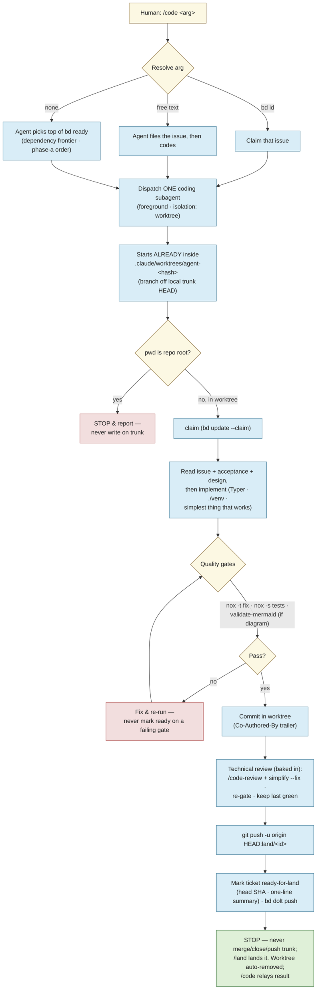
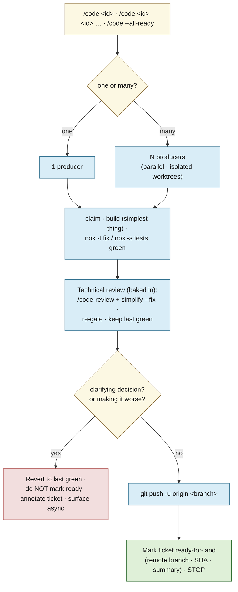
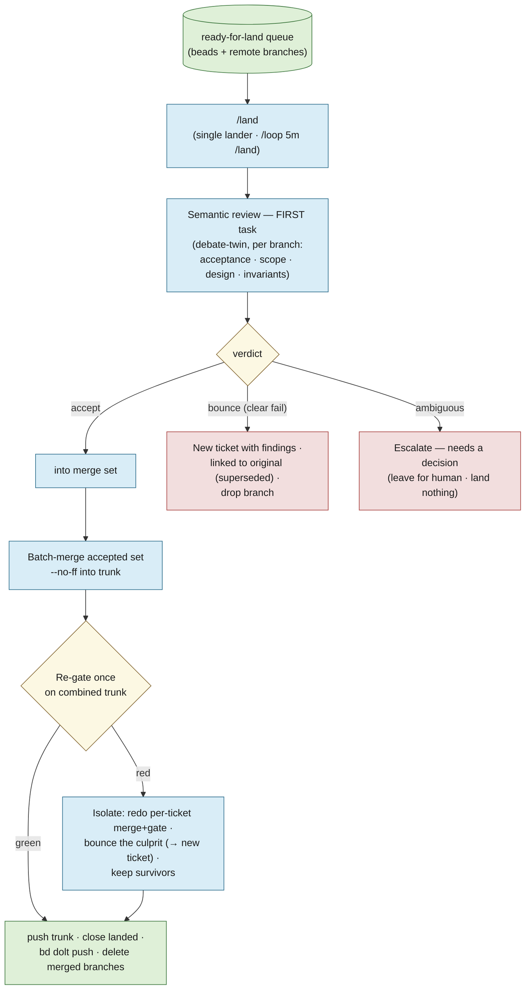

# lode — Agent dev workflow

How lode is *built*. The other docs describe the system; this one describes the **agent
loops that produce it** — a **design loop** that stress-tests a plan before it's built, a
**coding loop** in which a *producer* carries one task through to a reviewed, green branch (solo,
or fanned out across several tasks at once with `/code <id> <id> …`), and a **landing loop** in
which a single `/land` lander is the **only** thing that writes `trunk`. The three are the last
three sections of this doc. See [design.md](design.md) for the thesis and the build sequencing the
work flows through.

The operational source of truth for each loop is its skill/agent definition under
[`.claude/`](../.claude); this doc is the map, not the mechanics. The hard project invariants live
in [`CLAUDE.md`](../CLAUDE.md) and [`AGENTS.md`](../AGENTS.md) — **where they and this doc disagree,
`CLAUDE.md` wins.**

---

## The loops

Work moves through three passes, with the human as the hinge:

1. **Design loop — `debate`.** Before anything is built, a plan, a beads ticket tree, a bug-fix
   approach, or a proposed `docs/` change is handed to the `debate` skill, which *pushes back*:
   it surfaces ambiguity, hidden assumptions, sequencing gaps, and risky approaches, and reports
   them to the human. It never edits `docs/` or beads as a side effect. The human revises until
   the plan is sound.
2. **Coding loop — `/code` → `coding` producers.** Once the plan is sound and captured as beads
   issues, `/code` dispatches one `coding` **producer** per task to carry it through an orderly
   cycle in an isolated worktree: claim → build → green gates → baked-in technical review → push a
   `land/<id>` branch → mark `ready-for-land` → **stop**. A producer never merges, closes, or
   writes `trunk`.
3. **Landing loop — `/land`.** A single lander drains the `ready-for-land` queue: it semantically
   reviews each branch, merges the accepted set into `trunk`, re-gates, closes the tickets, and
   pushes. It is the **only** thing that writes `trunk` (see
   [the landing loop](#the-landing-loop--build-review-land)).

The boundaries are deliberate: **debate decides *what* and *whether*; the coding loop decides *how*
and *builds and reviews* it; the landing loop decides *whether it lands* and *does the merge*.**
Keeping the merge decision out of the hands of the agent that wrote the code is the point. Design
decisions settle into `docs/` and beads; only then does code get written (see
[how the loops connect](#how-the-loops-connect)).

---

## The design loop — `debate`

`debate` is a single, non-looping pass whose only job is to **argue with the plan**. You give it
something about to be built; it reads the *whole* thing before forming an opinion, challenges it on
the axes that apply, and hands the criticisms back. It does **not** implement, close tickets,
dispatch other agents, or silently rewrite issues — it runs once and stops. (Skill:
[`.claude/skills/debate/SKILL.md`](../.claude/skills/debate/SKILL.md).)

What it reads depends on the mode:

- **A conversation plan / approach** — the proposal as written (re-read, not remembered).
- **A beads issue or epic** — `bd show <id>`, then `bd dep tree <id>` and `bd show` on every
  subtask: titles, descriptions, acceptance criteria, notes, design.
- **A proposed `docs/` change** — cross-checked against the source of truth in `docs/`; a plan that
  contradicts a settled decision is itself a finding.

It then challenges on four axes — **ambiguity** (is "done" unambiguous?), **assumptions** (an
unrecorded architectural/tech decision? a repo state that may not hold? an uncited external?),
**sequencing & dependencies** (are all blockers captured? does the stated order actually work?),
and **acceptance/verifiability** (could someone write the test without more clarification?). For a
bug-fix approach it also weighs **root cause vs. symptom**, **side effects**, and whether a simpler
standard pattern exists.

Findings come back grouped by item, each a *genuine blocker* — no padding, and a clean bill is a
valid outcome. The human decides what to do with them; nothing is persisted unless explicitly asked
(`bd update <id> --notes=…` / `--design=…`).

---

## The coding loop — `/code` → `coding`

`/code` is the **only** sanctioned way to start coding work from the main session (which is
otherwise told not to spawn agents). The skill resolves the task from its argument and dispatches a
`coding` **producer** per task — `/code <id>` is one producer; `/code <id> <id> …` /
`/code --all-ready` fans out **N producers in parallel**, each in its own isolated worktree. There
is **no `/code-parallel`**. (Skill:
[`.claude/skills/code/SKILL.md`](../.claude/skills/code/SKILL.md); agent:
[`.claude/agents/coding.md`](../.claude/agents/coding.md).)

Argument resolution:

- **A bd issue ID** (`lode-1a8`) → claim and implement that issue.
- **Free text** ("add a `--json` flag to search") → the agent files the bd issue itself, then codes.
- **No argument** → the agent picks the top unblocked item from `bd ready` — *the subagent chooses,
  not the dispatcher*, honoring the dependency frontier and the phase-a skeleton order.

Each producer then runs its orderly cycle. The worktree is **handed to it by the harness**
(`isolation: "worktree"`) — a subagent pinned at the repo root cannot create its own, so it begins
*already inside* `.claude/worktrees/agent-<hash>` on a branch off local `trunk` HEAD. It works
in-cwd with plain git, and if its `pwd` is ever the repo root it **stops and reports** rather than
writing on `trunk`. It claims the issue, builds the simplest thing that works, takes it green
through the gates, and runs a **baked-in technical review** (`/code-review` + `simplify`, re-gate,
keep the last green commit). Then it **pushes a `land/<id>` branch to origin, marks the ticket
`ready-for-land`, and stops.** It never merges, closes, or writes `trunk` — landing is
[`/land`](#the-landing-loop--build-review-land)'s job. The final agent message isn't shown to the
user, so `/code` relays what came back — which issue, that the gates and technical review passed,
the pushed branch and head SHA, or exactly where it stopped (an escalation) and why.

> **Adding a brand-new `src/lode/*.py` module?** Build a worktree-local venv before `nox` — run
> `./scripts/python-init.sh` from *inside* the worktree. The shared `./venv` editable install
> resolves `lode` to the **main checkout's** `src`, so a new module that exists only in the worktree
> is invisible to it and `nox -s tests` fails with `ModuleNotFoundError`. **Editing an existing
> module needs no fresh venv** — that file already resolves under the main-checkout package.

### Invariants the coding loop never breaks

A quick card; the full list is in [`.claude/agents/coding.md`](../.claude/agents/coding.md) and
[`CLAUDE.md`](../CLAUDE.md).

| Thing | Rule |
|---|---|
| Default branch | `trunk` — **never** edit directly *and never landed by a producer*; `/land` owns every write to it |
| Worktrees | harness-made (`isolation: "worktree"`) under `.claude/worktrees/`, branched from local `trunk` HEAD, pushed to `origin/land/<id>`, auto-removed on exit |
| Task tracker | **bd only** — no TodoWrite, no markdown checklists; file an issue *before* non-trivial work |
| Design decisions | doc edits under `docs/`, never a bd note or memory (that forks the record) |
| Gates | `nox -t fix`, `nox -s tests`; `scripts/validate-mermaid.sh` for diagram changes — never mark `ready-for-land` on a failing gate |
| CLI framework | **Typer** (never argparse); venv at `./venv` |
| Done (producer) | branch pushed to `origin/land/<id>` *and* ticket marked `ready-for-land` (`bd dolt push`); `/land` does the merge/close |

---

## How the loops connect

The two loops share one substrate: **`docs/` and beads are the source of truth between them.**
Debate reads that substrate and argues against the plan; the human folds the criticisms back into
the docs and the ticket tree; the coding loop then reads the settled docs and the claimed issue and
writes code to them. Nothing skips the middle — a design decision that exists only in a chat
transcript, a bd note, or memory has *forked the record*, and the next loop will trust the docs and
miss it. Keep the decisions in the docs, and the two loops stay in agreement.

---

## The landing loop — build, review, land

> **One landing path for everything.** Producers (the coding loop above) build and review a branch,
> mark it `ready-for-land`, and stop; a single `/land` lander is the **only** thing that ever writes
> `trunk` — solo or batch, one machine or several. This decouples *landing* from *building* through a
> durable hand-off, so the merge decision lands with the agent that *didn't* write the code.

### Why one landing path

In-session landing breaks down the moment work goes parallel or spans more than one sitting:

- **It isn't durable.** The build→land hand-off lives in the building session's context. If that
  session compacts, crashes, or is closed between "branch is green" and "branch is merged," the work
  is stranded on a branch nobody lands.
- **It doesn't cross machines.** In-session landing ties the merge to the machine that did the build.
  Development here happens across **multiple machines**, and a local worktree branch on machine A is
  invisible to a lander on machine B.
- **It puts the merge decision in the wrong hands.** The agent that *wrote* the code is the worst
  judge of whether it should land — it's attached to its own work.

So **all landing goes through `/land`, no exceptions** — solo or batch, one machine or several. The
durable hand-off is two facts: the branch lives on **origin**, and "ready-for-land" lives in
**beads**. Either survives a dead session and is visible from any machine.

### Two reviews, two stages

Review splits along a clean seam, and the two halves live in different loops:

- **Technical review — *in the dev loop*.** Bugs, cleanup, over-design, complexity. The **builder
  owns this**: it just wrote the code, it has the context, it fixes problems immediately. It runs
  **autonomously** and you only hear about it on a real fork (see below).
- **Semantic review — *the first task of `/land`*.** Does it meet the ticket's acceptance? Is scope
  clean (no silent creep)? Are the design and the lode invariants honored? Is the approach right?
  This is the **build-side twin of `debate`**, and it's done by the lander, *not* the builder — the
  independence is the point. `debate` critiques the *plan* before building; the semantic review
  critiques the *result* before landing.

Both run autonomously and surface to you on the **same rule**: only a **genuine decision** pulls you
in (and, for the technical review, "I think I'm making it worse"). Everything else they handle.

### The producers — `/code`, solo or fan-out

There is **no separate `/code-parallel`** — once landing leaves the producer, building one task and
building five are the same act, just a different count:

- `/code <id>` — one producer.
- `/code <id> <id> …` / `/code --all-ready` — **N producers in parallel**, each in its own isolated
  worktree.

Each producer (the `coding` agent), in its worktree:

1. **Claims and builds** the simplest thing that works; `nox -t fix` / `nox -s tests` green.
2. **Technical review, baked in.** Runs `/code-review` (bugs) and `simplify` (over-design /
   complexity) on its own branch in `--fix` mode, then **re-gates**. It keeps its last **green**
   commit; if a refinement breaks the gates unrecoverably or trades simplicity for complexity, it
   **reverts to green**. Escalation rule: if a **clarifying decision** is genuinely needed, or it
   judges it is **making things worse**, it stops, **does not** mark the ticket ready, **annotates
   the ticket**, and surfaces it — *asynchronously*, never blocking a parallel batch.
3. **Pushes the branch to origin** (`git push -u origin <branch>`) — the durable, cross-machine
   artifact (a *new* branch ref doesn't race `trunk`, so parallel producers stay safe).
4. **Marks the ticket `ready-for-land`** with the landing context (remote branch, head SHA, summary)
   and **stops**. It never merges, closes, pushes `trunk`, or touches the main checkout.

### The lander — `/land`, drained by a self-paced loop

A **single** `/land` lander owns every write to `trunk`, **run self-paced as `/loop 5m /land` on one
machine** — start it and it drains the `ready-for-land` queue in the background while you build; stop
it by ending the loop, and there's no daemon to manage. Run exactly **one** such loop at a time:
being the *single* lander is what serializes landing (the single-lander lock in
[Mechanics](#mechanics-decided) below keeps overlapping ticks from colliding). Guaranteeing only one
is active across machines is an open mechanism (see [decisions.md](decisions.md)). A drain pass:

1. **Semantic review — the first task.** For each ready-for-land branch, the `debate`-twin reviews it
   against the ticket (acceptance, scope, design, invariants, approach) and returns a verdict:
   **accept** → into the merge set; **bounce** (a clear failure it's confident about) → open a **new
   ticket carrying the findings, linked to the original** (the original is superseded), and drop the
   rejected branch; **ambiguous** (a genuine decision) → **escalate** to you, land nothing.
2. **Batch-merge the accepted set** `--no-ff` into `trunk`, then **re-gate once** on the combined
   result (two branches green in isolation can break *combined* — a clean git merge with broken
   behaviour). If green, proceed. If red, **isolate**: redo the merges one at a time to find the
   culprit, bounce it (→ new ticket, as above), and keep the survivors.
3. **Land the survivors:** push `trunk`, `bd close` the landed tickets, `bd dolt push`, delete the
   merged remote branches.

The re-validation that beads and git haven't drifted (branch still on origin, SHA matches) happens
before the merge; a drifted or missing branch is bounced like any other failure.

### Mechanics (decided)

- **Queue state is a label, not a status.** A built-but-unlanded ticket stays `in_progress` and
  carries a **`ready-for-land`** label, which the lander polls. Escalations and bounces are their own
  labels (`land-escalated`, …), composing on top of the lifecycle status rather than replacing it. (A
  claimed ticket already drops out of `bd ready`, so a producer won't re-grab work waiting to land.)
- **Landing context is minimal — head SHA + a one-line summary** (small JSON in a bd field, read via
  `bd show --json`). The lander re-reviews and re-gates, so stored gate-results would be decorative;
  the SHA exists only to detect drift (a push onto the branch *after* it was marked ready). The branch
  name isn't stored — it's derived (below).
- **Branches are `land/<ticket-id>` on origin** (`git push -u origin HEAD:land/<id>`) — derivable from
  the ticket, no opaque `worktree-agent-<hash>` refs on the remote. **GC:** delete `origin/land/<id>`
  on a successful land *or* a bounce (a rebuild gets a fresh `land/<new-id>`); keep it for an
  *escalated* ticket until the human resolves it (a stale-escalation sweep is a later hygiene task).
- **Single-lander lock (v1): a local "skip if already running" guard + the convention that the
  `/land` loop runs on one machine.** The guard stops a `/loop 5m /land` tick from overlapping a
  still-running land on the same machine; the one-machine convention covers cross-machine. A
  **distributed remote-lock ref** (atomic `refs/locks/land` on origin, owner + timestamp for
  stale-break) is the documented upgrade for true concurrent multi-machine landing — and the natural
  seam toward real CI.

### Where this is heading — a green-branch merge queue

This is, deliberately, a **merge queue**: producers open reviewed "ready" branches, a single lander
semantically reviews and drains the green ones into `trunk`. It is the first step toward a proper
**CI/CD** setup — the natural end state is the re-gate and merge moving to **real CI** (a service
that merges green, approved PRs), with `/land` the local-dev stand-in until then. v1 keeps the lander
a local agent so it stays simple and needs no external infrastructure. The open sub-choices this
design defers — the single-lander lock, the `ready-for-land` representation, the landing-context
schema, remote-branch naming and cleanup — are recorded in [decisions.md](decisions.md).
