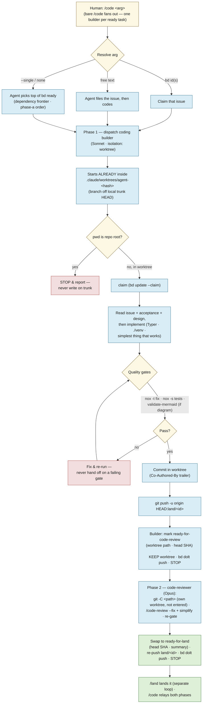
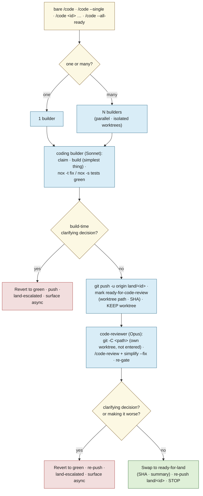
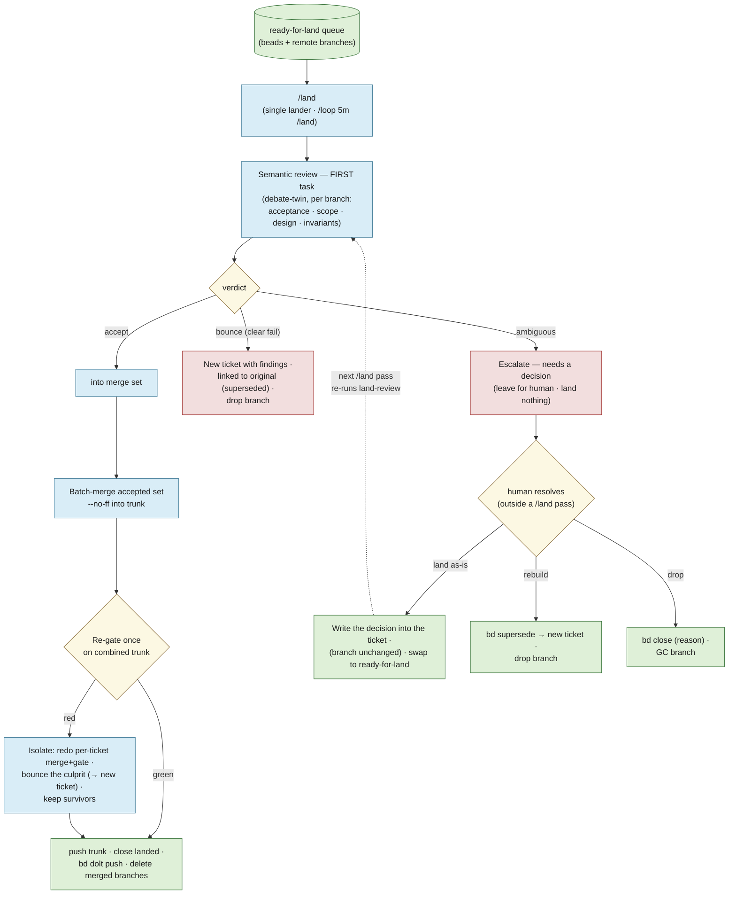

# lode — Agent dev workflow

How lode is *built*. The other docs describe the system; this one describes the **agent
loops that produce it** — a **design loop** that stress-tests a plan before it's built, a
**coding loop** in which a *builder* (Sonnet) produces a green branch and a separate *code-reviewer*
(Opus) runs the technical review on it (solo, or fanned out across several tasks at once with
`/code <id> <id> …`), and a **landing loop** in which a single `/land` lander is the **only** thing
that writes `trunk`. The three are the last three sections of this doc. See [design.md](design.md)
for the thesis and the build sequencing the work flows through.

The operational source of truth for each loop is its skill/agent definition under
[`.claude/`](../.claude); this doc is the map, not the mechanics. The hard project invariants live
in [`CLAUDE.md`](../CLAUDE.md) and [`AGENTS.md`](../AGENTS.md) — **where they and this doc disagree,
`CLAUDE.md` wins.**

---

## The loops

Work moves through three passes, with the human as the hinge:

1. **Design loop — `debate`.** Before anything is built, a plan, a beads ticket tree, a bug-fix
   approach, or a proposed `docs/` change is handed to the `debate` skill, which *pushes back*:
   it surfaces ambiguity, hidden assumptions, sequencing gaps, and risky approaches, and reports
   them to the human. It never edits `docs/` or beads as a side effect. The human revises until
   the plan is sound.
2. **Coding loop — `/code` → `coding` builder, then `code-reviewer`.** Once the plan is sound and
   captured as beads issues, `/code` runs each task in **two dispatched phases**. First a `coding`
   **builder** (Sonnet) carries it through an orderly cycle in an isolated worktree: claim → build →
   green gates → push a `land/<id>` branch → mark **`ready-for-code-review`** → **keep the worktree**
   → stop. Then a `code-reviewer` (Opus) drives that worktree via `git -C`, runs the technical review
   (`/code-review` + `/simplify`), re-gates, re-pushes, and swaps the ticket to **`ready-for-land`**.
   The builder never reviews its own work; neither agent merges, closes, or writes `trunk`.
3. **Landing loop — `/land`.** A single lander drains the `ready-for-land` queue: it semantically
   reviews each branch, merges the accepted set into `trunk`, re-gates, closes the tickets, and
   pushes. It is the **only** thing that writes `trunk` (see
   [the landing loop](#the-landing-loop--build-review-land)).

The boundaries are deliberate: **debate decides *what* and *whether*; the coding loop decides *how*
and *builds and reviews* it; the landing loop decides *whether it lands* and *does the merge*.**
Keeping the merge decision out of the hands of the agent that wrote the code is the point. Design
decisions settle into `docs/` and beads; only then does code get written (see
[how the loops connect](#how-the-loops-connect)).

---

## The design loop — `debate`

`debate` is a single, non-looping pass whose only job is to **argue with the plan**. You give it
something about to be built; it reads the *whole* thing before forming an opinion, challenges it on
the axes that apply, and hands the criticisms back. It does **not** implement, close tickets,
dispatch other agents, or silently rewrite issues — it runs once and stops. (Skill:
[`.claude/skills/debate/SKILL.md`](../.claude/skills/debate/SKILL.md).)

What it reads depends on the mode:

- **A conversation plan / approach** — the proposal as written (re-read, not remembered).
- **A beads issue or epic** — `bd show <id>`, then `bd dep tree <id>` and `bd show` on every
  subtask: titles, descriptions, acceptance criteria, notes, design.
- **A proposed `docs/` change** — cross-checked against the source of truth in `docs/`; a plan that
  contradicts a settled decision is itself a finding.

It then challenges on four axes — **ambiguity** (is "done" unambiguous?), **assumptions** (an
unrecorded architectural/tech decision? a repo state that may not hold? an uncited external?),
**sequencing & dependencies** (are all blockers captured? does the stated order actually work?),
and **acceptance/verifiability** (could someone write the test without more clarification?). For a
bug-fix approach it also weighs **root cause vs. symptom**, **side effects**, and whether a simpler
standard pattern exists.

Findings come back grouped by item, each a *genuine blocker* — no padding, and a clean bill is a
valid outcome. The human decides what to do with them; nothing is persisted unless explicitly asked
(`bd update <id> --notes=…` / `--design=…`).

---

## The coding loop — `/code` → `coding` + `code-reviewer`

`/code` is the **only** sanctioned way to start coding work from the main session (which is
otherwise told not to spawn agents). The skill resolves the task from its argument and runs each task
in **two dispatched phases** — a `coding` **builder** (Sonnet), then a `code-reviewer` (Opus). **Bare
`/code`** fans out across the whole ready frontier; `/code --single` does the top one task;
`/code <id>` / `/code <id> <id> …` name the work explicitly — in every case it's **N builders in
parallel** (one per task, each in its own isolated worktree), each followed by its own reviewer. There
is **no `/code-parallel`**. (Skill:
[`.claude/skills/code/SKILL.md`](../.claude/skills/code/SKILL.md); agents:
[`.claude/agents/coding.md`](../.claude/agents/coding.md),
[`.claude/agents/code-reviewer.md`](../.claude/agents/code-reviewer.md).)

Argument resolution:

- **No argument** (the default) / **`--all-ready`** → fan out across the **independent, unblocked**
  `bd ready` frontier, honoring the dependency graph and the phase-a skeleton order.
- **`--single`** → one task: the agent picks the top unblocked item from `bd ready` — *the subagent
  chooses, not the dispatcher*.
- **A bd issue ID** (`lode-1a8`) / **several IDs** → claim and implement those (one builder each).
- **Free text** ("add a `--json` flag to search") → the agent files the bd issue itself, then codes.

Each builder then runs its orderly cycle. The worktree is **handed to it by the harness**
(`isolation: "worktree"`) — a subagent pinned at the repo root cannot create its own, so it begins
*already inside* `.claude/worktrees/agent-<hash>` on a branch off local `trunk` HEAD. It works
in-cwd with plain git, and if its `pwd` is ever the repo root it **stops and reports** rather than
writing on `trunk`. It claims the issue, builds the simplest thing that works, takes it green through
the gates, then **pushes a `land/<id>` branch to origin, marks the ticket `ready-for-code-review`
(recording its worktree path), keeps the worktree, and stops** — it does **not** review its own work.

Then `/code` dispatches a **`code-reviewer`** (Opus) for that ticket. It stays in its own launch
worktree and drives the builder's worktree (by the recorded path) via `git -C <path>` — not
`EnterWorktree`, which the worktree-isolation guard refuses for commands resolved into a
path-entered worktree — runs the **technical review** (`/code-review --fix` + `/simplify`, re-gate,
keep the last green commit), re-pushes `land/<id>`, and swaps the ticket to
**`ready-for-land`**. Neither agent merges, closes, or writes `trunk` — landing is
[`/land`](#the-landing-loop--build-review-land)'s job. Final agent messages aren't shown to the user,
so `/code` relays what came back across **both** phases — which issue, that the build gates and the
technical review passed, the pushed branch and head SHA, or exactly where it stopped (a build- or
review-time escalation) and why.

> **Adding a brand-new `src/lode/*.py` module?** Build a worktree-local venv before `nox` — run
> `./scripts/python-init.sh` from *inside* the worktree. The shared `./venv` editable install
> resolves `lode` to the **main checkout's** `src`, so a new module that exists only in the worktree
> is invisible to it and `nox -s tests` fails with `ModuleNotFoundError`. **Editing an existing
> module needs no fresh venv** — that file already resolves under the main-checkout package.

### Invariants the coding loop never breaks

A quick card; the full list is in [`.claude/agents/coding.md`](../.claude/agents/coding.md) and
[`CLAUDE.md`](../CLAUDE.md).

| Thing | Rule |
|---|---|
| Default branch | `trunk` — **never** edit directly *and never landed by a producer*; `/land` owns every write to it |
| Worktrees | harness-made (`isolation: "worktree"`) under `.claude/worktrees/`, branched from local `trunk` HEAD, pushed to `origin/land/<id>`; the **builder keeps its worktree** for the code-reviewer (removed after land) |
| Models | builder on **Sonnet** (cheap), code-reviewer on **Opus** (review quality); neither reviews work it authored |
| Task tracker | **bd only** — no TodoWrite, no markdown checklists; file an issue *before* non-trivial work |
| Design decisions | doc edits under `docs/`, never a bd note or memory (that forks the record) |
| Gates | `nox -t fix`, `nox -s tests`; `scripts/validate-mermaid.sh` for diagram changes — never hand off / mark ready on a failing gate |
| CLI framework | **Typer** (never argparse); venv at `./venv` |
| Done (coding loop) | builder hands off at `ready-for-code-review` (worktree kept); code-reviewer reviews, re-gates, swaps to `ready-for-land` (`bd dolt push`); `/land` does the merge/close |

---

## How the loops connect

The two loops share one substrate: **`docs/` and beads are the source of truth between them.**
Debate reads that substrate and argues against the plan; the human folds the criticisms back into
the docs and the ticket tree; the coding loop then reads the settled docs and the claimed issue and
writes code to them. Nothing skips the middle — a design decision that exists only in a chat
transcript, a bd note, or memory has *forked the record*, and the next loop will trust the docs and
miss it. Keep the decisions in the docs, and the two loops stay in agreement.

---

## The landing loop — build, review, land

> **One landing path for everything.** Producers (the coding loop above) build a branch and a separate
> Opus code-reviewer technically reviews it; once it carries `ready-for-land`, a single `/land` lander
> is the **only** thing that ever writes `trunk` — solo or batch, one machine or several. This
> decouples *landing* from *building* through a durable hand-off, so the merge decision lands with the
> agent that *didn't* write the code.

### Why one landing path

In-session landing breaks down the moment work goes parallel or spans more than one sitting:

- **It isn't durable.** The build→land hand-off lives in the building session's context. If that
  session compacts, crashes, or is closed between "branch is green" and "branch is merged," the work
  is stranded on a branch nobody lands.
- **It doesn't cross machines.** In-session landing ties the merge to the machine that did the build.
  Development here happens across **multiple machines**, and a local worktree branch on machine A is
  invisible to a lander on machine B.
- **It puts the merge decision in the wrong hands.** The agent that *wrote* the code is the worst
  judge of whether it should land — it's attached to its own work.

So **all landing goes through `/land`, no exceptions** — solo or batch, one machine or several. The
durable hand-off is two facts: the branch lives on **origin**, and "ready-for-land" lives in
**beads**. Either survives a dead session and is visible from any machine.

### Two reviews, two stages

Review splits along a clean seam, and — crucially — **neither half is done by the author of the
code:**

- **Technical review — *the second phase of the coding loop*.** Bugs, cleanup, over-design,
  complexity. A separate **`code-reviewer` (Opus) owns this** — it drives the builder's worktree via `git -C` and
  fixes problems, but it did **not** write the code. Splitting it out (the builder runs cheaper, on
  Sonnet) is what buys the independence *and* puts the review spend where it matters. It runs
  **autonomously** and you only hear about it on a real fork (see below).
- **Semantic review — *the first task of `/land`*.** Does it meet the ticket's acceptance? Is scope
  clean (no silent creep)? Are the design and the lode invariants honored? Is the approach right?
  This is the **build-side twin of `debate`**, and it's done by the lander, *not* the builder — the
  independence is the point. `debate` critiques the *plan* before building; the semantic review
  critiques the *result* before landing.

Both run autonomously and surface to you on the **same rule**: only a **genuine decision** pulls you
in (and, for the technical review, "I think I'm making it worse"). Everything else they handle.

### The producers — `/code`, solo or fan-out

There is **no separate `/code-parallel`** — once landing leaves the producer, building one task and
building five are the same act, just a different count:

- **bare `/code`** / `/code --all-ready` — **N builders in parallel** across the ready frontier.
- `/code --single` — one builder (top of `bd ready`).
- `/code <id>` / `/code <id> <id> …` — one builder per named id.

Each builder (the `coding` agent, on **Sonnet**), in its worktree:

1. **Claims and builds** the simplest thing that works; `nox -t fix` / `nox -s tests` green.
2. **Pushes the branch to origin** (`git push -u origin HEAD:land/<id>`) — the durable, cross-machine
   artifact (a *new* branch ref doesn't race `trunk`, so parallel producers stay safe).
3. **Marks the ticket `ready-for-code-review`** with the review context (worktree path, branch, head
   SHA), **keeps its worktree**, and **stops**. It does **not** review its own work, merge, close,
   push `trunk`, or touch the main checkout. A build-time **clarifying decision** is the only thing
   that escalates it (revert to green, `land-escalated`, surface async — never blocking a sibling).

#### Concurrent `bd dolt push` under fan-out — the load-bearing assumption (validated, lode-nps.3)

Bare `/code` already fans out N producers writing to the **same** beads database, so concurrent `bd
dolt push` to `refs/dolt/data` is a **pre-existing** load-bearing assumption behind running the loop
family unattended — not a new risk introduced by any later addition. Validated against Dolt's own
documented push/merge semantics (a stress test is corroboration only — a green run cannot prove the
absence of a rare lost-write race; it is not the basis for this determination):

- **No silent lost write.** `dolt push` — the primitive `bd dolt push` wraps, including in the
  **embedded** (in-process Dolt engine) mode lode runs in — is **fast-forward-only, exactly like
  `git push`**: "Pushes to existing branches require that your changes are fast-forward changes
  relative to what you are pushing to"
  ([DoltHub docs](https://www.dolthub.com/docs/concepts/dolt/git/remotes)), enforced by an atomic
  compare-and-swap on the branch ref. Two racing pushes can never both silently win — one is
  atomically accepted, the other is **rejected outright** and must retry (pull → merge → push again).
  Because lode's Dolt remote is itself a plain git remote (`sync.remote:
  git+ssh://…/lode.git`, storing chunks under `refs/dolt/data`), a git server's own atomic ref-update
  is a second, independent enforcement layer underneath Dolt's client-side check — the guarantee is a
  property of the remote ref update, not of any one client code path. Producers writing disjoint issue
  rows (one ticket per producer) merge cleanly on retry via Dolt's cell-level merge. The only
  multi-machine failure on record corroborates this by exclusion rather than confirming it directly:
  [beads#2466](https://github.com/gastownhall/beads/issues/2466) was a recurring `bd dolt pull` merge
  conflict on *shared bookkeeping rows* in the `metadata` table — "not a conflict on actual issue
  data," in the issue's own words — fixed in beads v0.60.0 by moving that auto-push state out of the
  replicated table and into a local file. (lode runs bd 1.0.4, well past that fix.)
- **Invariant:** a `bd dolt push` from any producer can be *rejected* under concurrent writers, but
  never *silently loses* another writer's already-committed data. Treat a non-zero exit from
  `bd dolt push` as "needs pull + retry," never as proof of corruption.

This investigation also surfaced two **gaps** the above safety net does not cover — filed as a
follow-up (lode-83d), since this ticket validates only and does not build the fix:

1. **No retry-on-reject exists today.** All four `bd dolt push` call sites in the skills
   (`.claude/agents/coding.md`, `.claude/agents/code-reviewer.md`, `.claude/skills/land/SKILL.md`,
   `.claude/skills/epic-audit/SKILL.md`) are bare calls with no exit-status check — a rejected push
   currently fails without the caller noticing, undermining the "durable, cross-machine" hand-off the
   comments assume.
2. **Embedded mode is documented as the wrong mode for this concurrency.** lode runs bd in
   **embedded (in-process Dolt engine)** mode (`bd dolt show` → `Mode: embedded`), and every git
   worktree of this repo shares **one** physical store on a given machine (`.beads/embeddeddolt` at the
   main checkout — confirmed via `bd where` from inside a linked worktree; no `.beads/redirect` is
   needed for this). Beads' own docs are explicit this mode is **single-writer, enforced via file
   lock**, and recommend Dolt **server mode** for "high-concurrency scenarios (multiple agents)" —
   precisely what `/code`'s bare fan-out is. The documented failure is a hard `database is locked`
   error with no built-in retry.

### The code-review pass — `code-reviewer` (Opus)

`/code` then dispatches a **`code-reviewer`** (Opus) for each `ready-for-code-review` ticket. Because
the technical review now lives in its own agent — not the builder — **neither review of a branch is
done by its author** (the lander's semantic review is the other). The reviewer:

1. **Drives the builder's worktree by the recorded path via `git -C <path>`** — not `EnterWorktree`:
   the worktree-isolation guard refuses to run commands resolved into a path-entered worktree
   ("commands from a worktree-isolated agent must run inside its worktree"), so the reviewer stays in
   its own launch worktree and confirms the builder's tree is off `trunk` via `git -C <path>
   rev-parse --abbrev-ref HEAD`.
2. **Runs the technical review** — `/code-review --fix` (bugs) and `/simplify` (over-design /
   complexity) — then **re-gates**, keeping the last **green** commit; if a refinement breaks the gates
   unrecoverably or trades simplicity for complexity, it **reverts to green**.
3. **Re-pushes `land/<id>`** and **swaps the ticket to `ready-for-land`** (refreshed head SHA +
   summary), then stops. Its escalation rule mirrors the builder's: a genuine **decision**, or "I'm
   making it worse," reverts to green, swaps the label to `land-escalated`, and surfaces async —
   landing nothing.

### The lander — `/land`, drained by a self-paced loop

A **single** `/land` lander owns every write to `trunk`, **run self-paced as `/loop 5m /land` on one
machine** — start it and it drains the `ready-for-land` queue in the background while you build; stop
it by ending the loop, and there's no daemon to manage. Run exactly **one** such loop at a time:
being the *single* lander is what serializes landing (the single-lander lock in
[Mechanics](#mechanics-decided) below keeps overlapping ticks from colliding). Guaranteeing only one
is active across machines is an open mechanism (see [decisions.md](decisions.md)). A drain pass:

1. **Semantic review — the first task.** For each ready-for-land branch, the `debate`-twin reviews it
   against the ticket (acceptance, scope, design, invariants, approach) and returns a verdict:
   **accept** → into the merge set; **bounce** (a clear failure it's confident about) → open a **new
   ticket carrying the findings, linked to the original** (the original is superseded), and drop the
   rejected branch; **ambiguous** (a genuine decision) → **escalate** to you, land nothing.
2. **Batch-merge the accepted set** `--no-ff` into `trunk`, then **re-gate once** on the combined
   result (two branches green in isolation can break *combined* — a clean git merge with broken
   behaviour). If green, proceed. If red, **isolate**: redo the merges one at a time to find the
   culprit, bounce it (→ new ticket, as above), and keep the survivors.
3. **Land the survivors:** push `trunk`, `bd close` the landed tickets, `bd dolt push`, delete the
   merged remote branches.

The re-validation that beads and git haven't drifted (branch still on origin, SHA matches) happens
before the merge; a drifted or missing branch is bounced like any other failure.

**Resolving `land-escalated`.** The label is not terminal — a human resolves it, outside a `/land`
pass, and every resolution **removes `land-escalated`** so a surfacer's queue can actually drain
instead of growing monotonically. Exactly three exits (full mechanics in
[`land/SKILL.md`](../.claude/skills/land/SKILL.md#resolving-a-land-escalated-branch)):

- **Land as-is** — the **branch is unchanged** (this exit is exactly the "it's fine as-is" case); the
  human **writes the decision into the ticket** (edits the acceptance criteria / description to remove
  the ambiguity `land-review` flagged), *then* swaps the label back to `ready-for-land`. A bare label
  swap with nothing else changed is **not** a valid transition: `/land`'s next pass just re-dispatches
  `land-review`, which hits the same ambiguity and escalates again. There is deliberately **no
  "human-blessed" bypass label** — `land-review` stays authoritative on re-review; forcing a land past
  its objection is an out-of-band manual act, not a designed fast-path.
- **Rebuild** — handled exactly like a `land-review` bounce: `bd supersede` the original onto a new
  ticket carrying the human's decision, and drop the branch.
- **Drop** — `bd close` the ticket with a reason, and GC the branch.

These resolve the label as `/land` sets it. `/code`'s producers set the same label for build-time,
technical-review, and rebase-conflict escalations: **rebuild** and **drop** apply to those unchanged,
while **land as-is** re-enters at the gate that escalated it rather than at `ready-for-land` —
`ready-for-code-review` for both a `code-reviewer` technical-review escalation and a `coding`
build-time clarification (the build-time case decided as the deliberately arguable one, accepted
because the `code-reviewer` can still bounce or escalate a half-built branch), and `needs-rebase` for a
`coding` rebase-pickup conflict; full mechanics and per-source table in
[`land/SKILL.md`](../.claude/skills/land/SKILL.md#exit-a-per-source--re-enter-at-the-gate-that-escalated)
(`lode-08g`).

### Mechanics (decided)

- **Queue state is a label, not a status.** A built-but-unlanded ticket stays `in_progress` and moves
  through **two labels**: the builder sets **`ready-for-code-review`** (the code-reviewer's queue), and
  the reviewer swaps it to **`ready-for-land`** (the lander's queue). Escalations and bounces are their
  own labels (`land-escalated`, …), composing on top of the lifecycle status rather than replacing it.
  (A claimed ticket already drops out of `bd ready`, so a producer won't re-grab work waiting to review
  or land.)
- **Hand-off context is minimal — head SHA + a one-line summary**, plus the **builder's worktree path**
  so the code-reviewer can drive it via `git -C <path>` (small JSON in bd fields, read via
  `bd show --json`).
  The lander re-reviews and re-gates, so stored gate-results would be decorative; the SHA exists only to
  detect drift (a push onto the branch *after* it was marked ready). The branch name isn't stored — it's
  derived (below).
- **Branches are `land/<ticket-id>` on origin** (`git push -u origin HEAD:land/<id>`) — derivable from
  the ticket, no opaque `worktree-agent-<hash>` refs on the remote. **GC:** delete `origin/land/<id>`
  on a successful land *or* a bounce (a rebuild gets a fresh `land/<new-id>`); keep it for an
  *escalated* ticket until the human resolves it, which always removes `land-escalated` — see
  "Resolving `land-escalated`" above (a sweep to surface long-abandoned escalations, rather than
  resolve them, is a later hygiene task).
  On a clean land the lander **also removes the builder's local worktree** (and its branch), keyed off
  the `review_worktree` metadata — best-effort and machine-local: the `git worktree list` guard skips a
  worktree that lives on another machine, so the build machine reclaims its own.
- **Single-lander lock (v1): a local "skip if already running" guard + the convention that the
  `/land` loop runs on one machine.** The guard stops a `/loop 5m /land` tick from overlapping a
  still-running land on the same machine; the one-machine convention covers cross-machine. A
  **distributed remote-lock ref** (atomic `refs/locks/land` on origin, owner + timestamp for
  stale-break) is the documented upgrade for true concurrent multi-machine landing — and the natural
  seam toward real CI.

### Where this is heading — a green-branch merge queue

This is, deliberately, a **merge queue**: producers open reviewed "ready" branches, a single lander
semantically reviews and drains the green ones into `trunk`. It is the first step toward a proper
**CI/CD** setup — the natural end state is the re-gate and merge moving to **real CI** (a service
that merges green, approved PRs), with `/land` the local-dev stand-in until then. v1 keeps the lander
a local agent so it stays simple and needs no external infrastructure. The open sub-choices this
design defers — the single-lander lock, the `ready-for-land` representation, the landing-context
schema, remote-branch naming and cleanup — are recorded in [decisions.md](decisions.md).
