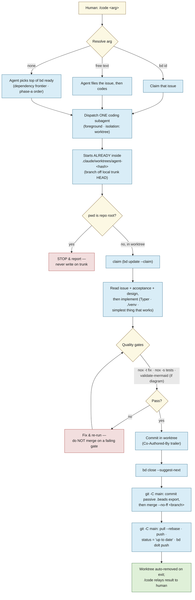

# lode — Agent dev workflow

How lode is *built*. The other docs describe the system; this one describes the **two agent
loops that produce it** — a **design loop** that stress-tests a plan before it's built, and a
**coding loop** that implements one task end-to-end in an isolated worktree. See
[design.md](design.md) for the thesis and the build sequencing the work flows through.

The operational source of truth for each loop is its skill/agent definition under
[`.claude/`](../.claude); this doc is the map, not the mechanics. The hard project invariants live
in [`CLAUDE.md`](../CLAUDE.md) and [`AGENTS.md`](../AGENTS.md) — **where they and this doc disagree,
`CLAUDE.md` wins.**

---

## The two loops

Work moves through two distinct passes, with the human as the hinge between them:

1. **Design loop — `debate`.** Before anything is built, a plan, a beads ticket tree, a bug-fix
   approach, or a proposed `docs/` change is handed to the `debate` skill, which *pushes back*:
   it surfaces ambiguity, hidden assumptions, sequencing gaps, and risky approaches, and reports
   them to the human. It never edits `docs/` or beads as a side effect. The human revises until
   the plan is sound.
2. **Coding loop — `/code` → `coding`.** Once the plan is sound and captured as beads issues, the
   `/code` skill dispatches exactly one `coding` subagent to carry **one** task through its
   orderly cycle in an isolated worktree: claim → build → green gates → `--no-ff` merge → close
   → push.

The boundary between them is deliberate: **debate decides *what* and *whether*; coding decides
*how* and *does it*.** The two are **separate tasks** — each has its own diagram below. Design
decisions settle into `docs/` and beads; only then does code get written (see
[how the loops connect](#how-the-loops-connect)).

---

## The design loop — `debate`

`debate` is a single, non-looping pass whose only job is to **argue with the plan**. You give it
something about to be built; it reads the *whole* thing before forming an opinion, challenges it on
the axes that apply, and hands the criticisms back. It does **not** implement, close tickets,
dispatch other agents, or silently rewrite issues — it runs once and stops. (Skill:
[`.claude/skills/debate/SKILL.md`](../.claude/skills/debate/SKILL.md).)

What it reads depends on the mode:

- **A conversation plan / approach** — the proposal as written (re-read, not remembered).
- **A beads issue or epic** — `bd show <id>`, then `bd dep tree <id>` and `bd show` on every
  subtask: titles, descriptions, acceptance criteria, notes, design.
- **A proposed `docs/` change** — cross-checked against the source of truth in `docs/`; a plan that
  contradicts a settled decision is itself a finding.

It then challenges on four axes — **ambiguity** (is "done" unambiguous?), **assumptions** (an
unrecorded architectural/tech decision? a repo state that may not hold? an uncited external?),
**sequencing & dependencies** (are all blockers captured? does the stated order actually work?),
and **acceptance/verifiability** (could someone write the test without more clarification?). For a
bug-fix approach it also weighs **root cause vs. symptom**, **side effects**, and whether a simpler
standard pattern exists.

Findings come back grouped by item, each a *genuine blocker* — no padding, and a clean bill is a
valid outcome. The human decides what to do with them; nothing is persisted unless explicitly asked
(`bd update <id> --notes=…` / `--design=…`).

---

## The coding loop — `/code` → `coding`

`/code` is the **only** sanctioned way to start coding work from the main session (which is
otherwise told not to spawn agents). The skill resolves the task from its argument and dispatches
**exactly one** `coding` subagent — in the foreground, with `isolation: "worktree"`, never
`run_in_background`. (Skill: [`.claude/skills/code/SKILL.md`](../.claude/skills/code/SKILL.md);
agent: [`.claude/agents/coding.md`](../.claude/agents/coding.md).)

Argument resolution:

- **A bd issue ID** (`lode-1a8`) → claim and implement that issue.
- **Free text** ("add a `--json` flag to search") → the agent files the bd issue itself, then codes.
- **No argument** → the agent picks the top unblocked item from `bd ready` — *the subagent chooses,
  not the dispatcher*, honoring the dependency frontier and the phase-a skeleton order.

The subagent then runs its orderly cycle. The worktree is **handed to it by the harness**
(`isolation: "worktree"`) — a subagent pinned at the repo root cannot create its own, so it begins
*already inside* `.claude/worktrees/agent-<hash>` on a branch off local `trunk` HEAD. It works
in-cwd with plain git, and if its `pwd` is ever the repo root it **stops and reports** rather than
writing on `trunk`. It merges back with `git -C <main-checkout>`; the main session stays on `trunk`
and never edits files there. The final agent message isn't shown to the user, so `/code` relays
what came back — which issue, that gates passed, that it merged and pushed, or exactly where it
stopped and why.

### Invariants the coding loop never breaks

A quick card; the full list is in [`.claude/agents/coding.md`](../.claude/agents/coding.md) and
[`CLAUDE.md`](../CLAUDE.md).

| Thing | Rule |
|---|---|
| Default branch | `trunk` — **never** edit directly; every change goes through a worktree |
| Worktrees | harness-made (`isolation: "worktree"`) under `.claude/worktrees/`, branched from local `trunk` HEAD, merged `--no-ff`, auto-removed on exit |
| Task tracker | **bd only** — no TodoWrite, no markdown checklists; file an issue *before* non-trivial work |
| Design decisions | doc edits under `docs/`, never a bd note or memory (that forks the record) |
| Gates | `nox -t fix`, `nox -s tests`; `scripts/validate-mermaid.sh` for diagram changes — no merge on a failing gate |
| CLI framework | **Typer** (never argparse); venv at `./venv` |
| Done | not done until `git push` *and* `bd dolt push` succeed |

---

## How the loops connect

The two loops share one substrate: **`docs/` and beads are the source of truth between them.**
Debate reads that substrate and argues against the plan; the human folds the criticisms back into
the docs and the ticket tree; the coding loop then reads the settled docs and the claimed issue and
writes code to them. Nothing skips the middle — a design decision that exists only in a chat
transcript, a bd note, or memory has *forked the record*, and the next loop will trust the docs and
miss it. Keep the decisions in the docs, and the two loops stay in agreement.
