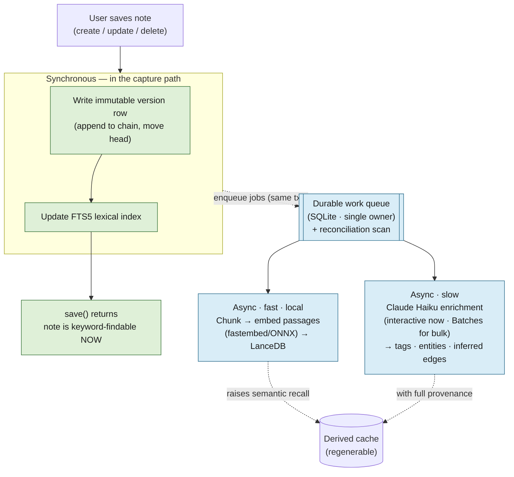

# lode — Design

> An AI-first, TUI-first personal knowledge base for "things I learn during my day at work" —
> meeting notes, technical instructions, decisions. Fast to capture, intelligent to retrieve.

Status: **built end-to-end.** The core loop from §7 step 1 — notes, version chains, cited Q&A,
and the eval harness — ships, plus a web connector and a Textual TUI. These documents remain the
source of truth for the reasoning and the decisions from the founding discussion, and record what
still lies ahead (additional connectors, one at a time — see §7 step 2 and
[`docs/decisions.md`](decisions.md)).

## Map of the docs

This overview holds the thesis, the primary bet, the principles, and the build order. The
mechanics live in focused companion docs:

| Doc | Covers |
|---|---|
| **design.md** (this file) | The core problem, the primary bet, principles, the save path, build sequencing |
| [storage.md](storage.md) | The ownership boundary, event-sourced version chains, invalidation, the data shape |
| [retrieval.md](retrieval.md) | The hybrid retrieval pipeline: FTS5 + vectors → RRF → rerank → graph expand → trust rank |
| [externals.md](externals.md) | External sources, snapshots, the knowledge graph, edges, link-rot immunity, privacy, hard delete |
| [stack.md](stack.md) | The decided stack and the split-store rationale |
| [configuration.md](configuration.md) | Every tunable knob and build constant, in one table |
| [decisions.md](decisions.md) | Open decisions, deferred but not forgotten |
| [keybindings.md](keybindings.md) | The TUI's central keymap: which keys are taken, App- vs Screen-level altitude, the editable-TextArea non-printable-key rule |
| [tui.md](tui.md) | TUI layout conventions -- what every screen's middle panel needs so it never renders past the docked Footer |
| [editing.md](editing.md) | The markdown editing surface: block-only live colouring, the keyboard open-link binding, and why a preview pane and clickable links are not built |
| [conventions.md](conventions.md) | Prescriptive coding-style *fiats* (unilateral maintainer preferences, no independent rationale) -- `@import`ed by CLAUDE.md so they reach the main session and every subagent |
| [agents-workflow.md](agents-workflow.md) | How lode is *built*: the design loop (`challenge`) and the coding loop (`/code` → `coding`) |

---

## 1. The core problem

The economics of a personal notes pile are lopsided: **capture is cheap, messy, and frequent;
retrieval is rare and high-value.** Notes are usually write-once-read-never — not because
they're worthless, but because finding the right one later costs more than re-deriving it.

The job of AI here is to **flip that economics**: make capture worth it *because* retrieval
is trustworthy. Everything else is supporting.

The UI is a TUI precisely so capture stays instant: get in, dump what you learned, get out.
**No AI in the capture path.** Intelligence is async (background enrichment) or on-demand
(you ask). Capture stays dumb and fast forever.

### The save path has three tiers

It's worth being exact, because "AI" and "embedding" are easy to conflate:

- **Synchronous on save** — write the version row **and** update the **FTS5 lexical index**. This
  is mechanical tokenization, not a model, so it stays in the capture path: it guarantees a
  just-captured note is **findable by keyword the instant save returns**.
- **Async, fast, local** — **chunk the body into passages and embed each** (lands in ms–seconds).
  It raises semantic recall but never blocks capture; the brief pre-vector window is masked by the
  lexical leg of hybrid retrieval (see [retrieval.md](retrieval.md)), so a fresh note is never
  invisible.
- **Async, slow** — the **Claude enrichment pass** (tags, entities, inferred edges). A fresh note
  enriches via one immediate Haiku call; bulk/backfill/re-enrichment goes through the 50%-off
  Batches API.

So *both* the embedding and the LLM are derived/async; the embedding is merely the cheap-local one.
Only the mechanical lexical index rides the capture path. The async tiers are driven by a **durable
work queue** enqueued in the same transaction as the save (so capture never loses pending work) and
self-healed by a reconciliation scan — see
[the async work queue](storage.md#the-async-work-queue).

The synchronous leg (green) is the only thing the user waits on. Everything that touches a model
(blue) is off the capture path and lands in the regenerable cache.

---

## 2. The primary bet: grounded Q&A over your own notes

Not search — *answers*, with **citations back to the source notes**. Citations are
non-negotiable: they let you verify, and they preserve original context.

> "What did we decide about the auth migration?"
> "How do I rotate the staging certs?"

This is the feature that changes capture behaviour. Once you trust "I can always ask later,"
you stop agonising over filing and just dump. It is also the foundation every other feature
reuses — connection-surfacing, promotion, and synthesis are all "find related notes, then do
something."

**Build this first.** Embeddings on every note + cited Q&A retrieval (the pipeline lives in
[retrieval.md](retrieval.md)).

A citation is only worth something if it's *true*: the answer is returned as discrete claims, each
pinned to a verbatim span of a specific note version, and a **faithfulness gate** verifies that
evidence before display — dropping unsupported claims and **abstaining** ("your notes don't answer
this") rather than emitting a confident hallucination. Requiring a citation *field* is not the same
as guaranteeing the citation *holds*; see
[faithfulness](retrieval.md#faithfulness-verify-citations-dont-just-require-them).

### Supporting features (roughly in value order)

1. **Async enrichment at capture, never blocking.** On save, a background pass extracts
   entities (people, projects, systems, tickets), suggests a title, and tags. User leaves
   immediately; structuring happens after. **Extraction is a Claude pass** (Haiku, structured
   outputs — see [stack.md](stack.md)), recorded with full provenance (`model`, `prompt_ver`,
   source `version_id`) — never a storage-engine black box, so it stays auditable and
   re-runnable on a model upgrade. The same pass proposes inferred edges
   ([externals.md](externals.md)), gated as suggestions.
2. **Surfacing connections.** When writing a new note, passively show related past notes
   ("you wrote about this 3 weeks ago"). Where a personal KB beats a search box.
3. **Distillation of meeting notes** into decisions / action items / open questions.
4. **Transient → durable promotion.** Meeting notes are transient; technical instructions
   harden into durable runbooks. AI detects when scattered transient notes have become a
   reusable procedure and *proposes* promoting them into a canonical doc (dedup the five
   times you wrote the same deploy steps).
5. **Periodic synthesis.** "What did I learn this week" rollups.

### Explicitly NOT doing

- AI in the capture path (autocomplete, "improve my note", chat-to-add) — friction against
  the one thing a TUI is for.
- Over-automated tagging with no user override.
- Generating content the user didn't say. For a personal KB, fidelity to your own words is
  the value; hallucinated synthesis is worse than none. Hence the hard citation requirement.

---

## 3. Principles

The decisions everything else hangs on. Each links to its full treatment.

- **You own the notes; the AI never touches them.** Anything the AI produces lives in a
  parallel **derived layer**, keyed to the note, that can be regenerated or thrown away without
  risking a single character of your content. The real partition is **irreplaceable** (owned
  content **+** user curation) **vs regenerable cache**. → [the ownership boundary](storage.md#the-ownership-boundary)
- **Append-only, immutable history.** Every save writes a new immutable, content-addressed
  node. Single-user, single-instance, no sync → a simple linear chain per note, no merge.
  → [storage model](storage.md#storage-model-event-sourced-linear-per-note-chains)
- **Answers, with citations.** Retrieval always points back to the source note, "as of" a known
  version. Fidelity over fluency. → [retrieval.md](retrieval.md)
- **Externals are snapshotted, never bookmarked.** Tickets, repos, wikis, email, and linked web
  pages get mirrored as immutable snapshots, so the knowledge graph is immune to link rot.
  → [externals.md](externals.md)
- **Content never leaves the box for indexing; enrichment and Q&A are explicit, governed egress.**
  Chunking, embeddings, reranking, and citation-checking are local; only enrichment and Q&A send
  text to Claude — logged, redacted-before-egress, and skippable per note/source via `no_egress`.
  → [privacy](externals.md#privacy-consequence-of-aggregation)

---

## 7. Build sequencing

Incremental, core-first. The graph is the easy part; **connectors are the hard, rot-prone part**
(auth, rate limits, pagination, alien data models). Do not fan out into six mediocre connectors
before the core loop works.

1. **Notes + version chains + derived layer + note↔note knowledge graph + cited Q&A** — plus a
   **minimal eval harness** as a first-class deliverable, not an afterthought. The harness is a
   small held-out Q&A set (~20–50 questions with known-good citations) scored on **retrieval
   recall@k**, **citation/faithfulness accuracy**, and **abstention correctness** (does it correctly
   decline when the notes don't answer). It exists *in step 1* because three quality knobs — rerank,
   the faithfulness-entailment threshold, and chunk size/overlap — all ship "tune post-data," and
   without a target they get guessed. Externals = none. This is the whole value on its own.
   The Phase-A exit gate is met when `lode add` → `lode ask` works end-to-end through the CLI
   and **`nox -s eval` integration test runs green** on the golden fixture (see `docs/decisions.md`,
   Shape A). The eval harness is a maintainer/CI check (`tests/test_eval_live.py`), not a shipped
   end-user command.
2. **Then connectors, one at a time**, starting with whichever source the notes actually
   reference most (likely tickets or the repo, not email). Normalize every connector to one
   interface — `(external_id, snapshot, fetched_at, source_type, raw_payload)` — so the graph
   never learns source-specific quirks and adding source N+1 doesn't touch the core.
3. Fan out only after the single-connector loop genuinely works end-to-end.

The knobs these stages expose are catalogued in [configuration.md](configuration.md).

> Section numbers (§1, §2, §7) are kept from the original single-file design so existing
> cross-references stay meaningful. §3–§6 and §8–§10 now live in the companion docs above.
