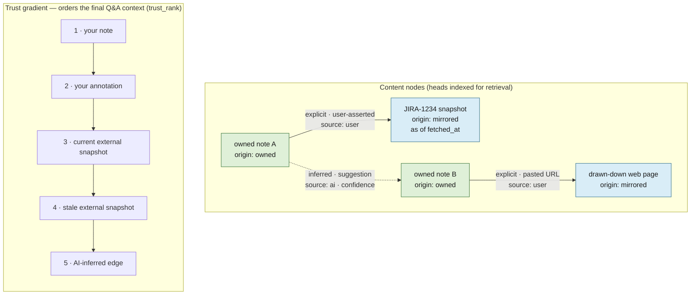

# lode — External sources & the knowledge graph

*(§6)* The AI annotation layer gains read access to external sources — **tickets, source repos,
wikis, email** — and **draws down explicitly linked web pages**, integrating everything into the
knowledge graph. This is added **incrementally, after the core loop works**
([design.md](design.md) §7). The retrieval that runs over this graph lives in
[retrieval.md](retrieval.md).

---

## Externals fit the *same* model

A fetched ticket / wiki page / email / web page is structurally **a note version**: an immutable,
point-in-time snapshot. The whole store collapses to one shape:

> immutable content nodes (some **owned** = your notes, some **mirrored** = externals)
> + a derived annotation/link layer + head pointers.

Axes on a content node: `origin: owned | mirrored`; on derived items: `source: ai | user`.

---

## The broken assumption: external staleness is NOT topological

For owned notes, staleness is free (head moved → you know instantly). For externals, **the true
head lives on someone else's server and changes without telling you.** Consequences:

- **Externals need a refresh policy** (TTL / on-access revalidation / webhook) — there is no
  structural staleness signal. (Per-connector judgment; see [decisions.md](decisions.md).)
- **Every AI claim from an external must cite "as of `fetched_at`."** "The ticket is open" is a
  lie; "the ticket was open as of last sync, 3 days ago" is honest.
- **Retrieval uses an explicit trust gradient**, in both ranking and citation display:
  **your note > your annotation > current external snapshot > stale external snapshot >
  AI-inferred edge.** The user's own words are highest-trust; externals corroborate, they do
  not override. This is the `trust_rank` step in [retrieval.md](retrieval.md).

---

## External identity — same two-id split

- `external_id` — stable logical identity: `JIRA-1234`, `repo@path@commit`, email `Message-ID`,
  normalized URL.
- `snapshot_id` — immutable fetched version (content hash).
- One canonical node per `external_id` with many edges — never five copies of a ticket linked
  from five notes. Dedup on `external_id`; version on `snapshot_id`.

---

## Edges: explicit vs inferred

- **Explicit** (a note cites `JIRA-1234` or pastes a URL): high confidence, user-asserted edge.
- **Inferred** (AI decides "the auth migration" *is* PR #42): a **suggestion** (`source: ai`,
  confidence-scored), **never an asserted fact**. Surface for confirmation; a user nod promotes
  it. This is where a hallucinated link would silently corrupt the graph — keep it gated.

---

## Draw-down rules

- **Follow explicit links one hop, then stop.** Pull the linked page, extract *its* entities,
  but do not follow that page's links outward. Recursion = unbounded web crawler, not a notes app.
- **Readability extraction + graceful failure.** Many pages (JS-rendered, paywalled, 403) return
  scaffolding to a naive GET; strip nav/ads, snapshot cleaned text (+ optional raw HTML), and on
  failure write a tombstone snapshot rather than garbage.

---

## Link-rot immunity (the payoff that justifies draw-down)

Because we **snapshot** externals instead of storing bare URLs, the knowledge graph is **immune
to link rot**: when the ticket is deleted, the wiki reorganised, the page taken down, the
mirrored snapshot — and everything the AI derived from it — survives. The opposite of bookmarks.
**Principle: always snapshot, never store a bare URL.**

---

## Privacy (consequence of aggregation)

Single-user does not mean low-stakes. Once this box holds embeddings of email + internal tickets
+ repo contents, it is a concentrated high-value target, and that content is shipped to an LLM
for enrichment and Q&A. Therefore:

- Be deliberate about **what text leaves the machine** to the model.
- **Redact obvious secrets (keys, tokens) before embedding** — a pasted `.env` or API key must
  not end up vectorised and retrievable. (Preventive half.)
- Care for local-at-rest storage.

---

## Hard delete — the deliberate immutability break (corrective half)

Append-only + content-addressing means a pasted secret otherwise lives in `versions.body`
**forever**, and a normal delete only writes a tombstone — the bytes survive. Because this box
aggregates sensitive data, there must be an escape hatch that **violates immutability on purpose**:

- **`purge` operates at version or whole-note granularity** (v1 — substring/span redaction is
  deferred, see [decisions.md](decisions.md)). It overwrites the body of the targeted version(s)
  with a redaction marker (`[purged YYYY-MM-DD]`) and sets `purged_at`. Node identity,
  `parent_version_id`, `op`, and `created` are **kept**, so lineage and undo structure survive —
  only the sensitive bytes die.
- **It sweeps the note's whole chain**, including soft-deleted (tombstoned) notes — a secret pasted
  then edited-around persists in older versions.
- **It cascades to the cache:** drop every derived entry referencing the purged versions (LanceDB
  vectors, FTS rows, `source: ai` annotations), then re-derive cheaply/locally so nothing leaks
  through the index. `source: user` annotations stay (metadata, not content).
- **Hash consequence (accepted):** a purged body no longer hashes to its `version_id`; that id stays
  as the historical identifier, flagged `purged`, and is no longer recomputable. This is the cost of
  an explicit immutability break, taken knowingly.
