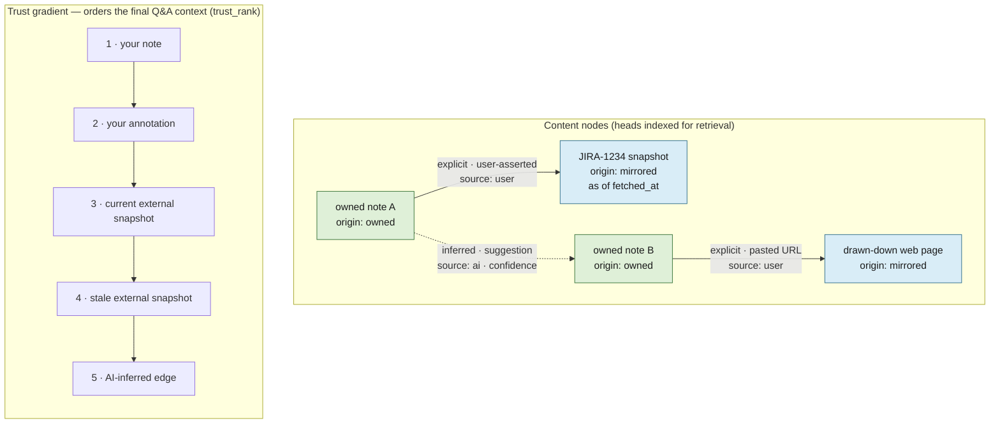

# lode — External sources & the knowledge graph

*(§6)* The AI annotation layer gains read access to external sources — **tickets, source repos,
wikis, email** — and **draws down explicitly linked web pages**, integrating everything into the
knowledge graph. This is added **incrementally, after the core loop works**
([design.md](design.md) §7). The retrieval that runs over this graph lives in
[retrieval.md](retrieval.md).

---

## Externals fit the *same* model

A fetched ticket / wiki page / email / web page is structurally **a note version**: an immutable,
point-in-time snapshot. The whole store collapses to one shape:

> immutable content nodes (some **owned** = your notes, some **mirrored** = externals)
> + a derived annotation/link layer + head pointers.

Axes on a content node: `origin: owned | mirrored`; on derived items: `source: ai | user`.

---

## The broken assumption: external staleness is NOT topological

For owned notes, staleness is free (head moved → you know instantly). For externals, **the true
head lives on someone else's server and changes without telling you.** Consequences:

- **Externals need a refresh policy** (TTL / on-access revalidation / webhook) — there is no
  structural staleness signal. (Per-connector judgment; see [decisions.md](decisions.md).)
- **Every AI claim from an external must cite "as of `fetched_at`."** "The ticket is open" is a
  lie; "the ticket was open as of last sync, 3 days ago" is honest.
- **Retrieval uses an explicit trust gradient**, in both ranking and citation display:
  **your note > your annotation > current external snapshot > stale external snapshot >
  AI-inferred edge.** The user's own words are highest-trust; externals corroborate, they do
  not override. This is the `trust_rank` step in [retrieval.md](retrieval.md).

---

## External identity — same two-id split

- `external_id` — stable logical identity: `JIRA-1234`, `repo@path@commit`, email `Message-ID`,
  normalized URL.
- `snapshot_id` — immutable fetched version (content hash).
- One canonical node per `external_id` with many edges — never five copies of a ticket linked
  from five notes. Dedup on `external_id`; version on `snapshot_id`.

### Snapshot churn: decouple new snapshot from re-enrich

`snapshot_id = H(external_id ‖ body)` makes an *identical* refetch free (same hash, no new row). But
a chatty external — an active PR refreshed hourly, one new comment each time — produces a **new
snapshot every refresh**, and naively each one would trigger a paid Claude **re-enrichment**
([stack.md](stack.md) Batches). Owned notes have a no-op-save guard; externals need the analogous
cost control, so the two operations are gated separately:

- **Re-embed on any change** — local, cheap, keeps retrieval current.
- **Re-enrich only on *material* change** — gate the expensive enrichment on a local delta between
  the new snapshot and its predecessor (size / similarity below a threshold); below the bar, **carry
  the prior enrichment forward**, re-anchored to the new snapshot. A one-comment PR update re-embeds
  but does not re-enrich.

The materiality threshold is a tunable knob ([configuration.md](configuration.md)); it caps cloud
spend on noisy sources without letting enrichment rot.

**The write path** (`lode.externals.ingest_snapshot`, `lode-w0h.2`) is the mirrored analogue of the
note save path: dedup on `external_id` (one `externals` row per source, created on first sight),
compute `snapshot_id` and skip the write entirely when it equals the current head (the identical-
refetch-is-free case above), otherwise insert the new snapshot and move `head_snapshot_id`, then
enqueue **`embed` only** (never `enrich` — that gate is `lode-w0h.5`'s, decided post-embed). A fetch
failure ([Draw-down rules](#draw-down-rules) below) writes a *tombstone* snapshot whose body is the
stable, inspectable marker `"[tombstone: <reason>]"` — itself content-addressed, so a source that
keeps failing the same way dedups its tombstones too, rather than growing one row per retry. This
write path is deliberately **read-agnostic**: it does not wire a cache backend or make the snapshot
directly retrievable — that is `lode-w0h.8`.

---

## Edges: explicit vs inferred

- **Explicit** (a note cites `JIRA-1234` or pastes a URL): high confidence, user-asserted edge.
- **Inferred** (AI decides "the auth migration" *is* PR #42): a **suggestion** (`source: ai`,
  confidence-scored), **never an asserted fact**. Surface for confirmation; a user nod promotes
  it. This is where a hallucinated link would silently corrupt the graph — keep it gated.

---

## Draw-down rules

- **Follow explicit links one hop, then stop.** Pull the linked page, extract *its* entities,
  but do not follow that page's links outward. Recursion = unbounded web crawler, not a notes app.
  (This hop limit governs a fetched page's own *outbound links*; it is a separate knob from the
  HTTP redirect cap a single fetch follows — see the fetch-outcome taxonomy below.)
- **Readability extraction + graceful failure.** Many pages (JS-rendered, paywalled, 403) return
  scaffolding to a naive GET; strip nav/ads, snapshot cleaned text (+ optional raw HTML), and on
  failure write a tombstone snapshot rather than garbage.

### Fetch-outcome taxonomy (decided, `lode-w0h.1`)

One fetch of one URL resolves to exactly one of these outcomes:

| Outcome | Trigger | Result |
|---|---|---|
| **OK** | 2xx response, extractor returns text at/above the length floor | snapshot with `status='ok'` |
| **PERMANENT failure** | 401/403 and any other 4xx *except* 408/429; **or** a 2xx response whose extracted text is empty/`None`/shorter than the length floor (covers JS-rendered scaffolding, paywalled teasers, and empty pages with one signal); **or** a redirect chain longer than the configured cap (loop or merely-too-long — a retry hits the same cap) | snapshot with `status='tombstone'` — retrying will not help |
| **TRANSIENT failure** | 408 or 429 (the two 4xx codes HTTP itself flags "try again later"), any 5xx, or a network/timeout error | **not** written as a snapshot by the fetch unit itself — the caller raises into the async work queue's existing attempts/backoff/dead-letter machinery (`failed` → `pending` retry, → `dead` at max attempts, PINNED `lode-i05.6`); on `dead`, the caller writes a tombstone snapshot so the note edge still resolves |
| **3xx** | one or more redirects, within the configured cap | followed transparently; the *final* resolved URL is what gets canonicalized into `external_id` — a note edge created on the originally-pasted URL may need re-pointing to the final URL's canonical form |

The testable detection signal for "PERMANENT — 2xx but not real content" is the readability
extractor returning `None`/empty **or** text below a configured length floor
([configuration.md](configuration.md)) — no separate paywall- or JS-shell-specific heuristic is
needed. **JS-rendered pages are a permanent tombstone by this rule, deliberately** — actually
rendering them (headless browser / JS execution) is an explicit deferred follow-on (`lode-oni`),
not first-connector scope.

---

## Link-rot immunity (the payoff that justifies draw-down)

Because we **snapshot** externals instead of storing bare URLs, the knowledge graph is **immune
to link rot**: when the ticket is deleted, the wiki reorganised, the page taken down, the
mirrored snapshot — and everything the AI derived from it — survives. The opposite of bookmarks.
**Principle: always snapshot, never store a bare URL.**

---

## Privacy (consequence of aggregation)

Single-user does not mean low-stakes. Once this box holds email + internal tickets + repo contents,
it is a concentrated high-value target — and the precise privacy claim matters.

### What leaves the box, and what doesn't

> **Content never leaves the box *for indexing*. Enrichment and Q&A are explicit, governed egress.**

Not "content never leaves the machine" — that's false and the headline must not say it:

- **Local, never leaves:** chunking, embeddings, reranking, NLI entailment. **Indexing and
  retrieval are fully on-box.**
- **Leaves the box to Anthropic:** **enrichment** (Haiku, *every note*, background) and **Q&A**
  (Sonnet/Opus, the *retrieved passages* — which can include mirrored ticket/email/repo snapshots —
  *per question*). The aggregation that makes this box valuable is exactly what Q&A ships into the
  cloud prompt, often invisibly.

### Two redactions, aimed at the right legs

Redaction is not one control. Because embedding is **local**, redacting before it only affects local
*retrievability* — it does **nothing** about egress, since the secret still sits in `versions.body`
and is still sent to Claude at enrichment/Q&A time:

- **Redact-before-index** — a pasted `.env` / API key doesn't become locally *retrievable* (vector
  + FTS). Local-at-rest concern.
- **Redact-before-egress** — strip known secret patterns from the **enrichment payload and the Q&A
  context** before they're sent to Claude. This is the control that actually limits cloud exposure,
  and it's the one §6 originally omitted.
- **`purge`** (the [corrective half](#hard-delete-the-deliberate-immutability-break-corrective-half))
  remains the only thing that removes the durable copy from `versions.body`.

### No-egress tier (for genuinely sensitive notes/sources)

A note — or an external source (a specific repo / ticket project) — can be marked **`no_egress`**:

- still **captured, chunked, embedded, and locally retrievable** (keyword + vector);
- **never sent to Claude** — no enrichment, and **excluded from cloud Q&A context**;
- in an answer it is **cited as "present, withheld from cloud synthesis"** rather than silently
  dropped, so the user knows relevant material exists but was kept local. (A local-LLM fallback that
  could synthesize over withheld notes is a future option — see [decisions.md](decisions.md).)

This keeps work secrets *in* the KB and retrievable while guaranteeing they never reach the cloud.

### Egress log (auditability)

Every time content leaves the box it is **logged**: timestamp, purpose (`enrich` | `qa`), model,
the `version_id`/`passage_id`s sent, and which redactions were applied. This extends the provenance
already on annotations into a straight answer to *"what of mine has gone to the cloud, and when?"*
Cheap to keep, high-trust, and the natural audit surface if a sensitive note is ever suspected of
having leaked.

### Local-at-rest

Care for the on-disk store itself — the SQLite file and LanceDB sit on the machine holding all of
the above.

---

## Hard delete: the deliberate immutability break (corrective half)

Append-only + content-addressing means a pasted secret otherwise lives in `versions.body`
**forever**, and a normal delete only writes a tombstone — the bytes survive. Because this box
aggregates sensitive data, there must be an escape hatch that **violates immutability on purpose**:

- **`purge` operates at version or whole-note granularity** (v1 — substring/span redaction is
  deferred, see [decisions.md](decisions.md)). It overwrites the body of the targeted version(s)
  with a redaction marker (`[purged YYYY-MM-DD]`) and sets `purged_at`. Node identity,
  `parent_version_id`, `op`, and `created` are **kept**, so lineage and undo structure survive —
  only the sensitive bytes die.
- **It sweeps the note's whole chain**, including soft-deleted (tombstoned) notes — a secret pasted
  then edited-around persists in older versions.
- **It cascades to the cache:** drop every derived entry referencing the purged versions (LanceDB
  vectors, FTS rows, `source: ai` annotations), then re-derive cheaply/locally so nothing leaks
  through the index. `source: user` annotations stay (metadata, not content).
- **Hash consequence (accepted):** a purged body no longer hashes to its `version_id`; that id stays
  as the historical identifier, flagged `purged`, and is no longer recomputable. This is the cost of
  an explicit immutability break, taken knowingly.
