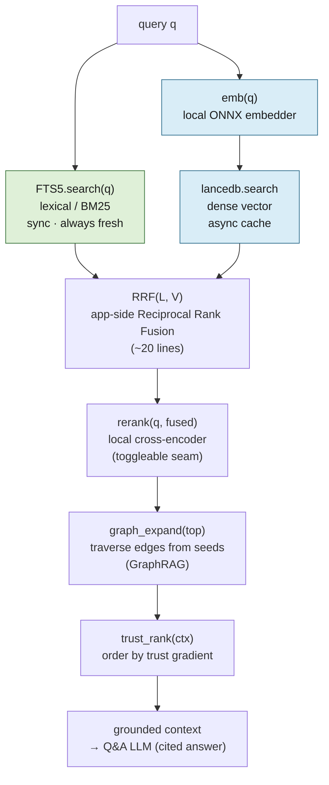

# lode — Retrieval

The pipeline behind the primary bet (cited Q&A — [design.md](design.md) §2). It runs over the
**heterogeneous graph** of owned notes + mirrored externals; the node model and the trust gradient
it ends on are defined in [externals.md](externals.md).

---

## Index heads only

For notes, index the current head version; for externals, the latest snapshot, marked with its
age. **Never index full history** — a note edited 5× would return 5 near-duplicate hits and cite a
stale copy. History exists for audit, undo, and annotation migration ([storage.md](storage.md)) —
not retrieval.

---

## The v1 retrieval pipeline is hybrid, fused app-side

```
retrieve(q):
  L     = FTS5.search(q)          # lexical / BM25 — sync, always fresh
  V     = lancedb.search(emb(q))  # dense vector — async cache
  fused = RRF(L, V)               # app-side Reciprocal Rank Fusion (~20 lines)
  top   = rerank(q, fused)        # local cross-encoder stage (toggleable)
  ctx   = graph_expand(top)       # GraphRAG: traverse edges from the seeds
  return trust_rank(ctx)          # trust gradient orders the final context
```



- **Hybrid, never vector-only.** Pure dense retrieval underperforms on keyword-heavy technical
  queries ("rotate the staging certs"); the **lexical leg carries those** — and, because FTS5 is
  the synchronous index ([design.md](design.md) save path), it also covers a just-written note
  before its vector lands.
- **Fusion is app-side RRF.** One lexical index (FTS5, fresh) + LanceDB for vectors only. LanceDB's
  *own* native hybrid goes unused — its lexical leg would lag (it's the async cache), and RRF over
  our two lists is the same fusion family with zero quality loss and no duplicate index. (So
  LanceDB earns its place on columnar vectors / ANN / metadata filtering — **not** native hybrid.)
- **Reranking is a first-class stage, wired in v1 behind a toggle.** A **local cross-encoder**
  (e.g. `bge-reranker-v2-m3` via the ONNX runtime already shipped for embeddings — no new stack,
  no content leaving the box per [externals.md](externals.md#privacy)) re-scores the fused top-N.
  It's the biggest quality lever and matters most in lode's regime (small corpus, short queries),
  and cited Q&A lives or dies on ranking. The *seam* is non-negotiable (painful to retrofit); the
  *model* is swappable/disableable so it can be A/B'd once there's a real corpus. Don't tune rerank
  models/thresholds pre-data ([decisions.md](decisions.md)).

The final `trust_rank` step applies the **trust gradient** — your note > your annotation > current
external snapshot > stale external snapshot > AI-inferred edge — defined in
[externals.md](externals.md#the-broken-assumption-external-staleness-is-not-topological). The
user's own words are highest-trust; externals corroborate, they do not override.

---

## Faithfulness: verify citations, don't just require them

The primary bet is *cited* Q&A, and the stated value is "hallucinated synthesis is worse than none"
([design.md](design.md) §2). Requiring a citation **field in the response schema** does not deliver
that — an LLM will emit a well-formed citation that doesn't support its claim. A confident answer
with a plausible-but-wrong citation is the **worst** outcome: a hallucination wearing the uniform of
a verified fact, which the user trusts *more* because it's cited. So citation **faithfulness** is
enforced as a pipeline stage, not assumed from the schema.

### Failure modes

1. **Citation–claim mismatch** — cites a note that says the opposite of the claim.
2. **Quote fabrication** — emits a "quoted" span that appears in no version.
3. **Paraphrase drift** — the note is topically right but a specific payload (number, date,
   decision) is wrong.
4. **Unsupported synthesis** — fuses notes A + B into a claim neither supports.

### Make the answer schema verifiable

The Q&A LLM does not return prose + `[note_id]`. It returns a list of **claims**, each carrying the
exact evidence it rests on — pinned to the **version**, not the logical note (bytes drift across
versions), and to a **span**, not the whole note:

```
answer = [
  { text: "<one factual claim>",
    support: [ { version_id | snapshot_id,
                 quoted_span: "<verbatim text from that version>" } ] },
  ...
]
```

### The faithfulness gate (a stage, like rerank)

Runs app-side, after the Q&A LLM returns and before display:

1. **Verbatim-span check (deterministic, v1).** Every `quoted_span` must occur (exact, or
   normalized-whitespace) in the body of its cited `version_id`/`snapshot_id`. No model, no latency.
2. **Extractive coupling (deterministic, v1).** A **fast path**: if the claim's load-bearing payload
   lies **inside** the quoted span, the claim is verified outright. This is the cheap common case and
   stops a model pairing a real but inverted quote with a contradicting claim, or a drifted number
   being both quoted-verbatim and wrong.
3. **Entailment check (local NLI, v1 — coarse, tuning pending).** Claims that pass the span check but
   *not* extractive coupling — genuine multi-note **synthesis**, and legitimate paraphrase that sits
   outside any single span — fall through to a **local NLI / cross-encoder** that scores whether the
   cited spans *jointly entail* the claim. Above a **deliberately conservative threshold** the
   synthesized claim is accepted; below it, dropped. This is what gives v1 real synthesis
   *capability* — "connect these two notes" gets answered, not refused. It runs on the **same ONNX
   runtime** as the reranker — on-box, no $, no Anthropic round-trip.
4. **Drop or flag** claims that fail; never silently display them.
5. **Abstain.** If nothing survives the gate, the system says **"your notes don't answer this"** —
   the honest failure mode. Fidelity over fluency means a *willingness to return nothing* rather than
   a confident hallucination.

> **The entailment threshold ships untuned and must be revisited.** Steps 1–2 are deterministic and
> need no tuning. Step 3's model choice and acceptance threshold are a real knob that cannot be set
> honestly without a corpus: shipped too loose, it readmits unsupported synthesis (mode 4); too
> tight, it collapses back to extractive-only. v1 ships it **conservative and fail-closed** so the
> capability exists from day one, and the model + threshold are **tuned against the eval harness**
> once there's real Q&A data ([decisions.md](decisions.md)). Treat v1 synthesis answers as
> capability-present, quality-untuned.

### What v1 catches — and what it doesn't

The gate **fails closed**: any claim it cannot verify (deterministically *or* by entailment) is
dropped, and if nothing survives, the system abstains. So the safety question ("could a hallucination
*ship*?") and the capability question ("can a valid claim of this kind get *answered*?") are separate
— and the table says which it means. **v1 is safe on all four modes, and has the capability for all
four — with synthesis quality gated on tuning.**

| Failure mode | Shipped to user in v1? (safety) | Answerable in v1? (capability) |
|---|---|---|
| 2 · Quote fabrication | **Never** — quote isn't in the version, dropped | n/a |
| 1 · Citation–claim mismatch | **Almost never** — extractive coupling rejects a quote that doesn't contain the claim | yes |
| 3 · Paraphrase drift | **Almost never** — caught by extractive coupling, or by the entailment check when the paraphrase sits outside a span | yes |
| 4 · Unsupported synthesis | **Conservatively** — the entailment gate admits a composed claim only when the cited spans jointly entail it above threshold; below, dropped | **Yes (coarse)** — synthesis is answered via the entailment gate; quality depends on a threshold that ships untuned and is **revisited** post-corpus |

Mode 4 is now handled by **validation, not blanket abstention**: the entailment check lets *valid*
synthesis through while still catching *invalid* synthesis. The residual risk is concentrated in one
place — the untuned threshold — which is why it's called out as a revisit, not a settled value. An
optional **LLM-judge** second pass can serve as a "high-assurance" toggle (stronger than local NLI),
but it costs a round-trip + dollars per answer and re-ships content off-box, so it is not the default.
