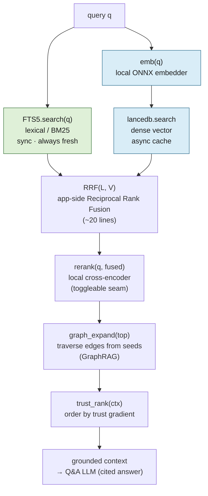

# lode — Retrieval

The pipeline behind the primary bet (cited Q&A — [design.md](design.md) §2). It runs over the
**heterogeneous graph** of owned notes + mirrored externals; the node model and the trust gradient
it ends on are defined in [externals.md](externals.md).

---

## Index heads only

For notes, index the current head version; for externals, the latest snapshot, marked with its
age. **Never index full history** — a note edited 5× would return 5 near-duplicate hits and cite a
stale copy. History exists for audit, undo, and annotation migration ([storage.md](storage.md)) —
not retrieval.

---

## The v1 retrieval pipeline is hybrid, fused app-side

```
retrieve(q):
  L     = FTS5.search(q)          # lexical / BM25 — sync, always fresh
  V     = lancedb.search(emb(q))  # dense vector — async cache
  fused = RRF(L, V)               # app-side Reciprocal Rank Fusion (~20 lines)
  top   = rerank(q, fused)        # local cross-encoder stage (toggleable)
  ctx   = graph_expand(top)       # GraphRAG: traverse edges from the seeds
  return trust_rank(ctx)          # trust gradient orders the final context
```



- **Hybrid, never vector-only.** Pure dense retrieval underperforms on keyword-heavy technical
  queries ("rotate the staging certs"); the **lexical leg carries those** — and, because FTS5 is
  the synchronous index ([design.md](design.md) save path), it also covers a just-written note
  before its vector lands.
- **Fusion is app-side RRF.** One lexical index (FTS5, fresh) + LanceDB for vectors only. LanceDB's
  *own* native hybrid goes unused — its lexical leg would lag (it's the async cache), and RRF over
  our two lists is the same fusion family with zero quality loss and no duplicate index. (So
  LanceDB earns its place on columnar vectors / ANN / metadata filtering — **not** native hybrid.)
- **Reranking is a first-class stage, wired in v1 behind a toggle.** A **local cross-encoder**
  (e.g. `bge-reranker-v2-m3` via the ONNX runtime already shipped for embeddings — no new stack,
  no content leaving the box per [externals.md](externals.md#privacy)) re-scores the fused top-N.
  It's the biggest quality lever and matters most in lode's regime (small corpus, short queries),
  and cited Q&A lives or dies on ranking. The *seam* is non-negotiable (painful to retrofit); the
  *model* is swappable/disableable so it can be A/B'd once there's a real corpus. Don't tune rerank
  models/thresholds pre-data ([decisions.md](decisions.md)).

The final `trust_rank` step applies the **trust gradient** — your note > your annotation > current
external snapshot > stale external snapshot > AI-inferred edge — defined in
[externals.md](externals.md#the-broken-assumption-external-staleness-is-not-topological). The
user's own words are highest-trust; externals corroborate, they do not override.
