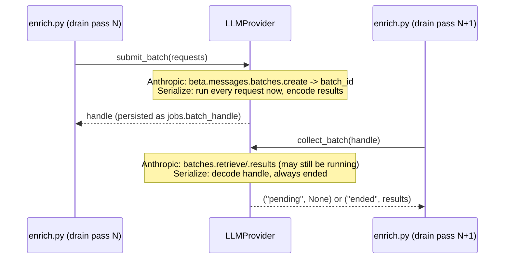

# lode — Stack (decided)

*(§10)* Chosen at founding; rationale where non-obvious. Most choices follow the existing
job-harness ecosystem (Python + Textual + Typer + SQLite) so there's no new framework risk. This
is the storage realization of the ownership boundary and data shape in [storage.md](storage.md).

| Layer | Choice | Notes |
|---|---|---|
| Language | **Python** | Richest LLM/embedding tooling; matches the existing harness |
| Versioning | **setuptools-scm** | The git tag is the version source of truth, no literal to hand-edit — see [release.md](release.md) |
| TUI | **Textual** | Already a proven front-end in the sibling project. Ships with **`textual[syntax]`** as a hard dependency (not an optional extra) for live markdown colouring in the note-body `TextArea`s, pulling in ~15 tree-sitter grammar packages — see [editing.md](editing.md) for the colouring scope (block-level only), the fallback behavior, and the rationale |
| CLI | **Typer** | Repo convention (never argparse). **`is_flag`/`flag_value` tri-state options are non-functional** — typer vendors its own copy of click's argument parser (`typer/_click/`, a module distinct from the real `click` dependency) whose `_get_value_from_state` lacks real click's `_flag_needs_value` fallback. Consequence — verified against this project's installed typer (`0.26.8` at discovery in `lode-l38d.8`, reconfirmed against `0.27.0`), reproduced side by side against real click (which handles both correctly): `typer.Option(is_flag=False, flag_value=...)` errors on a bare trailing option (`Option '--file' requires an argument`), and when a following token *is* present it is swallowed even if it is itself another flag (`--file --all` parses as `file='--all'`, not two separate flags). Typer's own `flag_value`/`is_flag` docstring independently confirms it: "inherited from Click and supported for compatibility ... not fully functional, and will likely be removed in future versions." **Sanctioned alternative: split into two fully-supported options** (a bool flag + a `Path` option) rather than one tri-state option — as `lode-l38d.8` landed (`--file`/`--dir`) |
| CLI rendering | **`rich`** | CLI colour + terminal-width rendering (E-UX2, `lode-l38d.1`). Already a hard runtime dependency *in practice* — pulled in transitively by Textual (built on rich, same authors) and Typer — but undeclared, which breaks silently the day either drops it; now declared explicitly in `[project].dependencies`. One shared `Console` in `lode/cli/__init__.py`, so colour is decided once per process instead of hand-rolled per command. **No test seam** (no `force_terminal`, no accessor to monkeypatch): colour tickets assert only the negative path; the positive case is verified by eye. **The detection is frozen at import**, not per command — the precise freeze-vs-live mechanism (what `Console.__init__` computes once vs. what stays a live property, with source-line refs and executed verification against the pinned rich) is canonical next to the scrub in `tests/conftest.py`; see that for the "why". This is what forces the no-test-seam design above: real use is correct (piping replaces stdout before `lode.cli` is imported), but the same import-time freeze is why colour cannot be asserted positively in-process under test — the two consequences that follow from it are canonical in full in `tests/test_cli_console.py`'s module docstring, not restated here (`lode-3npn`). Mechanism verified in `lode-l38d.1`. Accepted residual risk: a regression that silently disables colour everywhere still passes the gates (it is user-visible on first use). The shared `Console` carries one shared rich `Theme` (`CLI_THEME`, `lode-l38d.11`), with SEMANTIC style names (`note_id`, `date`, `warn`, `danger`, `ok`, `table.header`) rather than colour literals — split out from `lode-l38d.1` because its four colour/table consumers (`lode-l38d.4`/`.5`/`.6`/`.10`) all depend only on `.1` and so reach the ready frontier together as parallel, non-coordinating producers; deciding the palette once, here, removes the need for them to coordinate it themselves. The palette is declared as a plain dict (`CLI_STYLES`) that the `Theme` is built *from*, because `Theme.__init__` **destroys the declaration** — it copies rich's `DEFAULT_STYLES` (`inherit=True` is the default, and wanted: rich's own `repr.*`/`progress.*`/traceback styles must keep working underneath ours) and `.update()`s ours on top, so a name whose value equals rich's default is indistinguishable on the constructed `Theme` from one never declared. That is not hypothetical: `table.header` deliberately restates rich's own default (`bold`, which rich's `Table` already applies via its default `header_style="table.header"`), declared anyway so the palette has one source of truth for `lode-l38d.4`, which cannot ask. Consequence for tests: assert the palette against `CLI_STYLES`, never against `CLI_THEME.styles` — the latter is merged over ~150 rich defaults and stays green with an entry deleted (found by `lode-l38d.11`'s technical review, whose tests originally did exactly that). **`highlight=False` is hoisted onto the shared `Console` itself** (`lode-re0s`), not left per-call-site: rich's `Console` runs its `ReprHighlighter` over every plain string by default, injecting `repr.*` styles outside `CLI_STYLES` — verified against rich 15.0.0 to shred a rendered date into mismatched bold-cyan/dim/bold-green spans and to recolour numbers/IPs/etc. inside a note's own text. Every consumer wants it off, rich `Table`s never run it regardless, so centralising it has no blast radius; a per-call `highlight=True` still overrides it if ever needed. Same "no public accessor" shape as the rest of this row — pin it via the private `Console._highlight`, not an assertion on rendered output |
| **SQLite store** (one file) | **SQLite** | A single **container** file. Holds the **irreplaceable** rows — owned content (`notes`/`versions`/`externals`/`snapshots`) **and** user curation (`annotations`/`edges` where `source = user`) — *and*, in the same file, rebuildable cache (**FTS5**, `source = ai` rows, `passages`) + operational `jobs`. The partition is by **rows / value, not by file** (see [below](#the-partition-is-by-rows-not-by-file)). Tiny, durable, **backup = copy the file** (a harmless *superset* of the irreplaceable set) |
| **Regenerable cache** | **LanceDB** (vectors) + **networkx** (graph, in-memory) | Disposable, rebuildable from the notes. LanceDB: columnar on-disk embeddings with a real ANN index and metadata filtering (its native hybrid is **unused** — lexical stays in FTS5; fusion is app-side RRF, see [retrieval.md](retrieval.md)). Graph traversal runs in-memory via networkx over the edge rows — no graph server. AI annotation/edge rows live in SQLite alongside the rest. Behind a thin **repository interface**, so the cache engine is swappable (sqlite-vec is the simpler fallback-down) |
| Embeddings | **Local, on-machine** | Open model via fastembed/ONNX (`nomic-ai/nomic-embed-text-v1.5`, **768-dim** — pinned + verified in `lode-txh.6`) — CPU-only, no torch. **Loaded in-process via `fastembed` (a thin wrapper over `onnxruntime` + tokenizers) — there is no model server or daemon; this is *not* Ollama.** The reranker and faithfulness-NLI models below run the same way, in the same process. **Chosen specifically to honor [privacy](externals.md#privacy-consequence-of-aggregation)**: note/email/ticket content is never sent off-box *for indexing*. The resulting vectors land in LanceDB. Accepts slightly lower retrieval quality + a bundled model file (~100–500MB) in exchange |
| Reranker | **Local cross-encoder** (`BAAI/bge-reranker-base`) | First-class retrieval stage ([retrieval.md](retrieval.md)), wired in v1 behind a toggle. Runs on the **same ONNX runtime** as embeddings via `fastembed` — no new stack, content stays on-box. (`fastembed` does not ship `bge-reranker-v2-m3`; `bge-reranker-base` is the loadable bge-family pick — verified in `lode-txh.6`.) Biggest single quality lever for cited Q&A; model/threshold tuning deferred until there's a corpus ([decisions.md](decisions.md)) |
| Faithfulness NLI | **Local cross-encoder repurposed** (`BAAI/bge-reranker-base` via `fastembed`'s `TextCrossEncoder`) | Entailment leg of the [faithfulness gate](retrieval.md#faithfulness-verify-citations-dont-just-require-them): scores whether cited spans jointly entail a synthesized claim, so multi-note synthesis is answered rather than refused. `fastembed` ships **no** dedicated NLI model, so the cross-encoder is repurposed as the entailment scorer — same **ONNX runtime**, on-box, no separate loader (verified in `lode-txh.6`). Ships in v1 **conservative and fail-closed**; the model + acceptance **threshold ship untuned** and are revisited against the eval harness ([decisions.md](decisions.md)) |
| Enrichment LLM | Provider-selected via `llm_provider` ([LLM provider seam](#llm-provider-seam-decided-lode-568v1), `lode-568v.2`/`.3`); default **Anthropic Claude Haiku 4.5** (`claude-haiku-4-5`, $1/$5 per Mtok), or an OpenAI/Azure deployment when `llm_provider = "openai"` | High-volume background tagging/extraction. Use **structured outputs** so the derived layer gets validated JSON. A **fresh note enriches interactively** (one immediate call) for promptness; **bulk / backfill / re-enrichment** goes through the provider's batch path — Anthropic's **Batches API** (50% off, non-interactive) under the default provider, or serialized sequential calls under a provider with no batch API (`lode-568v.3`). Driven by the durable [work queue](storage.md#the-async-work-queue); submitted batch handles are persisted so a restart resumes rather than resubmits. **`no_egress` notes are skipped** (never enriched); every send is redacted-before-egress and recorded in the [egress log](externals.md#privacy-consequence-of-aggregation) |
| Q&A LLM | Provider-selected via `llm_provider` (same seam); default **Anthropic Claude Sonnet 4.6** (`claude-sonnet-4-6`, $3/$15) with **Opus 5** (`claude-opus-5`, $5/$25) as a "think harder" toggle, or OpenAI/Azure deployments under `qa_llm`/`qa_think_harder_llm` when `llm_provider = "openai"` | Low-volume, interactive, quality-sensitive synthesis. Returns **structured claims**, each pinned to a verbatim span of a specific version; a [faithfulness gate](retrieval.md#faithfulness-verify-citations-dont-just-require-them) verifies the evidence and abstains rather than emit an unsupported claim — citations are enforced by *verification*, not just by the response schema. **`no_egress` passages are excluded from the cloud context** (cited as "withheld from synthesis"); the context sent is redacted-before-egress and recorded in the [egress log](externals.md#privacy-consequence-of-aggregation) |
| Web-fetch HTTP client | **`httpx2`** | First connector (E12 web draw-down, `lode-w0h.1`) — synchronous GET with an explicit `follow_redirects`/`max_redirects` cap and a typed exception hierarchy (`TooManyRedirects`/`TimeoutException`/`NetworkError`) that maps onto the fetch-outcome taxonomy ([externals.md](externals.md#draw-down-rules)). Chosen over `requests` purely on maintenance status — `requests` is in long-term maintenance mode, httpx (of which httpx2 is the Pydantic-stewarded successor fork, `lode-6wly`) is the actively developed equivalent with the same sync call shape (both have a redirect cap and typed exceptions; that pair differentiates only against stdlib). Chosen over stdlib `urllib.request` because its redirect cap is a hardcoded `HTTPRedirectHandler.max_redirections = 10`, not a per-request knob, so the `fetch_max_redirects` setting could not be honored without subclassing |
| Web-fetch readability extraction | **`trafilatura`** | Same ticket. Named directly in the fetch-outcome decision: `extract()` returns `str \| None`, and `None` on failed/empty extraction *is* the taxonomy's testable "not real content" signal, combined with a configured length floor for short-but-non-`None` teasers (paywalls). Verified locally against synthetic JS-shell/paywall/article fixtures during the build. Chosen over `readability-lxml` (stale, weaker boilerplate removal) and `boilerpy3` (thinner API) |

---

## Why a split store

*(decided after evaluating a unified Oracle AI Database 26ai, plus SQLite+sqlite-vec, SurrealDB,
FalkorDB, Neo4j, Postgres+pgvector+AGE)*

The ownership boundary ([storage.md](storage.md#the-ownership-boundary)) already partitions the data
by *value*, so the storage follows it. The irreplaceable set is **tiny and structurally trivial**
but must be durable and trivial to back up — SQLite is the ideal fit (one file, atomic,
restore-anywhere). The cache is **heavy but disposable**, so it optimizes for *retrieval quality and
feature fit*, not durability — which frees the pick to the best embedded tools (LanceDB + networkx)
with no server, licensing, or unpatched-security risk. (Not *all* cache leaves SQLite: FTS5, the
`source = ai` rows, and `passages` co-reside there for transactional and FTS-next-to-`versions`
reasons — so the boundary is by **value / rows, not strictly by engine**; see
[the partition is by rows](#the-partition-is-by-rows-not-by-file).)

A single unified engine (the original Oracle 26ai choice) was rejected because it inverted that
match: it put the **heaviest, least-durability-critical machinery under the most sensitive data**.
Oracle Free is unsupported/unpatched (security included) on a box aggregating email + tickets + repo
contents; it makes backup a full-DB dump instead of a file copy; and it front-loads the heaviest
yak-shaving onto an MVP (build step 1, [design.md](design.md) §7) that needs none of its
differentiators (the note↔note graph fits in memory; entity extraction is the enrichment LLM's job —
with provenance — not a DB black box).

---

## The derived layer is not uniformly disposable

Three rebuildable tiers, plus one non-regenerable exception that belongs with the irreplaceable set:

| Derived item | Rebuilt by | Regeneration cost |
|---|---|---|
| Embeddings | Local CPU model over head nodes | **Cheap** — minutes for thousands of notes, tens of minutes for ~100k. No dollars, no network. |
| Lexical (FTS5) + explicit edges | Deterministic re-parse | **Trivial** — pure computation, no model. |
| AI annotations + inferred edges | The enrichment LLM (default: Claude Haiku via Anthropic's Batches API; a provider without a batch API serializes instead, [LLM provider seam](#llm-provider-seam-decided-lode-568v1)) | **Real $ + hours** — ~tens of dollars per ~10k notes, non-interactive. Not prohibitive, but not free. |
| **User curation** (`source = user`) | — (not derived from anything) | **Not regenerable.** A fixed tag, a confirmed or deleted link — genuine user decisions. Stored with the irreplaceable set in SQLite. |

So "drop the derived layer and lose nothing" holds only for the first three tiers; user curation is
irreplaceable.

---

## The partition is by rows, not by file

The value boundary (§3, irreplaceable vs regenerable) and the engine boundary (SQLite vs
LanceDB/networkx) do **not** coincide. The SQLite file is a *container* that holds irreplaceable
rows **and** rebuildable cache (FTS5, `source = ai` rows, `passages`) **and** operational `jobs`.
So the partition is **by rows / value, not by file** — and the docs say so rather than implying the
file equals the irreplaceable set.

It stays a **single file** (not split into `core.db` + `cache.db`) for three concrete reasons:

- **Atomic enqueue.** "Write version row + enqueue its derive jobs" must be one transaction
  ([storage.md](storage.md#the-async-work-queue)); across two attached DBs in WAL mode commit is
  **not** atomic, which would break that invariant.
- **FTS5 sits next to `versions`.** An external-content FTS5 index references `versions.body` to
  avoid duplicating text; that reference doesn't cross database files cleanly.
- **Nuking the cache needs no file boundary** — it's a `DROP`/`DELETE` of the cache tables within
  the one file, not a file deletion.

**Backup, stated honestly:**

- **`cp lode.db` is the default** — a *superset* backup: it includes rebuildable cache (harmless
  extra bytes you could have regenerated). Trivial and always correct.
- **A minimal / archival irreplaceable-only dump** is a *row-level* export (owned tables +
  `source = user` rows); restore rebuilds the cache via the reconciliation scan
  ([storage.md](storage.md#the-async-work-queue)) + re-embed/re-enrich. Deferred — the superset copy
  is correct and free; the minimal export is an optimization ([decisions.md](decisions.md)).
- **Restore is robustly sloppy.** A restored file may carry *stale* cache (AI rows from an old
  `prompt_ver`, FTS rows, a dangling `batch_handle`); all of it is absorbed by structural staleness
  + reconciliation, so a superset restore is safe.

---

## Dependency locking (lode-g2741)

Two files, two jobs — **never pin the same thing in both**:

- **`pyproject.toml` is the INTENT layer.** Ranges and floors, not exact versions. A real lower
  (or upper) bound appears here only where a version demonstrably matters — e.g. `trafilatura
  >=2.1,<2.2`, bounded so the lock below always resolves 2.1.0, the version `lode-g274.3`'s
  characterization fixtures assert extraction behavior against. Moving off 2.1.0 is a deliberate
  act: bump the ceiling and re-baseline `lode-g274.3` first, not an incidental side effect of an
  unrelated dependency bump.
- **`requirements.lock` is the ONLY place exact versions live.** A committed, fully-transitive,
  hash-verified (`uv pip compile --generate-hashes`) lock of the **runtime** dependency set only —
  the `dev` extra is deliberately *not* locked (epic `lode-g274` OQ#1: dev-tool drift is not this
  lock's job; the gates themselves, run at HEAD, are the backstop for that). Regenerated only via
  `scripts/compile-lock.sh` (`scripts/update-deps.sh`, `lode-g274.2`) — never hand-edited; the
  hashes make hand-editing impractical anyway.

  **Single-tool exception: `ruff==0.16.0` is pinned in the `dev` extra.** This is a deliberate,
  maintainer-approved *partial rescission* of the unlocked-`dev` policy above, scoped to ruff alone.
  `lode-umh2` established the carve-out at `ruff==0.15.22` as a stopgap; `lode-ju25` then re-pinned
  it to `0.16.0`, and at that point it stopped being a stopgap awaiting a follow-up decision and
  became permanent policy. Ruff 0.16 (released 2026-07-23) enforced a much larger default rule set
  than the version that last certified trunk clean, turning `nox -t fix` red repo-wide for every
  producer with no regression in any one branch's own code; the pin is the only thing that keeps a
  repeat of that from arriving unannounced. *Which* rules that pinned ruff enforces is a separate
  question, settled in [Ruff's lint rule set](#ruffs-lint-rule-set-settled-lode-cs5u) below.

  **The pin only constrains what `uv` installs, not what the gate runs (`lode-0yfn`).**
  `noxfile.py` sets `default_venv_backend = "none"`, so a session inherits whatever PATH the
  invoking shell has. A stale system-wide tool sitting earlier on PATH than the project's own
  `./venv/bin` (e.g. a pip `--user` / pipx `ruff`) then silently shadows the pinned copy — the gate
  runs a *different* ruff than the one pinned above and still reports success, with no signal that
  anything was skipped (reproduced directly: an ambient `~/.local/bin/ruff` 0.15.11 masking the
  then-pinned `0.15.22`, which silently skipped ruff-format's markdown Python-fence reformatting
  while `nox -t fix` still exited 0). Fixed by resolving every dev-extra tool a session shells out
  to — `ruff`, `pytest`, `shellcheck`, `python` — to its explicit on-disk path under `./venv/bin`,
  derived from `noxfile.py`'s own location rather than searched for on PATH (`noxfile.py`'s
  `_venv_tool` helper), so ambient PATH order cannot substitute a different binary; the session
  fails loudly instead if the project venv (or the tool inside it) is missing. Because it fails
  closed, **any CI workflow running one of those sessions must build `./venv` first** — installing
  the dev extra into the runner's ambient interpreter is no longer enough, which is why
  `coverage.yml` calls `scripts/python-init.sh` instead of `pip install -e '.[dev]'`. Deliberately
  **not** applied to the `build` session, which shells out to ambient `python -m build` on purpose —
  `build.yml`/`release.yml` run it with no `./venv` at all, since packaging resolves its own
  isolated PEP 517 env and never touches the dev-extra/lock tools this guarantee exists to pin —
  nor to `lock_currency`, which resolves `uv` itself (a separate, system-wide tool never installed
  into `./venv`, already checked explicitly and failed closed if absent, `lode-sys4`).

`./scripts/python-init.sh` installs from the lock by default, with `--require-hashes` so a hash
mismatch **fails** the install rather than warning. `-e .` (the local package, editable) and
`--require-hashes` are mutually exclusive in one pip/uv invocation, so the dependency install splits
in two: a **lock step** (hash-verified runtime deps from `requirements.lock`), then a **dev-extra
step** (the local package editable together with the `dev` extra, `-e '.[dev]'`, resolved fresh from
`pyproject.toml`). The dev-extra step does re-resolve the whole graph, but the lock step's pins
already satisfy `pyproject.toml`'s ranges and uv keeps an already-installed satisfying version — so
it adds the dev-only packages on top without moving anything the lock step hash-verified. That was
reproduced rather than argued (`lode-xo99`): a locked venv built with and without an extra
`-e . --no-deps` step in between came out with the same package set, the same runtime pins, and the
same resolved `lode` source path either way, so that step was deleted as dead work. `--unlocked`
skips the lock and resolves everything fresh from `pyproject.toml` instead — the deliberate "what
would we get today" escape hatch for regenerating the lock or probing an upstream bump before
committing to it.

**The pip-refresh half of that same install (`uv pip install -U pip`) is different — cosmetic, but
not dead (`lode-hfaz`).** Unlike the deleted `-e . --no-deps` step above, it measurably changes the
installed package set: it bumps the venv's own pip (26.1.1 → 26.1.2 from ensurepip's bundle in the
reproduction run), the one difference in an otherwise byte-identical `uv pip list --format=freeze`
with vs. without it. That holds only while ensurepip's bundle trails the current pip release — the
usual state, not a guaranteed one, so a re-run finding *no* difference means the window closed, not
that the method was wrong. Nothing ever installs *through* the upgraded pip: the venv's pip is
invoked in exactly one place, the `pip install -U uv` that opens this same sequence (and its
`--unlocked` twin in `python-init.sh`, kept for the same reason), so the upgrade's only effect is
suppressing pip's own "a new release is available" notice the next time that opening command runs.
Everything that builds `./venv` builds it from scratch — a first-time `python-init.sh`, both CI legs
that call it (`tests.yml` and `coverage.yml`; neither caches `./venv`), and `update-deps.sh`'s
`rebuild_venv` (`rm -rf ./venv` first, every time) — and so starts from ensurepip's bundle regardless
of history, buying nothing there. It only pays off re-running `python-init.sh` a second time against
a `./venv` that survived from a prior run: verified directly, `python -m venv` on an *existing* venv
directory does not reset an already-upgraded pip. Narrow, but real — kept.

**Both CI legs that install lode's deps install from the lock (`lode-7byn`).** `tests.yml`'s
`tests` job has since `lode-g274.6`; `coverage.yml` was the holdout, for historical reasons only.
It landed a day *before* `requirements.lock` existed (`lode-qxdn.3`), so its fresh
`pip install -e '.[dev]'` was the only option there was, never a decision to measure a different
dependency set — that commit's stated goal was parity with `nox -s tests` on *which tests run*
("no marker filter, slow tests included … the suite the tests badge backs, not a narrower one"),
and it said nothing either way about dependencies. `lode-g274.6` then left the leg alone on scope
grounds ("report-only … neither is in this ticket's scope"), and `lode-0yfn`'s review preserved the
fresh resolve deliberately rather than decide it. With no affirmative reason anywhere on record for
the coverage number to describe a *different* dependency set than the tests badge, `lode-7byn`
dropped `--unlocked`: both legs now run the identical install, so a coverage percentage is
reproducible from committed bytes instead of from whatever resolved on the day it ran.

**What that parity does not cover.** The lock is the runtime set only, so both legs still resolve
`pytest`/`pytest-cov`/`coverage` fresh from the `dev` extra (the dev-extra step above) — `lode-7byn`
pinned the code under measurement, not the tools doing the measuring. The counter-case for resolving
fresh here (an upstream runtime bump moving the coverage number before the lock is bumped) is real but
toothless on this leg: `coverage.yml` enforces no threshold, so such a drift fails nothing and
attributes nothing — and no CI signal fires on an upstream runtime release either way.
[`lock-currency`](#the-lock-gen-command-is-derived-from-python-version-not-hard-coded-lode-sys4)
only catches a lock that has fallen *behind* a `pyproject.toml` constraint change, never one that has
fallen behind PyPI — uv's preference seeding, described in that same section. Moving the runtime set
forward is always a deliberate `scripts/update-deps.sh` run, never something CI notices on its own.

**A green promote files a churn-evaluation bd stub, not a finding (`lode-i642`).** Reading upstream
changelogs for the packages that moved, and judging required-work-vs-judgment-call in the context of
lode's actual call sites, worked by hand once (it produced `lode-cai6`) but depends on remembering.
`scripts/update-deps.sh` now files exactly one bd ticket on its GREEN promote path (step 6 in the
script's own header), carrying the VERSION DIFF it already computed as a durable work order — the
script never does the evaluation itself. Filing policy for that ticket's own executor is
**required-only**: open follow-up tickets only for churn that demonstrably breaks or degrades a lode
call site; new capabilities and judgment calls belong in the executor's hand-off for a human, not as
auto-filed tickets — `lode-cai6` is the worked example of a judgment call that should *not* have been
auto-filed. A **noise gate** skips filing entirely when every moved package changed only its patch
component (mechanically decidable from the diff already on hand) — a ticket per run that is usually
noise gets ignored. `--no-file` suppresses filing outright; `--dry-run` never reaches this step.
Because filing writes Dolt, a missing or failing `bd` (or the `bd dolt push` after it) only warns —
it never changes the script's exit status or the lock promotion, preserving the script's existing
contract that it never mutates anything outside `./venv` and `requirements.lock`.

The diff parsing, the rendering, and the stub's skip policy live in the sourceable
`scripts/dep-churn-lib.sh`, not inline in `update-deps.sh` — so they get `nox -s shellcheck` and
`tests/test_dep_churn_lib.py`, the same shape `scripts/venv-install.sh` and `scripts/gate-lib.sh`
already use. **A sourceable shell library in this repo returns its data on stdout and holds no
cross-call state** — the standing rule the split exists to enforce, not a stylistic preference: a
caller consumes such a helper through command substitution, which runs in a *subshell*, so a
function that "returns" a value by setting a global has that value silently discarded. lode-i642's
first implementation did exactly that and shipped a feature that could never fire on any input, with
both quality gates green because nothing tested it (`tests/test_dep_churn_lib.py`'s docstring keeps
the incident).

### Ruff's lint rule set (settled `lode-cs5u`)

**The model: ruff's full default set, minus a shrinking `[tool.ruff.lint] ignore` list.**
`lode-ju25` originally proposed the opposite shape — an explicit opt-in
`select = ["E4", "E7", "E9", "F"]` — and is closed with that text still reading as its
authoritative decision; it is superseded. The maintainer's call (2026-07-25): reducing `ignore` is
the simpler route to a codebase that is lint-clean against *all* of ruff's default checks.
Consequences of this model, stated honestly:

- **`ignore` is a work queue, not a policy.** Every entry in `[tool.ruff.lint] ignore`
  (`pyproject.toml`) names a rule with outstanding violations somewhere in the tree, removed as the
  epic that owns adopting it (`lode-cs5u`) fixes those sites. The terminal state is `ignore = []` —
  there are no permanent exclusions.
- **This model does not give back `lode-ju25`'s churn-proofing.** A future ruff default-set
  expansion can turn `nox -t fix` red repo-wide again, exactly as 0.16 did. The `ruff==0.16.0` pin
  above is the only mitigation, and it works only because an expansion can now arrive solely via a
  deliberate version bump, never a `dev`-extra resolve.

**Markdown Python-fence formatting is accepted (`lode-ju25` decision 3).** `ruff format` also
formats the Python code fences embedded in `docs/*.md`; the resulting churn to those fences is
wanted, not something to revert.

**B008 (`function-call-in-default-argument`) on `typer.Option`/`typer.Argument`: adopted with no
carve-out, via the `Annotated` idiom (`lode-up58`).** `lode-cs5u.3` adopted B008 by hoisting the sites
it flagged to module-level singleton defaults — but B008 only flags a default whose parameter
annotation is a known-immutable builtin (`bool`, `str` were skipped; `Path` and enum types were
flagged), so `src/lode/cli/` ended up split between hoisted and inline
`typer.Option(...)`/`typer.Argument(...)` defaults by a heuristic invisible at the call site, and the
split would have ratcheted with every future `Path`- or enum-annotated option added. The alternative
`extend-immutable-calls = ["typer.Option", "typer.Argument"]` in `pyproject.toml` would have silenced
B008 correctly (ruff's own docs name CLI frameworks as the false-positive case) but only removes the
lint, not the call-site inconsistency, and is a per-rule semantics carve-out this file's own "`ignore`
is a work queue, not a policy" bar was written against.

**The decided fix:** every Typer CLI in this repo uses `Annotated[<type>, typer.Option(...)]` —
Typer's current idiom — so the construction no longer lives in the default-argument position at all
and B008 has nothing left to flag, no hoist and no config carve-out, now or for any option added
later. The previously-hoisted single-use singletons (`_JOBS_STATUS_OPTION`, `_EGRESS_PURPOSE_OPTION`,
`_DUMP_HTML_DIR_OPTION` in `cli/dump_html.py`; `_ROOT_OPTION` in `check_links.py`) were unwound back to their
call sites. The genuinely-shared `_DEBUG_OPTION`/`_DB_OPTION` (used across many commands, not hoisted
for lint) became shared `Annotated` type aliases (`_DebugOption`, `_DbOption`) — same sharing, same
reason, new idiom. The forward-binding half of this is a style fiat, so it also lives in
[`conventions.md`](conventions.md), which is `@import`ed into every producer and reviewer's context;
the reasoning stays here.

### The lock-gen command is derived from `.python-version`, not hard-coded (lode-sys4)

**Root cause of the original flap (`lode-gyag`):** `uv pip compile` does **not** read
`.python-version` — it resolves against whichever interpreter it happens to discover on the
invoking machine. Some transitive deps carry Python-version markers (`lancedb`'s
`overrides>=0.7 ; python_full_version < "3.12"`; `anyio`'s marker-gated `typing_extensions ; python_version
< "3.13"`), so the SAME `pyproject.toml` resolves a *different* lock depending on whether the
generating machine's default Python was, say, 3.11 or 3.14. CI validates against 3.14 (this repo's
`.python-version`), so a lock generated on an older interpreter diffed red against CI's recompile —
not because a dependency actually changed, but because of *which Python resolved it*.

**The fix:** every lock-gen invocation passes `--python-version "$(cat .python-version)"` explicitly,
so the resolution target is always this repo's single source of truth for its interpreter, regardless
of whatever Python happens to be default on the machine running the command. This lives in exactly
**one** place — `scripts/compile-lock.sh` — which every caller below invokes rather than keeping its
own copy of the `uv pip compile` command string:

- `scripts/update-deps.sh` — the sanctioned way to move `requirements.lock`
  (`lode-g274.2`/`lode-fdjr`). Its two flows are a bare invocation for the whole set and
  `--package NAME` for one package (full usage:
  [onboarding.md](onboarding.md#updating-dependencies)); the corresponding `--upgrade` /
  `--upgrade-package NAME` go *down* to `compile-lock.sh` — not flags `update-deps.sh` accepts.
- **CI enforcement (`lode-g274.6` / `lode-sys4`):** `tests.yml`'s `tests` job installs from
  `requirements.lock` itself (via `scripts/python-init.sh`, the same install path a developer runs),
  and a separate, independent `lock-currency` job in the same workflow verifies the lock is current —
  it runs `scripts/compile-lock.sh -o requirements.lock`, **in place** against the just-checked-out
  committed lock. uv feeds an existing output file's own pins back to the resolver as its *preference*
  set by default (only `--upgrade`/`-U` ignores them), so the resolution only moves when a
  `pyproject.toml` constraint forces it — an upstream release alone reproduces the committed lock
  byte-for-byte, and `git diff --exit-code requirements.lock` catches any real drift. `build.yml`
  never installs lode's runtime deps at all (`python -m build` resolves in its own isolated env), so
  the lock is irrelevant there. `coverage.yml` installs *from* the lock (`lode-7byn`) but does not
  re-verify its currency: being report-only (`lode-qxdn.3`, no merge-gate status), it leaves that to
  the single `lock-currency` job here — one commit, one currency check.
- **Local pre-flight (`lode-sys4`):** `nox -s lock_currency` (`noxfile.py`) is the same check,
  runnable on any dev machine — it seeds a scratch copy with the committed lock (mirroring CI's
  in-place recompile so the preference-seeding behaves identically), recompiles it via
  `scripts/compile-lock.sh`, and diffs the result against the committed file. Deliberately kept out
  of the default `nox` session set (same reasoning as `eval`/`build`: it needs network to resolve
  against PyPI, so a bare `nox` / `nox -s tests` stays offline). **`/land` runs it** as part of its
  combined re-gate (`.claude/skills/land/SKILL.md`, alongside `nox -t fix`/`nox -s tests`) and in its
  per-branch isolation-replay loop — so a stale lock is caught locally, by the single trunk-writer,
  before the public CI badge is the only thing that catches it.
- **Offline / `uv`-absent behaviour: fails closed, and fails *distinguishably*.**
  `scripts/compile-lock.sh` exits non-zero with an explicit message if `uv` is not on `PATH`, rather
  than silently skipping the check. A stale lock landing unnoticed because a local check was quietly
  skipped is worse than a noisy failure that tells a developer to install `uv`. `nox -s lock_currency`
  splits its own non-zero into content (exit 1: the committed lock genuinely disagrees with what
  `pyproject.toml` resolves to) vs. machine (exit 2: `uv` absent, or `compile-lock.sh` unable to
  resolve — PyPI unreachable, a 5xx, DNS) — the same [gate exit-code
  contract](agents-workflow.md#gate-exit-code-contract-012-lode-jhry) every other gate in this repo
  honours; see that section for the full 0/1/2 rule, each consumer's obligation, and the nox
  mechanic (`session.error`/a failed `session.run` both collapse to exit 1, so the machine-fault path
  needs a direct `sys.exit(2)`).

  This gate needs that distinction more than the offline default set does, not less: `nox -t
  fix`/`nox -s tests` are offline once the model cache is warm, whereas `lock_currency` requires `uv`
  and a reachable PyPI on **every** invocation. CI's `lock-currency` job installs `uv` itself first,
  so the uv-absent path only bites a developer machine or `/land`'s local pre-flight — the public CI
  badge still catches a stale lock in that case, just later.
- **Attribution needs a baseline, not just an exit code (`lode-sys4`, extended to `nox -s tests` by
  `lode-kq4v`).** `/land`'s isolation-replay loop finds a culprit by merging the accepted branches
  one at a time and blaming the one that turns the gate red. That is **not** sound for either gate
  taken unconditionally — `nox -s tests` does *not* ask a question about the tree alone, despite
  once being recorded here as if it did: it is sensitive to ambient env vars a landing session's own
  shell can carry, and `lode-kq4v` observed exactly that in production — an ambient `FORCE_COLOR=3`
  in the landing session's environment (never set anywhere in this repo) froze rich's `Console()`
  colour detection at import (`lode-xgaa`'s mechanism) and reddened 6 CLI tests on a bare, unmodified
  `origin/trunk` with no branch involved at all. `lock_currency` fails the same soundness test for a
  different reason: it asks whether the committed lock is a fixed point of the tree **plus the
  ambient `uv` plus today's PyPI** — an answer that can flip with no branch involved (a `uv` release
  that changes the emitted format; `uv` is installed unpinned via `pip install -U uv`, so the
  lander's resolver can differ from the one that produced the committed lock). So `/land` runs
  **both** gates once on bare `origin/trunk` before entering the loop: red on either one there means
  the failure predates every branch in the set and is not attributable to any of them — stop the
  pass, don't isolate. (`tests/conftest.py` also scrubs the specific ambient colour/tty env vars
  rich reads — `FORCE_COLOR`/`NO_COLOR`/`TTY_COMPATIBLE`/`TTY_INTERACTIVE` — at collection time for
  every pytest invocation, closing the root cause `lode-kq4v` found; the baseline here is the
  independent blast-radius fix, so `/land` stays safe even against a *different* source of
  tree-alone-defying redness nobody has scrubbed yet.)

The cache is never *required* in a backup — losing it costs a rebuild, never data. Optionally
snapshot just the LLM tier of the cache to skip the dollars + hours of re-enrichment on restore
([decisions.md](decisions.md)) — an optimization, not a correctness need.

**Keep the cache behind a repository interface.** The [data shape](storage.md#data-shape-sketch) is
engine-agnostic; the access layer hides the cache engine so LanceDB can be swapped (sqlite-vec is
the simpler fallback-down) without touching the core.

**Embeddings reality check:** embeddings are **local-only regardless of which cloud LLM vendor is
configured** — Anthropic in particular has no first-party embeddings API, but even a vendor that does
offer one (e.g. OpenAI) doesn't change the decision: local embedding is a deliberate [privacy
principle](externals.md#privacy-consequence-of-aggregation), not an availability accident, and stays
out of scope for the vendor-neutral seam below (epic scope, decided 2026-07-22). LanceDB just stores
the resulting local vectors.

**Auth:** no hardcoded API key for any provider. Anthropic resolves via the SDK's own chain (env var,
then an `ant auth login` profile, then workload-identity federation), same as the harness; OpenAI/Azure
resolves via `OPENAI_API_KEY` / `AZURE_OPENAI_API_KEY` (see [LLM provider seam](#llm-provider-seam-decided-lode-568v1)
below). If nothing resolves, fail gracefully with an actionable, provider-appropriate message (no
traceback) and log the detail.

**Model-tier split mirrors the harness:** cheap/deterministic high-volume work on the cheaper tier
(default: Claude Haiku); judgment-sensitive synthesis on a stronger tier (default: Claude Sonnet, with
Opus as a "think harder" toggle) — now provider-portable via `ModelTier` ([§6](#6-config-shape)), so
the same split holds under an OpenAI/Azure deployment.

---

## LLM provider seam (decided, lode-568v.1)

`lode-568v` (epic: support LLM vendors outside Anthropic — OpenAI via Azure) needs a vendor-neutral
seam over the three cloud-LLM call surfaces before any provider code lands. This section is that
seam, pinned design-first so `lode-568v.2` (Anthropic behind the seam, zero behavior change) and
`lode-568v.3` (OpenAI-via-Azure behind the seam) build against one decided contract rather than
inventing it under implementation pressure. **LLM only** — embeddings/reranker/NLI stay local-only
and untouched (epic scope, decided 2026-07-22).

### Module home, and Protocol vs ABC

The seam lives in a **new module, `src/lode/llm_provider.py`** — not folded into `src/lode/auth.py`.
`auth.py`'s own docstring already treats staying cheap to import as load-bearing (`lode-4q97`):
`import anthropic` is deferred inside `build_client()` because most callers (e.g.
`lode.worker.drain`, unconditionally) import the module only to *catch* `AuthError`, on paths that
may never touch Anthropic at all. A seam that can construct **either** vendor's SDK client behind
one factory has strictly more reason to keep that import discipline, and a fresh module keeps it
from being re-litigated every time a provider is added. `auth.py`'s exact fate (kept as an internal
credential-resolution helper the `AnthropicProvider` calls into, vs. absorbed wholesale) is left to
`lode-568v.2` — an implementation detail, not a contract question.

**Protocol, not ABC** — matching this repo's existing precedent for exactly this shape of seam: the
`Embedder` Protocol (`src/lode/embedding.py`), cited directly in the epic body as the model for any
future vendor-neutral abstraction ("independent of this epic … the existing `Embedder` Protocol").
Structural typing needs no shared base class, and every current + hypothetical future provider
already satisfies the same shape without inheriting anything, the same way `FastEmbedEmbedder` does
today.

### 1. Client + credential/routing construction

Replaces `auth.build_client()`, which today constructs a bare `anthropic.Anthropic()` from the SDK's
own credential chain with no routing insertion point at all:

```python
def build_provider(settings: Settings) -> LLMProvider:
    """Resolve credentials + routing for settings.llm_provider; return its LLMProvider.

    Raises LLMAuthError (provider-appropriate message) when nothing resolves.
    """
```

- `settings.llm_provider == "anthropic"` → resolves via the same SDK credential chain
  `build_client()` uses today (env var / `ant auth login` profile / workload-identity federation),
  returns an `AnthropicProvider`.
- `settings.llm_provider == "openai"` → resolves `OPENAI_API_KEY`, or — when
  `settings.azure_openai_endpoint` is non-empty — `AZURE_OPENAI_API_KEY` plus the endpoint/
  api-version routing knobs (§6 below); returns an `OpenAIProvider` (`lode-568v.3`'s implementation).
  Azure-vs-direct-OpenAI is a routing detail *under* this one value, never a second provider value
  (epic's resolved decision, 2026-07-22).
- Failure is `LLMAuthError` (below), its message naming the *correct* env var(s) for whichever
  provider is active — generalizing today's Anthropic-worded `MISSING_CREDENTIALS_MESSAGE`.
  **`lode-568v.2` implementation note:** the Anthropic branch does NOT wrap `build_client()`'s
  `AuthError` into `LLMAuthError` — `AuthError` propagates unchanged, preserving `worker.py`'s
  extensively-tested `lode-9yy` permanent-failure handling byte-for-byte. `LLMAuthError` is reserved
  for a future non-Anthropic provider's own credential failures. Full rationale and the tracked
  follow-up: `decisions.md` (`lode-568v.2`).

### 2 & 3. The two immediate structured-output calls — one seam method

`enrich._call_haiku()` (forced tool-use: `tools=[…]`, `tool_choice={"type": "tool", "name": …}`,
reads `content` block `type == "tool_use"`) and `qa._request_claims()` (`messages.parse(...,
output_format=...)`, reads `response.parsed_output`) take **identical inputs** once named generically
— a model, a system prompt, a user prompt, an output Pydantic schema, a token cap, a timeout. There
is no principled reason to keep them as two seam methods; the epic's own work-surface-4 language
("response-shape differences must be normalized at the seam") is exactly this. One generic method:

```python
def structured_call(
    self,
    *,
    model: str,
    reasoning_effort: str | None,
    system: str,
    user_prompt: str,
    output_schema: type[BaseModelT],
    max_tokens: int,
    timeout_s: float,
    tool_name: str | None = None,
    tool_description: str | None = None,
) -> BaseModelT: ...
```

`tool_description` is a `lode-568v.2` addition beyond this ticket's original pin — required for
`AnthropicProvider`'s forced tool-use branch to send the *exact* tool description text `_call_haiku()`
sent pre-seam (byte-for-byte wire equivalence is `lode-568v.2`'s own acceptance bar, and this pin had
no way to carry it). See `decisions.md` (`lode-568v.2`) for the full rationale.

**`AnthropicProvider` maps onto today's exact calls with zero behavior change (the decision this
ticket's acceptance criteria names explicitly) via `tool_name`, not by unifying the underlying wire
mechanism** — asserting that `messages.parse` and forced tool-use are wire-equivalent isn't a claim
this docs-only ticket can verify, and `lode-568v.2`'s own acceptance bar is "byte-for-byte
equivalent." So the two existing mechanisms stay literally distinct, selected by whether the caller
passes `tool_name`:

- **Enrichment** passes `tool_name=_TOOL_NAME` → `AnthropicProvider` forces tool-use exactly as
  `_call_haiku()` does today (same `tools=[…]`, same `tool_choice`, same `tool_use` block read).
- **Q&A** passes no `tool_name` (`None`) → `AnthropicProvider` calls `messages.parse(output_format=
  output_schema)` exactly as `_request_claims()` does today.

`reasoning_effort` reaches `AnthropicProvider` as `output_config.effort` on every wire mechanism
(`lode-wnz1`), subject to the model-support caveat recorded in
[configuration.md](configuration.md#reasoning_effort-wired-to-output_configeffort-decided-lode-wnz1)
(some models reject `effort` outright, so this is a model choice, not just a level choice).
`OpenAIProvider` (`lode-568v.3`) has a single wire mechanism for structured output — the Responses
API's `text.format`/json_schema (see the Azure/OpenAI routing note below) — so it can honor or ignore
`tool_name` as it sees fit; the param is Anthropic-mechanism-selecting, not a cross-provider
requirement.

**`lode-568v.2` note:** `timeout_s` is now threaded into *every* `structured_call` — including Q&A's,
which pre-seam passed no client-side timeout to `messages.parse` at all (only the enrichment/batch
calls read `anthropic_call_timeout_s`). This is the intended effect of unifying the seam ("every LLM
call, immediate and batch alike" — §6 below), not an accidental behavior change: Q&A now gets the same
hung-call protection enrichment already had, bounded by the same (renamed) knob.

### 4. The two-phase batch contract (the trap — pinned precisely)

Anthropic's Batches path (`submit_enrich_batch` / `collect_enrich_batch`) is deliberately
**two-phase across drain passes**: submit persists `batch_handle` on the job rows (survives a
restart, `lode-i05.5`) and collect reaps on a *later* pass, so the drain keeps working while the
batch cooks. A blocking `run_batch(requests) -> results` contract would regress Anthropic (the drain
would block on it). The seam stays two-phase, and `enrich.py` keeps **all** job-row / `egress_log` /
DB bookkeeping — the provider only implements "run this set of requests":

```python
@dataclass(frozen=True)
class BatchRequest:
    custom_id: str  # version_id/snapshot_id, mirrors today's custom_id mapping
    model: str
    reasoning_effort: str | None
    system: str
    user_prompt: str
    output_schema: type[BaseModel]
    max_tokens: int
    tool_name: str | None = None
    tool_description: str | None = (
        None  # lode-568v.2 addition, see structured_call above
    )


@dataclass(frozen=True)
class BatchResult:
    custom_id: str
    outcome: Literal["succeeded", "errored", "expired", "canceled"]
    parsed: BaseModel | None  # set iff outcome == "succeeded" -- the provider's RAW
    # decoded wire payload (a pydantic.RootModel[dict]), NEVER
    # a schema-validated domain object; the caller validates it
    # against whatever output_schema it submitted (lode-568v.2,
    # decisions.md -- keeps the provider generic and preserves
    # lode-i05.5 restart durability with no schema info needing
    # to survive in the persisted batch_handle)
    error: LLMProviderError | None  # set iff outcome != "succeeded"


class LLMProvider(Protocol):
    def submit_batch(
        self, requests: Sequence[BatchRequest], *, timeout_s: float
    ) -> str:
        """Submit; return an opaque, PERSISTABLE handle string (stored as batch_handle)."""
        ...

    def collect_batch(
        self, handle: str, *, timeout_s: float
    ) -> tuple[Literal["pending"], None] | tuple[Literal["ended"], list[BatchResult]]:
        """Poll `handle`; ("pending", None) or ("ended", <results, one per request>)."""
        ...
```

- **`AnthropicProvider`**: `submit_batch` calls `client.beta.messages.batches.create(...)`, returns
  `batch.id` as the handle — identical to `submit_enrich_batch` today. `collect_batch` calls
  `batches.retrieve` + `.results` when ended — identical to `collect_enrich_batch` today.
- **A provider without a batch API (OpenAI/Azure, `lode-568v.3`) satisfies the contract
  degenerately: `submit_batch` runs every request through `structured_call()` synchronously, right
  there** (the epic's own sanctioned "serialize as sequential immediate calls" behavior — a
  long-running `submit_batch` call is the accepted cost, not a bug), **and returns a handle that
  self-encodes the already-computed `BatchResult`s** (e.g. a JSON blob) rather than a server-side
  batch id — there is no such thing to reference. `collect_batch` then just decodes its own handle
  and returns `("ended", …)` immediately; no network call, no actual polling. The caller (`enrich.py`)
  neither knows nor cares which strategy produced the handle — exactly the epic's "the caller asks
  the provider to run the batch and does not know or care which strategy it used."



### 5. Provenance capture point

A **new, nullable `annotations.provider TEXT` column** (alongside the existing `model TEXT`,
`schema.sql`) — not a composite string encoded into `model`. `annotations.model` keeps recording
exactly what it does today (the bare model/deployment string, unchanged in meaning and format);
`provider` records the short id each `LLMProvider` implementation exposes (`"anthropic"` /
`"openai"`). `NULL` on existing rows means "anthropic" by convention — the only provider that ever
wrote a row before this epic — so no backfill is required, matching the existing
"no separate manifest, aggregate read" provenance pattern
([configuration.md](configuration.md#model-provenance-the-enrichment-llm-decided-lode-g2745)). Same
treatment for **`egress_log`**: a new nullable `provider TEXT` column, populated by `log_egress()`
call sites going forward — the audit trail's whole point is "content left the box," and which vendor
it went to is part of that fact, not less so than for `annotations`. Schema migration + the
`_write_enrichment`/`log_egress` write-path changes are `lode-568v.4`'s scope, not this ticket's.

**Known consequence, scoped elsewhere:** `lode-o9k3`'s staleness comparison
(`_enrichment_model_stale` / `_STALE_ENRICHMENT_LIVE_HEADS_SQL`) currently compares stored `model`
against `settings.enrichment_llm` only; once `provider` is a real per-row fact, a provider switch
with an unchanged model *string* would not otherwise be caught. That read-side update is
`lode-568v.6`'s scope, already split out and tracked — not addressed here.

### 6. Config shape

**One whole-app provider selector** (resolved decision, 2026-07-22): setting a provider sets it for
*every* cloud-LLM surface; there is no per-surface vendor axis.

- `llm_provider: str = "anthropic"` (`Kind.RUNTIME`) — `"anthropic"` | `"openai"`.
- `azure_openai_endpoint: str = ""` (`Kind.RUNTIME`) — the resource **root**, e.g.
  `https://{resource}.openai.azure.com` (do **not** append `/openai`: it is passed to the openai
  SDK's `AzureOpenAI(azure_endpoint=…)`, which appends `/openai` itself, so `.../openai` doubles the
  path and every request 404s — verified against `openai==2.47.0`). Empty means direct OpenAI (or a
  non-`"openai"` provider); its presence is what distinguishes Azure routing from direct OpenAI
  *under* the one `"openai"` provider value, not a second vendor axis.
- `azure_openai_api_version: str = ""` (`Kind.RUNTIME`) — passed as a **query param on every
  request** (verified against a working Azure config, see this ticket's notes), e.g.
  `2025-04-01-preview`, not a header. Required when `azure_openai_endpoint` is set.
- Keys stay **env/SDK-only, never in config.toml** — `ANTHROPIC_API_KEY`/`ANTHROPIC_AUTH_TOKEN`
  (unchanged) for Anthropic, `OPENAI_API_KEY` / `AZURE_OPENAI_API_KEY` for OpenAI/Azure — mirrors
  lode's existing keys-never-in-config invariant with no change needed to port it to Azure.

**Per-surface tier becomes a `(model, reasoning_effort)` pair, not a bare string** — resolving the
crux this ticket's acceptance criteria names explicitly. `enrichment_llm` / `qa_llm` /
`qa_think_harder_llm` stay as three *separate* knobs (unchanged in count and meaning — each still
selects a tier *within* the active provider), but each is now typed as a small `ModelTier` value:

```python
class ModelTier(BaseModel):
    model: str  # Anthropic model id, or an Azure/OpenAI deployment name
    reasoning_effort: str | None = (
        None  # meaningful only under a reasoning-capable deployment
    )
    max_tokens: int | None = None  # lode-d70n; None = the call site's own constant
```

`max_tokens` is a later addition (`lode-d70n`) on the same rationale — it co-varies with the model
choice exactly as `reasoning_effort` does, and left unset falls back to the call site's own output
budget (`qa.MAX_TOKENS` / `enrich.MAX_TOKENS`); see
[configuration.md](configuration.md#per-tier-max_tokens-override-decided-lode-d70n), which owns that
decision.

A bare TOML string (every existing `config.toml` today, e.g. `enrichment_llm = "claude-haiku-4-5"`)
coerces to `ModelTier(model=<string>)` — back-compat, no migration required for existing configs; an
inline table (`qa_think_harder_llm = { model = "gpt-5.5", reasoning_effort = "high" }`) sets the
fields explicitly. This directly answers the challenge's three-way crux ("does 'think harder' select
a different deployment, a different effort on one deployment, or both?") with **no new abstraction
beyond upgrading each existing knob's type** — since `qa_llm` and `qa_think_harder_llm` are already
two independent `ModelTier` values, a config can set `model` the same on both and vary only
`reasoning_effort` (effort bump on one deployment), vary only `model` (deployment swap, today's
existing Sonnet→Opus behavior — the historical case, preserved as-is), or vary both.

**`anthropic_call_timeout_s` renamed vendor-neutral: `llm_call_timeout_s`, with a back-compat
alias** — the second item this ticket's acceptance criteria names explicitly (the Anthropic-named
knob would otherwise govern the OpenAI/Azure provider too, `config.py:285`). Same default (120.0s),
same meaning (per-call client-side timeout passed to every LLM call, immediate and batch alike).
Back-compat mechanism: `load_settings()` already massages the raw `config.toml` dict before
constructing `Settings` (dropping `None`-valued overrides, `config.py`) — the same spot gains one
more rename: a `config.toml` still carrying the old key is mapped onto the new one
(`file_values.setdefault("llm_call_timeout_s", file_values.pop("anthropic_call_timeout_s", …))`-shape
logic) before validation, so an un-migrated config file keeps working rather than tripping
`extra="forbid"`. Exact implementation is `lode-568v.2`'s.

> **Update (lode-7y6s):** `llm_call_timeout_s` was itself later renamed
> `enrich_call_timeout_s`, once the `qa_call_timeout_s` split (`lode-wfyx`)
> left the general name reaching only `enrich.py`'s call sites. The write-up
> above stands as decided, but the mechanism it describes now runs **more
> than once, oldest-name-first** — each hop's output feeds the next, so the
> oldest key still reaches the current field. That order is load-bearing:
> reversing it strands the oldest key on `extra="forbid"`.

### Error contract — diagnosability over genericness

A provider's failure paths must surface enough to diagnose remotely, not collapse into one generic
lode error — the two residual structural risks doc-reading alone can't close (Azure api-version
skew, Azure content-filtering) are only observable in a real Azure environment, where logs are the
only diagnostic surface this repo can't reproduce locally (challenge addendum, 2026-07-22):

```python
class LLMProviderError(RuntimeError):
    """A provider call failure. Carries enough to diagnose remotely; chains onto
    the underlying SDK exception via __cause__."""

    provider: str
    status_code: int | None
    request_id: str | None


class LLMAuthError(LLMProviderError):
    """No credentials resolved for the active provider — raised by build_provider()."""
```

Every `LLMProvider` implementation converts the SDK's **status** errors (4xx/5xx) into
`LLMProviderError` (or a subclass) rather than letting them escape raw, so callers (`enrich.py`/
`qa.py`'s existing retry/backoff logic) catch one exception type across providers, while
`.status_code`/`.request_id` + the chained `__cause__` still expose whatever the underlying SDK/HTTP
response carried. This generalizes today's credential-only "provider-appropriate error messaging"
(§1) to *runtime* call failures too. The concrete OpenAI/Azure field-by-field mapping (which response
fields populate `status_code`/`request_id` for a Responses API error, an Azure content-filter
rejection, etc.) is `lode-568v.3`'s scope — only the shape is pinned here.

**What still escapes raw.** `AnthropicProvider` wraps all five of its SDK calls — the three that
submit (`lode-90o7`) and `collect_batch`'s two that poll (`lode-i7yr`) — plus, separately,
`collect_batch`'s own JSONL-results iteration (`lode-3gtu`). That last one is not covered by any
`except anthropic.*` clause and never can be: the SDK resolves HTTP status *before* it returns the
lazily-streamed decoder, so a failure while pulling the body is not an `anthropic` type at all.
`collect_batch` converts three such types to `LLMProviderError`:

| Escaping type | Cause |
|---|---|
| `httpx2.HTTPError` | the stream dies mid-read |
| `json.JSONDecodeError` | a line is not valid JSON |
| `UnicodeDecodeError` | a line is not decodable at all — `json.loads(bytes)` sniffs an encoding and decodes *before* it parses, so an invalid byte fails one step earlier and lands on a different `ValueError` subclass |

The wrap brackets only the *iteration*, never the loop body, so a genuine bug below it can never be
mistaken for a stream failure and no bare `except Exception` is needed to say so. Whatever was
already decoded is discarded rather than returned partially: `batches.results` re-fetches the same
JSONL from the start on every call (not a resumable cursor), so nothing already-good is permanently
lost, only re-done on the next poll.

**A results line that is *well-formed* JSON but the wrong *shape* (`lode-i821`, rebuild of
`lode-t7en`)** is a different class again — it does not come from the iteration at all. The SDK
builds each line with `construct_type_unchecked`, which by design does **not** validate, so a missing
or malformed field leaves the corresponding attribute simply absent (or `None`) rather than raising a
pydantic `ValidationError` at decode time. The failure this produces — a raw `AttributeError`,
`TypeError`, or (one step later, inside `RootModel`'s own validation) pydantic `ValidationError` —
surfaces from the loop **body**, on attribute access, not from `_stream`'s iteration; deliberately not
swept up by the three types above, since catching it there would also swallow a real bug in the loop
body. Every attribute chain the loop body reads off the unvalidated model is guarded — narrow
`except`, degrading the *one* item to an `errored` `BatchResult` rather than failing the whole
collection, the same treatment the pre-existing "no `tool_use` block" arm already gets:

| Chain | Failure mode | Guard |
|---|---|---|
| `result.result.type` | missing `result` field → `AttributeError` | `except AttributeError` |
| `result.result.message.content` (iterated) | missing/`None` `content` → `TypeError` | `except (AttributeError, TypeError)` |
| `b.type` (each content block, inside the same iteration) | a content item that isn't object-shaped at all (e.g. `null`) → `AttributeError` | same `except (AttributeError, TypeError)` above — one combined arm, since either failure means the line can't be trusted |
| `tool_block.input` | missing `input` → `None`, and `RootModel[dict[str, Any]](None)` → pydantic `ValidationError` | `except ValidationError` |

Two fields round the enumeration out — both unvalidated like the rest, neither able to *raise*
in the loop body, so both would break their declared type silently rather than loudly:

- **`custom_id`** (declared `str`) is normalized by **`_result_custom_id`, the single reader**, which
  substitutes `"<unknown>"` for anything that isn't a non-empty `str`. This is deliberately a
  property of the *field*, not of the wrong-shape lines above: a line whose `result` block is
  well-formed and whose `custom_id` alone is missing passes every guard in the table and takes the
  ordinary `succeeded`/`errored`/no-`tool_use` branch, so *every* `BatchResult` built here takes its
  `custom_id` from that one reader. The result is an invariant consumers can rely on — a
  `BatchResult`'s `custom_id` is always a non-empty `str` — bought without widening the
  vendor-neutral type to `str | None` and obliging every consumer to branch on it. A placeholder is
  merely *unroutable*: it misses `collect_enrich_batch`'s `job_map`, which is an already-handled
  case, and never reaches a DB write.
- **`outcome`** (declared `Literal["succeeded", "errored", "expired", "canceled"]`) is
  `result.result.type` verbatim, which a missing `type` key leaves `None`. Inert rather than
  guarded: an unrecognized value simply takes the failure arm, which is the right handling for a
  result whose type can't be read. Listed so the enumeration is complete, not because it needs a
  guard.

**Why guard chain-by-chain rather than validate the line once up front** (`lode-i821`, decided): a
single `model_validate` at the top of the loop would collapse all of the above into one rule, and it
would *not* be the broad `except Exception` this design rejects — it fires before the body, so it
still couldn't mask a bug there. It is rejected for a different reason: `construct_type_unchecked`'s
leniency is load-bearing forward-compatibility. A content-block type newer than the pinned SDK
decodes fine today and yields a usable result; under strict validation the same line would be
*rejected*, converting a working result into an errored one on an SDK bump. The cost accepted in
exchange is that this enumeration is not closed by construction — a newly-added attribute read is an
unguarded hole by default, and the table above has to be re-derived from the loop body whenever it
changes. That trade is the reason the table is derived rather than asserted.

**One class remains open**, measured against the pinned SDK, not yet bounded:

- `anthropic`'s *non*-status errors (`APITimeoutError`, `APIConnectionError` — a timeout is not a
  rejected request; see `qa.MAX_TOKENS`).

`OpenAIProvider` needs none of this: its `collect_batch` makes no network call and decodes no stream
(`submit_batch` already ran every request and self-encoded the results into the handle), and it
catches bare `Exception` around its single real call. The asymmetry is inherent to the two batch
designs, not an unclosed gap.

**Consumer-side blast radius (`lode-5zqa`, `lode-knnt`).** Whatever this seam raises lands in
`lode.worker.drain`'s batch pre-step. Originally that pre-step caught only `(AuthError,
LLMProviderError)`, so a failure escaping this seam as something else (`lode-t7en`) still aborted the
whole drain — a *consumer-side* reason (on top of the diagnosability one above) the classes this
section names were worth closing at the seam rather than downstream. `lode-knnt` closed that
consumer-side gap instead (see `docs/storage.md` "Transient vs. permanent job failures" for the
mechanism), so a failure arriving as *any* type — including one still escaping this seam raw
— no longer starves the credential-free `embed` jobs or blocks a new enrich submission. Closing a
class named above at the seam is therefore no longer required for that reason; it remains worth doing
for the diagnosability reason this section opens with (`.status_code`/`.request_id`/`__cause__`, and
a message specific enough to act on — `lode-yx1c` landed the `lode work`/`lode ask` handler that
turns a non-auth `LLMProviderError` into a clean line instead of a raw traceback, so what is left at
this seam is the *quality* of that line, not whether one is printed). `docs/storage.md`
"Transient vs. permanent job failures" owns the policy and the limits it leaves standing.

### Implemented: `OpenAIProvider` (`lode-568v.3`)

`src/lode/llm_provider.py::OpenAIProvider` is the second `LLMProvider` implementation, resolved by
`build_provider` when `settings.llm_provider == "openai"`. It fills in the details this section left
open:

- **One wire mechanism regardless of `tool_name`**: the Responses API's `text.format` `json_schema`
  (`client.responses.create(model=, instructions=<system>, input=<user_prompt>, max_output_tokens=,
  text={"format": {...}}, reasoning={"effort": ...} if reasoning_effort else omitted, timeout=)`).
  `tool_name` (when given, e.g. by the enrichment surface) becomes the schema's `name` field;
  `tool_description` becomes its `description` field. Confirmed against the installed `openai==2.47.0`
  SDK's actual `responses.create` signature and `Response`/`IncompleteDetails`/`ResponseOutputRefusal`
  field shapes (not merely assumed from memory) — see the module docstring and `decisions.md`
  (`lode-568v.3`) for what was and wasn't independently verifiable this way.
- **`strict` is deliberately `False`**, not `True`. OpenAI's strict Structured Outputs mode requires
  every object in the schema to set `additionalProperties: false` and list every property as
  `required` (optional fields modeled as nullable) — a transformation `pydantic`'s
  `model_json_schema()` does not perform. Asserting strict-mode compliance without that transform
  would be exactly the wire-shape assumption the epic's challenge review flagged as highest-risk.
  `OpenAIProvider.structured_call` validates the returned JSON against `output_schema` via
  `model_validate` regardless — the real conformance check either way.
- **Credential resolution**: `OPENAI_API_KEY` (direct OpenAI) or, when `azure_openai_endpoint` is
  set, `AZURE_OPENAI_API_KEY` + the endpoint/api-version knobs (§6). Unlike `AnthropicProvider`'s
  branch, a missing credential here raises `LLMAuthError` for real — there was no pre-existing
  exception type to preserve for a provider that didn't exist before this ticket. This required
  widening `lode.worker`'s three `except AuthError` sites to `except (AuthError, LLMAuthError)` so a
  missing OpenAI/Azure credential gets the same permanent (no retry, no dead-letter) treatment
  `lode-9yy` already gives a missing Anthropic credential — the follow-up `lode-568v.2`'s
  implementation notes tracked.
- **Batch = serialize, exactly as pinned above**: `submit_batch` runs every request through the same
  Responses-API call synchronously and self-encodes the computed `BatchResult`s as a JSON blob string
  (the handle); `collect_batch` decodes it with no network call, always `("ended", …)`.
- **Diagnosability**: every failure path (a raised SDK exception, a non-`"completed"` response status,
  a Structured Outputs refusal, unparseable/schema-mismatched JSON) logs the model/endpoint/api-version
  in play plus the raw provider payload — including an Azure `innererror.content_filter_result` when
  present in an error body — before raising, per the challenge addendum above.
- **Acceptance is mock-only** (named risk, `decisions.md` `lode-568v.3`): no live Azure/OpenAI endpoint
  was available to verify the Responses API's actual runtime behavior end-to-end (only its installed
  SDK's *type shapes*, which were checked directly). The diagnostic logging above is the compensating
  control the challenge review asked for — a first real run's failure is diagnosable from logs alone.

### 7. Multi-turn tool-use — `LLMProvider.run_tool_turns` (decided, lode-35nu.11.6)

`structured_call` is single-shot: one system+user prompt, no message history, no way to return a
tool *result* to the model. `lode-35nu.11` (Ask's read-only external-tool tree) needs a real loop —
the model calls a tool, gets the result back, and may call another before finally answering. This
ticket adds the seam **mechanism** only; it defines no tool schemas (`lode-35nu.11.2`'s job) and no
call site passes real tools yet.

**Shape**: `LLMProvider.run_tool_turns(*, …, tools: Sequence[ToolSpec], tool_result: Callable[[str,
dict], str], output_schema, max_tokens, timeout_s, tool_name=None, tool_description=None,
max_tool_turns=8) -> BaseModelT`. Free tool choice and a forced structured-output schema are mutually
exclusive within one call, so a run is: up to `max_tool_turns` free turns (the model may call any
tool in `tools`; each call is resolved via `tool_result(name, input)` and fed back as a tool result,
until the model stops calling tools or the turn budget runs out), then **exactly one** final call
with tool choice forced to `tool_name or output_schema.__name__` — the same forced-tool-use mechanism
`structured_call`'s enrichment branch already uses, now continuing the accumulated conversation
instead of a single user turn.

**`timeout_s` is a budget for the whole run; `max_tokens` deliberately is not.** No new config knob
was added — these are the same two knobs `structured_call` already took, and a call site's existing
`ModelTier`-resolved values (e.g. `qa.MAX_TOKENS`/`qa_call_timeout_s`,
[configuration.md](configuration.md#models)) carry over unchanged.

- **`timeout_s` — per-RUN, implemented literally.** `AnthropicProvider` sets one deadline at the top
  of the run and sends each `messages.create` the *remaining* wall clock (`timeout_s` minus elapsed),
  raising `LLMProviderError` rather than starting a further call once it is exhausted, instead of
  resetting the clock every turn. A run therefore cannot outlive `timeout_s` however many turns it
  takes.
- **`max_tokens` — per-TURN, DECIDED to stay that way (maintainer, `lode-3dh1`).** The ticket's
  acceptance criteria asked for both budgets to be per-run; only `timeout_s` is, and that asymmetry is
  now a settled design decision, not a known gap awaiting a fix. `max_tokens` is not a spend meter —
  it is Anthropic's hard cap on a *single response*, so "per-run" could only be emulated by
  decrementing it against each turn's `usage.output_tokens`. That emulation was **rejected**: it
  silently shrinks the budget available to the **final forced-schema turn**, so a run that narrated
  its way through several tool calls would produce a truncated `_ClaimsEnvelope` and fail with the
  budget-exhausted diagnostic — turning a cost overshoot into a wrong answer on the user-visible Q&A
  path. Instead, total spend for a run is bounded by the turn count
  ([`_DEFAULT_MAX_TOOL_TURNS`](configuration.md#models) = 8) rather than by decrementing `max_tokens`:
  the worst case is `(max_tool_turns + 1) × max_tokens` output tokens per run — the `+ 1` is the
  final forced-schema turn, spent *after* the free-turn loop and not covered by the constant, so the
  ceiling at today's default is 9 × `max_tokens`. A bound is the property that matters here.
- **A separate per-run ceiling remains available, deferred not rejected.** A dedicated
  `max_output_tokens_per_run` knob is the principled fix if real cost pressure ever shows up, and
  bounding by turn count does not preclude adding it later — it would be additive. Building it now
  would be machinery for a pressure nobody has measured, so it is filed as a follow-up (`lode-csl2`)
  rather than built here.

**Degenerate case, byte-for-byte (the acceptance bar every existing call site must clear)**: when
`tools` is empty, **every** `LLMProvider` implementation is required to delegate straight to
`structured_call` with the same arguments — no loop machinery engages at all. `lode.qa._request_claims`
is reshaped onto `run_tool_turns` by this ticket, called with `tools=()`, so its wire behavior is
unchanged (still `messages.parse` for Anthropic); `lode.enrich` is untouched, still calling
`structured_call` directly. This is what lets `lode-35nu.11.2` wire real tools into `qa.py` later
without another reshape of this call site.

**Provider parity, settled here: Anthropic-only.** `AnthropicProvider.run_tool_turns` implements the
real loop above. `OpenAIProvider.run_tool_turns` implements only the empty-`tools` delegation; a
non-empty `tools` raises `LLMProviderError` rather than silently answering without calling the tools
it was asked to offer the model. Rationale:

- The Responses API's function-calling shape is a genuinely different wire mechanism from
  `OpenAIProvider.structured_call`'s `text.format` `json_schema` path (§2 & 3 above) — not a
  mechanical port of the Anthropic loop, a second implementation with its own message-history and
  tool-result encoding to get right.
- `OpenAIProvider` was already built and accepted against **mocked** Responses-API response shapes
  with no live Azure endpoint available to verify against (§ above, `decisions.md` `lode-568v.3`).
  Stacking an unverified multi-turn function-calling implementation on top of that risk, for a code
  path nothing calls yet (no tool schemas exist until `lode-35nu.11.2`), fails the same
  cost/verifiability bar `lode-568v.3` itself was accepted under, for zero present behavioral gain.
- The explicit-raise degradation (rather than silently ignoring `tools`) keeps a future OpenAI/Azure
  caller from getting a plausible-looking but ungrounded answer when it thought a tool was in play —
  it fails loud, at the seam, instead of producing a wrong result downstream.

Revisit this decision once `lode-35nu.11.2` lands real tools and an OpenAI/Azure user actually needs
this path — implementing `OpenAIProvider`'s real loop then is scoped as its own follow-up, not
bundled into this ticket.

---

## Docs site generator (decided, lode-fhql.8)

`lode-fhql` (brand + docs site epic) needs a rendered site over a curated subset of `docs/`. This
section is the generator decision; `lode-fhql.9` wires it into a GitHub Pages CI workflow,
`lode-fhql.10` builds the landing page, and `lode-fhql.15` writes derived reference pages for
content the publish scope below excludes. The constraints this section decides against — the Mermaid
pre-render mandate, the publish scope, the link policy — were set as user calls on 2026-08-12 and are
recorded in [`decisions.md`](decisions.md) (`lode-fhql.8`); this section is where the settled outcome
lands, so where the two differ, **this is current**.

### Chosen: MkDocs-Material

**MkDocs-Material** (`mkdocs-material`, which pulls in `mkdocs` itself as a transitive dependency),
evaluated against **Sphinx + MyST-Parser** — the other realistic Python-native candidate. Mermaid
does not separate the two (both render client-side by default; see the next subsection), so the
deciding factors were:

- **Source markdown, not reStructuredText.** MkDocs authors pages in plain Markdown out of the box.
  Sphinx's native format is reStructuredText; MyST-Parser adds Markdown support on top, but that's an
  extra layer doing work MkDocs needs none of, for docs that are already committed as `.md` and
  already read on GitHub today (a hard requirement here — see below).
- **Narrative fit.** lode's docs are prose design documents and how-tos, not an API reference.
  Sphinx's core strength — `autodoc`, cross-referencing a Python object graph — is exactly the
  workload lode's docs don't have. MkDocs-Material's nav-and-search shape matches a curated set of
  narrative pages directly, with far less configuration to reach a working site.
- **Built-in search.** MkDocs-Material ships a strong client-side search (a prebuilt Lucene-derived
  index, offline, no external service) with no plugin wiring beyond enabling it. Sphinx's built-in
  search is functional but plainer, and the docs corpus here is large and heavily cross-referenced —
  search is a stated requirement, not a nice-to-have.
- **Precedent already in the dependency tree.** Typer — already a hard lode dependency (the stack
  table at the top of this file) — is itself documented with MkDocs-Material, so the theme and its
  conventions are a known quantity, not a fresh unknown.
- **Ruled out without deep evaluation** (neither candidate above loses on this axis — both are
  Python-native and add zero Node toolchain on the host): Docusaurus (Node-based — the exact cost
  this repo already avoids by running Mermaid validation through Docker rather than a host
  Node/Chromium toolchain, per [`CLAUDE.md`](../CLAUDE.md)) and Hugo/Zola (not Python, and a second
  static-site toolchain the venv/lock already cover for nothing).

**Dependency**: `mkdocs-material>=9.5,<10` in the `dev` extra in `pyproject.toml` (`lode-fhql.20`,
2026-08-14 — **reverses** the original decision below to put it in its own CI-only `docs` extra).
The original premise was that the docs build had no local value (`lode-fhql.9`'s Pages workflow
builds the site; no local `dev` install needs it) — that premise broke the same day a local `mkdocs
serve` (run ad hoc for `lode-fhql.13`'s favicon sign-off) immediately surfaced two broken intra-doc
anchors nobody had seen (`lode-fhql.21`). mkdocs is a validator, not just a site generator, so it
belongs in `dev` and behind its own gate — see `nox -s docs` in `noxfile.py` (`lode-fhql.20`). Per
the [pyproject-intent / requirements.lock split](#dependency-locking-lode-g2741), optional extras
stay unlocked (the `dev` extra's existing policy), and `scripts/compile-lock.sh` compiles the lock
from `pyproject.toml` with no `--extra` flags — so this needed no `requirements.lock` regeneration,
only the `pyproject.toml` declaration.

### Mermaid: build-time pre-render, not the validator (mandated, user call 2026-08-12)

`docs/` diagrams are validated today by `scripts/validate-mermaid.sh` against `minlag/mermaid-cli` in
Docker — the same parser GitHub renders with (`CLAUDE.md`). That script **validates only**: it parses
each fenced block and reports pass/fail, emitting no SVG. Neither MkDocs-Material's nor Sphinx's
default Mermaid integration (`pymdownx.superfences` custom-fence / `sphinxcontrib-mermaid`) renders
at build time either — both hand a `<div class="mermaid">…</div>` (or equivalent) to `mermaid.js` in
the visitor's browser. That means a broken diagram under either generator's default renders as a
silently-empty box, with nothing for `lode-fhql.9`'s "a Mermaid render failure fails the build"
requirement to hook into.

The fix, mandated rather than optional: the site build **pre-renders** every Mermaid block to SVG
through the **same pinned `mermaid-cli` Docker image** `scripts/validate-mermaid.sh` already uses (not
a second, independently-versioned copy), and the site embeds the resulting SVGs — never a live
`mermaid.js` require in the shipped page. This is **new work**, not a reuse of the existing script: a
renderer that walks the published pages' fenced blocks, shells out to the pinned image per block, and
substitutes the SVG output (or fails the build on any block the image can't render). Building that
renderer and wiring its failure into the CI workflow's exit status is `lode-fhql.9`'s scope; what
this section fixes is the *contract* `.9` builds against — pre-render through the pinned image, embed
the result, never ship a live client-side Mermaid require.

`lode-fhql.9` as landed temporarily shipped a second, independently-versioned pin (a defensible split
at the time: `.9`'s own acceptance required a pinned toolchain, while `validate-mermaid.sh` still
floated `:latest`). `lode-3ld8` closed that split: `scripts/validate-mermaid.sh` and
`scripts/update-images.sh` now pin the same `minlag/mermaid-cli` tag as
`scripts/build_docs_site.py`'s `MERMAID_IMAGE`, kept in sync by
`tests/test_build_docs_site.py::test_validate_mermaid_and_update_images_pin_match_build_docs_site` —
this mandate is satisfied, not amended.

### Published / excluded page sets (user call, 2026-08-12)

The site is about lode, not about how lode is made — it publishes a curated subset of `docs/`, not
all of it:

- **PUBLISHED**: `design.md`, `retrieval.md`, `storage.md`, `externals.md`, `brand.md`, `keymap.md`
  and `settings.md` (the derived pages from `lode-fhql.15`), and **all of
  `docs/how-to/`** — genuinely end-user content, already linked from `design.md`. The how-to
  directory is published **as a directory, not as a frozen file list**: it holds `README.md`,
  `config-change.md`, `jira-setup.md`, and `maintenance-commands.md` today, and a guide added there
  later is published by default (the 2026-08-12 call named only the first three, which predated
  `maintenance-commands.md`; `how-to/README.md`'s index table links it, so a frozen list would have
  shipped a dangling link).
- **EXCLUDED**: `decisions.md`, `agents-workflow.md`, `stack.md` (this file), `conventions.md`,
  `release.md`, `test-suite-audit.md`, `onboarding.md`, `keybindings.md`, `tui.md`, `editing.md`,
  `configuration.md`. The last four are the interesting exclusions — they're about lode by title but
  addressed to whoever *builds* it next, not whoever *uses* it (`keybindings.md`: "Consult this doc
  before adding or rebinding a key"; `tui.md`: layout rules for the next screen; `configuration.md`:
  build-time knobs alongside runtime ones; `editing.md`: TextArea internals). Their genuinely
  user-facing content is picked up as **derived pages** by `lode-fhql.15`, not by publishing the
  maintainer originals verbatim.

**PUBLISHED is the authoritative list; EXCLUDED is commentary.** The published set is a closed
enumeration and everything else under `docs/` is unpublished — including material the excluded list
does not name individually (`docs/research/`, `test-suite-audit-data.csv`, and anything added later).
Stated this way round a new maintainer doc is unpublished by default, rather than published because
nobody remembered to exclude it.

### Link policy: one rewrite rule, not a link-rewriting architecture

Measured 2026-08-13 (the user call of 2026-08-12 measured 64/38, before `brand.md` joined the
published set; the shape is unchanged): **75** outbound relative links from the published set leave
it, against **48** that stay internal. They are not one kind — `decisions.md` 25 and `stack.md` 17
read as maintainer citations ("Per-connector judgment; see decisions.md") that a site reader loses
nothing by not resolving; `configuration.md` 24 are substantive (a specific knob a reader following
the prose actually wants) and are the links `lode-fhql.15`'s derived settings page absorbs; the rest
are ones and twos. The counts are a snapshot, not an invariant — `lode-fhql.9` must not gate on a
literal number; the **shape** is what the rewrite rule is sized against.

The fix is **one rewrite rule**: at build time, any relative link inside a published page that
targets a file **not in the published set** resolves instead to that file's **GitHub URL**
(`https://github.com/bildzeitung/lode/blob/trunk/docs/<path>` — the canonical repo, `trunk` being
this repo's default branch), rather than a 404 or a broken relative path on the rendered site. Three
details `lode-fhql.9` should not have to guess at:

- **Keyed on "not published", never on the EXCLUDED list.** The rule is then total over every link
  target — the unenumerated material noted above, and repo-root files like `README.md`
  (`blob/trunk/<path>`, one level up from `docs/`) — instead of silently passing through anything
  nobody remembered to exclude.
- **Fragments carry through verbatim.** `configuration.md#some-knob` becomes
  `…/blob/trunk/docs/configuration.md#some-knob`; GitHub's heading anchors are the same slugs the
  markdown source already targets, so the deep link keeps working. This matters most for exactly the
  24 `configuration.md` links measured above, which are overwhelmingly anchored.
- **`lode-fhql.15`'s derived pages take precedence once they exist.** A link whose target is
  absorbed by a derived page resolves to that on-site page, not to GitHub — the GitHub rewrite is
  the fallback for everything not yet derived.

Links among **published** pages stay plain relative markdown links — those work unmodified both on
GitHub's markdown view and once rendered by MkDocs-Material, so no rewriting is applied to that set.
This is deliberately the smallest fix that closes the measured gap, not a general link-rewriting
architecture: the outbound links are overwhelmingly one repeated pattern (a citation to an
unpublished maintainer doc), not a diversity of cases that would justify one.

### Constraint carried over unchanged: docs still read on GitHub

Every published page is (and remains) read directly on GitHub today, unmodified by this decision —
this was a hard requirement going in, not something the generator choice gets to relax. MkDocs-
Material's Markdown dialect (`pymdownx` extensions: admonitions, tabs, etc.) is opt-in per-extension
in `mkdocs.yml`; none of the currently-published pages use GitHub-flavored-Markdown-incompatible
syntax today, and none should be added as part of adopting the site without checking it renders
sanely in GitHub's plain markdown view first.

### Derived reference pages (decided, lode-fhql.15)

`docs/keybindings.md` and `docs/configuration.md` are EXCLUDED above because they're addressed to
whoever *builds* lode next, not whoever *uses* it — but each holds genuinely user-facing content
trapped inside that maintainer prose: `keybindings.md`'s "Current keymap" tables (which keys the TUI
responds to, full stop), and `configuration.md`'s `runtime`-kind rows (a setting the user/operator
can change while running, as opposed to a `tune`/`build` knob nobody outside the codebase acts on).
`docs/tui.md` was assessed against the same question and found to hold **none** — it is TCSS layout
rules, footer-width measurement mechanics, and TUI test-settling internals, addressed entirely to
whoever writes the next screen; no derived page is generated from it.

**Generated, not hand-copied, so the two copies cannot silently diverge.**
`scripts/generate_derived_docs.py` parses the source doc's own markdown tables (the "Current keymap"
tables in `keybindings.md`; every `| Knob | Kind | Default | Notes |` table in `configuration.md`,
filtered to `Kind == runtime`) and writes `docs/keymap.md` / `docs/settings.md` from them — no field
is retyped by hand. `scripts/generate_derived_docs.py --check` regenerates to memory and diffs
against the committed files, exiting 1 (naming the stale file) on any drift;
`tests/test_generate_derived_docs.py` runs that check as part of `nox -s tests`, so a source table
that changes without regenerating the derived page fails the gate rather than shipping a page that
silently disagrees with its own source. A source doc reshaped past what the generator can read (a
renamed `## Current keymap`, a renamed/reordered table column, a `Kind` column that no longer says
`runtime`) **raises** rather than emitting a thinner page: `--check` would otherwise report only "stale, regenerate", and the
truncated page would get committed. The generator also strips maintainer-only asides — a
parenthetical citing a bd ticket id, `show=False` footer-visibility trivia, or a source-file path
(`screens/browse.py`) — from cells *and* headings alike, so the two pages read as documentation for
someone using lode, not a verbatim dump of `keybindings.md`'s development history or
`configuration.md`'s implementation notes.

`docs/keymap.md` links back to `keybindings.md`'s GitHub URL for whoever actually needs to add or
rebind a key, and points out that the in-app `Ctrl+_`/`?` help overlay (not the page) is the
definitive *live* keymap — the derived page is a browsing convenience, not a promise that it can
never lag a mid-session TUI change the way the always-current overlay cannot. Its per-screen section
titles come from a `SCREEN_LABELS` map in the generator (reader-facing names, not `Screen` class
names) — **adding a screen to `keybindings.md`'s Screen-level table means adding its label there
too**, or the page falls back to a de-camel-cased class name rather than failing. `docs/settings.md`
emits an explicit `<a id="...">` above each section heading, slugged exactly the way GitHub slugs
that heading (`scripts/check_links.py::github_slug`, the algorithm the repo's link gate already
enforces), so one `#anchor` link resolves both on GitHub — via its own auto-generated heading
anchor — and on the site, whose renderer slugs punctuation differently.

**Publish-scope wiring landed as `lode-7uze`**, once both `lode-fhql.9` (the staging gate itself) and
`lode-fhql.15` (the derived pages) were on `trunk` — deferred at the time this section was first
written because `lode-fhql.9` was still being built concurrently in its own worktree and could
reshape the gate; wiring the two pages in from mid-flight would have edited a sibling's in-flight
file on a mechanism that might not survive. `keymap.md` and `settings.md` are now listed in
`scripts/build_docs_site.py`'s `PUBLISHED_TOP_LEVEL`, and the "`lode-fhql.15`'s derived pages take
precedence once they exist" link-rewrite rule above is implemented: `DERIVED_PAGE_ALIASES` in that
same script resolves a `keybindings.md`/`configuration.md` citation elsewhere in the published set to
these two pages instead of falling through to GitHub — but **only when the derived page actually
carries the cited anchor**. The derived pages are curated subsets of their maintainer sources, so a
citation of a section they don't carry (e.g.
`configuration.md#model-provenance-the-enrichment-llm-decided-lode-g2745`) keeps the GitHub blob
URL: aliasing it would both lose the cited content and fail `mkdocs build --strict`, whose
`validation.links.anchors: warn` treats a link to a nonexistent anchor as an error.

**Nav wiring landed as `lode-gecm`**: `keymap.md` and `settings.md` are now listed in `mkdocs.yml`'s
`nav` (alongside the other top-level published pages), so both are reachable from the site menu, not
only by direct URL. This closes `lode-gecm`'s own acceptance criteria in full; sibling `lode-kqeb`
was filed for the same nav-wiring scope before this landed and overlaps completely — whether to close
`lode-kqeb` as superseded is a human call, not one this branch makes.

### mkdocs.yml scaffold and the landing page (lode-fhql.10)

`mkdocs.yml` (repo root) and `docs/index.md` (the site's landing page) exist as of `lode-fhql.10`.
Neither ticket that named the generator or the CI workflow (`lode-fhql.8`/`.9`) owned creating
them, and the landing page's own acceptance criteria ("the site's index renders...") could not be
satisfied without a minimal, working scaffold to render it against — so `lode-fhql.10` created
both, kept deliberately small:

- Keeping the site to the PUBLISHED set above takes **two separate settings**, and an explicit
  `nav` alone is **not** one of them. MkDocs renders every markdown file under `docs_dir` whether
  or not `nav` lists it, so `nav` controls only the *menu*: with `nav` alone, `decisions.md` and
  `agents-workflow.md` still build and are publicly reachable by URL, merely unlisted (verified by
  running `mkdocs build` against mkdocs 1.6.1 / mkdocs-material 9.7.7 — it reports them as "pages
  [that] exist in the docs directory, but are not included in the nav configuration", i.e. built).
  What actually decides publication is **`exclude_docs`**, written as an **allowlist** (exclude
  `*`, re-include the published pages) so it matches this section's authoritative direction:
  PUBLISHED is the closed enumeration, everything else is unpublished by default, and a maintainer
  doc added later stays off the site with nobody remembering to exclude it. `how-to/` is
  re-included as `how-to/*.md` — a directory, not a frozen file list, per the PUBLISHED entry
  above. `nav` is then hand-restricted to that same set, for order and labels.
- `docs/overrides/main.html` (a `theme.custom_dir` override) adds the OG/social `<meta>` tags,
  pointing `og:image`/`twitter:image` at `assets/og-card.png` — the path `lode-fhql.6` (favicon +
  OG card, open at the time `.10` built) will commit its 1200x630 asset to, matching the existing
  `docs/assets/` naming convention (`mark.svg`, `mark-16.png`, `lockup.svg`). The tag needs no
  change once `.6` lands the file.
- Wiring this scaffold into GitHub Actions/Pages — including the Mermaid build-time pre-render step
  and the link-rewrite rule mandated above — is still entirely `lode-fhql.9`'s scope.

**SUPERSEDED (2026-08-14, maintainer decision resolving the `lode-fhql.9`/`.10` `mkdocs.yml`
merge conflict).** The two-separate-settings `exclude_docs` mechanism described in the bullet above
is **gone from `mkdocs.yml`**. `lode-fhql.9`'s staged-build architecture — `docs_dir` pointed at
`scripts/build_docs_site.py`'s staged output (`.docs-site-src`), never at `docs/` directly — makes
publication total by construction: nothing unpublished can ship regardless of `nav`, so a second,
separately-maintained `exclude_docs` allowlist is redundant and was dropped. `.10`'s other additions
(`nav`, `theme.custom_dir`/`logo`/`favicon`/`features`, `edit_uri`, `site_description`,
`markdown_extensions`) all still apply, layered on top of the staged `docs_dir`.
`scripts/build_docs_site.py`'s `PUBLISHED_TOP_LEVEL`/`PUBLISHED_DIRS` is now the sole publish-scope
enumeration; it also stages `docs/assets/` verbatim (theme logo/favicon/OG-card) and `index.md` (the
landing page), which `.10`'s original scaffold did not need to stage since it built straight from
`docs/`. The paragraph below (measured against a real `mkdocs build`) still describes the `.10`
scaffold as it stood before this merge; read it with that in mind.

**Measured against a real `mkdocs build` (2026-08-13, `lode-fhql.10`'s technical review).** The
scaffold was validated by actually running mkdocs 1.6.1 / mkdocs-material 9.7.7 against it — not
just reviewed by eye — which is what turned up the `nav`-does-not-exclude behaviour above. Two
results `lode-fhql.9` should plan around:

- **`mkdocs build --strict` does not pass yet, and that is expected.** Four warnings remain, all of
  the same kind: a published page links to a file **outside `docs/`** (`brand.md` → `../README.md`;
  `how-to/config-change.md` and `how-to/jira-setup.md` → `../../src/lode/*.py`). These are precisely
  what the one rewrite rule above exists to fix, so `--strict` becomes viable once `lode-fhql.9`
  implements it — the rule must therefore cover links leaving `docs/` entirely, not only links to
  unpublished pages *inside* `docs/`. Until then a Pages workflow must either omit `--strict` or
  land the rewrite rule in the same change.
- **`exclude_docs` gives the rewrite rule a free enumeration.** With the allowlist in place, MkDocs
  logs every `link to 'X' which is excluded from the built site`, which is exactly the set of links
  the rule has to rewrite to GitHub URLs.

### Heading-anchor slugs: matching GitHub, and the dedup-suffix gap (lode-fhql.21, lode-rmsf)

Every published doc is read both on GitHub directly and through the built site, and every intra-doc
`#anchor` link in `docs/` is written against **GitHub's** heading-to-anchor algorithm — so the site's
renderer must slug headings the same way GitHub does, not diverge. `mkdocs.yml`'s `markdown_extensions
→ toc.slugify` installs `src/lode/docs_slug.py`'s `github_slugify` (a deliberate copy of
`scripts/check_links.py`'s `github_slug` — see that module's docstring for why it's a copy, not a
shared import) so a single heading's anchor `id` matches on both surfaces (`lode-fhql.21`).

**That fixes only the slug half of GitHub's algorithm — not the dedup-suffix half (`lode-rmsf`).**
GitHub dedups a *repeated* heading's slug with a `-1`, `-2`, ... suffix; `check_links.py`'s own
`_slugs_for_file` reproduces that. Python-Markdown's `toc` extension dedups with its own `unique()`
helper instead, which appends `_1`, `_2`, ... — and critically, `toc` calls `slugify` **before**
dedup, so no custom `slugify` (installed or otherwise) can influence the suffix `toc` picks. A
published doc that ever grows two headings with the same slug would render `#foo_1` on the built
site while GitHub, and this repo's own link gate, both resolve `#foo-1` — a second, independent
broken-anchor bug that `lode-fhql.21`'s fix cannot reach.

**Decided: gate it, don't patch `toc`'s internals.** The docs set has zero duplicate heading slugs
today (verified during `lode-fhql.21`'s review), so this is latent, not live. Patching or
monkeypatching python-markdown's `toc.unique()` to match GitHub's `-1` suffix was considered and
rejected as disproportionate to a case that has never actually occurred — instead,
`tests/test_docs_no_duplicate_heading_slugs.py` fails `nox -s tests` loudly the moment any
**published** doc (the `exclude_docs` allowlist above, read directly from `mkdocs.yml` via the
shared `conftest.mkdocs_config` so the test can't drift from what the site actually publishes) gains
a repeated heading slug, forcing the heading to be renamed before the mismatch can ever ship. It
reuses `check_links.py`'s `_headings`/`github_slug` rather than adding a third copy of the slug
algorithm, and touches zero lines of that script.

**Why a pytest gate and not `scripts/check_links.py`, the repo's existing docs-anchor gate.** Scope:
this invariant holds over the **published** set only — `toc` never runs over an excluded doc, so a
duplicate heading in e.g. `decisions.md` is harmless — while `check_links.py` deliberately validates
*citations* across all of `docs/`, under GitHub semantics everywhere. Folding this in would make a
standalone markdown script (runnable under any interpreter, by design) read `mkdocs.yml` to learn
the site's published set: a new coupling that buys nothing the pytest gate doesn't already give.

**Landing page / README sync (lode-fhql.10).** `README.md` is the **canonical** pitch — every
GitHub visitor sees it first, with or without a deployed docs site. `docs/index.md` is a **derived
restatement**, not a second, independently-maintained pitch: its positioning line, name-story
quote, two-line demo, and "The idea in one breath" section are reused **verbatim** from
`README.md`, never rewritten into separate marketing copy (an instruction already given in
`lode-fhql.10`'s own ticket text, and repeated here so it survives past the ticket). Whoever edits
any of those sections in `README.md` updates `docs/index.md`'s copy in the same commit, and vice
versa — there is no automated sync; this paragraph, plus the HTML-comment note at the top of
`docs/index.md` pointing back here, is the only thing keeping the two from silently diverging.
