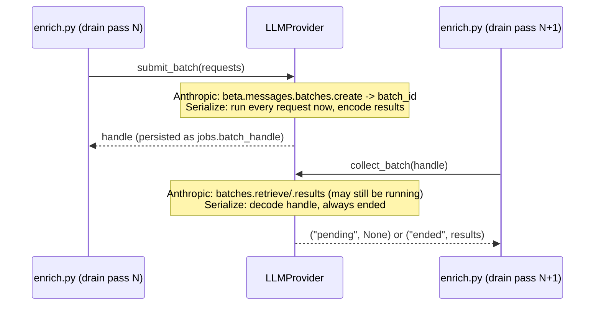

# lode — Stack (decided)

*(§10)* Chosen at founding; rationale where non-obvious. Most choices follow the existing
job-harness ecosystem (Python + Textual + Typer + SQLite) so there's no new framework risk. This
is the storage realization of the ownership boundary and data shape in [storage.md](storage.md).

| Layer | Choice | Notes |
|---|---|---|
| Language | **Python** | Richest LLM/embedding tooling; matches the existing harness |
| Versioning | **setuptools-scm** | The git tag is the version source of truth, no literal to hand-edit — see [release.md](release.md) |
| TUI | **Textual** | Already a proven front-end in the sibling project. Ships with **`textual[syntax]`** as a hard dependency (not an optional extra) for live markdown colouring in the note-body `TextArea`s, pulling in ~15 tree-sitter grammar packages — see [editing.md](editing.md) for the colouring scope (block-level only), the fallback behavior, and the rationale |
| CLI | **Typer** | Repo convention (never argparse). **`is_flag`/`flag_value` tri-state options are non-functional** — typer vendors its own copy of click's argument parser (`typer/_click/`, a module distinct from the real `click` dependency) whose `_get_value_from_state` lacks real click's `_flag_needs_value` fallback. Consequence — verified against this project's installed typer (`0.26.8` at discovery in `lode-l38d.8`, reconfirmed against `0.27.0`), reproduced side by side against real click (which handles both correctly): `typer.Option(is_flag=False, flag_value=...)` errors on a bare trailing option (`Option '--file' requires an argument`), and when a following token *is* present it is swallowed even if it is itself another flag (`--file --all` parses as `file='--all'`, not two separate flags). Typer's own `flag_value`/`is_flag` docstring independently confirms it: "inherited from Click and supported for compatibility ... not fully functional, and will likely be removed in future versions." **Sanctioned alternative: split into two fully-supported options** (a bool flag + a `Path` option) rather than one tri-state option — as `lode-l38d.8` landed (`--file`/`--dir`) |
| CLI rendering | **`rich`** | CLI colour + terminal-width rendering (E-UX2, `lode-l38d.1`). Already a hard runtime dependency *in practice* — pulled in transitively by Textual (built on rich, same authors) and Typer — but undeclared, which breaks silently the day either drops it; now declared explicitly in `[project].dependencies`. One shared `Console` in `cli.py`, so colour is decided once per process instead of hand-rolled per command. **No test seam** (no `force_terminal`, no accessor to monkeypatch): colour tickets assert only the negative path; the positive case is verified by eye. **The detection is frozen at import**, not per command — `Console()` reads its TTY check *and* `NO_COLOR` at construction, and at module scope that is import time. Correct for real use (piping replaces stdout before `cli.py` is imported) but it constrains the tests: colour is off under `CliRunner` because *pytest's default capture* already replaced stdout by import time — not because CliRunner's sink is not a TTY — so `pytest -s` from a terminal freezes the decision the other way and leaks ANSI into captured output; and `monkeypatch.setenv("NO_COLOR", …)` after import is read too late to do anything, so that path must be asserted in a **subprocess** carrying `NO_COLOR=1`. Mechanism verified in `lode-l38d.1`. Accepted residual risk: a regression that silently disables colour everywhere still passes the gates (it is user-visible on first use). The shared `Console` carries one shared rich `Theme` (`CLI_THEME`, `lode-l38d.11`), with SEMANTIC style names (`note_id`, `date`, `warn`, `danger`, `ok`, `table.header`) rather than colour literals — split out from `lode-l38d.1` because its four colour/table consumers (`lode-l38d.4`/`.5`/`.6`/`.10`) all depend only on `.1` and so reach the ready frontier together as parallel, non-coordinating producers; deciding the palette once, here, removes the need for them to coordinate it themselves. The palette is declared as a plain dict (`CLI_STYLES`) that the `Theme` is built *from*, because `Theme.__init__` **destroys the declaration** — it copies rich's `DEFAULT_STYLES` (`inherit=True` is the default, and wanted: rich's own `repr.*`/`progress.*`/traceback styles must keep working underneath ours) and `.update()`s ours on top, so a name whose value equals rich's default is indistinguishable on the constructed `Theme` from one never declared. That is not hypothetical: `table.header` deliberately restates rich's own default (`bold`, which rich's `Table` already applies via its default `header_style="table.header"`), declared anyway so the palette has one source of truth for `lode-l38d.4`, which cannot ask. Consequence for tests: assert the palette against `CLI_STYLES`, never against `CLI_THEME.styles` — the latter is merged over ~150 rich defaults and stays green with an entry deleted (found by `lode-l38d.11`'s technical review, whose tests originally did exactly that). **`highlight=False` is hoisted onto the shared `Console` itself** (`lode-re0s`), not left per-call-site: rich's `Console` runs its `ReprHighlighter` over every plain string by default, injecting `repr.*` styles outside `CLI_STYLES` — verified against rich 15.0.0 to shred a rendered date into mismatched bold-cyan/dim/bold-green spans and to recolour numbers/IPs/etc. inside a note's own text. Every consumer wants it off, rich `Table`s never run it regardless, so centralising it has no blast radius; a per-call `highlight=True` still overrides it if ever needed. Same "no public accessor" shape as the rest of this row — pin it via the private `Console._highlight`, not an assertion on rendered output |
| **SQLite store** (one file) | **SQLite** | A single **container** file. Holds the **irreplaceable** rows — owned content (`notes`/`versions`/`externals`/`snapshots`) **and** user curation (`annotations`/`edges` where `source = user`) — *and*, in the same file, rebuildable cache (**FTS5**, `source = ai` rows, `passages`) + operational `jobs`. The partition is by **rows / value, not by file** (see [below](#the-partition-is-by-rows-not-by-file)). Tiny, durable, **backup = copy the file** (a harmless *superset* of the irreplaceable set) |
| **Regenerable cache** | **LanceDB** (vectors) + **networkx** (graph, in-memory) | Disposable, rebuildable from the notes. LanceDB: columnar on-disk embeddings with a real ANN index and metadata filtering (its native hybrid is **unused** — lexical stays in FTS5; fusion is app-side RRF, see [retrieval.md](retrieval.md)). Graph traversal runs in-memory via networkx over the edge rows — no graph server. AI annotation/edge rows live in SQLite alongside the rest. Behind a thin **repository interface**, so the cache engine is swappable (sqlite-vec is the simpler fallback-down) |
| Embeddings | **Local, on-machine** | Open model via fastembed/ONNX (`nomic-ai/nomic-embed-text-v1.5`, **768-dim** — pinned + verified in `lode-txh.6`) — CPU-only, no torch. **Loaded in-process via `fastembed` (a thin wrapper over `onnxruntime` + tokenizers) — there is no model server or daemon; this is *not* Ollama.** The reranker and faithfulness-NLI models below run the same way, in the same process. **Chosen specifically to honor [privacy](externals.md#privacy-consequence-of-aggregation)**: note/email/ticket content is never sent off-box *for indexing*. The resulting vectors land in LanceDB. Accepts slightly lower retrieval quality + a bundled model file (~100–500MB) in exchange |
| Reranker | **Local cross-encoder** (`BAAI/bge-reranker-base`) | First-class retrieval stage ([retrieval.md](retrieval.md)), wired in v1 behind a toggle. Runs on the **same ONNX runtime** as embeddings via `fastembed` — no new stack, content stays on-box. (`fastembed` does not ship `bge-reranker-v2-m3`; `bge-reranker-base` is the loadable bge-family pick — verified in `lode-txh.6`.) Biggest single quality lever for cited Q&A; model/threshold tuning deferred until there's a corpus ([decisions.md](decisions.md)) |
| Faithfulness NLI | **Local cross-encoder repurposed** (`BAAI/bge-reranker-base` via `fastembed`'s `TextCrossEncoder`) | Entailment leg of the [faithfulness gate](retrieval.md#faithfulness-verify-citations-dont-just-require-them): scores whether cited spans jointly entail a synthesized claim, so multi-note synthesis is answered rather than refused. `fastembed` ships **no** dedicated NLI model, so the cross-encoder is repurposed as the entailment scorer — same **ONNX runtime**, on-box, no separate loader (verified in `lode-txh.6`). Ships in v1 **conservative and fail-closed**; the model + acceptance **threshold ship untuned** and are revisited against the eval harness ([decisions.md](decisions.md)) |
| Enrichment LLM | **Claude Haiku 4.5** (`claude-haiku-4-5`, $1/$5 per Mtok) | High-volume background tagging/extraction. Use **structured outputs** (`output_config.format` + Pydantic) so the derived layer gets validated JSON. A **fresh note enriches interactively** (one immediate call) for promptness; **bulk / backfill / re-enrichment** goes through the **Batches API** (50% off, non-interactive). Driven by the durable [work queue](storage.md#the-async-work-queue); submitted batch handles are persisted so a restart resumes rather than resubmits. **`no_egress` notes are skipped** (never enriched); every send is redacted-before-egress and recorded in the [egress log](externals.md#privacy-consequence-of-aggregation) |
| Q&A LLM | **Claude Sonnet 4.6** default (`claude-sonnet-4-6`, $3/$15); **Opus 4.8** (`claude-opus-4-8`, $5/$25) as a "think harder" toggle | Low-volume, interactive, quality-sensitive synthesis. Returns **structured claims**, each pinned to a verbatim span of a specific version; a [faithfulness gate](retrieval.md#faithfulness-verify-citations-dont-just-require-them) verifies the evidence and abstains rather than emit an unsupported claim — citations are enforced by *verification*, not just by the response schema. **`no_egress` passages are excluded from the cloud context** (cited as "withheld from synthesis"); the context sent is redacted-before-egress and recorded in the [egress log](externals.md#privacy-consequence-of-aggregation) |
| Web-fetch HTTP client | **`httpx`** | First connector (E12 web draw-down, `lode-w0h.1`) — synchronous GET with an explicit `follow_redirects`/`max_redirects` cap and a typed exception hierarchy (`TooManyRedirects`/`TimeoutException`/`NetworkError`) that maps onto the fetch-outcome taxonomy ([externals.md](externals.md#draw-down-rules)). Chosen over `requests` purely on maintenance status — `requests` is in long-term maintenance mode, httpx is the actively developed equivalent with the same sync call shape (both have a redirect cap and typed exceptions; that pair differentiates only against stdlib). Chosen over stdlib `urllib.request` because its redirect cap is a hardcoded `HTTPRedirectHandler.max_redirections = 10`, not a per-request knob, so the `fetch_max_redirects` setting could not be honored without subclassing |
| Web-fetch readability extraction | **`trafilatura`** | Same ticket. Named directly in the fetch-outcome decision: `extract()` returns `str \| None`, and `None` on failed/empty extraction *is* the taxonomy's testable "not real content" signal, combined with a configured length floor for short-but-non-`None` teasers (paywalls). Verified locally against synthetic JS-shell/paywall/article fixtures during the build. Chosen over `readability-lxml` (stale, weaker boilerplate removal) and `boilerpy3` (thinner API) |

---

## Why a split store

*(decided after evaluating a unified Oracle AI Database 26ai, plus SQLite+sqlite-vec, SurrealDB,
FalkorDB, Neo4j, Postgres+pgvector+AGE)*

The ownership boundary ([storage.md](storage.md#the-ownership-boundary)) already partitions the data
by *value*, so the storage follows it. The irreplaceable set is **tiny and structurally trivial**
but must be durable and trivial to back up — SQLite is the ideal fit (one file, atomic,
restore-anywhere). The cache is **heavy but disposable**, so it optimizes for *retrieval quality and
feature fit*, not durability — which frees the pick to the best embedded tools (LanceDB + networkx)
with no server, licensing, or unpatched-security risk. (Not *all* cache leaves SQLite: FTS5, the
`source = ai` rows, and `passages` co-reside there for transactional and FTS-next-to-`versions`
reasons — so the boundary is by **value / rows, not strictly by engine**; see
[the partition is by rows](#the-partition-is-by-rows-not-by-file).)

A single unified engine (the original Oracle 26ai choice) was rejected because it inverted that
match: it put the **heaviest, least-durability-critical machinery under the most sensitive data**.
Oracle Free is unsupported/unpatched (security included) on a box aggregating email + tickets + repo
contents; it makes backup a full-DB dump instead of a file copy; and it front-loads the heaviest
yak-shaving onto an MVP (build step 1, [design.md](design.md) §7) that needs none of its
differentiators (the note↔note graph fits in memory; entity extraction is Claude's job — with
provenance — not a DB black box).

---

## The derived layer is not uniformly disposable

Three rebuildable tiers, plus one non-regenerable exception that belongs with the irreplaceable set:

| Derived item | Rebuilt by | Regeneration cost |
|---|---|---|
| Embeddings | Local CPU model over head nodes | **Cheap** — minutes for thousands of notes, tens of minutes for ~100k. No dollars, no network. |
| Lexical (FTS5) + explicit edges | Deterministic re-parse | **Trivial** — pure computation, no model. |
| AI annotations + inferred edges | Claude Haiku via the Batches API | **Real $ + hours** — ~tens of dollars per ~10k notes, non-interactive. Not prohibitive, but not free. |
| **User curation** (`source = user`) | — (not derived from anything) | **Not regenerable.** A fixed tag, a confirmed or deleted link — genuine user decisions. Stored with the irreplaceable set in SQLite. |

So "drop the derived layer and lose nothing" holds only for the first three tiers; user curation is
irreplaceable.

---

## The partition is by rows, not by file

The value boundary (§3, irreplaceable vs regenerable) and the engine boundary (SQLite vs
LanceDB/networkx) do **not** coincide. The SQLite file is a *container* that holds irreplaceable
rows **and** rebuildable cache (FTS5, `source = ai` rows, `passages`) **and** operational `jobs`.
So the partition is **by rows / value, not by file** — and the docs say so rather than implying the
file equals the irreplaceable set.

It stays a **single file** (not split into `core.db` + `cache.db`) for three concrete reasons:

- **Atomic enqueue.** "Write version row + enqueue its derive jobs" must be one transaction
  ([storage.md](storage.md#the-async-work-queue)); across two attached DBs in WAL mode commit is
  **not** atomic, which would break that invariant.
- **FTS5 sits next to `versions`.** An external-content FTS5 index references `versions.body` to
  avoid duplicating text; that reference doesn't cross database files cleanly.
- **Nuking the cache needs no file boundary** — it's a `DROP`/`DELETE` of the cache tables within
  the one file, not a file deletion.

**Backup, stated honestly:**

- **`cp lode.db` is the default** — a *superset* backup: it includes rebuildable cache (harmless
  extra bytes you could have regenerated). Trivial and always correct.
- **A minimal / archival irreplaceable-only dump** is a *row-level* export (owned tables +
  `source = user` rows); restore rebuilds the cache via the reconciliation scan
  ([storage.md](storage.md#the-async-work-queue)) + re-embed/re-enrich. Deferred — the superset copy
  is correct and free; the minimal export is an optimization ([decisions.md](decisions.md)).
- **Restore is robustly sloppy.** A restored file may carry *stale* cache (AI rows from an old
  `prompt_ver`, FTS rows, a dangling `batch_handle`); all of it is absorbed by structural staleness
  + reconciliation, so a superset restore is safe.

---

## Dependency locking (lode-g2741)

Two files, two jobs — **never pin the same thing in both**:

- **`pyproject.toml` is the INTENT layer.** Ranges and floors, not exact versions. A real lower
  (or upper) bound appears here only where a version demonstrably matters — e.g. `trafilatura
  >=2.1,<2.2`, bounded so the lock below always resolves 2.1.0, the version `lode-g274.3`'s
  characterization fixtures assert extraction behavior against. Moving off 2.1.0 is a deliberate
  act: bump the ceiling and re-baseline `lode-g274.3` first, not an incidental side effect of an
  unrelated dependency bump.
- **`requirements.lock` is the ONLY place exact versions live.** A committed, fully-transitive,
  hash-verified (`uv pip compile --generate-hashes`) lock of the **runtime** dependency set only —
  the `dev` extra is deliberately *not* locked (epic `lode-g274` OQ#1: dev-tool drift is not this
  lock's job; the gates themselves, run at HEAD, are the backstop for that). Regenerated only via
  `uv pip compile` (`scripts/update-deps.sh`, `lode-g274.2`, once it lands) — never hand-edited;
  the hashes make hand-editing impractical anyway.

`./scripts/python-init.sh` installs from the lock by default, with `--require-hashes` so a hash
mismatch **fails** the install rather than warning. `-e .` (the local package, editable) and
`--require-hashes` are mutually exclusive in one pip/uv invocation, so the install is three steps:
hash-verified runtime deps from the lock, then the local package editable (`--no-deps`, so this
step can't silently re-resolve — and un-pin — what step one just hash-verified), then the `dev`
extra resolved fresh from `pyproject.toml`. `--unlocked` skips the lock and resolves everything
fresh from `pyproject.toml` instead — the deliberate "what would we get today" escape hatch for
regenerating the lock or probing an upstream bump before committing to it.

**CI enforcement (`lode-g274.6`):** `tests.yml`'s `tests` job installs from `requirements.lock`
itself (via `scripts/python-init.sh`, the same install path a developer runs), and a separate,
independent `lock-currency` job in the same workflow verifies the lock is current — it recompiles
`pyproject.toml` with `uv pip compile … -o requirements.lock`, run **in place** against the
just-checked-out committed lock. uv feeds an existing output file's own pins back to the resolver
as its *preference* set by default (only `--upgrade`/`-U` ignores them), so the resolution only
moves when a `pyproject.toml` constraint forces it — an upstream release alone reproduces the
committed lock byte-for-byte, and `git diff --exit-code requirements.lock` catches any real drift.
`build.yml` and `coverage.yml` are unaffected: `build.yml` never installs lode's runtime deps at
all (`python -m build` resolves in its own isolated env), and `coverage.yml` is report-only
(`lode-qxdn.3`, no merge-gate status).

The cache is never *required* in a backup — losing it costs a rebuild, never data. Optionally
snapshot just the LLM tier of the cache to skip the dollars + hours of re-enrichment on restore
([decisions.md](decisions.md)) — an optimization, not a correctness need.

**Keep the cache behind a repository interface.** The [data shape](storage.md#data-shape-sketch) is
engine-agnostic; the access layer hides the cache engine so LanceDB can be swapped (sqlite-vec is
the simpler fallback-down) without touching the core.

**Embeddings reality check:** Anthropic has **no first-party embeddings API**, so embeddings was
always going to be a separate runtime decision regardless of using Claude for the LLM work. Going
local resolves it in favor of the privacy principle; LanceDB just stores the resulting vectors.

**Auth:** no hardcoded `ANTHROPIC_API_KEY`. Resolve via the SDK chain (env var, then an
`ant auth login` profile, then workload-identity federation), same as the harness. If that resolves
nothing, fail gracefully with an actionable message (no traceback) and log the detail.

**Model-tier split mirrors the harness:** cheap/deterministic high-volume work on Haiku;
judgment-sensitive synthesis on Sonnet/Opus.

---

## LLM provider seam (decided, lode-568v.1)

`lode-568v` (epic: support LLM vendors outside Anthropic — OpenAI via Azure) needs a vendor-neutral
seam over the three cloud-LLM call surfaces before any provider code lands. This section is that
seam, pinned design-first so `lode-568v.2` (Anthropic behind the seam, zero behavior change) and
`lode-568v.3` (OpenAI-via-Azure behind the seam) build against one decided contract rather than
inventing it under implementation pressure. **LLM only** — embeddings/reranker/NLI stay local-only
and untouched (epic scope, decided 2026-07-22).

### Module home, and Protocol vs ABC

The seam lives in a **new module, `src/lode/llm_provider.py`** — not folded into `src/lode/auth.py`.
`auth.py`'s own docstring already treats staying cheap to import as load-bearing (`lode-4q97`):
`import anthropic` is deferred inside `build_client()` because most callers (e.g.
`lode.worker.drain`, unconditionally) import the module only to *catch* `AuthError`, on paths that
may never touch Anthropic at all. A seam that can construct **either** vendor's SDK client behind
one factory has strictly more reason to keep that import discipline, and a fresh module keeps it
from being re-litigated every time a provider is added. `auth.py`'s exact fate (kept as an internal
credential-resolution helper the `AnthropicProvider` calls into, vs. absorbed wholesale) is left to
`lode-568v.2` — an implementation detail, not a contract question.

**Protocol, not ABC** — matching this repo's existing precedent for exactly this shape of seam: the
`Embedder` Protocol (`src/lode/embedding.py`), cited directly in the epic body as the model for any
future vendor-neutral abstraction ("independent of this epic … the existing `Embedder` Protocol").
Structural typing needs no shared base class, and every current + hypothetical future provider
already satisfies the same shape without inheriting anything, the same way `FastEmbedEmbedder` does
today.

### 1. Client + credential/routing construction

Replaces `auth.build_client()`, which today constructs a bare `anthropic.Anthropic()` from the SDK's
own credential chain with no routing insertion point at all:

```python
def build_provider(settings: Settings) -> LLMProvider:
    """Resolve credentials + routing for settings.llm_provider; return its LLMProvider.

    Raises LLMAuthError (provider-appropriate message) when nothing resolves.
    """
```

- `settings.llm_provider == "anthropic"` → resolves via the same SDK credential chain
  `build_client()` uses today (env var / `ant auth login` profile / workload-identity federation),
  returns an `AnthropicProvider`.
- `settings.llm_provider == "openai"` → resolves `OPENAI_API_KEY`, or — when
  `settings.azure_openai_endpoint` is non-empty — `AZURE_OPENAI_API_KEY` plus the endpoint/
  api-version routing knobs (§6 below); returns an `OpenAIProvider` (`lode-568v.3`'s implementation).
  Azure-vs-direct-OpenAI is a routing detail *under* this one value, never a second provider value
  (epic's resolved decision, 2026-07-22).
- Failure is `LLMAuthError` (below), its message naming the *correct* env var(s) for whichever
  provider is active — generalizing today's Anthropic-worded `MISSING_CREDENTIALS_MESSAGE`.
  **`lode-568v.2` implementation note:** the Anthropic branch does NOT wrap `build_client()`'s
  `AuthError` into `LLMAuthError` — `AuthError` propagates unchanged, preserving `worker.py`'s
  extensively-tested `lode-9yy` permanent-failure handling byte-for-byte. `LLMAuthError` is reserved
  for a future non-Anthropic provider's own credential failures. Full rationale and the tracked
  follow-up: `decisions.md` (`lode-568v.2`).

### 2 & 3. The two immediate structured-output calls — one seam method

`enrich._call_haiku()` (forced tool-use: `tools=[…]`, `tool_choice={"type": "tool", "name": …}`,
reads `content` block `type == "tool_use"`) and `qa._request_claims()` (`messages.parse(...,
output_format=...)`, reads `response.parsed_output`) take **identical inputs** once named generically
— a model, a system prompt, a user prompt, an output Pydantic schema, a token cap, a timeout. There
is no principled reason to keep them as two seam methods; the epic's own work-surface-4 language
("response-shape differences must be normalized at the seam") is exactly this. One generic method:

```python
def structured_call(
    self,
    *,
    model: str,
    reasoning_effort: str | None,
    system: str,
    user_prompt: str,
    output_schema: type[BaseModelT],
    max_tokens: int,
    timeout_s: float,
    tool_name: str | None = None,
    tool_description: str | None = None,
) -> BaseModelT: ...
```

`tool_description` is a `lode-568v.2` addition beyond this ticket's original pin — required for
`AnthropicProvider`'s forced tool-use branch to send the *exact* tool description text `_call_haiku()`
sent pre-seam (byte-for-byte wire equivalence is `lode-568v.2`'s own acceptance bar, and this pin had
no way to carry it). See `decisions.md` (`lode-568v.2`) for the full rationale.

**`AnthropicProvider` maps onto today's exact calls with zero behavior change (the decision this
ticket's acceptance criteria names explicitly) via `tool_name`, not by unifying the underlying wire
mechanism** — asserting that `messages.parse` and forced tool-use are wire-equivalent isn't a claim
this docs-only ticket can verify, and `lode-568v.2`'s own acceptance bar is "byte-for-byte
equivalent." So the two existing mechanisms stay literally distinct, selected by whether the caller
passes `tool_name`:

- **Enrichment** passes `tool_name=_TOOL_NAME` → `AnthropicProvider` forces tool-use exactly as
  `_call_haiku()` does today (same `tools=[…]`, same `tool_choice`, same `tool_use` block read).
- **Q&A** passes no `tool_name` (`None`) → `AnthropicProvider` calls `messages.parse(output_format=
  output_schema)` exactly as `_request_claims()` does today.

`reasoning_effort` is meaningful only under a reasoning-capable OpenAI/Azure deployment (§6);
`AnthropicProvider` ignores it (Anthropic has no such axis). `OpenAIProvider` (`lode-568v.3`) has a
single wire mechanism for structured output — the Responses API's `text.format`/json_schema (see the
Azure/OpenAI routing note below) — so it can honor or ignore `tool_name` as it sees fit; the param is
Anthropic-mechanism-selecting, not a cross-provider requirement.

**`lode-568v.2` note:** `timeout_s` is now threaded into *every* `structured_call` — including Q&A's,
which pre-seam passed no client-side timeout to `messages.parse` at all (only the enrichment/batch
calls read `anthropic_call_timeout_s`). This is the intended effect of unifying the seam ("every LLM
call, immediate and batch alike" — §6 below), not an accidental behavior change: Q&A now gets the same
hung-call protection enrichment already had, bounded by the same (renamed) knob.

### 4. The two-phase batch contract (the trap — pinned precisely)

Anthropic's Batches path (`submit_enrich_batch` / `collect_enrich_batch`) is deliberately
**two-phase across drain passes**: submit persists `batch_handle` on the job rows (survives a
restart, `lode-i05.5`) and collect reaps on a *later* pass, so the drain keeps working while the
batch cooks. A blocking `run_batch(requests) -> results` contract would regress Anthropic (the drain
would block on it). The seam stays two-phase, and `enrich.py` keeps **all** job-row / `egress_log` /
DB bookkeeping — the provider only implements "run this set of requests":

```python
@dataclass(frozen=True)
class BatchRequest:
    custom_id: str                      # version_id/snapshot_id, mirrors today's custom_id mapping
    model: str
    reasoning_effort: str | None
    system: str
    user_prompt: str
    output_schema: type[BaseModel]
    max_tokens: int
    tool_name: str | None = None
    tool_description: str | None = None  # lode-568v.2 addition, see structured_call above

@dataclass(frozen=True)
class BatchResult:
    custom_id: str
    outcome: Literal["succeeded", "errored", "expired", "canceled"]
    parsed: BaseModel | None          # set iff outcome == "succeeded" -- the provider's RAW
                                       # decoded wire payload (a pydantic.RootModel[dict]), NEVER
                                       # a schema-validated domain object; the caller validates it
                                       # against whatever output_schema it submitted (lode-568v.2,
                                       # decisions.md -- keeps the provider generic and preserves
                                       # lode-i05.5 restart durability with no schema info needing
                                       # to survive in the persisted batch_handle)
    error: LLMProviderError | None    # set iff outcome != "succeeded"

class LLMProvider(Protocol):
    def submit_batch(self, requests: Sequence[BatchRequest], *, timeout_s: float) -> str:
        """Submit; return an opaque, PERSISTABLE handle string (stored as batch_handle)."""
        ...

    def collect_batch(
        self, handle: str, *, timeout_s: float
    ) -> tuple[Literal["pending"], None] | tuple[Literal["ended"], list[BatchResult]]:
        """Poll `handle`; ("pending", None) or ("ended", <results, one per request>)."""
        ...
```

- **`AnthropicProvider`**: `submit_batch` calls `client.beta.messages.batches.create(...)`, returns
  `batch.id` as the handle — identical to `submit_enrich_batch` today. `collect_batch` calls
  `batches.retrieve` + `.results` when ended — identical to `collect_enrich_batch` today.
- **A provider without a batch API (OpenAI/Azure, `lode-568v.3`) satisfies the contract
  degenerately: `submit_batch` runs every request through `structured_call()` synchronously, right
  there** (the epic's own sanctioned "serialize as sequential immediate calls" behavior — a
  long-running `submit_batch` call is the accepted cost, not a bug), **and returns a handle that
  self-encodes the already-computed `BatchResult`s** (e.g. a JSON blob) rather than a server-side
  batch id — there is no such thing to reference. `collect_batch` then just decodes its own handle
  and returns `("ended", …)` immediately; no network call, no actual polling. The caller (`enrich.py`)
  neither knows nor cares which strategy produced the handle — exactly the epic's "the caller asks
  the provider to run the batch and does not know or care which strategy it used."



### 5. Provenance capture point

A **new, nullable `annotations.provider TEXT` column** (alongside the existing `model TEXT`,
`schema.sql`) — not a composite string encoded into `model`. `annotations.model` keeps recording
exactly what it does today (the bare model/deployment string, unchanged in meaning and format);
`provider` records the short id each `LLMProvider` implementation exposes (`"anthropic"` /
`"openai"`). `NULL` on existing rows means "anthropic" by convention — the only provider that ever
wrote a row before this epic — so no backfill is required, matching the existing
"no separate manifest, aggregate read" provenance pattern
([configuration.md](configuration.md#model-provenance-the-enrichment-llm-decided-lode-g2745)). Same
treatment for **`egress_log`**: a new nullable `provider TEXT` column, populated by `log_egress()`
call sites going forward — the audit trail's whole point is "content left the box," and which vendor
it went to is part of that fact, not less so than for `annotations`. Schema migration + the
`_write_enrichment`/`log_egress` write-path changes are `lode-568v.4`'s scope, not this ticket's.

**Known consequence, scoped elsewhere:** `lode-o9k3`'s staleness comparison
(`_enrichment_model_stale` / `_STALE_ENRICHMENT_LIVE_HEADS_SQL`) currently compares stored `model`
against `settings.enrichment_llm` only; once `provider` is a real per-row fact, a provider switch
with an unchanged model *string* would not otherwise be caught. That read-side update is
`lode-568v.6`'s scope, already split out and tracked — not addressed here.

### 6. Config shape

**One whole-app provider selector** (resolved decision, 2026-07-22): setting a provider sets it for
*every* cloud-LLM surface; there is no per-surface vendor axis.

- `llm_provider: str = "anthropic"` (`Kind.RUNTIME`) — `"anthropic"` | `"openai"`.
- `azure_openai_endpoint: str = ""` (`Kind.RUNTIME`) — e.g.
  `https://{resource}.openai.azure.com/openai`. Empty means direct OpenAI (or a non-`"openai"`
  provider); its presence is what distinguishes Azure routing from direct OpenAI *under* the one
  `"openai"` provider value, not a second vendor axis.
- `azure_openai_api_version: str = ""` (`Kind.RUNTIME`) — passed as a **query param on every
  request** (verified against a working Azure config, see this ticket's notes), e.g.
  `2025-04-01-preview`, not a header. Required when `azure_openai_endpoint` is set.
- Keys stay **env/SDK-only, never in config.toml** — `ANTHROPIC_API_KEY`/`ANTHROPIC_AUTH_TOKEN`
  (unchanged) for Anthropic, `OPENAI_API_KEY` / `AZURE_OPENAI_API_KEY` for OpenAI/Azure — mirrors
  lode's existing keys-never-in-config invariant with no change needed to port it to Azure.

**Per-surface tier becomes a `(model, reasoning_effort)` pair, not a bare string** — resolving the
crux this ticket's acceptance criteria names explicitly. `enrichment_llm` / `qa_llm` /
`qa_think_harder_llm` stay as three *separate* knobs (unchanged in count and meaning — each still
selects a tier *within* the active provider), but each is now typed as a small `ModelTier` value:

```python
class ModelTier(BaseModel):
    model: str                       # Anthropic model id, or an Azure/OpenAI deployment name
    reasoning_effort: str | None = None   # meaningful only under a reasoning-capable deployment
```

A bare TOML string (every existing `config.toml` today, e.g. `enrichment_llm = "claude-haiku-4-5"`)
coerces to `ModelTier(model=<string>)` — back-compat, no migration required for existing configs; an
inline table (`qa_think_harder_llm = { model = "gpt-5.5", reasoning_effort = "high" }`) sets both
fields explicitly. This directly answers the challenge's three-way crux ("does 'think harder' select
a different deployment, a different effort on one deployment, or both?") with **no new abstraction
beyond upgrading each existing knob's type** — since `qa_llm` and `qa_think_harder_llm` are already
two independent `ModelTier` values, a config can set `model` the same on both and vary only
`reasoning_effort` (effort bump on one deployment), vary only `model` (deployment swap, today's
existing Sonnet→Opus behavior — the historical case, preserved as-is), or vary both.

**`anthropic_call_timeout_s` renamed vendor-neutral: `llm_call_timeout_s`, with a back-compat
alias** — the second item this ticket's acceptance criteria names explicitly (the Anthropic-named
knob would otherwise govern the OpenAI/Azure provider too, `config.py:285`). Same default (120.0s),
same meaning (per-call client-side timeout passed to every LLM call, immediate and batch alike).
Back-compat mechanism: `load_settings()` already massages the raw `config.toml` dict before
constructing `Settings` (dropping `None`-valued overrides, `config.py`) — the same spot gains one
more rename: a `config.toml` still carrying the old key is mapped onto the new one
(`file_values.setdefault("llm_call_timeout_s", file_values.pop("anthropic_call_timeout_s", …))`-shape
logic) before validation, so an un-migrated config file keeps working rather than tripping
`extra="forbid"`. Exact implementation is `lode-568v.2`'s.

### Error contract — diagnosability over genericness

A provider's failure paths must surface enough to diagnose remotely, not collapse into one generic
lode error — the two residual structural risks doc-reading alone can't close (Azure api-version
skew, Azure content-filtering) are only observable in a real Azure environment, where logs are the
only diagnostic surface this repo can't reproduce locally (challenge addendum, 2026-07-22):

```python
class LLMProviderError(RuntimeError):
    """A provider call failure. Carries enough to diagnose remotely; chains onto
    the underlying SDK exception via __cause__."""
    provider: str
    status_code: int | None
    request_id: str | None

class LLMAuthError(LLMProviderError):
    """No credentials resolved for the active provider — raised by build_provider()."""
```

Every `LLMProvider` implementation's failure paths raise `LLMProviderError` (or a subclass) rather
than letting a raw SDK exception escape uncaught, so callers (`enrich.py`/`qa.py`'s existing
retry/backoff logic) catch one exception type across providers, while `.status_code`/`.request_id` +
the chained `__cause__` still expose whatever the underlying SDK/HTTP response carried. This
generalizes today's credential-only "provider-appropriate error messaging" (§1) to *runtime* call
failures too. The concrete OpenAI/Azure field-by-field mapping (which response fields populate
`status_code`/`request_id` for a Responses API error, an Azure content-filter rejection, etc.) is
`lode-568v.3`'s scope — only the shape is pinned here.

### Implemented: `OpenAIProvider` (`lode-568v.3`)

`src/lode/llm_provider.py::OpenAIProvider` is the second `LLMProvider` implementation, resolved by
`build_provider` when `settings.llm_provider == "openai"`. It fills in the details this section left
open:

- **One wire mechanism regardless of `tool_name`**: the Responses API's `text.format` `json_schema`
  (`client.responses.create(model=, instructions=<system>, input=<user_prompt>, max_output_tokens=,
  text={"format": {...}}, reasoning={"effort": ...} if reasoning_effort else omitted, timeout=)`).
  `tool_name` (when given, e.g. by the enrichment surface) becomes the schema's `name` field;
  `tool_description` becomes its `description` field. Confirmed against the installed `openai==2.47.0`
  SDK's actual `responses.create` signature and `Response`/`IncompleteDetails`/`ResponseOutputRefusal`
  field shapes (not merely assumed from memory) — see the module docstring and `decisions.md`
  (`lode-568v.3`) for what was and wasn't independently verifiable this way.
- **`strict` is deliberately `False`**, not `True`. OpenAI's strict Structured Outputs mode requires
  every object in the schema to set `additionalProperties: false` and list every property as
  `required` (optional fields modeled as nullable) — a transformation `pydantic`'s
  `model_json_schema()` does not perform. Asserting strict-mode compliance without that transform
  would be exactly the wire-shape assumption the epic's challenge review flagged as highest-risk.
  `OpenAIProvider.structured_call` validates the returned JSON against `output_schema` via
  `model_validate` regardless — the real conformance check either way.
- **Credential resolution**: `OPENAI_API_KEY` (direct OpenAI) or, when `azure_openai_endpoint` is
  set, `AZURE_OPENAI_API_KEY` + the endpoint/api-version knobs (§6). Unlike `AnthropicProvider`'s
  branch, a missing credential here raises `LLMAuthError` for real — there was no pre-existing
  exception type to preserve for a provider that didn't exist before this ticket. This required
  widening `lode.worker`'s three `except AuthError` sites to `except (AuthError, LLMAuthError)` so a
  missing OpenAI/Azure credential gets the same permanent (no retry, no dead-letter) treatment
  `lode-9yy` already gives a missing Anthropic credential — the follow-up `lode-568v.2`'s
  implementation notes tracked.
- **Batch = serialize, exactly as pinned above**: `submit_batch` runs every request through the same
  Responses-API call synchronously and self-encodes the computed `BatchResult`s as a JSON blob string
  (the handle); `collect_batch` decodes it with no network call, always `("ended", …)`.
- **Diagnosability**: every failure path (a raised SDK exception, a non-`"completed"` response status,
  a Structured Outputs refusal, unparseable/schema-mismatched JSON) logs the model/endpoint/api-version
  in play plus the raw provider payload — including an Azure `innererror.content_filter_result` when
  present in an error body — before raising, per the challenge addendum above.
- **Acceptance is mock-only** (named risk, `decisions.md` `lode-568v.3`): no live Azure/OpenAI endpoint
  was available to verify the Responses API's actual runtime behavior end-to-end (only its installed
  SDK's *type shapes*, which were checked directly). The diagnostic logging above is the compensating
  control the challenge review asked for — a first real run's failure is diagnosable from logs alone.
