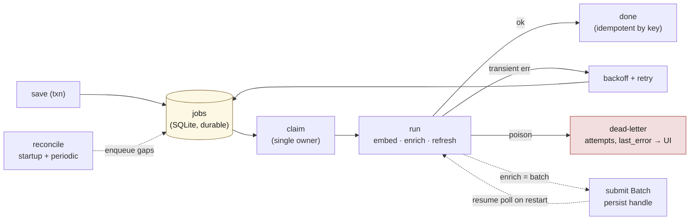

# lode — Storage, invalidation & data shape

Covers the foundational data decisions: the ownership boundary (§3), the event-sourced version
chains (§4), how staleness is detected and migrated (§5), and the concrete data shape (§8). See
[design.md](design.md) for the thesis and [stack.md](stack.md) for how this shape maps onto the
chosen engines.

---

## The ownership boundary

*(§3 — foundational decision)*

**The user does CRUD on notes. The AI never touches note content.** Anything the AI produces
— annotations, links, tags, extracted items, embeddings — lives in a **parallel derived layer**
keyed to the note. User notes are the source of truth; the AI layer is a sidecar that can be
regenerated or thrown away without ever risking the original.

Test of a clean separation: **drop the AI-derived cache — embeddings, AI annotations, inferred
edges — and you lose zero user data; it rebuilds from the notes.**

**One caveat the build must honor:** *user* corrections (`source: user` — a fixed tag, a confirmed
or deleted link) live in the derived layer but are **not** AI output and **not** regenerable —
they're genuine user decisions. So the real partition is not *owned vs derived* but
**irreplaceable** (owned content **+** user curation) **vs regenerable cache** (everything the AI
produced). The irreplaceable set is what must be backed up; the cache is rebuildable
(see [stack.md](stack.md)).

This constraint doesn't simplify the design — it *forces* solving invalidation (below).

---

## Storage model: event-sourced, linear per-note chains

*(§4)*

Notes are stored as an **append-only version chain**. Each mutating operation **at save time**
(create / update / delete — not per keystroke) creates a new **immutable node**.

- **create** → new root node
- **update** → new node parented to the prior version
- **delete** → a tombstone node (soft delete; recovery = repoint the head)

Version ids are content-addressed (`note_id` + `parent` + `body`), so a delete of an unchanged,
recovered note is **idempotent**: re-deleting from the same recovered head reproduces the exact
inputs of the earlier tombstone and repoints the head to that existing row rather than minting a
new one (`versions.delete`, lode-n8q). Editing the body (or deleting from a different parent) still
mints a new tombstone as usual.

This was chosen specifically *because* the AI sidecar is the whole point. It hands us, for free:
immutability **by construction**, precise staleness, deterministic annotation migration, full
provenance, and undo. Without the AI layer this would be over-engineering; with it, it pays.


### Ordering a version chain — never by `created` (lode-t1y)

**The wall clock is not a total order.** `created` (and every other wall-clock column) comes from
SQLite's `strftime('now')`, which reads `CLOCK_REALTIME` — and the OS is free to step that clock
**backward** (NTP correction, or hypervisor catch-up after the guest was descheduled; observed
directly on this host, under load, between two back-to-back `INSERT`s). So a *later* version can
carry an *earlier* `created` than its own parent. That is not a tie a secondary sort key can break —
it is an outright wrong primary order, and `ORDER BY created, rowid` is just as broken as
`ORDER BY created`. **Never sort a version chain by `created`, with or without a tiebreaker.**
`created` is for display and lineage, not for ordering.

The chain's real total order is **insertion order**, and there are exactly two sound ways to read it:

- **`ORDER BY rowid`** — the sanctioned form for a whole-chain sweep, and what `lode.versions.purge`
  uses. `versions` is not `WITHOUT ROWID` (see `schema.sql`), so it has SQLite's implicit rowid, and
  insertion order *is* chain order: a child's `parent_version_id` FK must already exist, so a parent
  is always inserted before its child. It stays correct under any future change to the table, because
  SQLite assigns a new rowid as `max(rowid) + 1` — an inserted row outranks every row still present,
  even if rows are ever deleted (today none are: `purge` overwrites bodies in place). *Caveat:* the
  rowid here is **implicit** (the PK is `version_id TEXT`), and SQLite reserves the right to renumber
  implicit rowids during `VACUUM`. In practice `VACUUM` rewrites rows in rowid order, so *relative*
  order survives, and nothing in lode runs `VACUUM` today — but if a `lode vacuum` ever lands, revisit
  this.
- **Walking `parent_version_id`** root-to-head — use this where the code already holds a
  `version_id → version` map and a sort would be redundant.

The same rule applies to the **jobs queue**, and there it is free: `jobs.id` is `INTEGER PRIMARY KEY`
— a true rowid alias — so `ORDER BY id` is insertion order by construction. `lode.worker`'s claim and
batch-submit queries use it. Never order the queue by `created` either.

### Two graphs — do not conflate them

- **Version lineage** — per-note history. With the decisions below, this is a **linear chain**,
  not a branching DAG.
- **The knowledge graph** — links *between* notes (and later, external resources). This is the
  valuable graph and the actual product. It lives in [externals.md](externals.md).

### Single-user, single-instance: linear chains, no merge

**Decision: single person, single instance, no sync.** This is a **scope boundary**, not a runtime
invariant: it says we will never build the only genuinely hard distributed problem (CRDT / merge
conflict resolution), because the branches that need merging only arise from concurrent edits across
synced devices. We are explicitly not doing that.

The version "graph" is therefore a **linear chain per note**. Two separate mechanisms keep it linear
— and the doc should lean on the mechanisms, not on the "single instance" assertion:

- **Branch prevention = head compare-and-swap (CAS).** Every save parents the current head and is
  **rejected if the head moved since the editor loaded it.** This is the load-bearing guard and it
  holds *regardless of process count* — including two editor panes on the same note inside one
  running app. Correctness here comes from the CAS (plus SQLite serializing writes), not from there
  being one process.
- **Single-instance = a startup advisory lock** (lockfile/PID beside the DB; refuse to start if
  held, pointing at the running PID). This is **not** needed for data integrity — CAS + SQLite cover
  that — but the **async workers (see [design.md](design.md) save path) need a single owner**: two
  instances would run duplicate, racing enrichment + embedding loops and double-spend on the
  enrichment LLM's batch calls. That, not corruption, is why we enforce one instance.

Do not pay for merge semantics we will never use.

#### What the user sees when CAS rejects a save

Scoping out *merge* is not the same as ignoring *conflict* — the CAS above can reject a save (two
editor panes on one note, or an edit made while a slow save was in flight), and the design must say
what happens then. It is **manual reconciliation, never auto-merge and never clobber**:

- The save is refused with **"this note changed since you opened it."**
- The user is shown a **diff of their buffer against the new head**, and chooses to **re-apply**
  (their edit re-parented onto the new head as the next version) or **discard**.
- The **rejected buffer is preserved as a draft** until they resolve it, so an unlucky CAS loss
  never costs the unsaved work.

**Where the split falls (decided).** The *storage* layer's contract stops at the honest CAS reject
plus the **buffer-preserving structured conflict** it hands back — the rejected buffer alongside the
new head (version id + body) for the diff — and it persists nothing itself. *Persisting* that buffer
as a durable draft is the **consumer's** job: the `lode add` CLI already writes a `*.draft` beside
the DB, and the TUI (E11) owns the interactive re-apply/discard store. A dedicated `drafts`
table/mechanism is **deferred** until the system is exercised in production.

This keeps the chain linear (the resolved save parents the *current* head) without any merge
machinery — the conflict is surfaced honestly and resolved by the one person who can.

### Identity vs version

Two distinct ids:

- `note_id` — the **logical** note, stable across its whole lineage.
- `version_id` — the immutable node; `version_id` = **`H(len(note_id)‖note_id ‖ len(parent)‖parent ‖ len(body)‖body)`**
  (git's model). Folding in `note_id` makes cross-note collisions impossible (two different notes
  both containing `"TODO"` would otherwise alias); folding in the parent keeps each chain position
  distinct even on a revert to an earlier body (otherwise the reverted node aliases the original and
  `parent_version_id` becomes ambiguous).
- **head pointer**: `note_id → current version_id`.

**Framing is length-prefixed, not bare concatenation.** A plain `note_id ‖ parent ‖ body` has
ambiguous field boundaries — `H("a","bc") == H("ab","c")` — a latent aliasing bug in a
content-addressed store. The **frozen encoding** length-prefixes *every* field: each field is its
UTF-8 bytes preceded by an **8-byte big-endian unsigned length**, and the framed fields are
concatenated in order — `framed(note_id) ‖ framed(parent) ‖ framed(body)` for `version_id`, and
`framed(external_id) ‖ framed(body)` for `snapshot_id`. A root `create` has no parent: the empty
string, framed as an 8-byte zero length followed by no bytes. `H` returns a lowercase hex digest.
(A hash-of-sub-hashes form `H(H(note_id) ‖ H(parent) ‖ H(body))` is *also* unambiguous, but it hashes
to a **different** value, so it is not interchangeable; the length-prefixed form above is the one
canonical encoding.) This is implemented once in `lode.hashing.content_version_id` /
`content_snapshot_id` — the single source of truth that the version-save path and the eval seed
fixture both import, so no two callers can frame ids differently. The `blake2b-128` fallback frames
identically, so it produces the same ids as `xxh3-128` would for the same encoding choice.

**`H` is a fast *non-cryptographic* hash (e.g. xxh3-128), not SHA/BLAKE.** Content addressing here
needs only **low accidental-collision probability**, not adversarial collision resistance: lode is
**single-user, single-instance, no sync** ([above](#single-user-single-instance-linear-chains-no-merge)),
so there is no untrusted party who could craft a colliding body, and the store is never reconciled
against a copy held by someone else. 128 bits keeps accidental collisions negligible at personal-KB
scale while costing far less than a crypto hash. (`H` is a build constant, not a runtime knob — see
[configuration.md](configuration.md); changing it re-keys every node, so pick once. blake2b-128 from
the Python stdlib is the zero-dependency fallback if avoiding the `xxhash` dep is preferred.)

**Dedup of no-op saves is an explicit guard, not hash luck:** before writing, compare the proposed
body to the *head's* body; if equal, return the head and write nothing. (With the parent-inclusive
hash a re-save parents the current head, so it would *not* auto-collide — the dedup has to be an
explicit check.)

Store **full content snapshot per save** (notes are small; do not prematurely delta-compress).
History grows forever — fine for years of personal notes. A compaction/squash policy can come
much later; the no-op-save guard above keeps the chain from growing on saves that change nothing.

---

## Invalidation: the problem the ownership boundary forces

*(§5)*

Because CRUD includes **update**, and AI may not fix the note to match, the derived layer must
*know* when it is stale and re-derive. The event-sourced model makes this **structural rather
than a maintained flag**:

- Each AI annotation records the `version_id` it was derived from.
- If the note's head pointer has moved past that version, the annotation is **stale** — read
  directly off the graph. No hashing, no flag to keep in sync.

### Re-anchoring is a deterministic graph op

Because old and new versions are both retained and linked, on update we diff them and migrate
annotations forward by rule:

- anchored quote **unchanged** → carry annotation forward as **fresh**
- anchored quote **changed** → mark **stale**
- anchored quote **gone** → mark **orphaned**

### Anchoring strategy

- **Whole-note annotations** (tags, summary, links, extracted items): default; trivially robust.
- **Span annotations** (highlight a sentence): anchor by **quoted text + version**, never raw
  character offsets (offsets shatter on any edit above them). On edit, fuzzy-match the quote to
  re-anchor; if no match, mark orphaned rather than guess.

### Stale-display policy (decided, implemented lode-npx.4)

- **Tags / links:** show, but flagged stale (avoids UI flicker on every typo fix).
- **Assertive items (extracted action items, etc.):** hide until re-enrichment is fresh — the
  cost of a wrong action item is higher than a wrong tag.

Stale annotations are never treated as ground truth.

`lode.display` is the single place this policy is applied: `classify_annotation_display(kind,
source, status)` / `classify_edge_display(source, status)` return a `(visible, stale)` decision so
every consumer (CLI, later the TUI, E11) renders the same rule instead of re-deriving it.
`ASSERTIVE_KINDS` (a build constant, [configuration.md](configuration.md)) names the kinds that hide
rather than flag; no extractor emits one yet (lode-npx.1 only produces `tag`/`entity` annotations and
inferred edges, all show-flagged), so this is a forward-compatible hook for action-item extraction.
`display_annotations`/`display_edges` are the DB-reading convenience wrappers.

### Enrichment view-model: three-valued state (decided, implemented lode-ay5.1)

`lode.enrichment_view.enrichment_view(db_path, note_id)` is the ONE shared read seam the TUI
inspector modal and the CLI (`lode show`) both consume for "what did enrichment produce for this
note" — built entirely on `display_annotations`/`display_edges` above (no second copy of the
stale-display policy) plus a head-keyed `enrichment_state`.

**Content vs. state are two different keys.** Content (summary/tags/entities/edges) is
`note_id`-scoped and spans every version in the chain, exactly as `display_annotations`/
`display_edges` already read it — never suppressed by state. `enrichment_state` instead is keyed on
the note's **head version**, because "did the current head finish enriching" is a different question
than "what's the latest known content." One consequence: a note mid-re-enrichment legitimately shows
`enrichment_state="pending"` **alongside** its stale last-known content — that co-occurrence is
intended, not a bug, and follows directly from the "show-flagged, never hide" stale-display policy.

**Staleness is structured data on every field, not a baked-in string (decided, implemented
lode-0qc).** `summary`/`tags`/`entities` carry a frozen `EnrichmentItem(value: str, stale: bool)`
rather than a pre-rendered string with a `" [stale]"` suffix — symmetric with `edges`, which already
carried a structured `stale: bool` on `EnrichmentEdge`. The seam hands back the `stale` bit as data;
rendering it is entirely the consumer's call (the TUI styles a stale item, e.g. dimmed or iconed; the
CLI prints the `" [stale]"` suffix). This was originally decided the other way (`tags`/`entities`/
`summary` as bare strings, per the epic's pinned design) but revised before either consumer (the
lode-ay5.2 modal, the lode-ay5.3 CLI parity work) was built: a string-only seam would force the TUI to
string-sniff the suffix just to style a stale tag differently — exactly the format-as-protocol
coupling this shared view-model seam exists to prevent, and cheap to fix only while both consumers
were still unbuilt.

**The predicate** (pinned 2026-07-08, bd `lode-ay5.1`; `"failed"` bucket corrected 2026-07-08, bd
`lode-bvg`), evaluated against the head's `target_version`/`source_version`:

- `"pending"` — the head has a live (`pending`/`running`/`failed`) `type='enrich'` job. `worker.py`
  writes `status='failed'` only in the else-branch of its max-attempts gate, so a `'failed'` job
  always has a retry coming — it is pending work, not a terminal outcome.
- `"failed"` — no live job, but a dead-lettered one (`status='dead'`) exists AND zero `source='ai'`
  rows (annotations or edges) exist for the head's `source_version` — a dead-lettered enrich job
  surfaced honestly rather than misread as "enriched, nothing found."
- `"ready"` — otherwise: either the head has real AI output, or there was never an enrich job for it.

Async enrichment makes an empty section ambiguous ("hasn't run yet" vs. "ran and found nothing" vs.
"ran and died") — this three-way split is what makes all three distinguishable on both surfaces.

**The TUI inspector modal (implemented lode-ay5.2).** `BrowseScreen`'s `i` binding (`Esc` to
dismiss) pushes `EnrichmentModalScreen` (`src/lode/tui/screens/enrichment_modal.py`), a scrollable popup that
renders `enrichment_view` directly — summary, tags, entities, edges (reason+confidence+stale),
embed status, `enrichment_state` — with no DB access or stale-display logic of its own. Consistent
with the `EnrichmentItem`/`EnrichmentEdge` `stale` bit being structured data rather than a baked-in
suffix, the modal styles a stale item dim (a `rich.text.Text` span) instead of printing a marker;
`lode show` (lode-ay5.3) is the surface that prints the `" [stale]"` suffix instead — same field,
different rendering per medium, exactly the split this seam exists to allow.

**`enrichment_view_conn(conn, note_id)` (implemented lode-ay5.3)** is the connection-taking sibling of
`enrichment_view(db_path, note_id)` — same return value, but reuses a connection the caller already
holds instead of opening a second one. Originally left private (`_enrichment_view`) by lode-ay5.1's
review — "a public API with no caller and no test is speculative" — and promoted once `lode show`
(which already holds an open `conn` and a resolved `note_id`) became that caller. `lode show` now
renders entirely from this seam (no independent `display_annotations`/`display_edges` assembly of its
own) and is at CONTENT parity with the TUI modal: it gained edge `reason`/`confidence` (compact, e.g.
`-> to_id (reason, 0.82)[stale]`) and an `enrichment:` status line ({pending, failed, ready}), neither
of which the pre-ay5.3 CLI printed.

### Surfacing retrieved external content in the edit screen (decided, lode-olmi.8)

**The ask (spec 06, "Surfacing more retrieved data"):** a user whose note draws down a web link has no
way, from either the edit screen or the browse-row inspector, to tell that content was actually
fetched, nor to look at what was fetched. `ExternalView` (above) already carries the metadata half of
this — `source_type`, `snapshot_id`, `fetched_at`, `state` — but deliberately carries no content field
(its own module docstring: `state` is scoped to what `lode-ay5.1`/`lode-w0h.2` land, "this module
fabricates no field for data that does not exist yet"); `snapshots.body`/`raw_payload` hold the actual
extracted text / raw HTML, and nothing on either TUI surface reads them today.

**Options considered:**

1. **Upgrade `EnrichmentModalScreen`'s Edges block into a selectable list**, with a "view" action on
   the highlighted external edge opening a content viewer in place. Reuses the one existing inspector
   surface for both metadata and content, but breaks that modal's documented "glance-and-dismiss,"
   zero-interactivity contract (its own docstring) — the biggest structural change of the three, for a
   screen the codebase otherwise treats as a pure, non-interactive render of `enrichment_view`.
2. **A second, independent binding + a new, small content-viewer modal**, orthogonal to the existing
   inspector. The inspector keeps showing metadata only, unchanged; the new binding resolves the note's
   external edges (already exactly what `enrichment_view` assembles) and either notifies "no retrieved
   content" (zero externals), pushes the viewer directly (exactly one), or — mirroring `lode-olmi.7`'s
   CLI `dump-html` disambiguation decision on purpose, so the CLI and TUI addressing logic can't drift
   onto two different rules for the same question — lists them first (reusing
   `VersionHistoryScreen`'s existing DataTable-then-select pattern) and pushes the viewer once one is
   chosen. Smallest diff of the three; touches no existing screen's rendering contract.
3. **A permanent, always-visible "N external source(s) retrieved" line in `EditScreen`'s layout**,
   computed once from `enrichment_view` in `on_mount`, plus the same viewer/addressing flow as (2) for
   the actual look. Answers "was anything retrieved" with no keypress needed to notice — the most
   visible of the three. But it's new permanent chrome competing for the edit screen's vertical space
   (already shared with `RelatedNotesPanel`) on every note, most of which have zero externals — against
   the epic's own "capped/lean" ergonomics theme (browse's summary cap, `lode-olmi.3`) — and it
   duplicates state `EnrichmentModalScreen` already renders, just gated behind a different screen.

**Decision: option 2.** `EditScreen` gains the same `i` → `EnrichmentModalScreen(self.note_id)` wiring
`BrowseScreen.action_inspect_selected` already has (`lode-g5es`), so "was this retrieved" is answered
by the existing, unmodified inspector, now reachable from the edit screen too and not only from browse
— plus a new `v` binding and a new `SnapshotViewerScreen` (`ModalScreen`) keyed to
`ExternalView.snapshot_id`, reading `snapshots.body`/`raw_payload` with a toggle key between the
extracted body and the raw HTML, sharing the same NULL/tombstone handling `lode-olmi.7`'s CLI
`dump-html` command establishes (a tombstone or a no-`raw_payload` snapshot reports cleanly rather than
toggling into blank) rather than re-deriving it (`lode-0sjj`). Chosen over (1) because it leaves
`EnrichmentModalScreen`'s existing glance-and-dismiss contract untouched, and over (3) because it adds
no permanent chrome to a screen most notes never populate. Follow-up build tickets: `lode-g5es` (wire
`i` into `EditScreen`) and `lode-0sjj` (the `v` addressing flow + new `SnapshotViewerScreen`).

### Provenance & user override

- **Provenance on every annotation:** model id, prompt/version, source `version_id`, timestamp,
  confidence. Enables re-running enrichment after a model upgrade, auditing a bad link, bulk
  purge. Cheap now, painful to retrofit.
- **Provider identity alongside the model id** (`annotations.provider` / `egress_log.provider`,
  decided [lode-568v.1](decisions.md), written [lode-568v.4](decisions.md)) — a bare model-name
  string can ambiguously belong to more than one vendor once a second LLM provider exists
  ([lode-568v](decisions.md)), so the vendor identity is recorded too. `NULL` means "anthropic" by
  convention (every row written before this column existed, and every row written while
  `settings.llm_provider == "anthropic"`, is implicitly Anthropic) — no backfill needed. Making a
  provider switch on an unchanged model string visible to `lode status` / `lode reenrich` was a
  read-side concern, out of scope here — implemented in [lode-568v.6](decisions.md), below.
- **`source: ai | user` on the annotation layer.** Users *will* correct an AI tag or link. That
  correction is still metadata (doesn't touch note content), and it is **pinned**:
  - **AI annotations are version-scoped** — regenerable, allowed to go stale, re-derived per head.
  - **User annotations attach to `note_id`** (the logical identity) — they ride across every
    version automatically, so re-enrichment never re-adds a link the user just removed.

**Deletion mechanism (implemented lode-npx.4): a user delete is a pin, not a physical `DELETE`.**
`lode.curation.delete_annotation`/`delete_edge` convert the row *in place* to a **suppression
tombstone** — `source='user', status='orphaned'`, `source_version` cleared — keeping the same
`target`/`kind`/`payload` (or `from_id`/`to_id`) so it stays matchable. Two things fall out of the
row staying present rather than vanishing:
- **Never re-anchored:** `lode.staleness` only touches `source='ai'` rows, so a tombstone is inert
  under structural re-anchoring forever.
- **Never re-added:** before inserting a suggestion, `lode.enrich._write_enrichment` calls
  `lode.curation.is_annotation_suppressed`/`is_edge_suppressed`, which checks for *any*
  `source='user'` row on the same `(target, kind, payload)` (or `(from_id, to_id)`) — tombstone or a
  user-authored row the user chose to keep, either way the AI duplicate is skipped. This is what
  makes "re-enrichment never re-adds a link the user just removed" true rather than aspirational:
  without it, a fresh Haiku call on the next version would simply re-suggest the same tag/edge and
  the deletion wouldn't stick.
- `status='orphaned'` here does not mean *structurally gone* (the §5 re-anchor meaning) — for
  `source='user'` rows the column instead flags "this is a suppression tombstone, not an active
  annotation," which `lode.display` reads to keep it hidden. Re-anchor and display are the only two
  readers of `status`, and re-anchor never looks at `source='user'` rows at all, so the two meanings
  never collide in practice.

### Purge: the note-wide hard cascade (decided)

`purge` (the [hard delete](externals.md#hard-delete-the-deliberate-immutability-break-corrective-half),
E8) is the one op that sweeps a note's **whole chain**, not just its head — and it is implemented as
two halves split along the ownership boundary:

- **Irreplaceable side** (`lode.versions.purge`): in one transaction, overwrite *every* version body
  in the chain — live head, prior updates, and soft-delete tombstones alike — with the `[purged
  YYYY-MM-DD]` marker and set `purged_at`; `version_id` / `parent_version_id` / `op` / `created`
  survive, so lineage does. `purged_at` **is** the "purged" flag (no separate column): a non-null
  `purged_at` means the body no longer hashes to its `version_id`, which stays as the historical id.
  The chain's regenerable `source='ai'` annotations are dropped here too (they are version-scoped, so
  keyed by `source_version`); `source='user'` corrections survive (curation, not content).
- **Cache side** (`lode.repository.Repository.purge`): the cascade runs **through the cache seam**,
  never reaching into an engine module — every swept version is `evict`-ed, so the `CompositeCache`
  fans the drop to every engine (LanceDB vectors, FTS rows, future graph). This is exactly the
  note-wide drop the per-head soft-delete `evict` *omits*: a normal update/delete only indexes the
  new head, so each superseded version's cache rows linger (retrieval filters to the live head) —
  purge is the only op that clears them all. The live head is then **re-derived locally** from the
  now-purged marker body (`index`), so the note stays present in the index as `[purged …]` with no
  leaked content — *unless* the head is a soft-delete tombstone, which carries no passages of its own
  and is left evicted (mirroring the normal delete path). "Every cache row referencing the purged
  version is gone" means the **secret-bearing** rows: after the cascade no cache row carries the
  original content, only the marker.

---

## The async work queue

The "capture stays instant" promise ([design.md](design.md) §1) is structurally a promise that the
derived work happens *later*: chunk + embed, enrich via the configured cloud LLM, propose inferred
edges, refresh externals, and re-derive the corpus when `prompt_ver` or the model bumps. That backlog
needs a home.

### One property makes this easy: lag is safe by construction

Because every derived row records its `source_version` and **staleness is structural** (see
[invalidation](#invalidation-the-problem-the-ownership-boundary-forces)), workers can **lag
arbitrarily without corrupting anything.** A job that finishes late just writes a possibly-stale
annotation, which the head-pointer comparison flags for re-derivation. So:

- the queue needs **no locking against edits**, and
- **every job is idempotent by key** (`type + target_version` for embed, or
  `type + target_version + prompt_ver` for enrich) — re-running overwrites or
  no-ops. The safe default on any failure is simply *do it again*.

### Shape: a durable `jobs` table + a reconciliation safety net

- **Durable rows in SQLite, enqueued in the same transaction as the save.** `write version row +
  enqueue its derive jobs` is **atomic**, so a crash can never leave a saved note with no pending
  work. (This does put more cache-ish state in the "irreplaceable" file — see
  [the partition is by rows](stack.md#the-partition-is-by-rows-not-by-file).)
- **Job types:** `embed(version)` — fast, local, **high priority**; `enrich(version, prompt_ver)` —
  slow, cloud LLM; `refresh(external)` — implemented with the first connector (`lode-w0h.3`): the web
  draw-down trigger enqueues it via `enqueue_derive_jobs(..., types=("refresh",))` when a note-save
  detects a pasted URL, atomically with the edge + version write. The shared fetch→ingest handler
  is `lode.drawdown.refresh_external`; `lode-w0h.6`'s later refresh policy reuses it unchanged.
  Priority `embed > enrich` so semantic recall lands fast while tags/edges lag (`refresh` carries
  no priority ordering against the other two — it is never in contention with a note capture's own
  derive jobs, since it targets an external, not a version).
- **Reconciliation scan on startup + periodically** re-enqueues any head version missing a fresh
  embedding/enrichment. This is the self-healing net for crashes, dropped jobs, and `prompt_ver`
  bumps (a bump makes every note's enrichment stale → the scan re-enqueues the corpus). Idempotency
  makes running it anytime safe. Implemented in `lode.reconcile` (lode-i05.4): a step registry
  mirrors the worker handler-registry shape; the Phase-A ``embed_gap`` step is registered at module
  load; E7 appends the enrich-gap step; `lode-w0h.6` appends the `refresh_stale` step — the web
  connector's refresh policy, re-enqueueing a `refresh` job for any external past its TTL
  (`docs/externals.md` "Refresh policy"). Each step uses `enqueue_derive_jobs` with `ON CONFLICT DO
  NOTHING` (the ``idx_jobs_live`` live-job index), so running it repeatedly enqueues no
  duplicates. Runs at the start of each `lode work` drain pass (startup + every ``--loop`` tick).
- **Single owner** (the startup advisory lock, above) is what lets a one-claimer SQLite queue stay
  correct with no distributed locking.
- **The embedder is owned by the run, not by the job** (`lode-j5r2`). `drain()` hands every `embed`
  job in a pass the same `FastEmbedEmbedder`, and `lode work` holds one for the whole process — across
  every pass of `--loop`/`--wait` — so an ONNX model load (~1.5s) and the provenance revision probe
  ([Model provenance](#model-provenance-the-embedder-revision-manifest-decided-lode-crh81)) are paid
  once per process, not once per indexed version. Sharing across passes is the *caller's* choice:
  `drain()` keeps no embedder of its own between calls. The trade is that the instance's first
  revision probe latches for the run — a failed one included, so one bad probe stamps
  `model_revision = NULL` for the rest of that process (`docs/decisions.md`, `lode-j5r2`).

### Enqueue ownership, atomicity, and layering — pinned 2026-06-28 (lode-i05.1)

**Ownership:** `Repository.save` is the **sole enqueue site** for derive jobs. It
already owns the irreplaceable version-write + cache index/evict seam; enqueueing a
head version's derive jobs is the third thing that must happen on a head change.
Jobs are operational/irreplaceable rows, so enqueue belongs at the Repository seam,
**not in the CLI and not buried in `versions.py`**.

**Atomicity / seam:** `Repository.save` wraps `lode.versions._save_core` (the
CAS-guarded version-write, which does not open its own transaction) and
`lode.jobs.enqueue_derive_jobs` (a plain `INSERT … ON CONFLICT DO NOTHING` on the
caller's connection) in a **single `with conn:`** context, so "write version row +
enqueue its derive jobs" commits atomically. A crash at any point in that block
rolls back both — no version without its jobs, no jobs without the version.

**Layering contract:**
- `lode.versions._save_core` — raw CAS write, **no transaction boundary** (caller
  owns the txn).
- `lode.versions.save` — convenience wrapper: `_save_core` inside its own `with
  conn:` for direct standalone callers (tests, etc.).
- `lode.jobs.enqueue_derive_jobs` — plain `executemany` INSERT, **no transaction
  boundary** (caller owns the txn).
- `lode.repository.Repository.save` — the authoritative save+enqueue entry point:
  calls `_save_core` + `enqueue_derive_jobs` in one `with conn:`, then drives the
  cache backend after the commit. **Direct callers (e.g. the CLI) must go through
  `Repository.save`, never call `enqueue_derive_jobs` separately.**

**Deduped no-op:** a save whose body equals the live head returns without writing
any row and without enqueuing anything — the version chain and the job queue are
both unchanged.

**Builds on lode-i05.6:** enqueue uses `ON CONFLICT DO NOTHING` against the
`idx_jobs_live` partial unique index (below), so a duplicate or reconcile
re-enqueue of a live job is silently dropped.

### Schema decisions — pinned 2026-06-28 (lode-i05.6)

**Idempotency key — partial UNIQUE index with COALESCE.**
Job identity is `(type, target_version)` for `embed` (prompt_ver always NULL) and
`(type, target_version, prompt_ver)` for `enrich`. A naive `UNIQUE(type,
target_version, prompt_ver)` would not dedupe embed jobs because SQLite treats
NULLs as distinct in UNIQUE constraints. Instead the schema uses a partial unique
index over a COALESCE expression, scoped to live (pending/running) jobs only:

```sql
CREATE UNIQUE INDEX idx_jobs_live ON jobs(type, target_version, COALESCE(prompt_ver, ''))
    WHERE status IN ('pending', 'running');
```

Scoping to `pending`/`running` is load-bearing: it dedupes in-flight work but
**still allows** a re-enqueue after the prior job reached `done`/`dead` (a
`prompt_ver` bump or re-derive must be able to enqueue again — the reconciliation
scan depends on this). Enqueue uses `INSERT ... ON CONFLICT DO NOTHING`.

**Backoff scheduling — `next_attempt_at`.**
The `next_attempt_at TEXT NOT NULL` column (ISO-8601 UTC) lets the worker durably
schedule a retry: claim selects `WHERE status = 'pending' AND next_attempt_at <=
now`. Without this column a restart mid-backoff retries immediately. Deliberately
**no SQL `DEFAULT`** (lode-uk1i, dropped after two independent test-only clock-race
bugs it enabled — the queue-clock section below): every writer, production and
test, stamps this column explicitly from `jobs.now_iso()`.

**Dead-letter terminal — distinct `dead` status.**
The status lifecycle is:
```
pending -> running -> done                    (success)
           running -> failed -> pending       (transient error; worker resets for retry)
                      failed -> dead          (terminal: max-attempts gate)
```
`dead` is the poison terminal reached at the max-attempts gate. `failed` is the
*transient* last-error state that retries reset from. They are distinct so the
worker can distinguish "retry me" from "give up", and the UI surfaces `dead` rows
as dead-letters (not `failed` rows).

### Transient vs. permanent job failures — pinned (lode-9yy)

`run_one`'s handler-failure catch is deliberately broad (`except Exception`) because
the whole `pending -> failed -> dead` lifecycle above assumes a failure is
*transient* — safe to retry with backoff, and eventually dead-letter as a last
resort. That is the right default for a flaky network call, a rate limit, or a
Batches API hiccup. It is **wrong** for a failure that retrying can never fix: most
concretely `lode.auth.AuthError`, raised by `lode.auth.build_client` (the Anthropic
provider path) when no Anthropic credentials can be resolved, and — since the
OpenAI/Azure provider landed (`lode-568v.3`) — `lode.llm_provider.LLMAuthError`,
raised by `build_provider()` when no `OPENAI_API_KEY`/`AZURE_OPENAI_API_KEY`
resolves. Retrying an unauthenticated call burns the retry budget on something
structurally certain to fail again, and the operator never sees the active
provider's actionable credential message (Anthropic's "set `ANTHROPIC_API_KEY` /
run `ant auth login`", or the OpenAI/Azure equivalent naming the missing env var)
— they see an ordinary failed, then dead-lettered, job.

The taxonomy: **permanent** = `lode.auth.AuthError` and `lode.llm_provider.LLMAuthError`
(the latter added when the OpenAI/Azure provider landed, `lode-568v.3` — a missing
OpenAI/Azure credential is exactly as permanent as a missing Anthropic one; a future
config-shape error belongs here too, same treatment) — never retried, never
charged against `attempts`, must reach the operator directly. Everything else is
**transient** — the existing `except Exception` accounting, unchanged.

`run_one` and `_batch_submit_enrich` special-case `(AuthError, LLMAuthError)` ahead
of their generic catch: the claimed job is reset straight back to `'pending'` with
`attempts` untouched (never `'failed'` with backoff, never `'dead'`), then the
exception is **re-raised** rather than absorbed. What happens next depends on the
caller — the queue mechanism itself has no opinion here, by design; each caller
decides how loud "surface it" should be:

- `lode work` (`lode.worker.drain`) lets it reach the CLI, which prints the active
  provider's actionable message to stderr and exits non-zero — the same clean,
  traceback-free treatment `lode ask` already gives `AuthError`/`LLMAuthError`.
  **The CLI's own catch is wider than this section's permanent-job taxonomy**
  (`lode-yx1c`): `cli.py`'s `ask` and `work` handlers name `(AuthError,
  LLMProviderError)`, not just `AuthError`/`LLMAuthError` — `LLMProviderError`
  is `LLMAuthError`'s own base class, so naming it also catches the subclass,
  and additionally catches a **non-auth** `LLMProviderError` that reaches the
  CLI without having gone through `run_one`/`_batch_submit_enrich`'s permanent
  handling at all (e.g. straight out of a batch pre-step, or any other
  provider call `drain` doesn't wrap). `AuthError` is named explicitly
  alongside it — it is a sibling `RuntimeError` subclass, not a
  `LLMProviderError` ancestor or descendant, so it would not otherwise be
  caught. This CLI-level widening is a safety net on top of the taxonomy
  above, not a change to it: a job handler raising a non-auth
  `LLMProviderError` is still transient by that taxonomy (retried, then
  dead-lettered by `run_one`'s generic `except Exception` — it never reaches
  this catch that way); the CLI catch only matters for a `LLMProviderError`
  that already escaped the queue machinery uncaught.
- `lode add`'s opportunistic immediate-enrich fast path
  (`lode.cli._enrich_immediately`) catches and discards it instead: capture must
  stay instant (`design.md` §1) regardless of whether the active provider's
  credentials are configured. The job is already back at `'pending'`, uncharged,
  for the next explicit `lode work` to report loudly.
- `_batch_collect_enrich` (the *other* batch pre-step, polling an in-flight
  request) needs no special case of its own: it never wraps its `collect_enrich_batch()`
  call (which resolves credentials via `build_provider()`) in a broad `except`, so an `AuthError`/`LLMAuthError`
  there already propagates out of it — the swallow this section fixes never
  existed on that path. `drain` handles it identically to `_batch_submit_enrich`'s,
  below.

**A missing credential must not starve the credential-free work.** Both enrich
batch pre-steps run *before* `drain`'s reclaim, retry-reset, and main claim/run
loop — so a pre-step that raised on the spot would abort the entire drain. That
is not acceptable: `embed` jobs are produced by the **local** fastembed model and
have nothing to do with the cloud LLM provider's credentials, and a pending
enrich job is essentially always present (every `add` enqueues one). Raising from
the pre-step would therefore abort *every* `lode work` before the first embed
ever ran, leaving an unkeyed user's embeds pending forever and silently killing
the dense half of retrieval — trading "enrich is retried forever" for "the whole
queue stops", which is strictly worse.

So `drain` **stashes** the pre-step's `AuthError`/`LLMAuthError`, completes the reclaim, the
retry-reset and the main claim/run loop, and re-raises it only at the end. The
main loop drains `embed` ahead of `enrich` (`_claim_one` orders on type), so the
embeds land before any residual enrich job re-raises out of `run_one`. Net effect
for an operator with no credentials: embeds keep draining, enrichment stays
pending and uncharged, and `lode work` still exits non-zero with the actionable
message.

### The queue's clock must never go backward — nor lag the wall clock (lode-t1y)

The eligibility predicate is `next_attempt_at <= now`, and `drain`'s loop stops at the **first** miss —
so a `now` that reads even momentarily low doesn't just delay one job, it strands every job behind it
for the rest of the pass. The OS wall clock (`CLOCK_REALTIME`) is not safe to use directly: it can be
stepped **backward** (NTP correction; hypervisor catch-up after the guest was descheduled — observed
on this host under load, between two back-to-back reads in the same loop).

`lode.jobs.now` is the clock for that comparison, and it guarantees two things, both load-bearing
and pulling in opposite directions:

1. **Readings never decrease** — a backward step is absorbed, so no job is spuriously "not ready yet".
2. **Readings are never *behind* `CLOCK_REALTIME`** — because not every timestamp this clock is
   compared against comes from *this process's* ratchet. Two writers stamp a `next_attempt_at` without
   touching it: **another process** (`_now_epoch` is a module-level global, so the CLI/TUI that
   enqueued a job and the `lode work` that claims it ratchet independently), and the **forward
   migration's backfill** (`storage.py`'s `_apply_migrations`: `next_attempt_at = created` for a row
   that predates the column, and `created` still carries the schema's raw `strftime('now')` `DEFAULT` —
   `next_attempt_at`'s own was dropped, lode-uk1i, once it had enabled two clock-race bugs and no
   production writer still relied on it). A clock that merely never went backward would fall
   permanently behind either writer after a *forward* step, make the row look not-yet-due, and strand
   it exactly as in (1) — trading one bug for a worse one.

Guarantee (2) is necessary for both writers, but *sufficient* only for the backfill: `created` is a raw
`CLOCK_REALTIME` reading, so a `now()` never behind `CLOCK_REALTIME` is never behind it either. Another
process's ratchet is **not** a raw reading — absorbing a backward step leaves it running *ahead* of
`CLOCK_REALTIME` until the wall clock catches up, so a claim landing inside that window can still read
the row as not-yet-due. That residual is the standing trade-off here, not a new one: a job retried a
hair late beats a job stranded. A monotonic clock alone would **not** have been safe for either writer.

**A residual gap in guarantee (2) — closed for the same-process enqueue-then-claim case (lode-0dnk).**
Guarantee (2) only holds relative to `CLOCK_REALTIME` *at the moment of that specific `now()` call* —
it says nothing about an *earlier*, independently-stamped raw timestamp once a genuine backward step
has landed in between. Guarantee (1) — never decreases within this process — is what would normally
cover that gap, but only *after* the ratchet has a baseline: on the very **first** `now()` call in a
fresh process, `_now_epoch` is still `datetime.min`, so that first read has no prior high-water mark to
protect it. The CLI's immediate-enrich fast path (`lode.worker.claim_and_run_one`, called moments after
`enqueue_derive_jobs` in the very same process) hit exactly this: `next_attempt_at` was stamped from the
schema's raw `strftime('now')` DEFAULT, an independent `CLOCK_REALTIME` read from `now()`'s own — so a
backward step landing between the enqueue and the claim's first-ever `now()` call in that (often
freshly-spawned, e.g. a `pytest-xdist` worker) process could read the job as "not yet due" and leave it
silently pending instead of running immediately
(`tests/test_cli.py::test_add_claims_own_job_not_backlog_job`'s intermittent xdist flake — reproduced
deterministically with a scripted backward-step, never with CPU load alone, since the trigger is a
genuine `CLOCK_REALTIME` step, not scheduling contention). **Fix:** `enqueue_derive_jobs` now stamps
`next_attempt_at` explicitly from `jobs.now_iso()` instead of falling through to the DEFAULT the column
still carried then (lode-uk1i has since dropped it outright, above), so the
enqueue's own call becomes (or reinforces) the ratchet's baseline and guarantee (1) — not just (2) —
now covers the claim that follows it, no matter how soon after. A cross-process claim (the plain `lode
work` drain loop, run by a different process than the one that enqueued) is unaffected either way — it
was already relying on guarantee (2) alone, and still does; the accepted "a job retried a hair late
beats a job stranded" trade-off is unchanged there. Regression test:
`test_claim_and_run_one_claims_a_job_enqueued_moments_before_a_backward_clock_step`
(`tests/test_worker.py`) forces a backward wall-clock step between the enqueue and the claim and asserts
the job is still claimed and run. This is the same class of clock-domain mismatch lode-bmg9 closed for
`snapshots.fetched_at` (below) — found independently, in the enqueue path rather than the ingest path.

**Aside, resolved as part of this investigation: `pytest-randomly` is deliberately NOT installed.**
`conftest.py`'s `_cache_cross_encoder_model_load` docstring discusses a *different*, already-fixed
order-dependent flake it would have caused (a coin-flip on test order); that reference describes a
hypothetical, not a live dependency. Test order under `pytest-xdist` is otherwise fixed per worker, so
the flake above is not order-dependent — it is a clock race, gated by which test happens to make the
first `jobs.now()` call in a given worker process, not by execution order itself.

The clock lives in `lode.jobs` (moved from `lode.worker` in lode-ajda), not because the worker stopped
needing it, but so `lode.enrich`'s own retry/backoff transition (`_mark_job_failed`, applied to an
errored/expired/canceled Batches API result) could share it too instead of reading a second, raw
`datetime.now(UTC)` of its own — previously a second, independently-drifting copy of both the backoff
formula and the failed/dead-letter state transition. Both `lode.worker.run_one` and
`lode.enrich._mark_job_failed` now call the one shared `lode.jobs.record_job_failure`.

### Crash reclaim: a job stuck in `running` — pinned (lode-aor)

Neither the claim query (`WHERE status = 'pending'`) nor either reconciliation
gap query (`WHERE ... status != 'dead'`) will ever pick a `'running'` row back
up — so a worker (or the CLI's inline immediate-enrich fast path, lode-npx.2)
that crashes or is killed between claiming a job and completing it leaves that
row **stuck forever** with no self-healing net, unless something explicitly
watches for it.

That something is `claimed_at` (set only by the claim `UPDATE`, ISO-8601 UTC)
plus a dedicated step, `lode.worker._reclaim_stale_running`, run at the top of
every `drain()` pass (before `_reset_retryable`): any job still `'running'`
with `claimed_at` older than `settings.stale_running_timeout_s` (default 15
minutes, `runtime`) is put through the *same* attempts/backoff/dead-letter
accounting `run_one` uses for a transient handler failure — no parallel retry
policy. Applies uniformly to `embed`, `enrich`, and `refresh`.

**Batch-backed enrich jobs are excluded** (`batch_handle IS NOT NULL`) — their
long-lived `'running'` status is intentional (the prior section's
resume-on-restart contract, lode-i05.5); reclaiming one here would risk
resubmitting a Batches API request still in flight.

**Every writer that *fails or resets* a `'running'` claim is CAS-guarded on the
exact claim — `AND status = 'running' AND claimed_at IS <the value read at
claim time>` — pinned lode-3jte, tightened lode-nggm.** All four sites —
`jobs.record_job_failure`'s two UPDATEs, `_reclaim_stale_running`'s two
UPDATEs, and `run_one`'s `AuthError` reset — go through one shared primitive,
`jobs.cas_update_running` (lode-nggm hole 3: this idiom used to be hand-rolled
at each site, so a change to the guard shape had to be made by hand in every
one). A caller can reach these writers with no worker lock held
(`cli._enrich_immediately` via `claim_and_run_one`), so a concurrent
`_reclaim_stale_running` can dead-letter the row (firing its dead-letter hook)
*while the stalled handler is still in flight*; a status-only guard would then
resurrect that dead-lettered job back to `'failed'` — double-charging
`attempts` and leaving a second, spurious dead-letter hook run on the table
(the race lode-3jte closed for `record_job_failure`). Guarding on `claimed_at`
too (not just `status`) additionally closes the **ABA case** lode-3jte left
open: `status='running'` is not a unique claim identity, it is a state a row
can cycle back through — reclaimed to `'failed'`, reset to `'pending'`, and
re-claimed to `'running'` again (a *different* `claimed_at`, possibly a
different worker) — all inside one stall that already exceeds
`stale_running_timeout_s`, before the *original* stalled caller's write, still
holding its now-stale `claimed_at`, finally lands. A status-only guard cannot
tell that later claim from its own and would clobber it; comparing the exact
`claimed_at` means it no longer matches. `record_job_failure` reports a third
value, `claim_lost`, when `cas_update_running`'s rowcount was 0; `run_one`
checks it and, when true, leaves the row exactly as it found it and skips the
dead-letter hook rather than running it again. `enrich._mark_job_failed`
ignores `claim_lost` — it only ever runs against batch-submitted jobs, which
`_reclaim_stale_running`'s SELECT above already excludes from this race
(nothing ever clears `batch_handle` back to `NULL`, so a row that reaches it
is excluded for life).

**The *success* transitions are deliberately left unguarded — a late success
WINS over a reclaim's dead-letter verdict (settled, lode-nggm hole 1 →
lode-37gg).** Three sites write an unguarded `status = 'done'`: `run_one`'s two
(`worker.py:495`, stamping `prompt_ver`, and `worker.py:499`) and
`submit_enrich_batch`'s gated-out `skip_ids` write (`enrich.py:616`). The same
race described above can let a late-succeeding handler resurrect a job whose
dead-letter hook already fired — and that is intentional, not a hole left
open.

**Why: success is monotonic; a dead-letter is a verdict.** "This work
completed" is a fact about the world that no later event invalidates. A
reclaim's dead-letter is a *prediction* that the work never will complete.
When the prediction and the fact disagree, the fact wins — which is exactly
what the unguarded success UPDATE already does.

**The obvious "symmetry with the failure path" fix was considered and
rejected.** CAS-guarding all three success writers with
`jobs.cas_update_running`, for consistency with the guard the failure path
now has, sounds tidy but conflates two different things. A late *failure*
write clobbers a *different* claim's state (the ABA case above) or
double-fires the dead-letter hook — genuine corruptions, correctly guarded. A
late *success* write instead replaces the reclaim's pessimistic guess with
ground truth. Guarding it wouldn't prevent a corruption; it would suppress a
true fact in favor of a stale prediction.

**The decisive fact: for enrich, the success UPDATE *is* the idempotency
receipt.** `prompt_ver` is only ever stamped by a *success* write — at
`worker.py:495` here, and at `enrich.py:783` on the batch-collect path (which
is `batch_handle`-set, so it is exempt from this race entirely). There is no
other writer: a job that does not succeed never gets a `prompt_ver`.
reconcile's enrich gap query (`reconcile.py:326-338`) re-enqueues any live
head version with no pending/running/failed enrich job *and* no `'done'`
enrich job carrying a matching `prompt_ver` — a `'dead'` row satisfies both.
So CAS-guarding the success write would mean: the Haiku call completes, the
enrichment is durably written (the handler commits its side effects *before*
`run_one`'s `with conn:` opens), the guard no-ops the status write, the row
stays `'dead'`, the `prompt_ver` receipt never lands, and reconcile — unable
to see the work was done — re-enqueues and pays Haiku a **second time** for a
result already sitting in the database. The guard would not prevent a
corruption; it would destroy the record of a completed, paid-for API call.

`embed` is the same shape, cheaper: `reconcile.py:239` is `NOT EXISTS (embed
job WHERE status != 'dead')`, so a guarded-out embed success would leave
`'dead'` → re-enqueued → redundantly re-embedded.

`refresh` is the exception that proves the rule: guarding it would change
nothing, because its sweep never reads the job row's terminal status at all.
The refresh sweep keys on the TTL (`s.fetched_at <= now - refresh_ttl_s`,
`reconcile.py:439`) and suppresses only on an *in-flight* job (`status IN
('pending', 'running')`) — there is **no dead-job arm**, so a `'dead'` refresh
row neither blocks nor triggers a re-fetch. A guarded-out refresh success would
therefore leave only an inert lie in the job row. What the sweep *does* exclude
is a tombstoned head (`s.status != 'tombstone'`, `reconcile.py:438`) — and that
exclusion, not the job status, is what makes the separate lode-uda1 corruption
below permanently absorbing.

**The ABA case is benign for success**, unlike for failure: a stale success
stamping `'done'` on a row a *different* claim now holds just means that
second claim redundantly redoes work that already succeeded; if it later
fails, its CAS-guarded failure write correctly no-ops against `status =
'done'`. Nothing breaks. Contrast the failure path, where ABA is a real
corruption — that is what the `claimed_at` guard above exists to close.

`run_one`'s two sites are exposed for the obvious reason: the handler stalls
across a network call, which is exactly the window `_reclaim_stale_running`
exists to sweep. The two *other* enrich `'done'` writers each need a word,
because the `batch_handle` exemption covers one of them and not the other:

- **`submit_enrich_batch`'s gated-out `skip_ids` UPDATE** (`enrich.py:616`) is
  also exposed — those rows were pre-claimed to `'running'` by
  `_batch_submit_enrich` with `batch_handle` still `NULL` at that point
  (nothing has been submitted yet), so they sit squarely inside
  `_reclaim_stale_running`'s `batch_handle IS NULL` SELECT. Its window is far
  narrower than `run_one`'s — the gated-out write happens in-process, before
  the network call, so reaching it takes a `stale_running_timeout_s` stall
  between the pre-claim and a purely local gating step — but "narrow" is not
  "excluded", and the same settled rule applies: unguarded, intentionally.
- **`collect_enrich_batch`'s two `status = 'done'` UPDATEs are *not* exposed**
  to this race at all, despite writing the same-shaped unguarded UPDATE: like
  `_mark_job_failed` above, they only ever run against rows selected by
  `batch_handle = ?`, which `_reclaim_stale_running` excludes for life.

A genuine, separate corruption exists in the same neighborhood — the refresh
dead-letter hook's tombstone can race the handler's real snapshot and leave a
permanently-absorbing tombstone for a fetch that succeeded — but CAS-guarding
the success write above would **not** have fixed it (the tombstone is already
written by the time the guard would run); it is tracked as its own ticket
(lode-uda1), not folded into this decision.

### A dead-letter hook's write can race a late success too — closed (lode-uda1, lode-elc8)

The paragraphs above are about a job's own `status` transition racing a reclaim. There is a
**second, distinct** race, in the `refresh` **dead-letter hook** itself
(`lode.worker._refresh_dead_letter_hook`, lode-at8): the hook doesn't just flip a status column, it
**writes a snapshot** (`lode.externals.ingest_snapshot`, `status='tombstone'`) that moves the
external's `head_snapshot_id`. That write can race the still-in-flight handler's own real snapshot
write, independently of which job-status update ends up winning:

1. `_reclaim_stale_running` selects the row (still `'running'`, `claimed_at` past
   `stale_running_timeout_s`) and dead-letters it, firing the hook.
2. Meanwhile the original handler — genuinely mid-fetch, not crashed — finishes and commits its
   **real** snapshot via `ingest_snapshot`.

Whichever of these two `ingest_snapshot` calls lands *last* wins the head. The bad ordering — the
handler's real snapshot lands first, then the hook's tombstone overwrites it — leaves
`head_snapshot_id` pointing at a tombstone **even though the fetch succeeded**, and this is not a
transient wrong reading: reconcile's refresh sweep and embed sweep both filter
`AND s.status != 'tombstone'` (deliberately, for a genuine permanent failure — see "Fetch-outcome
taxonomy" in `docs/externals.md`), so nothing ever revisits that external again. **Absorbing**, not
self-correcting.

**A fact beats a verdict, same principle as the job-status races above.** The hook passes the
dead-lettered job's own `claimed_at` through to `ingest_snapshot`'s `skip_if_head_at_or_after`
parameter, which skips the whole write when the external's current head is already a non-tombstone
snapshot fetched **at or after** that claim — that can only mean a real fetch (this job's own racing
handler, or some other refresh) already landed content newer than the point at which the dead-letter
verdict was decided, so the verdict is stale and must not clobber it. A head fetched *before* the
claim is unaffected — that is the pre-existing, intentional case where a *later* refresh (the
staleness policy, not this race) exhausts its retries and correctly tombstones over older,
still-referenced content regardless (no "unless there's prior content" carve-out — see the hook's own
docstring).

This is deliberately narrower than, and independent of, the `run_one` success-UPDATE question above:
guarding the hook's *snapshot write* on a fact/verdict basis is uncontroversial once stated (the
tombstone is documentation of a fetch outcome, and documenting a stale outcome over a real one serves
nobody), whereas guarding the *job row's* `status='done'` transition trades off against the enrich
`prompt_ver` receipt (see the note above) and needed its own ticket. This guard neither depends on
nor prejudges how that one is settled.

**The check is atomic with the write (lode-elc8) — this is now closed, not merely narrowed.**
lode-uda1's original shape was a read-then-write: the hook read the head as a
plain, unprotected `SELECT` *before* ever calling `ingest_snapshot`, which then opened its
*own*, independent `with conn:` transaction to write the tombstone. A handler committing its real
snapshot in the gap between that read and that write was still clobbered — the residual window this
section used to describe as "narrowed, not closed" (a few microseconds of one `SELECT` plus a hash and
an `INSERT`, versus the seconds-wide window it replaced).

lode-elc8 closes that gap by moving the check *inside* `ingest_snapshot`'s own transaction instead of
leaving it as a separate caller-side read: the hook now passes `claimed_at` in as
`skip_if_head_at_or_after`, and `ingest_snapshot` reads the head only *after* that transaction has
already taken SQLite's write lock. The mechanism needs **no new transaction-control primitive** — no
`BEGIN IMMEDIATE`, no explicit `isolation_level` change, nothing this codebase didn't already rely on
for every other write. It works because the externals-row upsert that already opens every guarded
call is made *unconditional* (`INSERT ... ON CONFLICT (external_id) DO NOTHING`, run whether or not
the row already exists) rather than only `if not exists` — so it is always the transaction's first
statement. Under SQLite's single-writer model, executing *any* DML — even one that changes zero rows
— forces the transaction to acquire the (only) write lock right then. A second connection's real
snapshot commit for the same `external_id` can therefore never land in the few lines between that
first statement and the head read a few lines later: it either already landed before the guarded
transaction got there (the guard sees it and correctly skips), or it is still blocked waiting for the
guarded transaction to finish, and lands cleanly — becoming head — the instant it does. Either way the
final state is correct, regardless of which side's wall-clock timing "wins".

This was verified empirically against this repo's actual connection settings (`PRAGMA journal_mode =
WAL`, schema.sql; default deferred `isolation_level`, no argument passed to `sqlite3.connect`) rather
than assumed from SQLite's documentation alone, because the two settings interact in a way worth
spelling out: under WAL, a **plain autocommit `SELECT`** — the shape lode-uda1's original guard used —
is genuinely *not* blocked by another connection's still-open write transaction; it reads the
last-committed snapshot immediately, which is exactly what let a concurrent real-snapshot commit slip
through the old guard's read undetected. A DML statement is different: even a no-op `ON CONFLICT DO
NOTHING` forces the executing connection to hold the (only) write lock for the remainder of its
transaction, blocking any other writer's commit until it releases — confirmed with two live
`sqlite3` connections against one on-disk WAL database, one holding an open write transaction while
the other's conflicting commit was shown to block for the full duration and land only after the first
released. `tests/test_worker.py::test_reclaim_dead_letter_hook_guard_is_atomic_under_genuine_concurrency`
encodes the same proof as a regression test, using a second real connection to hold a real snapshot
commit open while the guarded call runs concurrently — this is the one test in the suite that
requires genuine multi-connection concurrency rather than a hand-ordered single-connection call
sequence, precisely because the property being proven (atomicity) cannot be observed any other way.

`ingest_snapshot`'s own docstring (`src/lode/externals.py`) carries the implementation-level version
of this explanation; this section is the design-level record of what changed and why.

When this fix first landed, the lock-taking upsert was scoped to *this* caller alone: unguarded
callers kept a conditional (`if not exists`) externals-row creation, contributing no DML on a dedup
and so taking no write lock. That was safe **only** because the sole thing an unguarded caller then
did with a possibly-stale head read was insert a new snapshot and move the head onto it — which
self-heals (see the next section). **lode-9tj4 ended that**, by making the `"ok"` dedup path a
writer. The upsert is now the first statement for *every* caller, guarded or not, so every head read
is taken under the write lock. See "The guard's blind spot" below for why that is load-bearing and
not merely tidy.

As before, the exposure was already small for an independent reason: `refresh` handlers only ever run
inside `worker.drain`, which holds the single-instance `lock.WorkerLock`, so a *live* handler racing a
reclaim needs two live workers on one DB — which the lock prevents in the normal single-machine case,
though it explicitly disclaims being a data-integrity guard ("CAS + SQLite serialization own
correctness"). lode-elc8 removes the remaining, narrower dependency on that disclaimer: correctness
here no longer rests on the lock being held at all, only on SQLite's own write-serialization, which is
unconditional.

**A second residual — a clock-domain mismatch, not a race — has since been closed (lode-bmg9).** The
guard's `head_fetched_at >= claimed_at` compared two *different* clocks: `snapshots.fetched_at` came
from the schema's raw SQLite `DEFAULT strftime('now')` (`CLOCK_REALTIME`), while `jobs.claimed_at` is
always stamped from `jobs.now_iso()`, the forward-ratcheted queue clock (`lode-t1y`) that — by its own
documented guarantee — deliberately runs *ahead* of `CLOCK_REALTIME` after a backward NTP/hypervisor
step, until real time catches up. For every other comparison in the queue that bias is the safe
direction (`jobs.now()`'s own docstring: it is only ever compared against a raw-stamped column as an
*upper* bound, e.g. `next_attempt_at <= now()`). This comparison needed the opposite: it reads a
raw-stamped column (`fetched_at`) against a *historical* ratchet reading (`claimed_at`), not a live
one, so a claim taken while the ratchet was running ahead could out-read a real, later fetch's raw
timestamp — exactly reproducing this guard's own clobber, just via a clock-skew precondition instead
of a read/write race. **Fix:** `ingest_snapshot` now stamps `fetched_at` explicitly from
`jobs.now_iso()` instead of falling through to the DEFAULT, so both sides of the guard's comparison
are the same clock — closed outright, not narrowed (`src/lode/externals.py`'s `ingest_snapshot`
docstring carries the same cross-reference). Regression test:
`test_reclaim_dead_letter_hook_survives_a_backward_clock_step` (`tests/test_worker.py`) forces a
backward wall-clock step between the claim and the ingest and asserts the guard still recognizes the
real fetch.

*The one deliberate ripple this leaves:* `reconcile.py`'s refresh-staleness sweep (`_refresh_stale_step`,
around `cutoff = jobs.iso(datetime.now(UTC) - ...)`) still computes its cutoff from the **raw** wall
clock, on purpose (its own comment: "a backward wall-clock step here only refreshes an external late;
it cannot strand one"). Now that `fetched_at` is ratchet-stamped, a row written after a backward step of
Δ reads Δ *ahead* of the raw clock the cutoff is computed from — the same direction `jobs.now()` always
biases in — so `s.fetched_at <= cutoff` fires Δ later than it otherwise would: the external is
refreshed **late by Δ, and is never stranded**, because the raw clock in the cutoff keeps advancing and
must eventually pass `fetched_at + refresh_ttl_s`. That is the exact "refreshes late, cannot strand"
outcome the sweep's own comment already accepts. It also does not interact with the sweep's tombstone
exclusion: `s.status != 'tombstone'` is a *status* test, and no clock skew can turn an `ok` head into a
tombstone one — so the skew cannot strand an external down that path either. Left as-is rather than
folded into this fix.

**Be precise about the bound, though: Δ does _not_ decay with elapsed time.** `jobs.now()` is
`_now_epoch + elapsed` where `_now_epoch = max(_now_epoch, wall - elapsed)` (`src/lode/jobs.py`), so
after a backward step the ratchet and the wall clock advance in lockstep and the gap stays exactly Δ for
the remainder of the **process's lifetime**. It closes only when the wall clock is stepped *forward*
again (a later NTP correction re-ratchets the epoch) or when the process restarts (`_now_epoch` resets
and re-anchors on its next read). The refresh delay is therefore bounded by the *magnitude of the step*
— not by some short window that waiting it out clears. Harmless here, because a refresh is a
revalidation and arriving late costs nothing but staleness; but it is **not** self-correcting, and a
record that claimed otherwise would be exactly the confidently-wrong-about-concurrency doc this section
exists to prevent.

### The guard's blind spot: a successful-but-deduped refresh — closed (lode-9tj4)

The two sections above close a race (lode-elc8) and a clock-domain mismatch (lode-bmg9) in
lode-uda1's late-success guard. A **third, distinct** residual survived both: the guard is blind to
the single most common refresh outcome — content that hasn't changed.

`ingest_snapshot`'s dedup path (`snapshot_id == head_snapshot_id`) used to be a total no-op: no new
row, no enqueue, no FTS write, and — the gap — **no touch of the existing head row's `fetched_at`
either**. So a refresh that successfully re-verified unchanged content left `fetched_at` pinned at
the *original* fetch time, arbitrarily far in the past. The guard's `head_fetched_at >=
skip_if_head_at_or_after` test has nothing recent to compare against, reads as stale, and does not
fire — exactly the failure mode lode-uda1 exists to prevent, just reached by a different door than
the race or the clock skew: **content unchanged is not a corner case, it's the common case**, so the
guard was blind in the likely path, not merely a rare one.

Reproduction (deterministic, `tests/test_worker.py::
test_reclaim_dead_letter_hook_recognizes_a_deduped_success`):

1. An external already has an `"ok"` head snapshot.
2. A `refresh` job for it is claimed (`jobs.claimed_at = T_claim`).
3. The fetch succeeds but returns content **identical** to the current head —
   `ingest_snapshot`'s dedup early return: no new row, `fetched_at` (pre-fix) untouched.
4. The job stalls past `stale_running_timeout_s` (lode-uda1's exact window) and
   `_reclaim_stale_running` dead-letters it, firing the hook with `claimed_at = T_claim`.
5. Pre-fix: `head_fetched_at >= T_claim` reads **false** (the timestamp predates the claim) — the
   guard does not fire, and the hook writes a tombstone over content it had just re-confirmed was
   fine. Worse, reconcile's refresh sweep excludes tombstoned heads (`s.status != 'tombstone'`), so
   the external is never revisited — lode-uda1's exact "permanently absorbing" corruption, reopened.

**Fix — option (a) from the ticket, the cheap one:** `ingest_snapshot`'s dedup branch now bumps the
existing head row's `fetched_at` to `jobs.now_iso()` whenever the dedup is a successful (`"ok"`)
refetch. The guard then sees a timestamp at-or-after the refresh's own claim, fires correctly, and
no tombstone is written. A repeated identical **`"tombstone"`** dedup is deliberately excluded — a
persistently-dead source re-verified as still dead is not a revalidation, and the guard already
ignores a tombstone head outright (`head_status != "tombstone"`), so bumping it would write for no
reader that will ever consult it.

This also gives `fetched_at` a second, welcome reading for the *unguarded* case: it now means "last
time this content was confirmed current," not just "first time it was ever seen" — which is what the
refresh-staleness sweep (`reconcile.refresh_stale`: `s.fetched_at <= now - refresh_ttl_s`, skipping
externals that already have a live `refresh` job) has always implicitly wanted the column to mean.
That fixes a second, quieter bug on the same root cause: because a dedup never advanced `fetched_at`,
an **unchanging source stayed permanently past its TTL cutoff** — so the sweep re-enqueued a refresh
for it on *every* tick, the moment the previous job left `pending`/`running`. Not "re-fetched every
TTL" (that is the intended policy) but re-fetched *continuously*, a treadmill bounded only by the
sweep cadence. Bumping `fetched_at` on a successful dedup drops the source out of the stale set for a
full TTL and restores the once-per-TTL cadence the policy was always meant to have.

**The immutability question, settled explicitly (acceptance criterion 3):** `snapshots` is still
documented as immutable mirrored content (`schema.sql`), and every column but one still is —
`snapshot_id`, `external_id`, `body`, `raw_payload`, and `status` are write-once for a row's
lifetime, never touched again after the `INSERT`. **`fetched_at` is now the one deliberate
exception.** It may be mutated forward, in place, on an *existing* row — but only by
`ingest_snapshot`, only on its dedup path, only when the incoming fetch's outcome is `"ok"`, and only
to `jobs.now_iso()` (the same forward-ratcheted, monotonically-nondecreasing clock every other
`fetched_at` stamp already uses, `lode-bmg9`) — never backward, and never onto a different row than
the one just re-verified. A separate `last_revalidated_at` column (the ticket's option (b)-adjacent
alternative) was considered and rejected: it would need its own plumbing through the guard's
comparison (`fetched_at` OR `last_revalidated_at`, whichever is later) for no behavioral difference,
since nothing else in the schema currently needs to distinguish "first fetched" from "last
revalidated" for a snapshot whose *content* — the thing immutability is actually protecting — never
changes either way.

**Making the dedup path a writer is not free, and this is the part that is easy to get wrong.**
lode-elc8 makes the *guarded* caller's head read atomic with its write; lode-9tj4 makes sure that
read has something recent to see. Those are indeed complementary — but they are **not** independent,
and an early draft of this section wrongly claimed they were. The bump only actually closes the blind
spot once the *dedup decision itself* is also taken under the write lock:

- Before lode-9tj4, an **unguarded** caller could safely read the head with an unprotected autocommit
  `SELECT` (Python's `sqlite3` issues no `BEGIN` until the first DML). A stale read cost it nothing,
  because the only thing it did next was insert a snapshot and `UPDATE externals SET
  head_snapshot_id` onto it — so a tombstone that snuck in first was simply **dragged back off the
  head**. It self-heals. (This is exactly what lode-elc8 verified empirically: with the tombstone
  winning the lock, the real snapshot "waits the lock out, lands cleanly and becomes head.")
- A **dedup has no such recovery.** It bumps `fetched_at` and *never moves the head*. So a dedup
  decided from a pre-lock head read is a genuine read-then-write race: if a tombstone commits in the
  gap, the handler still believes it is deduping, writes only the bump — onto a row that is no longer
  head — and the tombstone stays head **permanently**. Since the refresh sweep skips tombstoned
  heads, nothing revisits it. That is lode-uda1's absorbing corruption again, reached through the
  very door lode-9tj4 opened.

So lode-9tj4 also **extends elc8's lock-taking `externals` upsert to every caller**, not just the
guarded one: the head read is now always taken under the write lock, so a dedup can never be decided
against a stale head. The cost is close to zero — every ingest already wrote (and so already
serialized) except a dedup, and an `"ok"` dedup now writes anyway; the one genuinely new lock
acquisition is a repeated identical `"tombstone"` dedup, a rare path. Both orderings are pinned by
`tests/test_worker.py::test_reclaim_dead_letter_hook_deduped_success_is_atomic_under_genuine_concurrency`
(mutation-tested: revert the ordering and it fails with head `'tombstone'` over a successful fetch).

With that, the guard's three residuals are covered — race (elc8), clock domain (bmg9), and blind spot
(9tj4) — but note the dependency the list hides: **9tj4's fix is only correct on top of elc8's
lock-first discipline**, generalized from one caller to all of them.

### The one thing reconciliation can't reconstruct: a submitted Batch

Almost all "what work remains" is *derivable* by scanning content vs derived outputs — **except a
submitted enrichment batch.** Once submitted, that's money in flight (e.g. Anthropic's `batch_abc123`
under the default provider); a reconciliation scan would see "not yet enriched" and **resubmit,
double-spending.** So **batch handles and their member jobs are persisted durably and resumed on
restart** — re-poll the handle, ingest results, mark done. This is the requirement that rules out an
in-memory queue. (A provider with no batch API of its own serializes instead of submitting a real
batch, `lode-568v.3` — the handle it returns self-encodes the already-computed results rather than
naming a server-side batch, but it is persisted and resumed the same way; see the [two-phase batch
contract](stack.md#llm-provider-seam-decided-lode-568v1).)

### Enrichment latency: interactive now, batch for bulk

A freshly-captured note enriches via **one immediate enrichment-LLM call** (seconds; the default
Anthropic Claude Haiku 4.5 price is tiny per note) so its tags/entities/edges appear promptly. Only
**bulk / backfill / re-enrichment** goes through the provider's batch path — Anthropic's 50%-off
**Batches API** (≤24h, non-interactive) under the default provider, or serialized sequential calls
under a provider with no batch API ([LLM provider seam](stack.md#llm-provider-seam-decided-lode-568v1)).
Either way the **embedding lands in seconds**, so the note is retrievable immediately regardless.

**How the immediate path stays a fast path, not a second job system (lode-npx.2, lode-a3x).**
`save()` enqueues the `enrich` job exactly like `embed` — no special case — so a `pending` row
exists the instant the version write commits. The capture path then opportunistically **claims and
runs that specific job inline** — the claim is scoped to the just-saved `target_version`, not just
the job's type, so a backlog of other pending enrich jobs (a burst of prior adds, an idle worker)
can never cause an unrelated older note to be claimed and enriched instead of the one just saved.
It reuses the identical claim primitive `lode work` uses (a single atomic
`UPDATE ... WHERE status = 'pending'`), narrowed with an `AND target_version = ?` clause, so it
never races the reconciliation scan: there is no window where the version is live but no enrich job
exists for `enrich_gap` to misdetect as missing and re-enqueue. If a concurrent `lode work` wins
that claim instead, the capture path simply does nothing further — the note is enriched a moment
later via the normal worker path rather than instantly. A failed immediate run is handled by the
job's own attempts/backoff/dead-letter accounting (the same state machine any worker-claimed job
uses), not by a bespoke retry in the CLI.



### Progress visibility & stuck-op bounding (lode-olmi.15)

`lode work` (one-shot, `--loop`, and `--wait` alike) makes several potentially
slow, blocking calls per pass — reconcile's step registry, drain's two
enrich-batch pre-steps, the main claim/run loop (an `embed` job can trigger a
first-use fastembed/ONNX model load), and the enrichment provider's batch-path
network calls themselves (Anthropic's Batches API under the default provider).
Before this ticket, none of them printed or logged anything
*while* they ran — every existing line fired only *after* a step returned —
so a one-shot run blocked inside one of these produced no visible sign of
what was happening until it either finished or hung forever.

**Fix: `lode.progress.op_progress`**, a context manager wrapping each named
step (`reconcile.<step>`, `drain.batch_collect`, `drain.batch_submit`,
`drain.run_jobs`, `embedding.load_model`). It logs an immediate `"<name>:
starting"` line, a periodic `"<name>: still running (<elapsed>s)"` heartbeat
(cadence `Settings.progress_heartbeat_interval_s`, default 15s) if the step
outlives the interval, and a final `"<name>: done"`/`"<name>: failed"` line.
This uses the stdlib `logging` module (mirrored to stderr at `INFO` by
default, `src/lode/logconfig.py`) rather than `typer.echo`, so it works
uniformly from `worker.py`/`reconcile.py`/`embedding.py` without threading
`typer` through those layers.

**"Bound a genuinely stuck op" has two different answers depending on what
kind of op it is:**

- For a call that can be given a real client-side timeout — the enrichment
  calls (`enrich.py`) routed through the `LLMProvider` seam
  ([stack.md](stack.md#llm-provider-seam-decided-lode-568v1)): the batch-path
  calls (Anthropic's `client.beta.messages.batches.create`/`retrieve`/`results`
  under the default provider; serialized immediate calls under a provider with
  no batch API) and the immediate `structured_call` a residual `enrich` job can
  take in `drain()`'s main claim/run loop — one is: `Settings.llm_call_timeout_s`
  (default 120s; renamed vendor-neutral from `anthropic_call_timeout_s`,
  `lode-568v.1`/`.2` — a `config.toml` still carrying the old key is remapped),
  the same pattern `fetch_timeout_s` already established for web draw-down HTTP
  fetches. A timed-out call now raises rather than hanging forever; the existing
  transient-failure retry/backoff accounting handles it like any other failure.
- For a call this codebase cannot safely abort mid-flight without cooperation
  from the callee — a local SQL scan (reconcile's steps), an in-process ONNX
  model construction (`embedding.py`) — there is no safe interrupt mechanism
  to reach for. The heartbeat above is the bound here: "hangs silently
  forever" becomes "known to still be running, and for how long" — visibility
  standing in for a hard timeout where one isn't safely available.

This is deliberately **CLI stdout/log instrumentation only** — no change to
what `lode work` actually does, no new keybindings, no TUI surface.

---

## Data shape (sketch)

*(§8)*

```
notes        note_id, head_version_id, no_egress, created              # logical identity
versions     version_id(=H(framed: note_id,parent,body)), note_id,
             parent_version_id, body, op(create|update|delete),
             purged_at?, created                                       # immutable, owned
externals    external_id, source_type, head_snapshot_id, no_egress,    # logical identity
             api_base?, created                                       # api_base: Atlassian
                                                                        # connectors only
                                                                        # (lode-gpzn.2), NULL
                                                                        # for web
snapshots    snapshot_id(=H(framed: external_id,body)), external_id, body,
             raw_payload, fetched_at, status(ok|tombstone)             # immutable, mirrored
                                                                        # (fetched_at excepted: bumped
                                                                        # forward on an "ok" dedup,
                                                                        # lode-9tj4)
annotations  id, target(note_id|external_id), source_version,          # derived layer
             kind, payload, source(ai|user),
             status(fresh|stale|orphaned),
             model, provider?, prompt_ver, confidence, created          # provider: NULL=anthropic
                                                                         # (lode-568v.4)
passages     passage_id, target_version(version_id|snapshot_id), ord,  # derived; heads only
             char_range, text, parent_block                            #   structure-aware chunks
embeddings   passage_id, vector, model                                 # derived; one per passage
edges        from, to, source(ai|user), reason, confidence,            # the knowledge graph
             source_version, status
jobs         id, type(embed|enrich|refresh), target_version,           # async work queue
             prompt_ver?, status(pending|running|done|failed|dead),    #   durable, single-owner
             attempts, last_error?, batch_handle?, claimed_at?,        #   lifecycle: pending->
             next_attempt_at, created                                  #   running->{done|failed->
                                                                       #   pending|dead}
egress_log   id, ts, purpose(enrich|qa), model, provider?,             # cloud-egress audit trail
             sent_targets(version_id|passage_id …), redactions         # provider: NULL=anthropic
```

`no_egress` on `notes`/`externals` marks content that is **indexed locally but never sent to the
configured cloud LLM** (no enrichment, excluded from cloud Q&A context — see
[externals.md](externals.md#privacy-consequence-of-aggregation)).
`egress_log` records every time content leaves the box, so exposure is auditable.

The UI composes `content node + its annotations` at render time. Nothing is ever written back
into `versions.body` / `snapshots.body`.

**Passages are the retrieval unit** (see [retrieval.md](retrieval.md#chunking-passages-are-the-retrieval-unit)):
a version's body is chunked into structure-aware passages, each embedded and lexically indexed
separately, with `parent_block` recording the enclosing section/note for small-to-big context
expansion. They are **regenerable cache** — re-chunked and re-embedded from the body on every new
head version (deterministic, local, cheap). This is *distinct* from the §5 span-annotation
anchoring: passages are **regenerated per version**, never fuzzy-migrated like user span marks —
different lifecycles, do not conflate.

This maps onto the store ([stack.md](stack.md)), but **by rows, not by file**
([the partition is by rows](stack.md#the-partition-is-by-rows-not-by-file)). The **irreplaceable**
rows — `notes`, `versions`, `externals`, `snapshots`, plus the `annotations`/`edges` rows where
`source = user` — live in **SQLite**; the same file *also* holds rebuildable cache, so `cp lode.db`
is a harmless *superset* backup (the DB, vector store, logs, lock, and config all live under one
root, `$LODE_HOME` — see [configuration.md](configuration.md#paths--locations)). **Regenerable cache** — `passages`, `embeddings`, the `source = ai`
`annotations`/`edges`, and the lexical index — is rebuildable: passage vectors in **LanceDB**,
lexical in **SQLite FTS5** (also per passage), and the `edges` knowledge graph traversed **in-memory
with networkx** (loaded from the edge rows). The whole shape sits behind a thin repository interface, so the cache engine is
swappable without touching the core.

**The cache slot holds one engine that may be many.** The repository exposes a *single* cache behind
a two-method seam (`index` on each head change, `evict` on a delete tombstone), but the regenerable
cache is several engines that must all see every head change — passage vectors (LanceDB), the FTS5
lexical index, and later the networkx graph. They compose through a **`CompositeCache`** that is
itself a cache backend and simply fans each `index`/`evict` out to its member engines in order. So
the repository never grows a second slot or learns the engine list: adding the FTS leg (lode-x6r.4)
is appending one engine to the composite at the wiring point, and every engine — the vector
`EmbeddingCacheBackend`, the FTS index, the graph — plugs into the *same* seam rather than inventing
its own. Fan-out runs only after the irreplaceable write commits, so a failing engine costs a
rebuild, never data (lode-1f9).

**Capture-path cache composition (settled lode-xyb):** the `CompositeCache` wired into `cli.py add`
contains **only the `LexicalCacheBackend`** — the model-free FTS leg. `LexicalCacheBackend.index()`
calls `chunk()` (deterministic, no model) and writes both the `passages` rows (structure, char_range,
parent_block — needed by `expand_parents` on the read side) and the `passages_fts` FTS5 rows
synchronously after the version commit, so a just-saved note is keyword-findable and
context-expandable before any async work runs. The `EmbeddingCacheBackend` (vector leg) is **not** in
the capture-path composite — embedding stays async: only the `lode work` worker calls `embed()` to
produce LanceDB vectors. The reconciliation embed-gap signal is the embed job status (non-dead =
vector work is tracked or done; all-dead/missing = re-enqueue), because `passages` rows now exist
right after save and can no longer distinguish "embed ran" from "save ran."

The `jobs` table is **operational state** in SQLite: mostly regenerable (the reconciliation scan
rebuilds the backlog from the content↔derived diff), with **one durable exception — in-flight
`batch_handle`s**, which a scan can't reconstruct without double-spending. So it doesn't fit cleanly
on either side of the irreplaceable/regenerable line — another reason the partition is by *rows*,
not by *file* ([the partition is by rows](stack.md#the-partition-is-by-rows-not-by-file)).

---

## Model provenance: the embedder revision manifest (decided, lode-crh8.1)

*(§8a — split out of `lode-crh8` as the epic's own true first deliverable; see
[configuration.md](configuration.md#model-provenance-download-control-and-mismatch-behavior-decided-lode-crh81)
for the companion runtime-knob write-up)*

**Scope: the embedder only**, per the epic's own DB-invalidation scoping (`lode-crh8`, decided
2026-07-21) — the reranker and the NLI/entailment cross-encoder run at retrieval/answer time and
persist nothing, so a revision change there alters ranking/gating going forward but cannot corrupt
the stored index; they are out of scope for a manifest. The enrichment LLM *is* in the
epic's scope for the same DB-invalidation reason the embedder is, but is tracked separately
([decided, lode-g274.5](configuration.md#model-provenance-the-enrichment-llm-decided-lode-g2745))
— it collapses to a `docs/configuration.md` edit because enrichment provenance is recorded per-row
from the configured model id and drift is detected from it, with nothing per-revision pinned, so it
needs no schema work here. (Whether a dated-snapshot form even *exists* to pin against varies per
model — configuration.md owns that, along with the open question it raises; see the link above.)

This section settles the two axes `lode-g274.4`/`lode-g274.7` were both blocked on. They are
**orthogonal**, not one decision — conflating them (as the epic originally did) is exactly what
produced the ambiguity this ticket exists to close:

1. **Download-control: DETECT, not PIN (v1).** `fastembed` resolves the embedder's HuggingFace repo
   HEAD *at download time* and exposes no `revision=` parameter of its own
   (`fastembed/common/model_management.py:235`, confirmed by direct source read, `lode-g274.4`'s
   FINDING note). Full pinning is achievable anyway — lode could pre-materialize the weights itself
   at a chosen SHA via `huggingface_hub.snapshot_download(repo, revision=<sha>)` (already a direct
   dep) and hand `fastembed` `specific_model_path`, bypassing its downloader entirely. That is real
   and was seriously considered, but it means lode takes over the download path outright: bootstrap
   (what happens before any SHA is pinned), offline/air-gapped fallback, partial-download recovery,
   and a deliberate re-pin workflow all become lode's problem instead of `fastembed`'s. **Decision:
   not worth that ongoing surface for v1.** DETECT only needs a **read-only probe** of the resolved
   revision — the exact same `huggingface_hub.model_info(repo).sha` lookup `fastembed`'s own loader
   already performs internally (`model_management.py:235`) — captured into lode's own record instead
   of being discarded after `fastembed` uses it internally. No new failure mode, no new owned
   subsystem. **PIN is not rejected, only deferred** — see the open-decision entry in
   [decisions.md](decisions.md) for the revisit trigger.

2. **Mismatch-behavior: WARN, never REFUSE — recorded PER-VECTOR.** REFUSE was rejected outright: it
   is "correct" in the abstract but can hard-block an entirely innocent event (the model cache
   directory getting cleared, `lode-gmo`'s own motivating incident for why it now lives under
   `$LODE_HOME/models/` instead of a wipeable tmpdir) — bricking embed/enrich on a routine cache
   eviction is a worse failure than the drift it prevents, and it fights the async work queue's own
   design invariant that [workers can lag arbitrarily without corrupting anything](#one-property-makes-this-easy-lag-is-safe-by-construction).
   A live-cache mismatch is surfaced as a **warning** (`lode status`, mirroring the existing
   cold-cache hint, `lode-l38d.6`), and correcting it is a deliberate act — the regeneration
   capability (`lode-g274.7`) — never an automatic refusal blocking normal operation.

   **PER-VECTOR recording turned out to be nearly free, not "a real schema change" as the epic
   originally worried.** The `embeddings` row shape *already* carries `model` **per passage vector**
   — this was not a new decision, it was already true before this ticket:

   ```
   embeddings   passage_id, vector, model, model_revision         # derived; one per passage
   ```

   The live write path is the LanceDB `embeddings` table (`src/lode/vectorstore.py::VectorStore._schema`),
   which already declares a per-row `model: string` field, populated from `settings.embedding_model`
   at every `embed()` call (`src/lode/embedding.py`). (The SQLite `embeddings` table in `schema.sql`
   documents the same row shape as the sqlite-vec fallback-down, but nothing writes it today — the
   live store is LanceDB only, per [stack.md](stack.md#why-a-split-store).) The only gap was that the
   per-row `model` field carried the friendly model id, never the revision that actually produced the
   vector. **The fix is one new field, `model_revision`, on the same per-row write** — not a new
   table, not a migration story, because passage vectors are already fully **regenerable cache**
   (they are rebuilt from the note/snapshot body on every new head, [above](#data-shape-sketch)): an
   installation with pre-existing vectors that predate this field simply carries `model_revision =
   NULL` on old rows until they are next re-embedded (naturally, on the next head change, or via a
   deliberate `lode-g274.7` regeneration run) — no backfill migration is required for correctness,
   only for completeness of the audit trail. **This is exactly the property that makes per-vector
   recording NOT split `lode-g274.4` into further tickets**, contrary to this ticket's own opening
   framing: it is a column addition to an existing per-row write, not a new data shape.

   Per-vector recording is what makes a **mixed** index — some passages embedded under one revision,
   others under a different one, e.g. after a mid-corpus cache eviction and re-pull — structurally
   **detectable and repairable**, not merely prevented at the whole-index granularity a single global
   flag would give: a scan for `DISTINCT (model, model_revision)` pairs currently present in
   `embeddings` answers "is this index mixed" directly, with no separate bookkeeping to keep in sync.

**The manifest is this per-vector data — there is no separate manifest file, table, or committed
constant.** `lode-g274.4`'s framing ("persist a manifest somewhere durable and reviewable... compare
the live cache against it") is satisfied by treating "the manifest" as an **aggregate read over the
existing `embeddings` rows**, not a new artifact:

- **What the index was actually built with** — the `DISTINCT (model, model_revision)` pairs across
  live `embeddings` rows. Detects a mixed index with no extra state.
- **Whether that agrees with what a fresh embed would resolve *right now*** — the same read-only
  `huggingface_hub.model_info(repo).sha` probe from the download-control decision above, compared
  against the most recently written `model_revision`. Detects drift since the last embed, the way
  `lode status`'s existing cold-cache hint (`lode-l38d.6`, [configuration.md](configuration.md))
  already answers "are the weights on disk" via a cheap, `fastembed`-import-free lookup.

Nothing here is git-committed, and that is deliberate, not an oversight against the epic's "committed
and human-reviewable" success criterion: under a DETECT (not PIN) design, the actually-resolved
revision is a **fact about a given installation's pull history**, not a fact the lode source tree can
assert once for every user — two installs that ran `lode models pull` on different days can
legitimately and correctly disagree. "Committed" is satisfied in the sense the rest of `storage.md`'s
provenance story already uses it (durably persisted, human-inspectable, survives a restart — the
`annotations.model`/`prompt_ver` columns are the same shape of per-row, per-installation provenance,
not git-tracked data) rather than the literal git sense. The one thing that *is* still a git-tracked
build constant, unchanged by this decision, is the **friendly model id** itself
(`nomic-ai/nomic-embed-text-v1.5`, [configuration.md](configuration.md#models)) — "which model" stays
pinned in code; "which exact revision of it is currently live" is the runtime fact this section adds
a place for.

**Unblocks, per this ticket's acceptance criteria:** `lode-g274.4` can now scope its build directly —
add `model_revision` to `VectorStore._schema`, capture it at `embed()` time via the probe above, wire
a `lode status` check reading the two comparisons above — as **one ticket**, and `lode-g274.7`'s
re-embed/regenerate capability is what a WARN-ed mismatch resolves into, never blocking anything on
its own. Neither needs a further design question answered before it can be scoped.

## Re-embedding the corpus deliberately (lode-g274.7)

`lode reembed` is the regeneration capability §8a's WARN-never-REFUSE decision requires — the
deliberate act a mixed/drift `lode status` hint points at, since a mismatch is never corrected
automatically. It also covers the pre-pin case §8a's own opening acknowledges: an index built before
`model_revision` even existed carries `NULL` on every row, and this is how that gets a real value.

**What "the corpus" means, scoped to live heads.** `lode reembed` enqueues one `embed` job per
**live head** — every note's current `head_version_id` and every external's current
`head_snapshot_id` (`lode.retrieval.live_head_versions`, the same notes-UNION-externals set
retrieval itself is scoped to). This is not a narrowing: `passages`/`embeddings` are already "heads
only" ([data shape sketch](#data-shape-sketch) above) — a superseded version or snapshot carries no
live vectors to regenerate in the first place. There is no partial/targeted re-embed (one note, one
source) — the triggering event (a model swap, or a cache eviction that changed the resolved
revision) is corpus-wide by nature, so the command always re-embeds every live head rather than
offering a scope flag nothing would use.

**Forces regeneration past a `done` job, reusing the existing enqueue primitive.** The passive
reconciliation scan's `embed_gap` step (above) only re-enqueues a head with **no live** (pending or
running) embed job — a `done` job already covers it, by design, since that step exists to heal a
job that never ran, not to second-guess one that succeeded. `lode reembed` is the opposite case: a
`done` job under a stale `model_revision` is exactly what needs a *fresh* one, so it force-enqueues
every live head unconditionally. It still goes through `lode.jobs.enqueue_derive_jobs` — the same
primitive every capture uses, `types=("embed",)` only — so the live-job partial unique index still
dedupes a head that already has a job in flight; nothing new was built to force the enqueue itself.

**Rebuild-in-place, not build-then-swap.** Each live head's vectors are replaced atomically as its
own `embed` job runs (`VectorStore.replace_vectors`'s existing delete-then-add for that
`target_version`) — no shadow index, no whole-corpus swap kept in reserve. The corpus is necessarily
**mixed** for the run's duration: some heads already on the new revision, others still on the old
one. That is not a new failure mode a re-embed run has to guard against — it is exactly the state
the per-vector `model_revision` field above was built to make **detectable** (`lode status`'s
"mixed" hint) and **safe** (retrieval keeps working throughout, on whichever revision each head
currently carries) rather than something to hide behind a swap. Build-then-swap was considered and
rejected here for the same reason PIN was deferred in the download-control decision above: it is
real cost (a second copy of the whole index) bought against a risk the mixed-state design already
neutralizes.

**Resumable by construction — no new interruption-handling was built.** `lode reembed`'s enqueue
step runs inside one SQLite transaction; interrupted before it commits, nothing is enqueued at all,
so re-running the command is always safe. It does not itself drain the jobs it enqueues — that is
`lode work`'s job, the async work queue's own durable, resumable execution engine (["lag is safe by
construction"](#one-property-makes-this-easy-lag-is-safe-by-construction) above): interrupting
`lode work` mid-drain leaves whatever was still pending exactly that, pending, safe to resume with
another `lode work` run. **Resume an interrupted regeneration with `lode work`, not by re-running
`lode reembed`** — the latter has no notion of "already did this run," so calling it again
re-enqueues a job for every live head again, including ones the interrupted run already finished
(harmless — `embed()` converges to the same state on a repeat run — but wasted inference at corpus
scale). Once every enqueued job reaches `done`, the manifest agrees with the index again:
`VectorStore.model_revisions()` returns a single revision and `lode status`'s hints clear, assuming
nothing else changed the live cache mid-run.

**The lexical/FTS leg needs nothing.** FTS is written synchronously at save time from `chunk()`'s
deterministic output (`LexicalCacheBackend`, [capture-path cache composition](#data-shape-sketch)) and
carries no model of its own — an embedding-model change cannot desync it, so `lode reembed` enqueues
no `refresh` of `passages_fts` and the lexical leg is simply unaffected, confirming the open question
this ticket originally posed.

**Embedder only — the enrichment LLM is explicitly out of scope here.** This matches `lode-crh8`'s
own DB-invalidation scoping, same as §8a above. The enrichment LLM also persists into the
DB (`annotations`/`edges`, [configuration.md](configuration.md#model-provenance-the-enrichment-llm-decided-lode-g2745))
and a mismatch there is symmetrically detectable — but *correcting* it (a targeted re-enrich) is
tracked as its own ticket, `lode-14jr`, not folded in here: re-enrichment costs a cloud LLM call per
head (unlike the embedder's local ONNX inference), so "always regenerate every live head
unconditionally" — the right default for a free, local, CPU-bound embed — is not obviously the right
default for a paid, remote, rate-limited enrich, and deserves its own design pass rather than
inheriting this command's shape by assumption.

## Rebuild the vector cache after a schema-mismatch crash (lode-2lu2)

The LanceDB vector store is a pure regenerable cache — `lode.db` is the source of truth, never it.
Pulling a release whose `VectorStore._schema` gained columns (e.g. `model`, then `model_revision`
from [the manifest decision](#model-provenance-the-embedder-revision-manifest-decided-lode-crh81)
above) against an older on-disk table used to make `_open_or_create_table`'s `create_table(exist_ok=True)`
(`vectorstore.py`) reject the mismatch outright — `lode work` / `lode ask` crashing with "Provided
schema does not match existing table schema." **`_open_or_create_table` now self-heals this
(lode-t08v):** on open, if the on-disk table's schema doesn't match the pinned one, it drops and
recreates the table on the current schema before returning — safe under this store's own
regenerable-cache contract, since dropping loses only derived vectors, never the irreplaceable
SQLite rows. Recovery is now just the normal re-embed path, no manual removal step:

1. Stop any running `lode work` / TUI (optional, but avoids racing a job against the drop).
2. `lode reembed` — the shipped, first-class way to force-enqueue one `embed` job per live head
   (above).
3. `lode work --wait` — the worker drains the queue; the first job to touch the table triggers the
   self-heal, recreating it under the current schema, and every job repopulates it as it runs.
4. Verify: `lode jobs --status done`, then `lode ask`.

Only current head versions are re-embedded — the same `live_head_versions` scope `lode reembed`
always uses (above) — so historical `as_of` vectors are not restored; that has never been retrievable
from the live vector store anyway. If the local model cache is cold, step 3's first job pulls ~500MB
of ONNX weights from HuggingFace mid-recovery; run `lode models pull`
([onboarding.md](onboarding.md#5-warm-the-local-model-cache)) first to avoid that surprise.

## Re-enriching the corpus deliberately, targeted (lode-14jr)

`lode reenrich` is the enrichment-LLM counterpart to `lode reembed` (`lode-g274.7` above) — the
deliberate act the enrichment-side "mixed" `lode status` hint points at, since a mismatch there is
never corrected automatically either (same WARN-never-REFUSE posture, §8a). It answers the scope
question `lode-g274.7` deliberately left open rather than inheriting by assumption: **targeted, not
whole-corpus, is the default here** — the opposite of `lode reembed`'s "always every live head."

**Why targeted, not whole-corpus.** `lode reembed` always regenerates every live head unconditionally
because its underlying inference is free, local, and CPU-bound — there is no cost axis to economize
on, so a scope flag nothing would use was deliberately not built. Re-enrichment is the opposite: every
head costs a real cloud LLM call. Force-enqueuing every live head on every `enrichment_llm` config
bump would re-run that cost against content that was never affected — for a corpus of any size, a
needless and potentially large spend. So `lode reenrich` force-enqueues only the heads that actually
carry stale enrichment, leaving everything already current untouched.

**Stale detection reuses the existing manifest — no new bookkeeping.** Per
[configuration.md](configuration.md#model-provenance-the-enrichment-llm-decided-lode-g2745), "the
manifest" for the enrichment LLM is already an aggregate read over `annotations.model`
(`WHERE source = 'ai'`), not a separate artifact. `lode reenrich` uses that same read, scoped per head:
a live head is force-enqueued only if it has at least one `'ai'` annotation (`source_version` = the
head's `version_id`/`snapshot_id`) whose `model` disagrees with the currently configured
`enrichment_llm`, **or** whose `provider` disagrees with the currently active provider
(`lode-568v.6`, below). A head with **no** ai annotations at all is not stale by this definition — it is
simply unenriched, which the passive reconciliation scan's `enrich_gap` step (above) already covers on
its own schedule; re-enqueuing it here too would just duplicate work `lode work` was already going to
do.

**Provider is part of the same identity, not a second check (lode-568v.6).** `annotations.provider`
(written since `lode-568v.4`) can disagree with the active provider even while `model` matches — the
same model/deployment string can name different vendors across a provider switch, so `model` alone
would silently miss that case. `_STALE_ENRICHMENT_LIVE_HEADS_SQL` (`src/lode/cli.py`) therefore treats
an `'ai'` annotation as stale if `model != enrichment_llm` **or** `provider` disagrees with the
currently active provider — compared with SQL's NULL-safe `IS NOT`, not `!=`, in both directions: a
stored `NULL` means "anthropic" by convention (`lode.llm_provider.provider_identity`), and the current
provider is itself `NULL` while `settings.llm_provider` is `"anthropic"`. A plain `!=` against a NULL
operand is never true, which would silently exempt the anthropic-vs-anthropic case — the common case
today — from ever comparing correctly either way. Both `_stale_enrichment_heads` and
`_enrichment_model_stale` take the current provider as an explicit `current_provider: str | None`
parameter — callers pass `provider_identity(settings)`, never `settings.llm_provider` directly, so the
convention stays consistent between the write side and this read side.

**Covers notes and externals, unlike `enrich_gap`'s notes-only scope.** `enrich_gap` (above) checks
notes only. `lode reenrich` covers both notes and externals — mirroring `lode reembed`'s and
`live_head_versions`'s notes-UNION-externals shape — because externals genuinely do get enriched
(`lode.externals.py`'s material-change trigger enqueues `enrich` jobs same as notes) and
`annotations.target` is polymorphic over both; excluding externals here would silently leave an
external's stale enrichment undetected by this command even though `configuration.md`'s own
`DISTINCT model` scan makes no such distinction.

**`no_egress` is still respected.** Enrichment is the leg that leaves the box (a cloud LLM call) —
unlike embedding, which never does — so `lode reenrich` excludes `no_egress` notes/externals from its
scan even if their previously-recorded annotations happen to be stale, the same guard `enrich_gap`
already applies. This is also why `lode reenrich` does not delegate to
`lode.retrieval.live_head_versions` the way `lode reembed` does: that function has no notion of
`no_egress` (it is scoped to retrieval, not egress), so `lode reenrich` runs its own query instead,
matching `enrich_gap`'s existing shape rather than reusing a helper whose semantics don't fit.

**Mechanism, resumability, and the FTS leg are otherwise identical to `lode reembed`.** Force-enqueues
via the same `lode.jobs.enqueue_derive_jobs` primitive (`types=("enrich",)` only, live-job partial
unique index still dedupes an in-flight job, still forces past a `done` one); the enqueue is one
SQLite transaction, resumable by construction, draining is `lode work`'s job; FTS is unaffected (it
carries no model of its own). Once every enqueued job reaches `done` and rewrites its `annotations`
under the current model, `lode status`'s enrichment hint clears on its own — there is no separate
manifest to reconcile.

**`lode status`'s hint reads this exact query (decided, lode-o9k3; provider-aware since lode-568v.6).**
The stale-detection scan above is not just conceptually mirrored by the `lode status` hint —
`src/lode/cli.py`'s `_enrichment_model_stale` calls the identical `_stale_enrichment_heads` this
command force-enqueues from, and fires whenever that list is non-empty. This replaced an earlier,
looser `lode status` check
(a plain `COUNT(DISTINCT model) > 1` scan over the whole `annotations` table, unscoped to live heads)
that missed the primary intended workflow — a corpus uniformly re-enriched under a single OLD model
reads as "not mixed" under a distinct-count, even though this command would re-enqueue the entire
corpus for it. Sharing one query instead of two independently-maintained approximations of "is
enrichment stale" is what makes "`lode status` says clean" and "`lode reenrich` has work" structurally
unable to disagree; full decision record: [configuration.md](configuration.md#model-provenance-the-enrichment-llm-decided-lode-g2745).

**No `--all`/whole-corpus flag.** Nothing in this ticket's scope asked for one, and the ticket's own
cost argument above is itself the reason not to add one speculatively — `lode reembed`'s "no scope
flag" omission was because a flag would go unused; here a flag would just make it easy to reintroduce
the cost problem targeting was built to avoid. If a genuine whole-corpus need turns up later, it is a
new, separately-justified ticket, not a default this one should carry silently.
