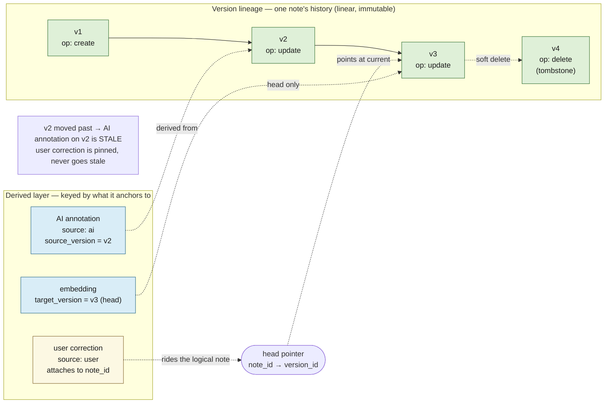
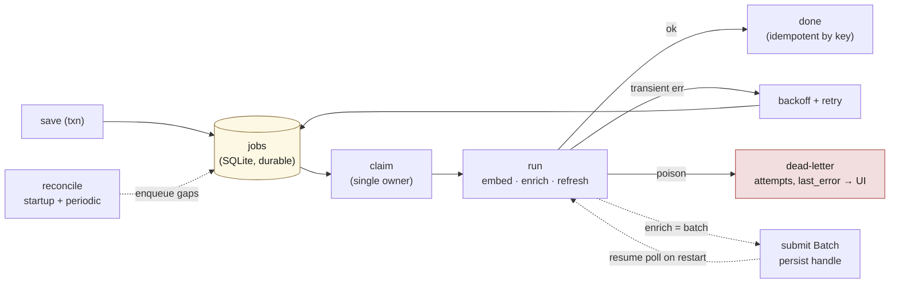

# lode — Storage, invalidation & data shape

Covers the foundational data decisions: the ownership boundary (§3), the event-sourced version
chains (§4), how staleness is detected and migrated (§5), and the concrete data shape (§8). See
[design.md](design.md) for the thesis and [stack.md](stack.md) for how this shape maps onto the
chosen engines.

---

## The ownership boundary

*(§3 — foundational decision)*

**The user does CRUD on notes. The AI never touches note content.** Anything the AI produces
— annotations, links, tags, extracted items, embeddings — lives in a **parallel derived layer**
keyed to the note. User notes are the source of truth; the AI layer is a sidecar that can be
regenerated or thrown away without ever risking the original.

Test of a clean separation: **drop the AI-derived cache — embeddings, AI annotations, inferred
edges — and you lose zero user data; it rebuilds from the notes.**

**One caveat the build must honor:** *user* corrections (`source: user` — a fixed tag, a confirmed
or deleted link) live in the derived layer but are **not** AI output and **not** regenerable —
they're genuine user decisions. So the real partition is not *owned vs derived* but
**irreplaceable** (owned content **+** user curation) **vs regenerable cache** (everything the AI
produced). The irreplaceable set is what must be backed up; the cache is rebuildable
(see [stack.md](stack.md)).

This constraint doesn't simplify the design — it *forces* solving invalidation (below).

---

## Storage model: event-sourced, linear per-note chains

*(§4)*

Notes are stored as an **append-only version chain**. Each mutating operation **at save time**
(create / update / delete — not per keystroke) creates a new **immutable node**.

- **create** → new root node
- **update** → new node parented to the prior version
- **delete** → a tombstone node (soft delete; recovery = repoint the head)

This was chosen specifically *because* the AI sidecar is the whole point. It hands us, for free:
immutability **by construction**, precise staleness, deterministic annotation migration, full
provenance, and undo. Without the AI layer this would be over-engineering; with it, it pays.



### Two graphs — do not conflate them

- **Version lineage** — per-note history. With the decisions below, this is a **linear chain**,
  not a branching DAG.
- **The knowledge graph** — links *between* notes (and later, external resources). This is the
  valuable graph and the actual product. It lives in [externals.md](externals.md).

### Single-user / single-instance → linear chains, no merge

**Decision: single person, single instance, no sync.** This is a **scope boundary**, not a runtime
invariant: it says we will never build the only genuinely hard distributed problem (CRDT / merge
conflict resolution), because the branches that need merging only arise from concurrent edits across
synced devices. We are explicitly not doing that.

The version "graph" is therefore a **linear chain per note**. Two separate mechanisms keep it linear
— and the doc should lean on the mechanisms, not on the "single instance" assertion:

- **Branch prevention = head compare-and-swap (CAS).** Every save parents the current head and is
  **rejected if the head moved since the editor loaded it.** This is the load-bearing guard and it
  holds *regardless of process count* — including two editor panes on the same note inside one
  running app. Correctness here comes from the CAS (plus SQLite serializing writes), not from there
  being one process.
- **Single-instance = a startup advisory lock** (lockfile/PID beside the DB; refuse to start if
  held, pointing at the running PID). This is **not** needed for data integrity — CAS + SQLite cover
  that — but the **async workers (see [design.md](design.md) save path) need a single owner**: two
  instances would run duplicate, racing enrichment + embedding loops and double-spend on Claude
  Batches. That, not corruption, is why we enforce one instance.

Do not pay for merge semantics we will never use.

### Identity vs version

Two distinct ids:

- `note_id` — the **logical** note, stable across its whole lineage.
- `version_id` — the immutable node; `version_id` = **`hash(note_id ‖ parent_version_id ‖ body)`**
  (git's model). Folding in `note_id` makes cross-note collisions impossible (two different notes
  both containing `"TODO"` would otherwise alias); folding in the parent keeps each chain position
  distinct even on a revert to an earlier body (otherwise the reverted node aliases the original and
  `parent_version_id` becomes ambiguous).
- **head pointer**: `note_id → current version_id`.

**Dedup of no-op saves is an explicit guard, not hash luck:** before writing, compare the proposed
body to the *head's* body; if equal, return the head and write nothing. (With the parent-inclusive
hash a re-save parents the current head, so it would *not* auto-collide — the dedup has to be an
explicit check.)

Store **full content snapshot per save** (notes are small; do not prematurely delta-compress).
History grows forever — fine for years of personal notes. A compaction/squash policy can come
much later; the no-op-save guard above keeps the chain from growing on saves that change nothing.

---

## Invalidation — the problem the ownership boundary forces

*(§5)*

Because CRUD includes **update**, and AI may not fix the note to match, the derived layer must
*know* when it is stale and re-derive. The event-sourced model makes this **structural rather
than a maintained flag**:

- Each AI annotation records the `version_id` it was derived from.
- If the note's head pointer has moved past that version, the annotation is **stale** — read
  directly off the graph. No hashing, no flag to keep in sync.

### Re-anchoring is a deterministic graph op

Because old and new versions are both retained and linked, on update we diff them and migrate
annotations forward by rule:

- anchored quote **unchanged** → carry annotation forward as **fresh**
- anchored quote **changed** → mark **stale**
- anchored quote **gone** → mark **orphaned**

### Anchoring strategy

- **Whole-note annotations** (tags, summary, links, extracted items): default; trivially robust.
- **Span annotations** (highlight a sentence): anchor by **quoted text + version**, never raw
  character offsets (offsets shatter on any edit above them). On edit, fuzzy-match the quote to
  re-anchor; if no match, mark orphaned rather than guess.

### Stale-display policy (decided)

- **Tags / links:** show, but flagged stale (avoids UI flicker on every typo fix).
- **Assertive items (extracted action items, etc.):** hide until re-enrichment is fresh — the
  cost of a wrong action item is higher than a wrong tag.

Stale annotations are never treated as ground truth.

### Provenance & user override

- **Provenance on every annotation:** model id, prompt/version, source `version_id`, timestamp,
  confidence. Enables re-running enrichment after a model upgrade, auditing a bad link, bulk
  purge. Cheap now, painful to retrofit.
- **`source: ai | user` on the annotation layer.** Users *will* correct an AI tag or link. That
  correction is still metadata (doesn't touch note content), and it is **pinned**:
  - **AI annotations are version-scoped** — regenerable, allowed to go stale, re-derived per head.
  - **User annotations attach to `note_id`** (the logical identity) — they ride across every
    version automatically, so re-enrichment never re-adds a link the user just removed.

---

## The async work queue

The "capture stays instant" promise ([design.md](design.md) §1) is structurally a promise that the
derived work happens *later*: chunk + embed, enrich via Claude, propose inferred edges, refresh
externals, and re-derive the corpus when `prompt_ver` or the model bumps. That backlog needs a home.

### One property makes this easy: lag is safe by construction

Because every derived row records its `source_version` and **staleness is structural** (see
[invalidation](#invalidation-the-problem-the-ownership-boundary-forces)), workers can **lag
arbitrarily without corrupting anything.** A job that finishes late just writes a possibly-stale
annotation, which the head-pointer comparison flags for re-derivation. So:

- the queue needs **no locking against edits**, and
- **every job is idempotent by key** (`version_id`, or `version_id + prompt_ver`) — re-running
  overwrites or no-ops. The safe default on any failure is simply *do it again*.

### Shape: a durable `jobs` table + a reconciliation safety net

- **Durable rows in SQLite, enqueued in the same transaction as the save.** `write version row +
  enqueue its derive jobs` is **atomic**, so a crash can never leave a saved note with no pending
  work. (This does put more cache-ish state in the "irreplaceable" file — see the partition caveat
  in [stack.md](stack.md).)
- **Job types:** `embed(version)` — fast, local, **high priority**; `enrich(version, prompt_ver)` —
  slow, Claude; `refresh(external)` — arrives with connectors. Priority `embed > enrich` so semantic
  recall lands fast while tags/edges lag.
- **Reconciliation scan on startup + periodically** re-enqueues any head version missing a fresh
  embedding/enrichment. This is the self-healing net for crashes, dropped jobs, and `prompt_ver`
  bumps (a bump makes every note's enrichment stale → the scan re-enqueues the corpus). Idempotency
  makes running it anytime safe.
- **Single owner** (the startup advisory lock, above) is what lets a one-claimer SQLite queue stay
  correct with no distributed locking.

### The one thing reconciliation can't reconstruct: a submitted Batch

Almost all "what work remains" is *derivable* by scanning content vs derived outputs — **except a
submitted Claude Batch.** Once POSTed, that's money in flight (`batch_abc123`); a reconciliation
scan would see "not yet enriched" and **resubmit, double-spending.** So **batch handles and their
member jobs are persisted durably and resumed on restart** — re-poll the handle, ingest results,
mark done. This is the requirement that rules out an in-memory queue.

### Enrichment latency: interactive now, batch for bulk

A freshly-captured note enriches via **one immediate Haiku call** (seconds, full Haiku price — tiny
per note) so its tags/entities/edges appear promptly. Only **bulk / backfill / re-enrichment** goes
through the 50%-off **Batches API** (≤24h, non-interactive). Either way the **embedding lands in
seconds**, so the note is retrievable immediately regardless.



---

## Data shape (sketch)

*(§8)*

```
notes        note_id, head_version_id, created                         # logical identity
versions     version_id(=hash(note_id‖parent‖body)), note_id,
             parent_version_id, body, op(create|update|delete),
             purged_at?, created                                       # immutable, owned
externals    external_id, source_type, head_snapshot_id, created       # logical identity
snapshots    snapshot_id(=hash(external_id‖body)), external_id, body,
             raw_payload, fetched_at, status(ok|tombstone)             # immutable, mirrored
annotations  id, target(note_id|external_id), source_version,          # derived layer
             kind, payload, source(ai|user),
             status(fresh|stale|orphaned),
             model, prompt_ver, confidence, created
passages     passage_id, target_version(version_id|snapshot_id), ord,  # derived; heads only
             char_range, text, parent_block                            #   structure-aware chunks
embeddings   passage_id, vector, model                                 # derived; one per passage
edges        from, to, source(ai|user), reason, confidence,            # the knowledge graph
             source_version, status
jobs         id, type(embed|enrich|refresh), target_version,           # async work queue
             prompt_ver?, status(pending|running|done|failed),
             attempts, last_error?, batch_handle?, created             #   durable, single-owner
```

The UI composes `content node + its annotations` at render time. Nothing is ever written back
into `versions.body` / `snapshots.body`.

**Passages are the retrieval unit** (see [retrieval.md](retrieval.md#chunking-passages-are-the-retrieval-unit)):
a version's body is chunked into structure-aware passages, each embedded and lexically indexed
separately, with `parent_block` recording the enclosing section/note for small-to-big context
expansion. They are **regenerable cache** — re-chunked and re-embedded from the body on every new
head version (deterministic, local, cheap). This is *distinct* from the §5 span-annotation
anchoring: passages are **regenerated per version**, never fuzzy-migrated like user span marks —
different lifecycles, do not conflate.

This maps onto the store ([stack.md](stack.md)), but **by rows, not by file**
([the partition is by rows](stack.md#the-partition-is-by-rows-not-by-file)). The **irreplaceable**
rows — `notes`, `versions`, `externals`, `snapshots`, plus the `annotations`/`edges` rows where
`source = user` — live in **SQLite**; the same file *also* holds rebuildable cache, so `cp lode.db`
is a harmless *superset* backup. **Regenerable cache** — `passages`, `embeddings`, the `source = ai`
`annotations`/`edges`, and the lexical index — is rebuildable: passage vectors in **LanceDB**,
lexical in **SQLite FTS5** (also per passage), and the `edges` knowledge graph traversed **in-memory
with networkx** (loaded from the edge rows). The whole shape sits behind a thin repository interface, so the cache engine is
swappable without touching the core.

The `jobs` table is **operational state** in SQLite: mostly regenerable (the reconciliation scan
rebuilds the backlog from the content↔derived diff), with **one durable exception — in-flight
`batch_handle`s**, which a scan can't reconstruct without double-spending. So it doesn't fit cleanly
on either side of the irreplaceable/regenerable line — another reason the partition is by *rows*,
not by *file* ([the partition is by rows](stack.md#the-partition-is-by-rows-not-by-file)).
